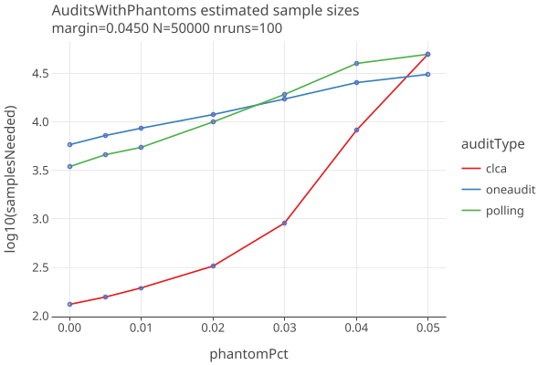

**RLAUXE (WORK IN PROGRESS)**

_last update: 01/24/2025_

A port of Philip Stark's SHANGRLA framework and related code to kotlin, 
for the purpose of making a reusable and maintainable library.

Click on plot images to get an interactive html plot.

You can also read this document on [github.io](https://johnlcaron.github.io/rlauxe/).

Table of Contents
<!-- TOC -->
* [Reference Papers](#reference-papers)
* [SHANGRLA framework](#shangrla-framework)
  * [Assorters and supported SocialChoices](#assorters-and-supported-socialchoices)
    * [Plurality](#plurality)
    * [Approval](#approval)
    * [SuperMajority](#supermajority)
    * [Instant Runoff Voting (IRV)](#instant-runoff-voting-irv)
* [Audit Types](#audit-types)
  * [Card Level Comparison Audits (CLCA)](#card-level-comparison-audits-clca)
  * [Polling audits](#polling-audits)
  * [Stratified audits using OneAudit](#stratified-audits-using-oneaudit)
  * [Comparison of AuditTypes' sample sizes](#comparison-of-audittypes-sample-sizes)
  * [Estimated Sample sizes with no errors](#estimated-sample-sizes-with-no-errors)
* [Sampling](#sampling)
  * [Estimating Sample sizes](#estimating-sample-sizes)
  * [Choosing which ballots/cards to sample](#choosing-which-ballotscards-to-sample)
    * [Consistent Sampling](#consistent-sampling)
    * [Uniform Sampling](#uniform-sampling)
  * [Polling Vs Comparison with/out CSD Estimated Sample sizes](#polling-vs-comparison-without-csd-estimated-sample-sizes)
  * [Missing Ballots (aka phantoms-to-evil zombies)](#missing-ballots-aka-phantoms-to-evil-zombies)
* [Appendices](#appendices)
  * [Differences with SHANGRLA](#differences-with-shangrla)
    * [Limit audit to estimated samples](#limit-audit-to-estimated-samples)
    * [compute sample size](#compute-sample-size)
    * [generation of phantoms](#generation-of-phantoms)
    * [estimate comparison error rates](#estimate-comparison-error-rates)
    * [use of previous round's sampled_cvr_indices](#use-of-previous-rounds-sampled_cvr_indices)
  * [Other Notes](#other-notes)
  * [Development Notes](#development-notes)
<!-- TOC -->

# Reference Papers

    P2Z         Limiting Risk by Turning Manifest Phantoms into Evil Zombies. Banuelos and Stark. July 14, 2012

    RAIRE       Risk-Limiting Audits for IRV Elections.			Blom, Stucky, Teague    29 Oct 2019
        https://arxiv.org/abs/1903.08804

    SHANGRLA	Sets of Half-Average Nulls Generate Risk-Limiting Audits: SHANGRLA.	Stark, 24 Mar 2020
        https://github.com/pbstark/SHANGRLA

    MoreStyle	More style, less work: card-style data decrease risk-limiting audit sample sizes	Glazer, Spertus, Stark; 6 Dec 2020

    ALPHA:      Audit that Learns from Previously Hand-Audited Ballots. Stark, Jan 7, 2022
        https://github.com/pbstark/alpha.

    BETTING     Estimating means of bounded random variables by betting. Waudby-Smith and Ramdas, Aug 29, 2022
        https://github.com/WannabeSmith/betting-paper-simulations

    COBRA:      Comparison-Optimal Betting for Risk-limiting Audits. Jacob Spertus, 16 Mar 2023
        https://github.com/spertus/comparison-RLA-betting/tree/main

    ONEAudit:   Overstatement-Net-Equivalent Risk-Limiting Audit. Stark   6 Mar 2023.
        https://github.com/pbstark/ONEAudit

    STYLISH	    Stylish Risk-Limiting Audits in Practice.		Glazer, Spertus, Stark  16 Sep 2023
      https://github.com/pbstark/SHANGRLA

    VERIFIABLE  Publicly Verifiable RLAs.     Alexander Ek, Aresh Mirzaei, Alex Ozdemir, Olivier Pereira, Philip Stark, Vanessa Teague


# SHANGRLA framework

SHANGRLA is a framework for running [Risk Limiting Audits](https://en.wikipedia.org/wiki/Risk-limiting_audit) (RLA) for elections.
It uses an _assorter_ to assign a number to each ballot, and a _statistical risk testing function_ that allows an audit to statistically
prove that an election outcome is correct (or not) to within a _risk level α_, for example,  risk limit = 5% means that
the election is correct with 95% probability.

It checks outcomes by testing _half-average assertions_, each of which claims that the mean of a finite list of numbers 
between 0 and upper is greater than 1/2. The complementary _null hypothesis_ is that each assorter mean is not greater than 1/2.
If that hypothesis is rejected for every assertion, the audit concludes that the outcome is correct.
Otherwise, the audit expands, potentially to a full hand count. If every null is tested at risk level α, this results 
in a risk-limiting audit with risk limit α:
**_if the election outcome is not correct, the chance the audit will stop shy of a full hand count is at most α_**.

This formulation unifies polling audits and comparison audits, with or without replacement. It allows for the ballots to
be divided into _strata_, each of which is sampled independently (_stratified sampling_), or to use
batches of ballot cards instead of individual cards (_cluster sampling_).

| term          | definition                                                                                     |
|---------------|------------------------------------------------------------------------------------------------|
| N             | the number of ballot cards validly cast in the contest                                         |
| risk	         | we want to confirm or reject the null hypothesis with risk level α.                            |
| assorter      | assigns a number between 0 and upper to each ballot, chosen to make assertions "half average". |
| assertion     | the mean of assorter values is > 1/2: "half-average assertion"                                 |
| estimator     | estimates the true population mean from the sampled assorter values.                           |
| riskTestingFn | is the statistical method to test if the assertion is true.                                    |
| audit         | iterative process of picking ballots and checking if all the assertions are true.              |


## Assorters and supported SocialChoices

### Plurality

"Top k candidates are elected."
The rules may allow the voter to vote for one candidate, k candidates or some other number, including n, which
makes it approval voting.

See SHANGRLA, section 2.1.

A contest has K ≥ 1 winners and C > K candidates. Let wk be the kth winner, and ℓj be the jth loser.
For each pair of winner and loser, let H_wk,ℓj be the assertion that wk is really the winner over ℓj.

There are K(C − K) assertions. The contest can be audited to risk limit α by testing all assertions at significance level α.
Each assertion is tested that the mean of the assorter values is > 1/2 (or not).

For the case when there is only one winner, there are C - 1 assertions, pairing the winner with each loser.
For a two candidate election, there is only one assertion.

For the ith ballot, define `A_wk,ℓj(bi)` as
````
    assign the value “1” if it has a mark for wk but not for ℓj; 
    assign the value “0” if it has a mark for ℓj but not for wk;
    assign the value 1/2, otherwise.
 ````

For polling, the assorter function is this A_wk,ℓj(MVR).

For a comparison audit, the assorter function is B(MVR, CVR) as defined below, using this A_wk,ℓj.

Notes
* Someone has to enforce that each CVR has <= number of allowed votes.


### Approval

See SHANGRLA, section 2.2.

In approval voting, voters may vote for as many candidates as they like.
The top K candidates are elected.

The plurality voting algorithm is used, with K winners and C-K losers.


### SuperMajority

"Top k candidates are elected, whose percent vote is above a fraction, f."

See SHANGRLA, section 2.3.

A winning candidate must have a minimum fraction f ∈ (0, 1) of the valid votes to win.
If multiple winners are allowed, each reported winner generates one assertion.

For the ith ballot, define `A_wk,ℓj(bi)` as
````
    assign the value “1/(2*f)” if it has a mark for wk but no one else; 
    assign the value “0” if it has a mark for exactly one candidate and not wk
    assign the value 1/2, otherwise.
````
For polling, the assorter function is this A_wk,ℓj(bi).

For a comparisian audit, the assorter function is B(MVR, CVR) as defined below, using this A_wk,ℓj.

One only needs one assorter for each winner, not one for each winner/loser pair.

Notes
* "minimum fraction of the valid votes": so use V-c, not N_c as the denominator.
* Someone has to enforce that each CVR has <= number of allowed votes.
* multiple winners are not yet supported for auditing. TODO is that true ??
* TODO test when there are no winners.

### Instant Runoff Voting (IRV)

Also known as Ranked Choice Voting, this allows voters to rank their choices by preference.
In each round, the candidate with the fewest first-preferences (among the remaining candidates) is eliminated. 
This continues until only one candidate is left.

We use the [RAIRE java library](https://github.com/DemocracyDevelopers/raire-java) to generate IRV assertions 
that fit into the SHANGRLA framewok, and makes them IRV contests amenable to risk limiting auditing, just like plurality contests.

See the RAIRE guides for details:
* [Part 1: Auditing IRV Elections with RAIRE](https://github.com/DemocracyDevelopers/Colorado-irv-rla-educational-materials/blob/main/A_Guide_to_RAIRE_Part_1.pdf)
* [Part 2: Generating Assertions with RAIRE](https://github.com/DemocracyDevelopers/Colorado-irv-rla-educational-materials/blob/main/A_Guide_to_RAIRE_Part_2.pdf)

# Audit Types

## Card Level Comparison Audits (CLCA)

When the election system produces an electronic record for each ballot card, known as a Cast Vote Record (CVR), then
Card Level Comparison Audits can be done that compare sampled CVRs with the corresponding ballot card that has been 
hand audited to produce a Manual Vote Record (MVR). A CLCA typically needs many fewer sampled ballots to validate contest
results than other methods.

The requirements for CLCA audits:

* The election system must be able to generate machine-readable Cast Vote Records (CVRs) for each ballot, which is compared to the MVR during the audit.
* Unique identifier must be assigned to each physical ballot, and put on the CVR, in order to find the physical ballot that matches the sampled CVR.
* There must be an independently determined upper bound on the number of cast cards/ballots that contain the contest.

For the risk function, Rlaux uses the BettingMart function with the AdaptiveComparison betting function. 
AdaptiveComparison needs estimates of the rates of over(under)statements. If these estimates are correct, one gets optimal sample sizes.
AdaptiveComparison uses a variant of ShrinkTrunkage that uses a weighted average of initial estimates (aka priors) with the actual sampled rates.

See [CLCA Error Rates](docs/ClcaErrorRates.md) for estimating error rates and plots.

See [CLCA Betting function](docs/BettingRiskFunction.md) for more details on BettingMart.


## Polling audits

When CVRs are not available, a polling audit can be done instead. A polling audit  
creates an MVR for each ballot card selected for sampling, just as with a CLCA, except without the CVR.

The requirements for Polling audits:

* There must be a BallotManifest defining the population of ballots, that contains a unique identifier that can be matched to the corresponding physical ballot.
* There must be an independently determined upper bound on the number of cast cards/ballots that contain the contest.

For the risk function, Rlaux uses the AlphaMart function with ShrinkTrunkage, which estimates the true
population mean (theta) using a weighted average of an initial estimate (eta0) with the actual sampled mean. 
The average assort value is used as the initial estimate (eta0) when testing each assertion. These assort values
are specified in SHANGRLA, section 2. See Assorter.kt for our implementation.

A few representative plots showing the effect of d are at [meanDiff plots](https://docs.google.com/spreadsheets/d/1bw23WFTB4F0xEP2-TFEu293wKvBdh802juC7CeRjp-g/edit?gid=1185506629#gid=1185506629).
* High values of d do significantly better when the reported mean is close to the true mean. 
* When the true mean < reported mean, high d may force a full hand count unnecessarily.
* Low values of d are much better when true mean < reported mean, at the cost of larger samples sizes.
* Tentatively, we will use d = 100 as default, and allow the user to override.

See [ALPHA testing statistic](docs/AlphaMart.md) for more details and plots.


## Stratified audits using OneAudit

OneAudit is a comparison audit that uses AlphaMart instead of BettingMart. 

When there is a CVR, use standard Comparison assorter. When there is no CVR, compare the MVR with the "average CVR" of the batch.
This is "overstatement-net-equivalent" (aka ONE).

See [OneAudit Notes](docs/OneAudit.md) for more details and plots.


## Comparison of AuditTypes' sample sizes

These are plots of sample sizes for the three audit types: Polling, Comparison (clca) and OneAudit (with 0%, 50% and 100% of ballots having CVRs),
when there are no errors between the MVRs and the CVRs.

<a href="https://johnlcaron.github.io/rlauxe/docs/plots/workflows/AuditsNoErrors/AuditsNoErrorsLinear.html" rel="AuditsNoErrors Linear"></a>
<a href="https://johnlcaron.github.io/rlauxe/docs/plots/workflows/AuditsNoErrors/AuditsNoErrorsLog.html" rel="AuditsNoErrors Log"></a>

* OneAudit results are about twice as high as polling. More tuning is possible but wont change the O(margin) shape.
* When there are no errors, the CLCA assort values depend only on the margin, so we get a smooth curve.
* Need to investigate how the presence of errors between the MVRs and the CVRs affects the results.
* OneAudit / Polling probably arent useable when margin < .02, whereas CLCA can be used for much smaller margins.
* Its surprising that theres not more difference between the OneAudit results with different percents having CVRs.

Plots vs fuzzPct (percent ballots having randomly changed candidate, see [sampling with fuzz](#estimating-sample-sizes-and-error-rates-with-fuzz),
with margin fixed at 4%:

<a href="https://johnlcaron.github.io/rlauxe/docs/plots/workflows/AuditsWithErrors/AuditsWithErrorsLinear.html" rel="AuditsWithErrors Linear"></a>
<a href="https://johnlcaron.github.io/rlauxe/docs/plots/workflows/AuditsWithErrors/AuditsWithErrorsLog.html" rel="AuditsWithErrors Log"></a>

* clca is much more sensitive to errors than polling or oneaudit.

Varying undervotes percent:

<a href="https://johnlcaron.github.io/rlauxe/docs/plots/workflows/AuditsNoErrors/AuditsWithUndervotesLinear.html" rel="AuditsWithUndervotes Linear"></a>
<a href="https://johnlcaron.github.io/rlauxe/docs/plots/workflows/AuditsNoErrors/AuditsWithUndervotesLog.html" rel="AuditsWithUndervotes Log"></a>

Varying phantom percent::

<a href="https://johnlcaron.github.io/rlauxe/docs/plots/workflows/AuditsWithPhantoms/AuditsWithPhantomsLinear.html" rel="AuditsNoErrors Linear"></a>
<a href="https://johnlcaron.github.io/rlauxe/docs/plots/workflows/AuditsWithPhantoms/AuditsWithPhantomsLog.html" rel="AuditsNoErrors Log"></a>

## Estimated Sample sizes with no errors

The best possible audit is CLCA when there are no errors in the CVRs. In that case, the sample sizes depend only on the margin:

<a href="https://johnlcaron.github.io/rlauxe/docs/plots/workflows/clcaNoErrors/clcaNoErrorsLinear.html" rel="clcaNoErrorsLinear"></a>

Remarkably, this value is independent of N. So, for example we need 1,128 samples to audit a contest with a 0.5% margin.
For a 10,000 vote election, thats 11.28% For a 100,000 vote election, its only 1.13%.

This plot (_PlotSampleSizeEstimates.plotComparisonVsPoll()_) shows the difference between a polling audit and a comparison
audit at different margins, where the MVRS match the CVRS ("no errors").

<a href="https://johnlcaron.github.io/rlauxe/docs/plots/samples/ComparisonVsPoll.html" rel="Polling Vs Comparison Estimated Sample sizes"></a>

Polling at margins < 4% needs prohibitively large sample sizes.
Comparison audits are useful down to any margin, depending on N and the error rates.

"In a card-level comparison audit, the estimated sample size scales with
the reciprocal of the diluted margin." (STYLISH p.4) Polling scales as square of 1/margin.

# Sampling

SHANGRLA provides a very elegant separation between the implementation of risk testing and sampling. Specifically,
the risk testing function deals only with (the mean of a sequence of) samples values. The sample values are 
calculated by assorters. The assorters themselves are independent of the risk function.

## Estimating Sample sizes

For each contest we simulate the audit with manufactured data that has the same margin as the reported outcome. By
running simulations, we can use estimated error rates and add errors to the manufactured data.

For each contest assertion we estimate the required sample size that will satisfy the risk limit some fraction 
(_auditConfig.quantile_) of the time. The contest sample_size is then the maximum of the contests' assertion estimates.

Audits are done in rounds. If a contest is not proved or disproved, the next round's estimated sample size starts from 
the previous audit's pvalue.

Note that each round does its own sampling without regard to the previous round's sampled ballots. 
Since the seed remains the same and the ballot ordering is the same, then previously audited MVRS are used as much as 
possible in subsequent rounds.

Note: I _think_ its ok if more ballots come in between rounds (although this may be disallowed for security reasons). 
Just add the new ballots to the "all cvrs list", and do the next round as usual. 
Ideally N_c doesnt change, so it just makes less evil zombies.

## Choosing which ballots/cards to sample

Once we have all of the contests' estimated sample sizes, we next choose which ballots/cards to sample. 
This step is highly dependent on how much we know about which ballots contain which contests. In particular,
whether you have Card Style Data (CSD), (see MoreStyle, p.2)

For comparison audits, the generated Cast Vote Record (CVR) comprises the CSD, as long as the CVR records when a contest recieves no votes.
If it does not record contests with no votes, I think we have to use uniform sampling instead of consistent sampling.
This has such a dramatic effect on sample sizes that I would consider this an bug of the CVR software.
Nonetheless we handle this case in the library.

So far, we can distinguish the following cases:

1. Comparison, hasCSD: CVR is a CSD.
2. Comparison, !hasCSD: contests with no votes are not recorded on the CVR.

3. Polling, hasCSD: has a ballot manifest with ballot.hasContest(contestId)
4. Polling, !hasCSD: doesnt know which ballots have which contests
5. Polling, precinct batches/containers (TODO). See MoreStyle, p.13:
  * precinct-based voting where each voter in a precinct gets the same ballot style, and the balots are stored by precinct.
  * information about which containers have which card styles, even without information about which cards contain which
    contests, can still yield substantial efficiency gains for ballot-polling audits.

### Consistent Sampling

When we can tell which ballots/CVRs contain a given contest, we can use consistent sampling, as follows:

* For each contest, estimate the number of samples needed (contest.estSamples).
* For each ballot/cvr, assign a large psuedo-random number, using a high-quality PRNG.
* Sort the ballots/cvrs by that number
* Select the first ballots/cvrs that use any contest that needs more samples, until all contests have
at least contest.estSampleSize in the sample of selected ballots.

### Uniform Sampling

When we can't tell which ballots/CVRs contain a given contest, we can use uniform sampling, as follows:

* For each contest, estimate the number of samples needed (contest.estSamples).
* Let N be the total number of ballots, and Nc the maximum number of cards for a contest C. Then we assume that the
  probability of a ballot containing contest C is Nc / N.
* Over all contests, compute contest.estSamples / Nc / N and choose the maximum = audit.estSamples.
* For each ballot/cvr, assign a large psuedo-random number, using a high-quality PRNG.
* Sort the ballots/cvrs by that number
* Take the first audit.estSamples of the sorted ballots.

We need Nc as a condition of the audit, but its straightforward to estimate a contests' sample size without Nc,
since it works out that Nc cancels out:

        sampleEstimate = rho / dilutedMargin                  // (SuperSimple p. 4)
        where 
          dilutedMargin = (vw - vl)/ Nc
        sampleEstimate = rho * Nc / (vw - vl)
        totalEstimate = sampleEstimate * N / Nc               // must scale by proportion of ballots with that contest
                      = rho * N / (vw - vl) 
                      = rho / fullyDilutedMargin
        where
          fullyDilutedMargin = (vw - vl)/ N

The scale factor N/Nc depends on how many contests there are and how they are distributed across the ballots.
In the following plot we just show N/Nc = 1, 2, 5 and 10. N/Nc = 1 is the case where the audit has CSDs:

<a href="https://johnlcaron.github.io/rlauxe/docs/plots/samples/PollingNoStyle.html" rel="PollingNoStyle"></a>

See _PlotPollingNoStyles.kt_.

## Polling Vs Comparison with/out CSD Estimated Sample sizes

The following plot shows polling with CSD vs comparison with CSD vs comparison without CSD at different margins:

<a href="https://johnlcaron.github.io/rlauxe/docs/plots/samples/ComparisonVsStyleAndPoll.html" rel="ComparisonVsStyleAndPoll"></a>

Little difference between comparison with/out CSD. Large difference with polling with CSD. Not showing polling without CSD,
since it depends on N/Nc scaling.

See _PlotSampleSizeEstimates.plotComparisonVsStyleAndPoll()_.

## Missing Ballots (aka phantoms-to-evil zombies)

From Phantoms to Zombies (P2Z) paper:

    A listing of the groups of ballots and the number of ballots in each group is called a ballot manifest.

    What if the ballot manifest is not accurate?
    It suffices to make worst-case assumptions about the individual randomly selected ballots that the audit cannot find.
    This ensures that the true risk limit remains smaller than the nominal risk limit.

    The dead (not found, phantom) ballots are re-animated as evil zombies: We suppose that they reflect whatever would
    increase the P-value most: a 2-vote overstatement for a ballot-level comparison audit, 
    or a valid vote for every loser in a ballot-polling audit.

See [Missing Ballots](docs/MissingBallots.md) for details.

# Appendices
## Differences with SHANGRLA

### Limit audit to estimated samples

SHANGRLA consistent_sampling() in Audit.py only audits with the estimated sample size. However, in multiple
contest audits, additional ballots may be in the sample because they are needed by another contest. Since theres no 
guarentee that the estimated sample size is large enough, theres no reason not to include all the available mvrs in the audit.

*** If the Audit gets below the risk limit, should you terminate? Or finish all the samples that have been audited? ***

### compute sample size

From STYLISH paper:

        4.a) Pick the (cumulative) sample sizes {𝑆_𝑐} for 𝑐 ∈ C to attain by the end of this round of sampling.
        The software offers several options for picking {𝑆_𝑐}, including some based on simulation.
        The desired sampling fraction 𝑓_𝑐 := 𝑆_𝑐 /𝑁_𝑐 for contest 𝑐 is the sampling probability
            for each card that contains contest 𝑘, treating cards already in the sample as having sampling probability 1.
        The probability 𝑝_𝑖 that previously unsampled card 𝑖 is sampled in the next round is the largest of those probabilities:
            𝑝_𝑖 := max (𝑓_𝑐), 𝑐 ∈ C ∩ C𝑖, where C_𝑖 denotes the contests on card 𝑖.
        4.b) Estimate the total sample size to be Sum(𝑝_𝑖), where the sum is across all cards 𝑖 except phantom cards.

AFAICT, the calculation of the total_size using the probabilities as described in 4.b) is only used when you just want the
total_size estimate, but not do the consistent sampling, which gives you the total sample size.

### generation of phantoms

From STYLISH paper:

        2.c) If the upper bound on the number of cards that contain any contest is greater than the number of CVRs that 
            contain the contest, create a corresponding set of “phantom” CVRs as described in section 3.4 of [St20]. 
            The phantom CVRs are generated separately for each contest: each phantom card contains only one contest.

SHANGRLA.make_phantoms() instead generates max(Np_c) phantoms, then for each contest adds it to the first Np_c phantoms.
Im guessing STYLISH is trying to describe the easist possible algorithm.

        2.d) If the upper bound 𝑁_𝑐 on the number of cards that contain contest 𝑐 is greater than the number of physical 
           cards whose locations are known, create enough “phantom” cards to make up the difference. 

Not clear what this means, and how its different from 2.c.

### estimate comparison error rates

SHANGRLA has guesses for p1,p2,p3,p4. We do a blanket fuzz, and simulate the errors by ncandidates in a contest, then use those.

### use of previous round's sampled_cvr_indices

At first glance, it appears that SHANGRLA Audit.py CVR.consistent_sampling() might make use of the previous round's
selected ballots (sampled_cvr_indices). However, it looks like CVR.consistent_sampling() never uses sampled_cvr_indices, 
and so uses the same strategy as we do of sampling without regards to the previous rounds.

Its possible that the code is wrong when sampled_cvr_indices is passed in, since the sampling doesnt just use the 
first n sorted samples, which the code seems to assume. But I think the question is moot.


## Other Notes

* [ALPHA testing statistic](docs/AlphaMart.md)
* [Notes on Corla](docs/Corla.md)

## Development Notes

* [RLA Options](docs/RlaOptions.md)
* [TODO](docs/Development.md)