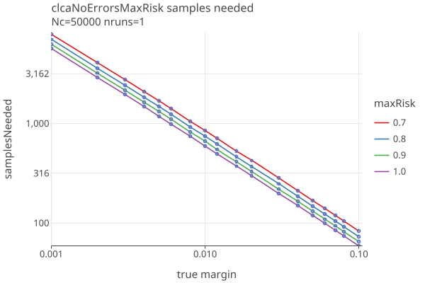
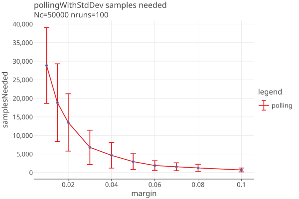
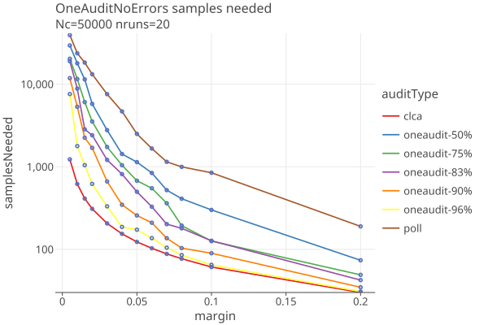
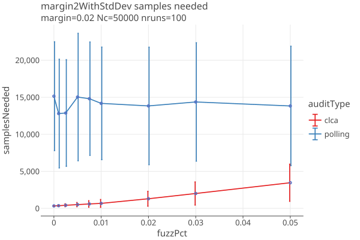
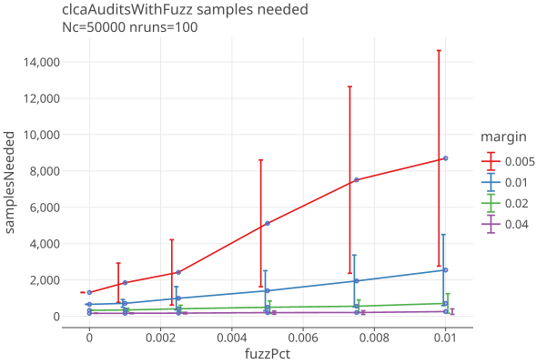
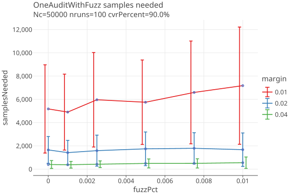
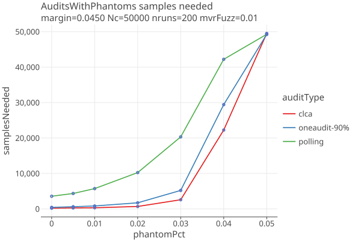

**rlauxe ("r-lux")**

WORK IN PROGRESS
_last changed: 01/18/2026_

A library for [Risk Limiting Audits](https://en.wikipedia.org/wiki/Risk-limiting_audit) (RLA), based on Philip Stark's SHANGRLA framework and related code.
The Rlauxe library is an independent implementation of the SHANGRLA framework, based on the
[published papers](#reference-papers) of Stark et al.

The [SHANGRLA python library](https://github.com/pbstark/SHANGRLA) is the work of Philip Stark and collaborators, released under the AGPL-3.0 license.

Rlauxe uses the [Raire Java library](https://github.com/DemocracyDevelopers/raire-java) for Ranked Choice contests, also
called Instant runoff Voting (IRV).
Raire-Java is Copyright 2023-2025 Democracy Developers. It is based on software (c) Michelle Blom in C++
https://github.com/michelleblom/audit-irv-cp/tree/raire-branch , and released under the GNU General Public License v3.0.

Click on plot images to get an interactive html plot. You can also read this document on [github.io](https://johnlcaron.github.io/rlauxe/).

**Table of Contents**
<!-- TOC -->
* [SHANGRLA framework](#shangrla-framework)
* [Audit Workflow Overview](#audit-workflow-overview)
  * [Before the Audit](#before-the-audit)
  * [Creating a random seed](#creating-a-random-seed)
  * [Starting the Audit](#starting-the-audit)
  * [Audit Rounds](#audit-rounds)
  * [Verification](#verification)
* [Audit Types](#audit-types)
  * [Card Level Comparison Audits (CLCA)](#card-level-comparison-audits-clca)
  * [OneAudit CLCA](#oneaudit-clca)
  * [Polling Audits](#polling-audits)
* [Comparing Samples Needed by Audit type](#comparing-samples-needed-by-audit-type)
  * [Samples needed with no errors](#samples-needed-with-no-errors)
  * [Samples needed when there are errors](#samples-needed-when-there-are-errors)
  * [Effect of Phantoms on Samples needed](#effect-of-phantoms-on-samples-needed)
* [Sample Populations and diluted margins](#sample-populations-and-diluted-margins)
* [Estimating Sample Batch sizes](#estimating-sample-batch-sizes)
  * [Estimation](#estimation)
  * [Under/Over estimating CLCA sample sizes](#underover-estimating-clca-sample-sizes)
  * [Multiple Contest Auditing](#multiple-contest-auditing)
    * [Efficiency](#efficiency)
    * [Deterministic sampling order for each Contest](#deterministic-sampling-order-for-each-contest)
* [Attacks](#attacks)
  * [Attack with phantoms](#attack-with-phantoms)
  * [Attack with wrong reported winner](#attack-with-wrong-reported-winner)
* [Appendices](#appendices)
  * [Reference Papers](#reference-papers)
  * [Extensions of SHANGRLA](#extensions-of-shangrla)
    * [Populations and hasStyle](#populations-and-hasstyle)
    * [CardManifest](#cardmanifest)
    * [General Adaptive Betting](#general-adaptive-betting)
    * [OneAudit Betting strategy](#oneaudit-betting-strategy)
    * [MaxRisk for Betting](#maxrisk-for-betting)
    * [Additional assorters](#additional-assorters)
    * [OneAudit Card Style Data](#oneaudit-card-style-data)
    * [Multicontest audits](#multicontest-audits)
  * [Unanswered Questions](#unanswered-questions)
    * [Contest is missing in the MVR](#contest-is-missing-in-the-mvr)
  * [Also See:](#also-see)
<!-- TOC -->


# SHANGRLA framework

SHANGRLA is a framework for running Risk Limiting Audits for elections.
It uses a _statistical risk testing function_ that allows an audit to statistically
prove that an election outcome is correct (or not) to within a _risk level α_. For example, a risk limit of 5% means that
the election outcome (i.e. the winner(s)) is correct with 95% probability.

It uses an _assorter_ to assign a number to each ballot, and checks outcomes by testing _half-average assertions_, 
each of which claims that the mean of a finite list of numbers is greater than 1/2. 
The complementary _null hypothesis_ is that the assorter mean is not greater than 1/2.
If that hypothesis is rejected for every assertion, the audit concludes that the outcome is correct.
Otherwise, the audit expands, potentially to a full hand count. If every assertion is tested at risk level α, this results 
in a risk-limiting audit with risk limit α:
**_if the election outcome is not correct, the chance the audit will stop shy of a full hand count is at most α_**.

| term      | definition                                                                                   |
|-----------|----------------------------------------------------------------------------------------------|
| audit     | iterative process of choosing ballots and checking if all the assertions are true.           |
| risk	     | we want to confirm or reject with risk level α.                                              |
| assorter  | assigns a number between 0 and upper to each card, chosen to make assertions "half average". |
| assertion | the mean of assorter values is > 1/2: "half-average assertion"                               |
| bettingFn | decides how much to bet for each sample. (BettingMart)                                       |
| riskFn    | the statistical method to test if the assertion is true.                                     |
| Nc        | a trusted, independent bound on the number of valid cards cast in the contest c.             |
| Ncast     | the number of cards validly cast in the contest                                              |
| Npop      | the number of cards that might contain the contest                                           |


# Audit Workflow Overview

## Before the Audit

For each contest:
- Describe the contest name, candidates, contest type (eg Plurality), etc in the ContestInfo.
- Count the votes in the usual way. The reported winner(s) and the reported margins are based on this vote count.
- Determine the total number of valid cards (Nc), and number of votes cast (Ncast) for the contest.
- The software generates the assertions needed to prove (or not) that the winners are correct.
- Write the ContestWithAssertions to contests.json file

Create the Card Manifest:
- Create a Card Manifest, in which every physical card has a unique entry (called the AuditableCard). 
- If this is a CLCA, attach the Cast Vote Record (CVR) from the vote tabulation system, to its AuditableCard.
- Optionally create Populations (eg OneAudit Pools) that describe each unique "population" of cards, and which contests are
  contained in the population. Cards that do not have complete CVRs should reference the population they are contained in.
- The Card Manifest is the ordered list of AuditableCards.
- Write the Card Manifest to cardManifest.csv, and optionally the Populations to populations.json.

Committment:
- Write the contests.json, populations.json, and cardManifest.csv files to a publically accessible "bulletin board".
- Digitally sign these files; they constitute the "audit committment" and may not be altered once the seed is chosen.

## Creating a random seed

- Create a random 32-bit integer "seed" in a way that allows public observers to be confident that it is truly random.
- Publish the random seed to the bulletin board. It becomes part of the "audit committment" and may not be altered once chosen.
- Use a PRNG (Psuedo Random Number Generator) with the random seed, and assign the generated PRNs, in order, to the auditable cards.
- Sort the cards by PRN and write them to sortedCards.csv.

## Starting the Audit

The Election Auditors (EA) can examine the audit committment files, run simulations to estimate how many
cards will need to be sampled, etc. The EA can choose:

* which contests will be included in the Audit
* the risk limit 
* other audit configuration parameters

The audit configuration parameters are written to auditConfig.json.

## Audit Rounds

The audit proceeds in rounds:

1. _Estimation_: for each contest, estimate how many samples are needed to satisfy the risk limit
2. _Choosing contests and sample sizes_: the EA decides which contests and how many samples will be audited.
 This may be done with an automated algorithm, or the Auditor may make individual contest choices.
3. _Random sampling_: The actual ballots to be sampled are selected in order from the sorted Card Manifest until the sample size is satisfied.
4. _Manual Audit_: find the chosen paper ballots that were selected to audit and do a manual audit of each.
5. _Create MVRs_: enter the results of the manual audits (as Manual Vote Records, MVRs) into the system.
6. _Run the audit_: For each contest, using the MVRs, calculate if the risk limit is satisfied.
7. _Decide on Next Round_: for each contest not satisfied, decide whether to continue to another round, or call for a hand recount.

Each round generates samplePrns.json, sampleCards.csv, sampleMvrs.csv, and auditState.json files, which become part of the Audit Record.

## Verification

Independently written verifiers can read the Audit Record and verify that the audit was correctly performed.
See [Verification](docs/Verification.md).

# Audit Types

In all cases:

* There must be a Card Location Manifest defining the population of ballots, that contains a unique identifier or location description
  that can be used to find the corresponding physical ballot.
* For each contest, there must be an independently determined upper bound on the number of cast cards/ballots that contain the contest.

## Card Level Comparison Audits (CLCA)

When the election system produces an electronic record for each ballot card, known as a Cast Vote Record (CVR), then
Card Level Comparison Audits can be done that compare sampled CVRs with the corresponding hand audited ballot card,
known as the Manual Vote Record (MVR). A CLCA typically needs many fewer sampled ballots to validate contest
results than other methods.

The requirements for CLCA audits:

* The election system must be able to generate machine-readable Cast Vote Records (CVRs) for each ballot.
* Unique identifiers must be assigned to each physical ballot, and recorded on the CVR, in order to find the physical ballot that matches the sampled CVR.

For the _risk function_, rlauxe uses the **BettingMart** function with the **GeneralAdaptiveBetting** _betting function_.
GeneralAdaptiveBetting uses estimates/measurements of the error rates between the Cvrs and the Mvrs. 
If the error estimates are correct, one gets optimal 
"sample sizes", the number of ballots needed to prove the election is correct.

See [CLCA Risk function](docs/Clca.md) for details on CLCA and BettingMart.

See [Generalized Adaptive Betting](docs/GeneralizedAdaptiveBetting.md) for details on the GeneralAdaptiveBetting function.

## OneAudit CLCA

OneAudit is a type of CLCA audit, based on the ideas and mathematics of the ONEAudit papers (see appendix).
It deals with the cases where:
1. CVRS are not available for all ballots, and the remaining ballots are in one or more "pools" for which subtotals are available.
   (This is the Boulder "redacted votes" case.)
2. CVRS are available for all ballots, but some cannot be matched to physical ballots. (This is the San Francisco case where
   mail-in ballots have matched CVRS, and in-person precinct votes have unmatched CVRs. Each precinct's ballots
   are kept in a separate pool.)

In both cases we create an “overstatement-net-equivalent” (ONE) CVR for each pool, 
and use the average assorter value in that pool as the value of the (missing) CVR in the CLCA overstatement.
When a ballot has been chosen for hand audit:

1. If it has a CVR, use the standard CLCA over-statement assorter value for the ballot.
2. If it has no CVR, use the overstatement-net-equivalent (ONE) CVR from the pool that it belongs to.

Thus, all cards must either have a CVR or be contained in a pool.


For details of OneAudit use cases, see [OneAudit Use Cases](docs/OneAuditUseCases.md).


## Polling Audits

When CVRs are not available, a Polling audit can be done instead. A Polling audit  
creates an MVR for each ballot card selected for sampling, just as with a CLCA, except without the CVR.

For the risk function, Rlaux uses the **AlphaMart** (aka ALPHA) function with the **ShrinkTrunkage** estimation of the true
population mean. ShrinkTrunkage uses a weighted average of an initial estimate of the mean with the measured mean
of the MVRs as they are sampled. The reported mean is used as the initial estimate of the mean.

See [AlphaMart risk function](docs/AlphaMart.md) for details on the AlphaMart risk function.


# Comparing Samples Needed by Audit type

Here we look at the actual number of samples needed to reject or confirm the risk limit (aka _samplesNeeded_).
We ignore the need to estimate a batch size, as if we do "one sample at a time". 
In the section [Estimating Sample Batch sizes](#estimating-sample-batch-sizes) below, we deal with the 
need to estimate a batch size, and the extra overhead that brings.

In general, samplesNeeded is independent of N. Instead, samplesNeeded depends on the _diluted margin_ 
as well as the random sequence of ballots chosen to be hand audited.

(Actually there is a slight dependence on N for "without replacement"
audits when the sample size approaches N,
but that case approaches a full hand audit, and isnt very interesting.)

The following plots are simulations, averaging the results from the stated number of runs.

## Samples needed with no errors

The audit needing the least samples is CLCA when there are no errors in the CVRs, and no phantom ballots. In that case, 
the samplesNeeded depend only on the margin, and is a straight line vs margin on a log-log plot. 

The best case for CLCA no-errors is when you always make the maximum bet of 2. However, if it turns out there are errors,
the maximum bet will "stall" the audit and the audit cant recover. To deal with this, rlauxe sets a maximum bet allowed. Here is a 
plot of CLCA no-error audits with maximum risks of 70, 80, 90, and 100% maximum:

<a href="https://johnlcaron.github.io/rlauxe/docs/plots2/samplesNeeded/clcaNoErrorsMaxRisk/clcaNoErrorsMaxRiskLogLog.html" rel="clcaNoErrorsMaxRiskLogLog"></a>

Currently we set maximum risk to 90%, and we are investigating what the optimal setting should be.

In any setting of maximum risk, the CLCA assort value is always the same when there are no errors, and so there is no variance.

For polling, the assort values vary, and the number of samples needed depends on the order the samples are drawn.
Here we show the average and standard deviation over 100 independent trials at each reported margin, when no errors are found:

<a href="https://johnlcaron.github.io/rlauxe/docs/plots2/samplesNeeded/pollingWithStdDev/pollingWithStdDevLinear.html" rel="pollingWithStdDev"></a>

For OneAudit, results depend on the percent of CVRs vs pooled data, the pool averages and if there are multiple card styles in the pools.
The following is a best case scenario with no errors in the CVRs, a single pool with the same margin and a single card style, 
with several values of the CVR percentage, as a function of margin:

<a href="https://johnlcaron.github.io/rlauxe/docs/plots2/oneaudit/OneAuditNoErrors/OneAuditNoErrorsLogLinear.html" rel="OneAuditNoErrorsLogLinear"></a>

However, OneAudit has a large variance due to the random sequence of pool values. Here are the one sigma intervals for
a "best case" 90% CVR OneAudit (for example, a 2% margin contest has a one-sigma interval of (466, 2520), click on the image
to get an interactive plot):

<a href="https://johnlcaron.github.io/rlauxe/docs/plots2/oneaudit/OneAuditWithStdDev/OneAuditWithStdDevLinear.html" rel="OneAuditWithStdDevLinear"></a>

## Samples needed when there are errors

In the following simulations, errors are created between the CVRs and the MVRs, by taking _fuzzPct_ of the cards
and randomly changing the candidate that was voted for. When fuzzPct = 0.0, the CVRs and MVRs agree.
When fuzzPct = 0.01, 1% of the contest's votes were randomly changed, and so on. 

With the margin fixed at 2%, this plot compares polling and CLCA audits and their variance:

<a href="https://johnlcaron.github.io/rlauxe/docs/plots2/samplesNeeded/margin2WithStdDev/pollingWithStdDevLinear.html" rel="margin2WithStdDevLinear"></a>

In this plot we show CLCA audits with margins of .01, .02, and .04, over a range of fuzz errors from 0 to 1%:

<a href="https://johnlcaron.github.io/rlauxe/docs/plots2/samplesNeeded/clcaAuditsWithFuzz/clcaAuditsWithFuzzLinear.html" rel="clcaAuditsWithFuzz"></a>

* Polling audit sample sizes are all but impervious to errors, because the sample variance dominates the errors.
* As margins get smaller, the variance in CLCA audits increases. At .001 fuzz (1 in 1000), an audit with a margin of 1% has an
average sample size of 814, but the 1-sigma range goes from 472 to 1157. 
* A rule of thumb might be that if you want to do CLCA audits down to 1% margin, your error rate must be less than 1/1000.

Here are similar plots for OneAudits with fuzz in their CVRs:

<a href="https://johnlcaron.github.io/rlauxe/docs/plots2/oneaudit/OneAuditWithFuzz/OneAuditWithFuzzLinear.html" rel="OneAuditWithFuzz"></a>

We dont see that much change as the CLCA errors increase; the variance generated by the CLCA errors is small compared to the OneAudit variance from the pooled data.

## Effect of Phantoms on Samples needed

Varying phantom percent, up to and over the margin of 4.5%, with errors generated with 1% fuzz:

<a href="https://johnlcaron.github.io/rlauxe/docs/plots2/samplesNeeded/AuditsWithPhantoms/AuditsWithPhantomsLinear.html" rel="AuditsWithPhantomsLinear"></a>

* Increased phantoms have a strong effect on sample size.
* All audits go to hand count when phantomPct gets close to the margin, as they should.

# Sample Populations and diluted margins

Once we have all of the contests' estimated sample sizes, we next choose which ballots/cards to sample.
This step depends on the CardManifest and Population information, which tells which cards
may have which contests. The number of cards that may have a contest on it is called the population size (Npop)
and is used as the denominator of the _diluted margin_ for the contest. The sampling must be uniform over the 
contests' population for a statistically valid audit.

The Population objects are a generalization of SHANGRLA's Card Style Data, allowing for partial information about which cards
have which contests.

When you know exactly what contests are on each card, the diluted margin is at a maximum, and the samples needed
is at a minimum. If you dont know exactly what contests are on each card, the cards may be divided up into populations in a
way that minimizes the number of cards that might have the contest.
See [SamplePopulations](docs/SamplePopulations.md) for more explanation and current thinking.

For CLCA audits, the generated Cast Vote Records (CVRs) tell you exactly which cards have which
contests, as long as the CVR records the undervotes (contests where no vote was cast). 
For Polling audits and OneAudit pools (and the case where _cvrsContainUndervotes_ = false), 
the Populations describe which contests are on which cards.


# Estimating Sample Batch sizes

Sampling refers to choosing which ballots to hand review to create Manual Voting Records (MVRs). Once the MVRs
are created, the actual audit takes place.

Audits are done in rounds. The auditors must decide how many cards/ballots they are willing to audit, since at some point its
more efficient for them to do a full handcount than the more elaborate process of tracking down a subset that has been 
selected for the sample.
Theres a tradeoff between the overall number of ballots sampled and the number of rounds, but, we would like to minimize both.

Note that in this section we are plotting _nmvrs_ = overall number of ballots sampled, which includes the inaccuracies of the
estimation. Above we have been plotting _samples needed_, as if we were doing "one ballot at a time" auditing.

There are two phases to sampling: estimating the sample batch sizes for each contest, and then randomly choosing ballots that
contain at least that many contests.

## Estimation

For each contest we simulate the audit with manufactured data that has the same margin as the reported outcome, and a
guess at the error rates. 

For each contest assertion we run _auditConfig.nsimEst_ (default 100) simulations and collect the distribution of samples
needed to satisfy the risk limit. We then choose the (_auditConfig.quantile_) sample size as our estimate for that assertion,
and the contest's estimated sample size is the maximum of the contest's assertion estimates.

If the simulation is accurate, the audit should succeed _auditConfig.quantile_ fraction of the time (default 80%). 
Since we dont know the actual error rates, or the order that the errors will be sampled, these simulation results are just estimates.

Note that each round does its own sampling without regard to the previous round's results.
However, since the seed remains the same, the ballot ordering is the same throughout the audit. We choose the lowest ordered ballots first,
so previously audited MVRS are always used again in subsequent rounds, for contests that continue to the next round. At
each round we record both the total number of MVRs, and the number of "new samples" needed for that round, which are the
ballots the auditors have to find and hand audit for that round.

## Under/Over estimating CLCA sample sizes

Overestimating sample sizes uses more hand-counted MVRs than needed. Underestimating sample sizes forces more rounds than needed.
Over/under estimation is strongly influenced by over/under estimating error rates. 

The following plots show approximate distribution of estimated and actual sample sizes, using our standard AdaptiveBetting
betting function with weight parameter d = 100, for margin=2% and errors in the MVRs generated with 2% fuzz.

When the estimated error rates are equal to the actual error rates:

<a href="https://johnlcaron.github.io/rlauxe/docs/plots/dist/estSamplesNeeded/estErrorRatesEqual.html" rel="estErrorRatesEqual"></a>

When the estimated error rates are double the actual error rates:

<a href="https://johnlcaron.github.io/rlauxe/docs/plots/dist/estSamplesNeeded/estErrorRatesDouble.html" rel="estErrorRatesDouble"></a>

When the estimated error rates are half the actual error rates:

<a href="https://johnlcaron.github.io/rlauxe/docs/plots/dist/estSamplesNeeded/estErrorRatesHalf.html" rel="estErrorRatesHalf"></a>

The amount of extra sampling closely follows the number of samples needed, adding around 30-70% extra work, as the 
following plots vs margin show:

<a href="https://johnlcaron.github.io/rlauxe/docs/plots/extra/extraVsMarginByFuzzDiff/extraVsMarginByFuzzDiffLogLinear.html" rel="extraVsMarginByFuzzDiffLogLinear"></a>
<a href="https://johnlcaron.github.io/rlauxe/docs/plots/extra/extraVsMarginByFuzzDiff/extraVsMarginByFuzzDiffPct.html" rel="extraVsMarginByFuzzDiffPct"></a>

The "extra samples" goes up as our guess for the error rates differ more from the actual rates. 
In these plots we use fuzzPct as a proxy for what the error rates might be.

In the best case, the simulation accurately estimates the distribution of audit sample sizes (fuzzDiff == 0%). 
But because there is so much variance in that distribution, the audit sample sizes are significantly overestimated. 
To emphasize this point, here are plots of average samples needed, and samples needed +/- one stddev, 
one for CLCA and one for polling:

<a href="https://johnlcaron.github.io/rlauxe/docs/plots/extra/clcaVariance/clcaVarianceLogLinear.html" rel="clcaVarianceLogLinear"></a>
<a href="https://johnlcaron.github.io/rlauxe/docs/plots/extra/pollingVariance/pollingVarianceLogLinear.html" rel="pollingVarianceLogLinear"></a>

The number of rounds needed reflects the default value of auditConfig.quantile = 80%, so we expect to need a second round 20% of the time:

<a href="https://johnlcaron.github.io/rlauxe/docs/plots/extra/clcaVariance/clcaVarianceNrounds.html" rel="clcaVarianceNrounds"></a>
<a href="https://johnlcaron.github.io/rlauxe/docs/plots/extra/pollingVariance/pollingVarianceNrounds.html" rel="pollingVarianceNrounds"></a>

* We see large variance in samples needed, even when we guess the error rates correctly.
* The variance gets larger as average samples needed gets larger.
* One could use other algorithms to trade off extra samples vs extra rounds.

## Multiple Contest Auditing

An election often consists of several or many contests, and it is likely to be more efficient to audit all of the contests at once.
We have several mechanisms for choosing contests to remove from the audit to keep the sample sizes reasonable.

Before the audit begins:
1. Any contest whose reported margin is less than _auditConfig.minMargin_ is removed from the audit with failure code MinMargin.
2. Any contest whose reported margin is less than its phantomPct (Np/Nc) is removed from the audit with failure code TooManyPhantoms.

For each Estimation round:
1. Any contest whose estimated samplesNeeded exceeds _auditConfig.sampleCutoff_ is removed from the audit with failure code FailMaxSamplesAllowed.
2. If the total number of ballots for a multicontest audit exceeds _auditConfig.sampleCutoff_, the contest with the largest estimated samplesNeeded
   is removed from the audit with failure code FailMaxSamplesAllowed. The Consistent/Uniform sampling is then redone without that
   contest, and the check on the total number of ballots is repeated.

These rules are somewhat arbitrary but allow us to test audits without human intervention. In a real audit,
auditors might hand select which contests to audit, interacting with the estimated samplesNeeded from the estimation stage,
and try out different scenarios before committing to which contests continue on to the next round. 

* See the prototype [rlauxe Viewer](https://github.com/JohnLCaron/rlauxe-viewer).
* See [Case Studies](docs/CaseStudies.md)


### Efficiency

We assume that the cost of auditing a ballot is the same no matter how many contests are on it. So, if two contests always 
appear together on a ballot, then auditing the second contest is "free". If the two contests appear on the same ballot some 
pct of the time, then the cost is reduced by that pct. More generally the reduction in cost of a multicontest audit depends
on the various percentages the contests appear on the same ballot.

### Deterministic sampling order for each Contest

For any given contest, the sequence of ballots/CVRS to be used by that contest is fixed when the PRNG is chosen.

In a multi-contest audit, at each round, the estimate n of the number of ballots needed for each contest is calculated, 
and the first n ballots in the contest's sequence are sampled.
The total set of ballots sampled in a round is just the union of the individual contests' set. 
The extra efficiency of a multi-contest audit comes when the same ballot is chosen for more than one contest.

The set of contests that will continue to the next round is not known, so the set of ballots sampled at each round is 
not known in advance. Nonetheless, for each contest, the sequence of ballots seen by the algorithm is fixed when the PRNG is chosen.

# Attacks

_Attacks_ are scenarios where the actual winner is not the reported winner. They may be intentional, due to malicious 
actors, or unintentional, due to mistakes in the process or bugs in the software.

## Attack with phantoms

Here we investigate what happens when the percentage of phantoms is high enough to flip the election, but the reported margin
does not reflect that. In other words an attack (or error) when the phantoms are not correctly reported.

We create CLCA simulations at different margins and percentage of phantoms, and fuzz the MVRs at 1%.
We measure the "true margin" of the MVRs, including phantoms, by applying the CVR assorter, and use that for the x axis.

The error estimation strategies in this plot are:
* noerror : The apriori error rates are 0.
* fuzzPct: The apriori error rates are calculated from the true fuzzPct (so, the best possible guess).
* phantomPct: use _phantomPct_ as the apriori error rates.

These are just the initial guesses for the error rates. In all cases, they are adjusted as samples are made and errors are found.

Here are plots of sample size as a function of true margin, for phantomPct of 0, 2, and 5 percent:

<a href="https://johnlcaron.github.io/rlauxe/docs/plots/attack/marginWithPhantoms0/marginWithPhantoms0LogLinear.html" rel="marginWithPhantoms0LogLinear"></a>
<a href="https://johnlcaron.github.io/rlauxe/docs/plots/attack/marginWithPhantoms2/marginWithPhantoms2LogLinear.html" rel="marginWithPhantoms2LogLinear"></a>
<a href="https://johnlcaron.github.io/rlauxe/docs/plots/attack/marginWithPhantoms5/marginWithPhantoms5LogLinear.html" rel="marginWithPhantoms5LogLinear"></a>

* The true margin is approximately the reported margin minus the phantom percentage.
* Once the true margin falls below 0, the audit goes to a full count, as it should.
* The fuzzPct strategy does a bit better when the phantom rate is not too high.

## Attack with wrong reported winner

Here we investigate an attack when the reported winner is different than the actual winner.

We create simulations at the given reported margins, with no fuzzing or phantoms.
Then in the MVRs we flip just enough votes to make the true margin < 50%. We want to be sure that
the percent of false positives stays below the risk limit (here its 5%):

<a href="https://johnlcaron.github.io/rlauxe/docs/plots/attack/attacksByStrategy/clcaAttacksByStrategyFalsePositives.html" rel="clcaAttacksByStrategyFalsePositives"></a>

* The false positives stay below the risk limit of 5%.

# Appendices

## Reference Papers
````
P2Z         Limiting Risk by Turning Manifest Phantoms into Evil Zombies. Banuelos and Stark. July 14, 2012
    https://arxiv.org/pdf/1207.3413
    
RAIRE        Risk-Limiting Audits for IRV Elections. Blom, Stucky, Teague 29 Oct 2019
    https://arxiv.org/abs/1903.08804

SHANGRLA     Sets of Half-Average Nulls Generate Risk-Limiting Audits: SHANGRLA.	Stark, 24 Mar 2020
    https://arxiv.org/pdf/1911.10035, https://github.com/pbstark/SHANGRLA

MoreStyle	More style, less work: card-style data decrease risk-limiting audit sample sizes. Glazer, Spertus, Stark; 6 Dec 2020
    https://arxiv.org/abs/2012.03371
    
Proportional  Assertion-Based Approaches to Auditing Complex Elections, with Application to Party-List Proportional Elections; 2 Oct, 2021
    Blom, Budurushi, Rivest, Stark, Stuckey, Teague, Vukcevic
    http://arxiv.org/abs/2107.11903v2
    
ALPHA:      Audit that Learns from Previously Hand-Audited Ballots. Stark, Jan 7, 2022
    https://arxiv.org/pdf/2201.02707, https://github.com/pbstark/alpha.

BETTING     Estimating means of bounded random variables by betting. Waudby-Smith and Ramdas, Aug 29, 2022
    https://arxiv.org/pdf/2010.09686, https://github.com/WannabeSmith/betting-paper-simulations

COBRA:      Comparison-Optimal Betting for Risk-limiting Audits. Jacob Spertus, 16 Mar 2023
    https://arxiv.org/pdf/2304.01010, https://github.com/spertus/comparison-RLA-betting/tree/main

ONEAudit:   Overstatement-Net-Equivalent Risk-Limiting Audit. Stark 6 Mar 2023.
    https://arxiv.org/pdf/2303.03335, https://github.com/pbstark/ONEAudit

STYLISH	    Stylish Risk-Limiting Audits in Practice. Glazer, Spertus, Stark  16 Sep 2023
    https://arxiv.org/pdf/2309.09081, https://github.com/pbstark/SHANGRLA

SliceDice   Dice, but don’t slice: Optimizing the efficiency of ONEAudit. Spertus, Glazer and Stark, Aug 18 2025
    https://arxiv.org/pdf/2507.22179; https://github.com/spertus/UI-TS
    
Verifiable  Risk-Limiting Audits Are Interactive Proofs — How Do We Guarantee They Are Sound?
    Blom, Caron, Ek, Ozdemir, Pereira, Stark, Teague, Vukcevic
    submitted to IEEE Symposium on Security and Privacy (S&P 2026 Cycle 2) 

````
Also see [complete list of references](docs/papers/papers.txt).


## Extensions of SHANGRLA

### Populations and hasStyle

Rlauxe uses Population objects as a way to capture the information about which cards are in which sample populations,
in order to set the diluted margins correctly.
This allows us to refine SHANGRLA's hasStyle flag. 
See [SamplePopulations](docs/SamplePopulations.md) for more explanation and current thinking.

### CardManifest

Rlauxe uses a CardManifest, which consists of a canonical list of AuditableCards, one for each possible card in the election, 
and the list of Populations. OneAudit pools are subtypes of Populations. The CardManifest is one of the committments that
the Prover must make before the random seed can be generated.

### General Adaptive Betting

SHANGRLA's Adaptive Betting has been generalized to work for both CLCA and OneAudit and for any assorter. 
It uses estimated and/or measured error rates to set optimal betting values. This is currently the only betting strategy used by Rlauxe.
See [GeneralizedAdaptiveBetting](docs/GeneralizedAdaptiveBetting.md) for more info.

### OneAudit Betting strategy

OneAudit uses GeneralizedAdaptiveBetting and includes the OneAudit assort values and their known
frequencies in computing the optimal betting values.

### MaxRisk for Betting

In order to prevent stalls in BettingMart, the maximum bet is bounded by a "maximum risk" value, which is the maximum
percent of your "winnings" you are willing to risk on any one bet.

### Additional assorters

Dhondt, AboveThreshold and BelowThreshold assorters have been added to support Belgian elections using Dhondt proportional
scoring. These assorters have an upper bound != 1, so are an important generalization of the Plurality assorter.

### OneAudit Card Style Data

Rlauxe adds the option that there may be CSD for OneAudit pooled data, in part to investigate the 
difference between having CSD and not. Specifically, different OneAudit pools may have different values of
_hasStyle_ (aka _hasSingleCardStyle_).  See [SamplePopulations](docs/SamplePopulations.md).

### Multicontest audits

Each contest has a canonical sequence of sampled cards, namely all the cards sorted by prn, that may contain that contest.
This sequence doesnt change when doing multicontest audits. 
Multicontest audits choose what cards are sampled based on each contests' estimated sample size. An audit can take advantage
of "extra" samples for a contest in the sample, as long as the canonical sequence is always used. Once a card in the sequence is skipped,
the audit must stop for that contest.

## Unanswered Questions

### Contest is missing in the MVR

The main use of _hasStyle_, aka _hasSingleCardStyle_ is when deciding the assort value when an MVR is missing a contest.
There are unanswered questions about if this allows attacks, and if it should be used for polling audits.
See [SamplePopulations](docs/SamplePopulations.md#contest-is-missing-in-the-mvr)


## Also See:
* [Developer Notes](docs/Developer.md)
* [Rlauxe Implementation Overview](docs/Overview.md)
* [Implementation Specificaton](docs/RlauxeSpec.md)
* [Rlauxe Viewer](https://github.com/JohnLCaron/rlauxe-viewer)
* [Verification](docs/Verification.md)
* [Case Studies](docs/CaseStudies.md)


