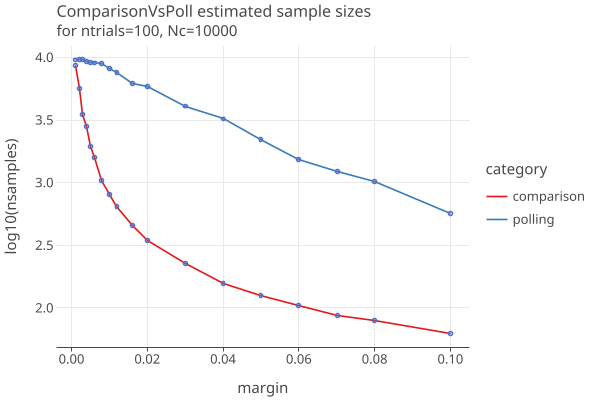
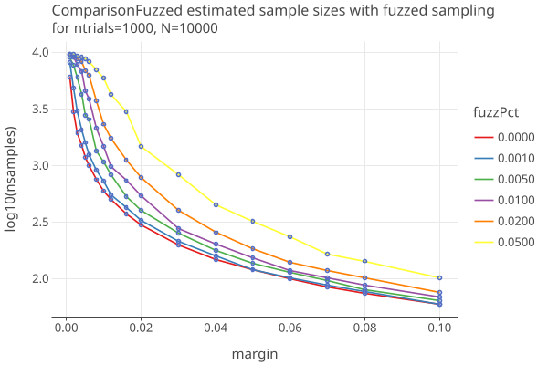
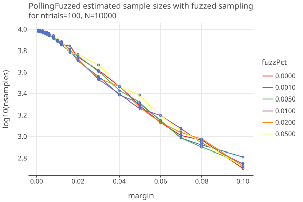
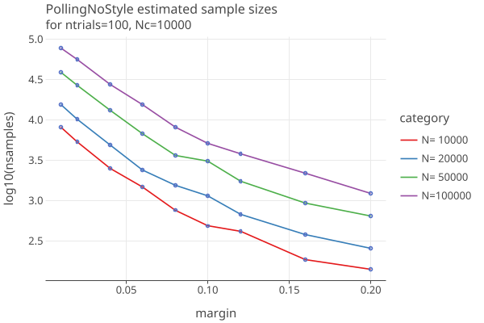
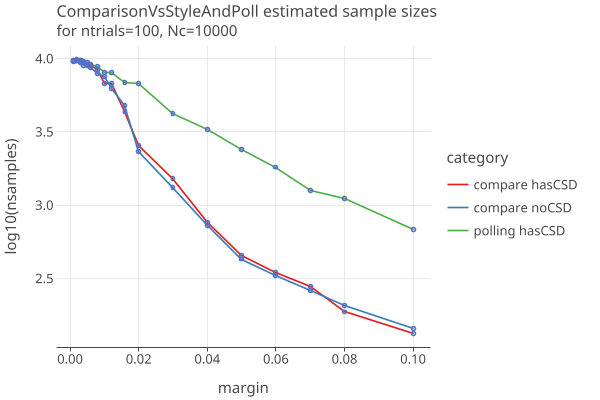
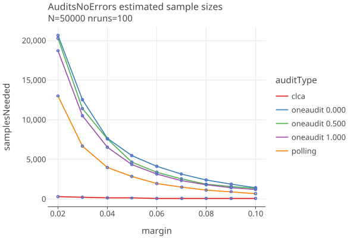
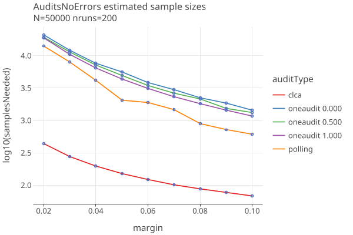
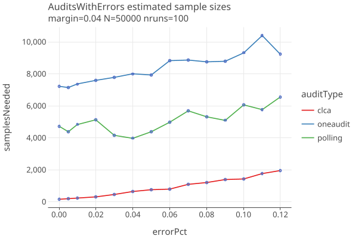
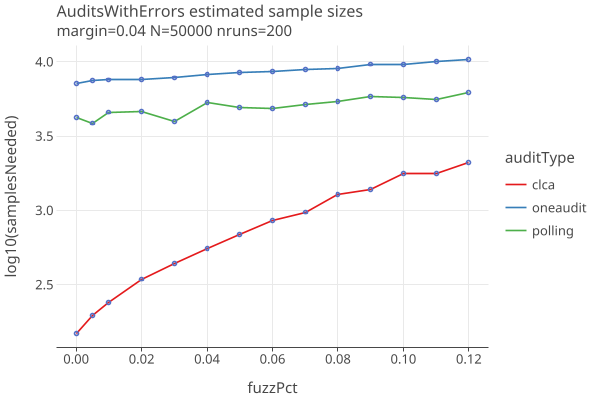
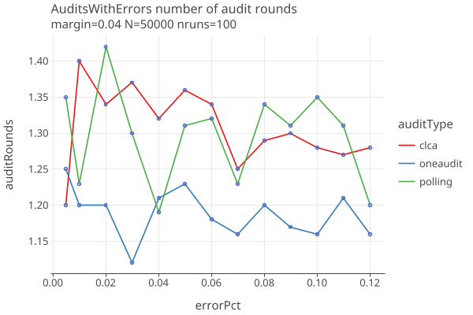

# rlauxe
last update: 01/17/2025

A port of Philip Stark's SHANGRLA framework and related code to kotlin, 
for the purpose of making a reusable and maintainable library.

**WORK IN PROGRESS**

You can also read this on [github.io](https://johnlcaron.github.io/rlauxe/).


Table of Contents
<!-- TOC -->
* [rlauxe](#rlauxe)
  * [Reference Papers](#reference-papers)
  * [SHANGRLA framework](#shangrla-framework)
    * [Assorters and supported SocialChoices](#assorters-and-supported-socialchoices)
      * [Plurality](#plurality)
      * [Approval](#approval)
      * [SuperMajority](#supermajority)
      * [IRV](#irv)
    * [Betting martingales](#betting-martingales)
    * [Polling audits](#polling-audits)
    * [Comparison audits](#comparison-audits)
      * [Comparison Betting Payoffs](#comparison-betting-payoffs)
    * [Polling Vs Comparison Estimated Sample sizes with no errors](#polling-vs-comparison-estimated-sample-sizes-with-no-errors)
    * [Estimating Error](#estimating-error)
      * [Comparison error rates](#comparison-error-rates)
      * [Estimating Sample sizes and error rates with fuzz](#estimating-sample-sizes-and-error-rates-with-fuzz)
  * [Sampling](#sampling)
    * [Estimating Sample sizes](#estimating-sample-sizes)
    * [Choosing which ballots/cards to sample](#choosing-which-ballotscards-to-sample)
      * [Consistent Sampling](#consistent-sampling)
      * [Uniform Sampling](#uniform-sampling)
    * [Comparison audits and CSDs](#comparison-audits-and-csds)
    * [Polling Vs Comparison with/out CSD Estimated Sample sizes](#polling-vs-comparison-without-csd-estimated-sample-sizes)
    * [Missing Ballots (aka phantoms-to-evil zombies)](#missing-ballots-aka-phantoms-to-evil-zombies)
  * [Stratified audits using OneAudit](#stratified-audits-using-oneaudit)
    * [Comparison of AuditTypes' sample sizes](#comparison-of-audittypes-sample-sizes)
  * [Differences with SHANGRLA](#differences-with-shangrla)
    * [Limit audit to estimated samples](#limit-audit-to-estimated-samples)
    * [compute sample size](#compute-sample-size)
    * [generation of phantoms](#generation-of-phantoms)
    * [estimate comparison error rates](#estimate-comparison-error-rates)
    * [use of previous round's sampled_cvr_indices](#use-of-previous-rounds-sampled_cvr_indices)
  * [Other Notes](#other-notes)
  * [Development Notes](#development-notes)
<!-- TOC -->

## Reference Papers

    P2Z         Limiting Risk by Turning Manifest Phantoms into Evil Zombies. Banuelos and Stark. July 14, 2012

    RAIRE       Risk-Limiting Audits for IRV Elections.			Blom, Stucky, Teague    29 Oct 2019
        https://arxiv.org/abs/1903.08804

    SHANGRLA	Sets of Half-Average Nulls Generate Risk-Limiting Audits: SHANGRLA.	Stark, 24 Mar 2020
        https://github.com/pbstark/SHANGRLA

    MoreStyle	More style, less work: card-style data decrease risk-limiting audit sample sizes	Glazer, Spertus, Stark; 6 Dec 2020

    ALPHA:      Audit that Learns from Previously Hand-Audited Ballots. Stark, Jan 7, 2022
        https://github.com/pbstark/alpha.

    BETTING     Estimating means of bounded random variables by betting. Waudby-Smith and Ramdas, Aug 29, 2022
        https://github.com/WannabeSmith/betting-paper-simulations

    COBRA:      Comparison-Optimal Betting for Risk-limiting Audits. Jacob Spertus, 16 Mar 2023
        https://github.com/spertus/comparison-RLA-betting/tree/main

    ONEAudit:   Overstatement-Net-Equivalent Risk-Limiting Audit. Stark   6 Mar 2023.
        https://github.com/pbstark/ONEAudit

    STYLISH	    Stylish Risk-Limiting Audits in Practice.		Glazer, Spertus, Stark  16 Sep 2023
      https://github.com/pbstark/SHANGRLA

    VERIFIABLE  Publicly Verifiable RLAs.     Alexander Ek, Aresh Mirzaei, Alex Ozdemir, Olivier Pereira, Philip Stark, Vanessa Teague


## SHANGRLA framework

SHANGRLA is a framework for running [Risk Limiting Audits](https://en.wikipedia.org/wiki/Risk-limiting_audit) (RLA) for elections.
It uses an _assorter_ to assign a number to each ballot, and a _statistical risk testing function_ that allows an audit to statistically
prove that an election outcome is correct (or not) to within a _risk level α_, for example,  risk limit = 5% means that
the election is correct with 95% probability.

It checks outcomes by testing _half-average assertions_, each of which claims that the mean of a finite list of numbers 
between 0 and upper is greater than 1/2. The complementary _null hypothesis_ is that each assorter mean is not greater than 1/2.
If that hypothesis is rejected for every assertion, the audit concludes that the outcome is correct.
Otherwise, the audit expands, potentially to a full hand count. If every null is tested at risk level α, this results 
in a risk-limiting audit with risk limit α:
**_if the election outcome is not correct, the chance the audit will stop shy of a full hand count is at most α_**.

This formulation unifies polling audits and comparison audits, with or without replacement. It allows for the ballots to
be divided into _strata_, each of which is sampled independently (_stratified sampling_), or to use
batches of ballot cards instead of individual cards (_cluster sampling_).

| term          | definition                                                                                     |
|---------------|------------------------------------------------------------------------------------------------|
| N             | the number of ballot cards validly cast in the contest                                         |
| risk	         | we want to confirm or reject the null hypothesis with risk level α.                            |
| assorter      | assigns a number between 0 and upper to each ballot, chosen to make assertions "half average". |
| assertion     | the mean of assorter values is > 1/2: "half-average assertion"                                 |
| estimator     | estimates the true population mean from the sampled assorter values.                           |
| riskTestingFn | is the statistical method to test if the assertion is true.                                    |
| audit         | iterative process of picking ballots and checking if all the assertions are true.              |


### Assorters and supported SocialChoices

#### Plurality

"Top k candidates are elected."
The rules may allow the voter to vote for one candidate, k candidates or some other number, including n, which
makes it approval voting.

See SHANGRLA, section 2.1.

A contest has K ≥ 1 winners and C > K candidates. Let wk be the kth winner, and ℓj be the jth loser.
For each pair of winner and loser, let H_wk,ℓj be the assertion that wk is really the winner over ℓj.

There are K(C − K) assertions. The contest can be audited to risk limit α by testing all assertions at significance level α.
Each assertion is tested that the mean of the assorter values is > 1/2 (or not).

For the case when there is only one winner, there are C - 1 assertions, pairing the winner with each loser.
For a two candidate election, there is only one assertion.

For the ith ballot, define `A_wk,ℓj(bi)` as
````
    assign the value “1” if it has a mark for wk but not for ℓj; 
    assign the value “0” if it has a mark for ℓj but not for wk;
    assign the value 1/2, otherwise.
 ````

For polling, the assorter function is this A_wk,ℓj(MVR).

For a comparison audit, the assorter function is B(MVR, CVR) as defined below, using this A_wk,ℓj.

Notes
* Someone has to enforce that each CVR has <= number of allowed votes.


#### Approval

See SHANGRLA, section 2.2.

In approval voting, voters may vote for as many candidates as they like.
The top K candidates are elected.

The plurality voting algorithm is used, with K winners and C-K losers.


#### SuperMajority

"Top k candidates are elected, whose percent vote is above a fraction, f."

See SHANGRLA, section 2.3.

A winning candidate must have a minimum fraction f ∈ (0, 1) of the valid votes to win.
If multiple winners are allowed, each reported winner generates one assertion.

For the ith ballot, define `A_wk,ℓj(bi)` as
````
    assign the value “1/(2*f)” if it has a mark for wk but no one else; 
    assign the value “0” if it has a mark for exactly one candidate and not wk
    assign the value 1/2, otherwise.
````
For polling, the assorter function is this A_wk,ℓj(bi).

For a comparisian audit, the assorter function is B(MVR, CVR) as defined below, using this A_wk,ℓj.

One only needs one assorter for each winner, not one for each winner/loser pair.

Notes
* Someone has to enforce that each CVR has <= number of allowed votes.
* multiple winners are not yet supported for auditing.


#### IRV

We use the [RAIRE java library](https://github.com/DemocracyDevelopers/raire-java) to generate IRV assertions. 

See the RAIRE guides for details:
* [Part 1: Auditing IRV Elections with RAIRE](https://github.com/DemocracyDevelopers/Colorado-irv-rla-educational-materials/blob/main/A_Guide_to_RAIRE_Part_1.pdf)
* [Part 2: Generating Assertions with RAIRE](https://github.com/DemocracyDevelopers/Colorado-irv-rla-educational-materials/blob/main/A_Guide_to_RAIRE_Part_2.pdf)

### Betting martingales

In BETTING, Waudby-Smith and Ramdas develop tests and confidence sequences for the mean of a bounded population using 
betting martingales of the form

    M_j :=  Prod (1 + λ_i (X_i − µ_i)),  i=1..j    (BETTING eq 34 and ALPHA eq  10)

where µi := E(Xi | Xi−1), computed on the assumption that the null hypothesis is true.
(For large N, µ_i is very close to 1/2.)

The sequence (M_j) can be viewed as the fortune of a gambler in a series of wagers.
The gambler starts with a stake of 1 unit and bets a fraction λi of their current wealth on
the outcome of the ith wager. The value Mj is the gambler’s wealth after the jth wager. The
gambler is not permitted to borrow money, so to ensure that when X_i = 0 (corresponding to
losing the ith bet) the gambler does not end up in debt (Mi < 0), λi cannot exceed 1/µi.

See BettingMart.kt and related code for current implementation.

### Polling audits

The requirements for Polling audits:

* There must be a BallotManifest defining the population of ballots, that contains a unique identifier that can be matched to the corresponding physical ballot.
* There must be an independently determined upper bound on the number of cast cards/ballots that contain the contest.

A polling audit retrieves a physical ballot and the auditors manually agree on what it says, creating an MVR (manual voting record) for it.
The assorter assigns an assort value in [0, upper] to the ballot, which is used in the testing statistic.

For the risk function, we use AlphaMart (or equivilent BettingMart) with ShrinkTrunkage, which estimates the true
population mean (theta) using a weighted average of an initial estimate (eta0) with the actual sampled mean. 
The average assort value is used as the initial estimate (eta0) when testing each assertion. These assort values
are specified in SHANGRLA, section 2. See Assorter.kt for our implementation.

The only settable parameter for the risk function is d, which is used for estimating theta (the true population assort value average) 
at the ith sample:

    estTheta_i = (d*eta0 + sampleSum_i) / (d + sampleSize_i)

which trades off smaller sample sizes when theta = eta0 (large d) vs quickly adapting to when theta < eta0 (smaller d).

To use BettingMart rather than AlphaMart, we just have to set

    λ_i = (estTheta_i/µ_i − 1) / (upper − µ_i)

where upper is the upper bound of the assorter (1 for plurality, 1/(2f) for supermajority), and µ_i := E(Xi | Xi−1) as above.

A few representative plots showing the effect of d are at [meanDiff plots](https://docs.google.com/spreadsheets/d/1bw23WFTB4F0xEP2-TFEu293wKvBdh802juC7CeRjp-g/edit?gid=1185506629#gid=1185506629).
* High values of d do significantly better when the reported mean is close to the true mean. 
* When the true mean < reported mean, high d may force a full hand count unnecessarily.
* Low values of d are much better when true mean < reported mean, at the cost of larger samples sizes.
* Tentatively, we will use d = 100 as default, and allow the user to override.

See [Polling Simulations](docs/PollingSimulations.md) for more details and plots.

### Comparison audits

The requirements for Comparison audits:

* The election system must be able to generate machine-readable Cast Vote Records (CVRs) for each ballot, which is compared to the MVR during the audit.
* Unique identifier must be assigned to each physical ballot, and put on the CVR, in order to find the physical ballot that matches the sampled CVR. 
* There must be an independently determined upper bound on the number of cast cards/ballots that contain the contest.

For the risk function, we use BettingMart with AdaptiveComparison. AdaptiveComparison needs estimates of the rates of 
over(under)statements. If these estimates are correct, one gets optimal sample sizes. 
AdaptiveComparison uses a variant of ShrinkTrunkage that uses a weighted average of initial estimates (aka priors) with the actual sampled rates.

See Cobra section 4.2 and SHANGRLA Section 3.2.

The overstatement error for the ith ballot is:
````
    ωi ≡ A(ci) − A(bi) ≤ A(ci) ≤ upper    "overstatement error" (SHANGRLA eq 2, p 9)
      bi is the manual voting record (MVR) for the ith ballot
      ci is the cast-vote record for the ith ballot
      A() is the assorter function
Let
     Ā(c) ≡ Sum(A(ci))/N be the average CVR assort value
     v ≡ 2Ā(c) − 1, the _reported assorter margin_
     τi ≡ (1 − ωi /upper) ≥ 0
     B(bi, ci) ≡ τi /(2 − v/upper) = (1 − ωi /upper) / (2 − v/upper) ≡ "comparison assorter" ≡ B(MVR, CVR)

Then B assigns nonnegative numbers to ballots, and the outcome is correct iff
    B̄ ≡ Sum(B(bi, ci)) / N > 1/2
and so B is an half-average assorter.
````

````
  "assorter" here is the plurality assorter
  Let 
    bi denote the true votes on the ith ballot card; there are N cards in all.
    ci denote the voting system’s interpretation of the ith card
    Ā(c) ≡ Sum(A(ci))/N is the average assorter value across all the CVRs
    margin ≡ v ≡ 2Ā(c) − 1, the _reported assorter margin_
  
    ωi ≡ A(ci) − A(bi)   overstatementError for ith ballot
    ωi in [-1, -.5, 0, .5, 1] (for plurality assorter, which is in {0, .5, 1}))
  
    
    We know Āb = Āc − ω̄, so Āb > 1/2 iff ω̄ < Āc − 1/2 iff ω̄/(2*Āc − 1) < 1/2 = ω̄/v < 1/2
    
    
    
    scale so that B(0) = (2*Āc − 1)
    
        find B affine transform to interval [0, u], where H0 is average B < 1/2
    shift to 0, just add 1 to ωi, B(-1) = 0
    
    so B(-1) = 0
       B(0) = 1/2 
       B(1) = u 
    
    Bi = (1 - ωi/u) / (2 - v/u)
    Bi = tau * noerror; tau = (1 - ωi/u), noerror = 1 / (2 - v/u)    
    
    τi ≡ (1 − ωi /upper) ≥ 0, since ωi <= upper
    B(bi, ci) ≡ τi / (2 − margin/upper) = (1 − ωi /upper) / (2 − margin/upper)
  
  overstatementError in [-1, -.5, 0, .5, 1] == A(ci) − A(bi) = ωi
  find B transform to interval [0, u],  where H0 is B < 1/2
  Bi = (1 - ωi/u) / (2 - v/u)
  Bi = tau * noerror; tau = (1 - ωi/u), noerror = 1 / (2 - v/u)
  
  Bi in [0, .5, 1, 1.5, 2] * noerror = [twoOver, oneOver, nuetral, oneUnder, twoUnder]
````

Notes 
* The comparison assorter B needs Ā(c) ≡ the average CVR assort value > 0.5.
* Ā(c) should have the diluted margin as the denominator. 
    (Margins are  traditionally calculated as the difference in votes divided by the number of valid votes.
    Diluted refers to the fact that the denominator is the number of ballot cards containing that contest, which is
    greater than or equal to the number of valid votes.)
* If overstatement error is always zero (no errors in CRV), the assort value is always
  ````
      noerror = 1 / (2 - margin/assorter.upperBound()) 
              = 1 / (3 - 2 * awinnerAvg/assorter.upperBound())
              > 0.5 since awinnerAvg > 0.5
  ````
* The possible values of the bassort function are then:
      {0, .5, 1, 1.5, 2} * noerror
* When the cvrs always equal the corresponding mvr, we always get bassort == noerror > .5, so eventually the null is rejected.

#### Comparison Betting Payoffs

For the ith sample with bet λ_i, the BettingMart payoff is

    t_i = 1 + λ_i * (X_i − µ_i)

where

    λ_i in [0, 1/u_i]
    X_i = {0, .5, 1, 1.5, 2} * noerror for {2voteOver, 1voteOver, equal, 1voteUnder, 2voteUnder} respectively.
    µ_i ~= 1/2
    λ_i ~in [0, 2]

then 

    payoff = t_i = 1 + λ_i * noerror * {-.5, 0, .5, 1.5}

Using AdaptiveComparison, λ_i depends only on the 4 estimated error rates (see next section) and the margin. 

See [Ballot Payoff Plots](docs/BettingPayoffs.md) for details.


### Polling Vs Comparison Estimated Sample sizes with no errors

This plot (_PlotSampleSizeEstimates.plotComparisonVsPoll()_) shows the difference between a polling audit and a comparison
audit at different margins, where the MVRS match the CVRS ("no errors").

<a href="https://johnlcaron.github.io/rlauxe/docs/plots/samples/ComparisonVsPoll.html" rel="Polling Vs Comparison Estimated Sample sizes"></a>

Polling at margins < 4% needs prohibitively large sample sizes.
Comparison audits are perhaps useful down to margins = .4% .

"In a card-level comparison audit, the estimated sample size scales with
the reciprocal of the diluted margin." (STYLISH p.4) Polling scales as square of 1/margin.

### Estimating Error

The assumptions that one makes about the comparison error rates greatly affect the sample size estimation.
These rates should be empirically determined, and public tables for different voting machines should be published.
While these do not affect the reliabilty of the audit, they have a strong impact on the estimated sample sizes.

If the errors are from random processes, its possible that margins remain approx the same, but also possible that some rates
are more likely to be affected than others. Its worth noting that error rates combine machine errors with human errors of
fetching and interpreting ballots.

We currently have two ways of setting error rates. Following COBRA, the user can specify the "apriori" error rates for p1, p2, p3, p4. 
Otherwise, they can specify a "fuzz pct" (explained below), and the apriori error rates are derived from it. In both cases, we use
CORBRA's adaptive estimate of the error rates that does a weighted average of the aproiri and the samples error rates. This is used 
when estimating the sample size from the diluted margin, and also when doing the actual audit comparing the CVRs and the MVRs. 


#### Comparison error rates

The comparison error rates are:

        val p1: // rate of 1-vote overstatements; voted for other, cvr has winner
        val p2: // rate of 2-vote overstatements; voted for loser, cvr has winner
        val p3: // rate of 1-vote understatements; voted for winner, cvr has other
        val p4: // rate of 2-vote understatements; voted for winner, cvr has loser

For IRV, the corresponding descriptions of the errror rates are:

    NEB two vote overstatement: cvr has winner as first pref (1), mvr has loser preceeding winner (0)
    NEB one vote overstatement: cvr has winner as first pref (1), mvr has winner preceding loser, but not first (1/2)
    NEB two vote understatement: cvr has loser preceeding winner(0), mvr has winner as first pref (1)
    NEB one vote understatement: cvr has winner preceding loser, but not first (1/2), mvr has winner as first pref (1)
    
    NEN two vote overstatement: cvr has winner as first pref among remaining (1), mvr has loser as first pref among remaining (0)
    NEN one vote overstatement: cvr has winner as first pref among remaining (1), mvr has neither winner nor loser as first pref among remaining (1/2)
    NEN two vote understatement: cvr has loser as first pref among remaining (0), mvr has winner as first pref among remaining (1)
    NEN one vote understatement: cvr has neither winner nor loser as first pref among remaining (1/2), mvr has winner as first pref among remaining  (1)

See [Ballot Comparison using Betting Martingales](docs/Betting.md) for more details and plots of 2-way contests
with varying p2error rates.

#### Estimating Sample sizes and error rates with fuzz

We can also estimate comparison error rates as follows:

The MVRs are "fuzzed" by taking _fuzzPct_ of the ballots
and randomly changing the candidate that was voted for. When fuzzPct = 0.0, the cvrs and mvrs agree.
When fuzzPct = 0.01, 1% of the contest's votes were randomly changed, and so on. 

The first plot below shows that Comparison sample sizes are somewhat affected by fuzz. The second plot shows that Plotting sample sizes
have greater spread, but on average are not much affected.

<a href="https://johnlcaron.github.io/rlauxe/docs/plots/samples/ComparisonFuzzed.html" rel="ComparisonFuzzed"></a>
<a href="https://johnlcaron.github.io/rlauxe/docs/plots/samples/PollingFuzzed.html" rel="PollingFuzzed"></a>

We use this strategy and run simulations that generate comparison error rates, as a function of number of candidates in the contest.
(see GenerateComparisonErrorTable.kt):

N=100000 ntrials = 1000
generated 12/01/2024

| ncand | r1     | r2     | r3     | r4     |
|-------|--------|--------|--------|--------|
| 2     | 0.2535 | 0.2524 | 0.2474 | 0.2480 |
| 3     | 0.3367 | 0.1673 | 0.3300 | 0.1646 |
| 4     | 0.3357 | 0.0835 | 0.3282 | 0.0811 |
| 5     | 0.3363 | 0.0672 | 0.3288 | 0.0651 |
| 6     | 0.3401 | 0.0575 | 0.3323 | 0.0557 |
| 7     | 0.3240 | 0.0450 | 0.3158 | 0.0434 |
| 8     | 0.2886 | 0.0326 | 0.2797 | 0.0314 |
| 9     | 0.3026 | 0.0318 | 0.2938 | 0.0306 |
| 10    | 0.2727 | 0.0244 | 0.2624 | 0.0233 |

Then p1 = fuzzPct * r1, p2 = fuzzPct * r2, p3 = fuzzPct * r3, p4 = fuzzPct * r4.
For example, a two-candidate contest has significantly higher two-vote error rates (p2), since its more likely to flip a 
vote between winner and loser, than switch a vote to/from other.
(NOTE: Currently the percentage of ballots with no votes cast for a contest is not well accounted for)

We give the user the option to specify a fuzzPct and use this table for the apriori error rates error rates,

Possible refinement of this algorithm might measure:
   1. percent time a mark is seen when its not there
   2. percent time a mark is not seen when it is there
   3. percent time a mark is given to the wrong candidate

## Sampling

SHANGRLA provides a very elegant separation between the implementation of risk testing (mostly described
above) and sampling.

### Estimating Sample sizes

For each contest we simulate the audit with manufactured data that has the same margin as the reported outcome. By
running simulations, we can use estimated error rates and add errors to the manufactured data.

For each contest assertion we estimate the required sample size that will satisfy the risk limit some fraction 
(_auditConfig.quantile_) of the time. The contest sample_size is then the maximum of the contests' assertion estimates.

Audits are done in rounds. If a contest is not proved or disproved, the next round's estimated sample size starts from 
the previous audit's pvalue.

Note that each round does its own sampling without regard to the previous round's sampled ballots. 
Since the seed remains the same and the ballot ordering is the same, then previously audited MVRS are used as much as 
possible in subsequent rounds.

Note: I _think_ its ok if more ballots come in between rounds (although this may be disallowed for security reasons). 
Just add the new ballots to the "all cvrs list", and do the next round as usual. 
Ideally N_c doesnt change, so it just makes less evil zombies.

### Choosing which ballots/cards to sample

Once we have all of the contests' estimated sample sizes, we next choose which ballots/cards to sample. 
This step is highly dependent on how much we know about which ballots contain which contests. In particular,
whether you have Card Style Data (CSD), (see MoreStyle, p2).

For comparison audits, the generated Cast Vote Record (CVR) comprises the CSD, as long as the CVR records when a contest recieves no votes.
If it does not record contests with no votes, I think we have to use uniform sampling instead of consistent sampling.
This has such a dramatic effect on sample sizes that I would consider this an bug of the CVR software.
Nonetheless we handle this case in the library.

So far, we can distinguish the following cases:

1. Comparison, hasCSD: CVR is a CSD.
2. Comparison, !hasCSD: contests with no votes are not recorded on the CVR.

3. Polling, hasCSD: has a ballot manifest with ballot.hasContest(contestId)
4. Polling, !hasCSD: doesnt know which ballots have which contests
5. Polling, precinct batches/containers (TODO). See MoreStyle, p.13:
  * precinct-based voting where each voter in a precinct gets the same ballot style, and the balots are stored by precinct.
  * information about which containers have which card styles, even without information about which cards contain which
    contests, can still yield substantial efficiency gains for ballot-polling audits.

#### Consistent Sampling

When we can tell which ballots/CVRs contain a given contest, we can use consistent sampling, as follows:

* For each contest, estimate the number of samples needed (contest.estSamples).
* For each ballot/cvr, assign a large psuedo-random number, using a high-quality PRNG.
* Sort the ballots/cvrs by that number
* Select the first ballots/cvrs that use any contest that needs more samples, until all contests have
at least contest.estSampleSize in the sample of selected ballots.

#### Uniform Sampling

When we can't tell which ballots/CVRs contain a given contest, we can use uniform sampling, as follows:

* For each contest, estimate the number of samples needed (contest.estSamples).
* Let N be the total number of ballots, and Nc the maximum number of cards for a contest C. Then we assume that the
  probability of a ballot containing contest C is Nc / N.
* Over all contests, compute contest.estSamples / Nc / N and choose the maximum = audit.estSamples.
* For each ballot/cvr, assign a large psuedo-random number, using a high-quality PRNG.
* Sort the ballots/cvrs by that number
* Take the first audit.estSamples of the sorted ballots.

We need Nc as a condition of the audit, but its straightforward to estimate a contests' sample size without Nc,
since it works out that Nc cancels out:

        sampleEstimate = rho / dilutedMargin                  // (SuperSimple p. 4)
        where 
          dilutedMargin = (vw - vl)/ Nc
        sampleEstimate = rho * Nc / (vw - vl)
        totalEstimate = sampleEstimate * N / Nc               // must scale by proportion of ballots with that contest
                      = rho * N / (vw - vl) 
                      = rho / fullyDilutedMargin
        where
          fullyDilutedMargin = (vw - vl)/ N

The scale factor N/Nc depends on how many contests there are and how they are distributed across the ballots.
In the following plot we just show N/Nc = 1, 2, 5 and 10. N/Nc = 1 is the case where the audit has CSDs:

<a href="https://johnlcaron.github.io/rlauxe/docs/plots/samples/PollingNoStyle.html" rel="PollingNoStyle"></a>

See _PlotPollingNoStyles.kt_.

### Comparison audits and CSDs

ConsistentSampling is used in either case. This assigns large psuedo-random numbers to each ballot, orders the ballots
by that number, and selects the first ballots that use any contest that needs more samples, until all contests have 
at least contest.estSampleSize in the sample of selected ballots.

In practice, its unclear whether there's much difference for Comparison audits when the CSD is complete or not (see plots below). 
It appears that the assort value changes when there is a discrepency between the CVR and MVR, but not otherwise. 

See ComparisonAssorter.overstatementError() in core/Assorter.kt (from SHANGRLA Audit.py class Assorter):

    assorter that corresponds to normalized overstatement error for an assertion

    If `use_style == true`, then if the CVR contains the contest but the MVR does not,
    that is considered to be an overstatement, because the ballot is presumed to contain
    the contest .

    If `use_style == False`, then if the CVR contains the contest but the MVR does not,
    the MVR is considered to be a non-vote in the contest .

TODO: whats the reasoning for the above?

For !hasCSD, we wont select unvoted contests to be in the sample, since they arent recorded.
So then if we see an unvoted contest on the MVR, the case where the MVR contains the contest but not the CVR, then...

### Polling Vs Comparison with/out CSD Estimated Sample sizes

The following plot shows polling with CSD vs comparison with CSD vs comparison without CSD at different margins:

<a href="https://johnlcaron.github.io/rlauxe/docs/plots/samples/ComparisonVsStyleAndPoll.html" rel="ComparisonVsStyleAndPoll"></a>

Little difference between comparison with/out CSD. Large difference with polling with CSD. Not showing polling without CSD,
since it depends on N/Nc scaling.

See _PlotSampleSizeEstimates.plotComparisonVsStyleAndPoll()_.


### Missing Ballots (aka phantoms-to-evil zombies)

From P2Z paper:

    A listing of the groups of ballots and the number of ballots in each group is called a ballot manifest.

    What if the ballot manifest is not accurate?
    It suffices to make worst-case assumptions about the individual randomly selected ballots that the audit cannot find.
    This ensures that the true risk limit remains smaller than the nominal risk limit.

    The dead (not found, phantom) ballots are re-animated as evil zombies: We suppose that they reflect whatever would
    increase the P-value most: a 2-vote overstatement for a ballot-level comparison audit, 
    or a valid vote for every loser in a ballot-polling audit.
 
From SHANGRLA, section 3.4:

    Let NC denote an upper bound on the number of ballot cards that contain the contest. 
    Suppose that n ≤ NC CVRs contain the contest and that each of those CVRs is associated with a unique,
    identifiable physical ballot card that can be retrieved if that CVR is selected for audit.
    
    If NC > n, create NC − n “phantom ballots” and NC − n “phantom CVRs.” Calculate the assorter mean for all the CVRs,
    including the phantoms by treating the phantom CVRs as if they contain no valid vote in the contest 
    (i.e., the assorter assigns the value 1/2 to phantom CVRs). Find the corresponding assorter margin (v ≡ 2Ā − 1).
    [comment: so use 1/2 for assorter margin calculation].

    To conduct the audit, sample integers between 1 and NC.
    
    1. If the resulting integer is between 1 and n, retrieve and inspect the ballot card associated with the corresponding CVR.
        1. If the associated ballot contains the contest, calculate the overstatement error as in (SHANGRLA eq 2, above).
        2. If the associated ballot does not contain the contest, calculate the overstatement error using the value the 
           assorter assigned to the CVR, but as if the value the assorter assigns to the physical ballot is zero
           (that is, the overstatement error is equal to the value the assorter assigned to the CVR).
       2. If the resulting integer is between n + 1 and NC , we have drawn a phantom CVR and a phantom ballot. Calculate the
          overstatement error as if the value the assorter assigned to the phantom ballot was 0 (turning the phantom into an “evil zombie”),
          and as if the value the assorter assigned to the CVR was 1/2.
    
    Some jurisdictions, notably Colorado, redact CVRs if revealing them might compromise
    vote anonymity. If such CVRs are omitted from the tally and the number of phantom
    CVRs and ballots are increased correspondingly, this approach still leads to a valid RLA.
    But if they are included in the tally, then if they are selected for audit they should be
    treated as if they had the value u TODO (the largest value the assorter can assign) in calculating
    the overstatement error.

From SHANGRLA python code, assertion-RLA.ipynb:

    Any sampled phantom card (i.e., a card for which there is no CVR) is treated as if its CVR is a non-vote (which it is), 
    and as if its MVR was least favorable (an "evil zombie" producing the greatest doubt in every assertion, separately). 
    Any sampled card for which there is a CVR is compared to its corresponding CVR.
    If the card turns out not to contain the contest (despite the fact that the CVR says it does), 
    the MVR is treated in the least favorable way for each assertion (i.e., as a zombie rather than as a non-vote).

So it seems (case 1) we use 1/2 when calculating assorter margins, but during the actual audit, (case 2) we use 0 (polling) and 0? (comparison).

So we need a different routine for "find assorter margin" than "find assorter value". Probably.
Python code (Audit.py, Assorter) doesnt seem to reflect polling case 2 that I can find, but perhaps because the assort is passed in?

    The basic method is assort, but the constructor can be called with (winner, loser)
    instead. In that case,
        assort = (winner - loser + 1)/2

which corresponds to case 1.

------------------------------------------------------------------------------------

    Let N_c = upper bound on ballots for contest C.
    Let Nb = N (physical ballots) = ncvrs (comparison) or nballots in manifest (polling).

    When we have styles, we can calculate Nb_c = physical ballots for contest C
    Let V_c = votes for contest C, V_c <= Nb_c <= N_c.
    Let U_c = undervotes for contest C = Nb_c - V_c >= 0.
    Let Np_c = nphantoms for contest C = N_c - Nb_c, and are added to the ballots before sampling or sample size estimation.
    Then V_c + U_c + Np_c = N_c.

    Comparison, no styles: we have cvrs, but the cvr doesnt record undervotes.
    We know V_c and N_c. Cant distinguish an undervote from a phantom, so we dont know U_c, or Nb_c or Np_c.
    For estimating, we can use some guess for U_c.
    For auditing, I think we need to assume U_c is 0? So Np_c = N_c - V_c??
    I think we must have a ballot manifest, which means we have Nb, and ... 

------------------------------------------------------------------------------------

The margin is calculated with both undervotes and phantoms = 1/2.
But in reality, the phantoms use "worst case" vote for the loser.
If the phantom pct is greater than the margin, the audit will fail.
When hasStyles, we know what that percent is.
So for estimation, we could calculate the margin with usePhantoms=true, since thats what were going to see during the audit.

Ive convinced myself that one cant know Nc without knowing Np. Since Np has such a strong effect, we will keep it per 
contest and use it in the estimation and also the betting strategy.

Should use phantomPct for estimated 1-vote overstatement error rate estimate.

-------------------
From OneAudit, p 9:

    The stratum with linked CVRs comprised 5,294 ballots with 5,218 reported votes in the contest; 
    the “no-CVR” stratum comprised 22,372 ballots with 22,082 reported votes.

1 - 5218/5294 = .0143
1 - 22082/22372 = .0129

## Stratified audits using OneAudit

When there is a CVR, use standard Comparison assorter. When there is no CVR, compare the MVR with the "average CVR" of the batch.
This is "overstatement-net-equivalent" (aka ONE).

OneAudit, 2.3 pp 5-7:
````
      "assorter" here is the plurality assorter
      from oa_polling.ipynb
      assorter_mean_all = (whitmer-schuette)/N
      v = 2*assorter_mean_all-1
      u_b = 2*u/(2*u-v)  # upper bound on the overstatement assorter
      noerror = u/(2*u-v)

      Let bi denote the true votes on the ith ballot card; there are N cards in all.
      Let ci denote the voting system’s interpretation of the ith card, for ballots in C, cardinality |C|.
      Ballot cards not in C are partitioned into G ≥ 1 disjoint groups {G_g}, g=1..G for which reported assorter subtotals are available.

          Ā(c) ≡ Sum(A(ci))/N be the average CVR assort value
          margin ≡ 2Ā(c) − 1, the _reported assorter margin_

          ωi ≡ A(ci) − A(bi)   overstatementError
          τi ≡ (1 − ωi /upper) ≥ 0, since ωi <= upper
          B(bi, ci) ≡ τi / (2 − margin/upper) = (1 − ωi /upper) / (2 − margin/upper)

         Ng = |G_g|
         Ā(g) ≡ assorter_mean_poll = (winner total - loser total) / Ng; > 0
         margin ≡ 2Ā(g) − 1 ≡ v = 2*assorter_mean_poll − 1
         
         mvr has loser vote = (1-assorter_mean_poll)/(2-v/u)
         mvr has winner vote = (2-assorter_mean_poll)/(2-v/u)
         otherwise = 1/2
````

````
Plurality assort values:
  assort in {0, .5, 1}

Regular Comparison:
  overstatementError in [-1, -.5, 0, .5, 1] == A(ci) − A(bi) = ωi
  find B transform to interval [0, u],  where H0 is B < 1/2
  Bi = (1 - ωi/u) / (2 - v/u)
  Bi = tau * noerror; tau = (1 - ωi/u), noerror = 1 / (2 - v/u)

  Bi in [0, .5, 1, 1.5, 2] * noerror = [twoOver, oneOver, nuetral, oneUnder, twoUnder]
  
Batch Comparison:
  mvr assort in {0, .5, 1} as before
  cvr assort is always Ā(g) ≡ assorter_mean_poll = (winner total - loser total) / Ng
  overstatementError == A(ci) − A(bi) = Ā(g) - {0, .5, 1} = { Ā(g), Ā(g)-.5, Ā(g)-1} = [loser, nuetral, winner]
  
  ωi ≡ A(ci) − A(bi)   overstatementError
  τi ≡ (1 − ωi /u) = {1 - Ā(g)/u, 1 - (Ā(g)-.5)/u, 1 - (Ā(g)-1)/u}
  B(bi, ci) ≡ {1 - Ā(g)/u, 1 - (Ā(g)-.5)/u, 1 - (Ā(g)-1)/u} / (2 − v/u)
          
  mvr has loser vote = (1 - Ā(g)/u) / (2-v/u)
  mvr has winner vote = (1 - (Ā(g)-1)/u) / (2-v/u)
  mvr has other vote = (1 - (Ā(g)-.5)/u) / (2-v/u) = 1/2
  
  when u = 1
   mvr has loser vote = (1 - A) / (2-v)
   mvr has winner vote = (2 - A) / (2-v)
   mvr has other vote = (1.5 - A) / (2-v) 
  
  v = 2A-1
  2-v = 2-(2A-1) = 3-2A = 2*(1.5-A)
  other = (1.5-A) / (2-v) = (1.5-A)/2*(1.5-A) = 1/2
  
  Bi in [ (1 - Ā(g)), .5, (2 - Ā(g))] * noerror(g)
````


Using a “mean CVR” for the batch is overstatement-net-equivalent to any CVRs that give the same assorter 
batch subtotals.

````
    v ≡ 2Ā(c) − 1, the reported _assorter margin_, aka the _diluted margin_.

    Ā(b) > 1/2 iff

    Sum(A(ci) - A(bi)) / N < v / 2   (5)

Following SHANGRLA Section 3.2 define

    B(bi) ≡ (upper + A(bi) - A(ci)) / (2*upper - v)  in [0, 2*upper/(2*upper - v)] (6)

    and Ā(b) > 1/2 iff B̄(b) > 1/2

    see OneAudit section 2.3
````
Section 2
````
    Ng = |G_g|
    assorter_mean_poll = (winner total - loser total) / Ng
    mvr has loser vote = (1-assorter_mean_poll)/(2-v)
    mvr has winner vote = (2-assorter_mean_poll)/(2-v)
    otherwise = 1/2
  
````
See "Algorithm for a CLCA using ONE CVRs from batch subtotals" in Section 3.
````
This algorithm can be made more efficient statistically and logistically in a variety
of ways, for instance, by making an affine translation of the data so that the
minimum possible value is 0 (by subtracting the minimum of the possible over-
statement assorters across batches and re-scaling so that the null mean is still
1/2) and by starting with a sample size that is expected to be large enough to
confirm the contest outcome if the reported results are correct.
````

Section 4: Auditing heterogenous voting systems: When the voting system can report linked CVRs for some but not all cards.

See "Auditing heterogenous voting systems" Section 4 for comparision to SUITE:
````
The statistical tests used in RLAs are not affine equivariant because
they rely on a priori bounds on the assorter values. The original assorter values
will generally be closer to the endpoints of [0, u] than the transformed values
are to the endpoints of [0, 2u/(2u − v)]

An affine transformation of the overstatement assorter values can move them back to the endpoints of the support
constraint by subtracting the minimum possible value then re-scaling so that the
null mean is 1/2 once again, which reproduces the original assorter.
````

Section 5.2

````
While CLCA with ONE CVRs is algebraically equivalent to BPA, the perfor-
mance of a given statistical test will be different for the two formulations.

Transforming the assorter into an overstatement assorter using the ONEAudit transformation, then testing whether 
the mean of the resulting population is ≤ 1/2 using the ALPHA test martingale with the
truncated shrinkage estimator of [22] with d = 10 and η between 0.505 and 0.55
performed comparably to—but slightly worse than—using ALPHA on the raw
assorter values for the same d and η, and within 4.8% of the overall performance
of the best-performing method.
````

"ALPHA on the raw assorter values" I think is regular BPA.
"Transforming the assorter into an overstatement assorter" is ONEAIDIT I think, but using Alpha instead of Betting? 
This paper came out at the same time as COBRA.

If ONEAUDIT is better than current BPA, perhaps can unify all 3 (comparison, polling, oneaudit) into a single workflow??
The main difference is preparing the contest with strata.

Unclear about using phantoms with ONEAUDIT non-cvr strata. Perhaps it only appears if the MVR is missing?

Unclear about using nostyle with ONEAUDIT.

### Comparison of AuditTypes' sample sizes

These are plots of sample sizes for the three audit types: Polling, Comparison (clca) and OneAudit (with 0%, 50% and 100% of ballots having CVRs),
when there are no errors between the MVRs and the CVRs.

<a href="https://johnlcaron.github.io/rlauxe/docs/plots/workflows/AuditsNoErrors/AuditsNoErrorsLinear.html" rel="AuditsNoErrors Linear"></a>
<a href="https://johnlcaron.github.io/rlauxe/docs/plots/workflows/AuditsNoErrors/AuditsNoErrorsLog.html" rel="AuditsNoErrors Log"></a>

* OneAudit results are about twice as high as polling. More tuning is possible but wont change the O(margin) shape.
* When there are no errors, the CLCA assort values depend only on the margin, so we get a smooth curve.
* Need to investigate how the presence of errors between the MVRs and the CVRs affects the results.
* OneAudit / Polling probably arent useable when margin < .02, whereas CLCA can be used for much smaller margins.
* Its surprising that theres not more difference between the OneAudit results with different percents having CVRs. 

Plots vs fuzzPct (percent ballots having randomly changed candidate, see [sampling with fuzz](#estimating-sample-sizes-and-error-rates-with-fuzz),
with margin fixed at 4%:

<a href="https://johnlcaron.github.io/rlauxe/docs/plots/workflows/AuditsWithErrors/AuditsWithErrorsLinear.html" rel="AuditsWithErrors Linear"></a>
<a href="https://johnlcaron.github.io/rlauxe/docs/plots/workflows/AuditsWithErrors/AuditsWithErrorsLog.html" rel="AuditsWithErrors Log"></a>
<a href="https://johnlcaron.github.io/rlauxe/docs/plots/workflows/AuditsWithErrors/AuditsWithErrorsNrounds.html" rel="AuditsWithErrors NRounds"></a>
## Differences with SHANGRLA

### Limit audit to estimated samples

SHANGRLA consistent_sampling() in Audit.py only audits with the estimated sample size. However, in multiple
contest audits, additional ballots may be in the sample because they are needed by another contest. Since theres no 
guarentee that the estimated sample size is large enough, theres no reason not to include all the available mvrs in the audit.

*** If the Audit gets below the risk limit, should you terminate? Or finish all the samples that have been audited? ***

### compute sample size

From STYLISH paper:

        4.a) Pick the (cumulative) sample sizes {𝑆_𝑐} for 𝑐 ∈ C to attain by the end of this round of sampling.
        The software offers several options for picking {𝑆_𝑐}, including some based on simulation.
        The desired sampling fraction 𝑓_𝑐 := 𝑆_𝑐 /𝑁_𝑐 for contest 𝑐 is the sampling probability
            for each card that contains contest 𝑘, treating cards already in the sample as having sampling probability 1.
        The probability 𝑝_𝑖 that previously unsampled card 𝑖 is sampled in the next round is the largest of those probabilities:
            𝑝_𝑖 := max (𝑓_𝑐), 𝑐 ∈ C ∩ C𝑖, where C_𝑖 denotes the contests on card 𝑖.
        4.b) Estimate the total sample size to be Sum(𝑝_𝑖), where the sum is across all cards 𝑖 except phantom cards.

AFAICT, the calculation of the total_size using the probabilities as described in 4.b) is only used when you just want the
total_size estimate, but not do the consistent sampling, which gives you the total sample size.

### generation of phantoms

From STYLISH paper:

        2.c) If the upper bound on the number of cards that contain any contest is greater than the number of CVRs that 
            contain the contest, create a corresponding set of “phantom” CVRs as described in section 3.4 of [St20]. 
            The phantom CVRs are generated separately for each contest: each phantom card contains only one contest.

SHANGRLA.make_phantoms() instead generates max(Np_c) phantoms, then for each contest adds it to the first Np_c phantoms.
Im guessing STYLISH is trying to describe the easist possible algorithm.

        2.d) If the upper bound 𝑁_𝑐 on the number of cards that contain contest 𝑐 is greater than the number of physical 
           cards whose locations are known, create enough “phantom” cards to make up the difference. 

Not clear what this means, and how its different from 2.c.

### estimate comparison error rates

SHANGRLA has guesses for p1,p2,p3,p4. We do a blanket fuzz, and simulate the errors by ncandidates in a contest, then use those.

### use of previous round's sampled_cvr_indices

At first glance, it appears that SHANGRLA Audit.py CVR.consistent_sampling() might make use of the previous round's
selected ballots (sampled_cvr_indices). However, it looks like CVR.consistent_sampling() never uses sampled_cvr_indices, 
and so uses the same strategy as we do of sampling without regards to the previous rounds.

Its possible that the code is wrong when sampled_cvr_indices is passed in, since the sampling doesnt just use the 
first n sorted samples, which the code seems to assume. But I think the question is moot.


## Other Notes

* [ALPHA testing statistic](docs/AlphaMart.md)
* [Notes on Corla](docs/Corla.md)

## Development Notes

* [RLA Options](docs/RlaOptions.md)
* [TODO](docs/Development.md)