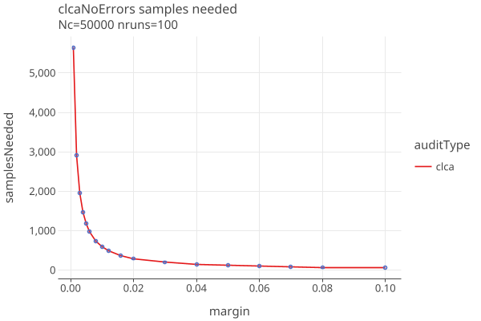
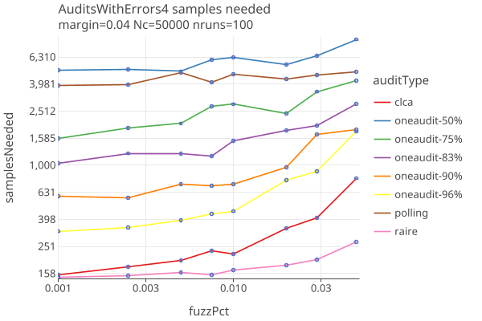
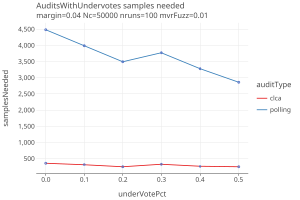

**rlauxe ("r-lux")**

WORK IN PROGRESS
_last changed: 12/12/2025_

A library for [Risk Limiting Audits](https://en.wikipedia.org/wiki/Risk-limiting_audit) (RLA), based on Philip Stark's SHANGRLA framework and related code.
The Rlauxe library is an independent implementation of the SHANGRLA framework, based on the
[published papers](#reference-papers) of Stark et al.

The [SHANGRLA python library](https://github.com/pbstark/SHANGRLA) is the work of Philip Stark and collaborators, released under the AGPL-3.0 license.

Also see:
* [Developer Notes](docs/Development.md)
* [Rlauxe Implementation Overview](docs/Overview.md)
* [Implementation Specificaton](docs/RlauxeSpec.md)
* [Rlauxe Viewer](https://github.com/JohnLCaron/rlauxe-viewer)

Click on plot images to get an interactive html plot. You can also read this document on [github.io](https://johnlcaron.github.io/rlauxe/).

**Table of Contents**
<!-- TOC -->
* [SHANGRLA framework](#shangrla-framework)
* [Audit Types](#audit-types)
  * [Card Level Comparison Audits (CLCA)](#card-level-comparison-audits-clca)
  * [Polling Audits](#polling-audits)
  * [OneAudit CLCA](#oneaudit-clca)
* [Comparing Samples Needed by Audit type](#comparing-samples-needed-by-audit-type)
  * [Samples needed with no errors](#samples-needed-with-no-errors)
  * [Samples needed when there are errors](#samples-needed-when-there-are-errors)
  * [Effect of Phantoms on Samples needed](#effect-of-phantoms-on-samples-needed)
* [Estimating Sample Batch sizes](#estimating-sample-batch-sizes)
  * [Estimation](#estimation)
  * [Card Style Data](#card-style-data)
    * [Consistent Sampling with Card Style Data](#consistent-sampling-with-card-style-data)
    * [Uniform Sampling without Card Style Data](#uniform-sampling-without-card-style-data)
    * [Polling Vs CLCA with/out CSD](#polling-vs-clca-without-csd)
  * [Under/Over estimating CLCA sample sizes](#underover-estimating-clca-sample-sizes)
  * [Multiple Contest Auditing](#multiple-contest-auditing)
    * [Efficiency](#efficiency)
    * [Deterministic sampling order for each Contest](#deterministic-sampling-order-for-each-contest)
* [Attacks](#attacks)
  * [Attack with phantoms](#attack-with-phantoms)
  * [Attack with wrong reported winner](#attack-with-wrong-reported-winner)
* [Appendices](#appendices)
  * [Reference Papers](#reference-papers)
  * [Differences with SHANGRLA](#differences-with-shangrla)
    * [Limit audit to estimated samples](#limit-audit-to-estimated-samples)
    * [compute sample size](#compute-sample-size)
    * [generation of phantoms](#generation-of-phantoms)
    * [estimate CLCA error rates](#estimate-clca-error-rates)
    * [use of previous round's sampled_cvr_indices](#use-of-previous-rounds-sampled_cvr_indices)
    * [OneAudit Card Style Data](#oneaudit-card-style-data)
  * [Developer Notes](#developer-notes)
<!-- TOC -->


# SHANGRLA framework

SHANGRLA is a framework for running Risk Limiting Audits for elections.
It uses a _statistical risk testing function_ that allows an audit to statistically
prove that an election outcome is correct (or not) to within a _risk level α_. For example, a risk limit of 5% means that
the election outcome (i.e. the winner(s)) is correct with 95% probability.

It uses an _assorter_ to assign a number to each ballot, and checks outcomes by testing _half-average assertions_, 
each of which claims that the mean of a finite list of numbers is greater than 1/2. 
The complementary _null hypothesis_ is that the assorter mean is not greater than 1/2.
If that hypothesis is rejected for every assertion, the audit concludes that the outcome is correct.
Otherwise, the audit expands, potentially to a full hand count. If every assertion is tested at risk level α, this results 
in a risk-limiting audit with risk limit α:
**_if the election outcome is not correct, the chance the audit will stop shy of a full hand count is at most α_**.

| term      | definition                                                                                   |
|-----------|----------------------------------------------------------------------------------------------|
| Nc        | a trusted, independent bound on the number of valid cards cast in the contest c.             |
| Ncast     | the number of ballot cards validly cast in the contest                                       |
| risk	     | we want to confirm or reject the null hypothesis with risk level α.                          |
| assorter  | assigns a number between 0 and upper to each card, chosen to make assertions "half average". |
| assertion | the mean of assorter values is > 1/2: "half-average assertion"                               |
| estimator | estimates the true population mean from the sampled assorter values.                         |
| bettingFn | decides how much to bet for each sample. (BettingMart)                                       |
| riskFn    | the statistical method to test if the assertion is true.                                     |
| audit     | iterative process of choosing ballots and checking if all the assertions are true.           |

# Audit Types

## Card Level Comparison Audits (CLCA)

When the election system produces an electronic record for each ballot card, known as a Cast Vote Record (CVR), then
Card Level Comparison Audits can be done that compare sampled CVRs with the corresponding hand audited ballot card,
known as the Manual Vote Record (MVR). A CLCA typically needs many fewer sampled ballots to validate contest
results than other methods.

The requirements for CLCA audits:

* The election system must be able to generate machine-readable Cast Vote Records (CVRs) for each ballot.
* Unique identifiers must be assigned to each physical ballot, and recorded on the CVR, in order to find the physical ballot that matches the sampled CVR.
* There must be an independently determined upper bound on the number of cast cards/ballots that contain the contest.

For the _risk function_, rlauxe uses the **BettingMart** function with the **AdaptiveBetting** _betting function_. 
AdaptiveBetting needs estimates of the error rates between the Cvrs and the Mvrs. If the error estimates are correct, one gets optimal 
"sample sizes", the number of ballots needed to prove the election is correct.

See [CLCA Risk function](docs/BettingRiskFunction.md) for details on the BettingMart risk function.

See [Generalized Adaptive Betting for CLCA](docs/GeneralizedAdaptiveBetting.md) for details on the AdaptiveBetting function.


## Polling Audits

When CVRs are not available, a Polling audit can be done instead. A Polling audit  
creates an MVR for each ballot card selected for sampling, just as with a CLCA, except without the CVR.

The requirements for Polling audits:

* There must be a Card Location Manifest defining the population of ballots, that contains a unique identifier or location description 
  that can be used to find the corresponding physical ballot.
* There must be an independently determined upper bound on the number of cast cards/ballots that contain the contest.

For the risk function, Rlaux uses the **AlphaMart** (aka ALPHA) function with the **ShrinkTrunkage** estimation of the true
population mean (theta). ShrinkTrunkage uses a weighted average of an initial estimate of the mean with the measured mean
of the mvrs as they are sampled. The reported mean is used as the initial estimate of the mean. The assort values
are specified in SHANGRLA, section 2. See Assorter.kt for our implementation.

See [AlphaMart risk function](docs/AlphaMart.md) for details on the AlphaMart risk function.

## OneAudit CLCA

OneAudit is a type of CLCA audit, based on the ideas and mathematics of the ONEAudit papers (see appendix).
It deals with the cases where:
1. CVRS are not available for all ballots, and the remaining ballots are in one or more "pools"
   for which subtotals are available. This is the Boulder "redacted votes" case. Each pool of redacted ballots
   has a single Ballot Style, which allows style-based sampling.
2. CVRS are available but some cannot be matched to physical ballots. This is the San Francisco case where
   mail-in ballots have matched CVRS, and in-person precinct votes have unmatched CVRs. Each precinct's ballots
   are kept in a separate pool.

In both cases we create an “overstatement-net-equivalent” (ONE) CVR for each pool, 
and use the average assorter value in that pool as the value of the (missing) CVR in the CLCA overstatement.
When a ballot has been chosen for hand audit:

1. If it has a CVR, use the standard CLCA over-statement assorter value for the ballot.
2. If it has no CVR, use the overstatement-net-equivalent (ONE) CVR from the batch that it belongs to.

For results, see [OneAudit results](docs/OneAudit4.md).

For details of the use cases, see [OneAudit Use Cases](docs/OneAuditUseCases.md).

# Comparing Samples Needed by Audit type

Here we are looking at the actual number of sample sizes needed to reject or confirm the null hypotheses, called the 
"samples needed". We ignore the need to estimate a batch size, as if we do "one sample at a time". This gives us a
theoretical minimum. In the section [Estimating Sample Batch sizes](#estimating-sample-batch-sizes) below, we deal with the 
need to estimate a batch size, and the extra overhead that brings.

In general, samplesNeeded are independent of N. (Actually there is a slight dependence on N for "without replacement" 
audits when the sample size approaches N, 
but that case approaches a full hand audit, and isnt very interesting.)

When Card Style Data (CSD) is missing, the samplesNeeded have to be scaled by Nb / Nc, where Nb is the number of physical ballots
that a contest might be on, and Nc is the number of ballots it is actually on. 
See [Uniform Sampling without Card Style Data](#uniform-sampling-without-card-style-data), below.

The following plots are simulations, averaging the results from the stated number of runs.

## Samples needed with no errors

The audit needing the least samples is CLCA when there are no errors in the CVRs, and no phantom ballots. In that case, 
the samplesNeeded depend only on the margin, and so is a smooth curve:

<a href="https://johnlcaron.github.io/rlauxe/docs/plots/workflows/clcaNoErrors/clcaNoErrorsLinear.html" rel="clcaNoErrorsLinear"></a>

(click on the plot to get an interactive html plot)

For example we need exactly 1,128 samples to audit a contest with a 0.5% margin, if no errors are found.
For a 10,000 vote election, thats 11.28% of the total ballots. For a 100,000 vote election, its only 1.13%.

For polling, the assort values vary, and the number of samples needed depends on the order the samples are drawn.
Here we show the average and standard deviation over 250 independent trials at each reported margin, when no errors are found:

<a href="https://johnlcaron.github.io/rlauxe/docs/plots/workflows/pollingNoErrors/pollingNoErrorsLinear.html" rel="pollingNoErrors"></a>

* In a card-level comparison audit, the estimated sample size scales with 1/margin, while polling scales as the square of 1/margin.
* The variation in polling sample sizes is about half the sample sizes, and so potentially adds a large burden to the audit.
* When there are errors and/or phantoms, CLCA audits also have potentially wide variance in sample sizes due to sample ordering. 
  See [Under/Over estimating CLCA sample sizes](#underover-estimating-clca-sample-sizes) below.

## Samples needed when there are errors

In these simulations, errors are created between the CVRs and the MVRs, by taking _fuzzPct_ of the ballots
and randomly changing the candidate that was voted for. When fuzzPct = 0.0, the CVRs and MVRs agree.
When fuzzPct = 0.01, 1% of the contest's votes were randomly changed, and so on. 

This is a log-log plot of samplesNeeded vs fuzzPct, with margin fixed at 4%:

<a href="https://johnlcaron.github.io/rlauxe/docs/plots/oneaudit4/AuditsWithErrors/AuditsWithErrors4LogLog.html" rel="AuditsNoErrors4LogLog"></a>

* CLCA as a percent of Nc is more sensitive to errors than polling, but still does much better in an absolute sense
* OneAudits are intermediate between Polling and CLCA.
* Raire audits are CLCA audits using Raire assertions. These are less sensitive to errors
  because the errors are less likely to change the assorter values.
* Polling audit sample sizes are all but impervious to errors.

Varying the percent of undervotes at margin of 4%, with errors generated with 1% fuzz:

<a href="https://johnlcaron.github.io/rlauxe/docs/plots/audits/AuditsWithUndervotes/AuditsWithUndervotesLinear.html" rel="AuditsWithUndervotesLinear"></a>

* Note that undervote percentages are shown up to 50%, with little effect.

## Effect of Phantoms on Samples needed

Varying phantom percent, up to and over the margin of 4.5%, with errors generated with 1% fuzz:

<a href="https://johnlcaron.github.io/rlauxe/docs/plots/audits/AuditsWithPhantoms/auditsWithPhantomsLogLinear.html" rel="auditsWithPhantomsLogLinear"></a>

* Increased phantoms have a strong effect on sample size.
* All audits go to hand count when phantomPct gets close to the margin, as they should.

Having _phantomPct_ phantoms is similar to subtracting phantomPct from the margin. In this CLCA plot we show samples needed
as a function of phantomPct, and also with no phantoms but the margin shifted by phantomPct:

<a href="https://johnlcaron.github.io/rlauxe/docs/plots/samples/phantomMarginShift/phantomMarginShiftLinear.html" rel="phantomMarginShiftLinear"></a>

* A rule of thumb is that the effect of phantoms is approximately as if the margins are reduced by phantomPct across the board,
  at least at phantomPct < 3% or so.


# Estimating Sample Batch sizes

Sampling refers to choosing which ballots to hand review to create Manual Voting Records (MVRs). Once the MVRs
are created, the actual audit takes place.

Audits are done in rounds. The auditors must decide how many cards/ballots they are willing to audit, since at some point its
more efficient for them to do a full handcount than the more elaborate process of tracking down a subset that has been 
selected for the sample.
Theres a tradeoff between the overall number of ballots sampled and the number of rounds, but, we would like to minimize both.

Note that in this section we are plotting _nmvrs_ = overall number of ballots sampled, which includes the inaccuracies of the
estimation. Above we have been plotting _samples needed_, as if we were doing "one ballot at a time" auditing.

There are two phases to sampling: estimating the sample batch sizes for each contest, and then randomly choosing ballots that
contain at least that many contests.

## Estimation

For each contest we simulate the audit with manufactured data that has the same margin as the reported outcome, and a
guess at the error rates. 

For each contest assertion we run _auditConfig.nsimEst_ (default 100) simulations and collect the distribution of samples
needed to satisfy the risk limit. We then choose the (_auditConfig.quantile_) sample size as our estimate for that assertion,
and the contest's estimated sample size is the maximum of the contest's assertion estimates.

If the simulation is accurate, the audit should succeed _auditConfig.quantile_ fraction of the time (default 80%). 
Since we dont know the actual error rates, or the order that the errors will be sampled, these simulation results are just estimates.

Note that each round does its own sampling without regard to the previous round's results.
However, since the seed remains the same, the ballot ordering is the same throughout the audit. We choose the lowest ordered ballots first,
so previously audited MVRS are always used again in subsequent rounds, for contests that continue to the next round. At
each round we record both the total number of MVRs, and the number of "new samples" needed for that round, which are the
ballots the auditors have to find and hand audit for that round.

## Card Style Data

Once we have all of the contests' estimated sample sizes, we next choose which ballots/cards to sample. 
This step depends whether the audit has Card Style Data (CSD, see MoreStyle, p.2), which tells which ballots
have which contests. 

For CLCA audits, the generated Cast Vote Records (CVRs) comprise the CSD, as long as the CVR has the information which contests are
on it, even when a contest receives no votes. For Polling audits, the BallotManifest (may) contain BallotStyles which comprise the CSD.

If we have CSD, then Consistent Sampling is used to select the ballots to sample, otherwise Uniform Sampling is used.

Its critical in all cases (with or without CSD), that when the MVRs are created, the auditors record all the contests on the ballot, 
whether or not there are any votes for a contest or not. In other words, an MVR always knows if a contest is contained on a ballot or not. 
This information is necessary in order to correctly do random sampling, which the risk limiting statistics depend on.

### Consistent Sampling with Card Style Data

At the start of the audit:
* For each ballot/cvr, assign a large psuedo-random number, using a high-quality PRNG.
* Sort the ballots/cvrs by that number

For each round:
* For each contest, choose the number of samples to audit (usually an estimate of samples needed) = contest.estSampleSize.
* Select the first ballots/cvrs that use any contest that needs more samples, until all contests have
at least contest.estSampleSize in the sample of selected ballots.

### Uniform Sampling without Card Style Data

At the start of the audit:
* For each ballot/cvr, assign a large psuedo-random number, using a high-quality PRNG.
* Sort the ballots/cvrs by that number
* Let Nb be the total number of ballots that may contain a contest, and Nc the maximum number of cards for a contest C.
  Then we assume that the probability of a ballot containing contest C is Nc / Nb.

For each round:
* For each contest, choose the number of samples to audit (usually an estimate of samples needed) = contest.estSampleSize.
* Over all contests, compute contest.estSamples * ( Nb / Nc) and set audit.estSamples to the maximum over contests.
* Take the first audit.estSamples of the sorted ballots.

We need Nc as a condition of the audit, but its straightforward to estimate a contests' sample size without Nc,
since it works out that Nc cancels out:

````
sampleEstimate = rho / dilutedMargin  // (SuperSimple p. 4)
where 
  dilutedMargin = (v_w - v_l)/ Nc
  rho = constant

sampleEstimate = rho * Nc / (v_w - v_l)
totalEstimate = sampleEstimate * Nb / Nc  // must scale by proportion of ballots with that contest
              = rho * Nb / (v_w - v_l) 
              = rho / fullyDilutedMargin

where
  fullyDilutedMargin = (v_w - v_l)/ Nb
````

The scale factor Nb/Nc depends on how many contests there are and how they are distributed across the ballots, but its
easy to see the effect of not having Card Style Data in any case.

As an example, in the following plot we show averages of the overall number of ballots sampled (nmvrs), for polling audits, 
no style information, no errors, for Nb/Nc = 1, 2, 5 and 10. 

<a href="https://johnlcaron.github.io/rlauxe/docs/plots/nostyle/pollingNoStyle/pollingNoStyleLinear.html" rel="pollingNoStyleLinear"></a>
<a href="https://johnlcaron.github.io/rlauxe/docs/plots/nostyle/pollingNoStyle/pollingNoStyleLogLinear.html" rel="pollingNoStyleLogLinear"></a>

* The increased number of nmvrs is simply Nc/Nb, and has a strong absolute effect as the margin gets smaller.

<a href="https://johnlcaron.github.io/rlauxe/docs/plots/nostyle/pollingNoStyle/pollingNoStylePct.html" rel="pollingNoStylePct"></a>

* The percent nmvrs / Nb depends only on margin, independent of the ratio Nc/Nb
* We need to sample more than 50% of Nb when the margin < 5%


### Polling Vs CLCA with/out CSD

The following plot shows nmvrs for Polling vs CLCA, with and without CSD at different margins, no errors, where Nb/Nc = 2.

<a href="https://johnlcaron.github.io/rlauxe/docs/plots/nostyle/compareWithStyle/compareWithStyleLogLinear.html" rel="compareWithStyleLogLinear"></a>

* For both Polling and CLCA, the sample sizes are a factor of Nb/Nc greater without Card Style Data.

## Under/Over estimating CLCA sample sizes

Overestimating sample sizes uses more hand-counted MVRs than needed. Underestimating sample sizes forces more rounds than needed.
Over/under estimation is strongly influenced by over/under estimating error rates. 

The following plots show approximate distribution of estimated and actual sample sizes, using our standard AdaptiveBetting
betting function with weight parameter d = 100, for margin=2% and errors in the MVRs generated with 2% fuzz.

When the estimated error rates are equal to the actual error rates:

<a href="https://johnlcaron.github.io/rlauxe/docs/plots/dist/estSamplesNeeded/estErrorRatesEqual.html" rel="estErrorRatesEqual"></a>

When the estimated error rates are double the actual error rates:

<a href="https://johnlcaron.github.io/rlauxe/docs/plots/dist/estSamplesNeeded/estErrorRatesDouble.html" rel="estErrorRatesDouble"></a>

When the estimated error rates are half the actual error rates:

<a href="https://johnlcaron.github.io/rlauxe/docs/plots/dist/estSamplesNeeded/estErrorRatesHalf.html" rel="estErrorRatesHalf"></a>

The amount of extra sampling closely follows the number of samples needed, adding around 30-70% extra work, as the 
following plots vs margin show:

<a href="https://johnlcaron.github.io/rlauxe/docs/plots/extra/extraVsMarginByFuzzDiff/extraVsMarginByFuzzDiffLogLinear.html" rel="extraVsMarginByFuzzDiffLogLinear"></a>
<a href="https://johnlcaron.github.io/rlauxe/docs/plots/extra/extraVsMarginByFuzzDiff/extraVsMarginByFuzzDiffPct.html" rel="extraVsMarginByFuzzDiffPct"></a>

The "extra samples" goes up as our guess for the error rates differ more from the actual rates. 
In these plots we use fuzzPct as a proxy for what the error rates might be.

In the best case, the simulation accurately estimates the distribution of audit sample sizes (fuzzDiff == 0%). 
But because there is so much variance in that distribution, the audit sample sizes are significantly overestimated. 
To emphasize this point, here are plots of average samples needed, and samples needed +/- one stddev, 
one for CLCA and one for polling:

<a href="https://johnlcaron.github.io/rlauxe/docs/plots/extra/clcaVariance/clcaVarianceLogLinear.html" rel="clcaVarianceLogLinear"></a>
<a href="https://johnlcaron.github.io/rlauxe/docs/plots/extra/pollingVariance/pollingVarianceLogLinear.html" rel="pollingVarianceLogLinear"></a>

The number of rounds needed reflects the default value of auditConfig.quantile = 80%, so we expect to need a second round 20% of the time:

<a href="https://johnlcaron.github.io/rlauxe/docs/plots/extra/clcaVariance/clcaVarianceNrounds.html" rel="clcaVarianceNrounds"></a>
<a href="https://johnlcaron.github.io/rlauxe/docs/plots/extra/pollingVariance/pollingVarianceNrounds.html" rel="pollingVarianceNrounds"></a>

* We see large variance in samples needed, even when we guess the error rates correctly.
* The variance gets larger as average samples needed gets larger.
* One could use other algorithms to trade off extra samples vs extra rounds.

## Multiple Contest Auditing

An election often consists of several or many contests, and it is likely to be more efficient to audit all of the contests at once.
We have several mechanisms for choosing contests to remove from the audit to keep the sample sizes reasonable.

Before the audit begins:
1. Any contest whose reported margin is less than _auditConfig.minMargin_ is removed from the audit with failure code MinMargin.
2. Any contest whose reported margin is less than its phantomPct (Np/Nc) is removed from the audit with failure code TooManyPhantoms.

For each Estimation round:
1. Any contest whose estimated samplesNeeded exceeds _auditConfig.sampleCutoff_ is removed from the audit with failure code FailMaxSamplesAllowed.
2. If the total number of ballots for a multicontest audit exceeds _auditConfig.sampleCutoff_, the contest with the largest estimated samplesNeeded
   is removed from the audit with failure code FailMaxSamplesAllowed. The Consistent/Uniform sampling is then redone without that
   contest, and the check on the total number of ballots is repeated.

These rules are somewhat arbitrary but allow us to test audits without human intervention. In a real audit,
auditors might hand select which contests to audit, interacting with the estimated samplesNeeded from the estimation stage,
and try out different scenarios before committing to which contests continue on to the next round. 

* See the prototype [rlauxe Viewer](https://github.com/JohnLCaron/rlauxe-viewer).
* See [Case Studies](docs/CaseStudies.md)


### Efficiency

We assume that the cost of auditing a ballot is the same no matter how many contests are on it. So, if two contests always 
appear together on a ballot, then auditing the second contest is "free". If the two contests appear on the same ballot some 
pct of the time, then the cost is reduced by that pct. More generally the reduction in cost of a multicontest audit depends
on the various percentages the contests appear on the same ballot.

### Deterministic sampling order for each Contest

For any given contest, the sequence of ballots/CVRS to be used by that contest is fixed when the PRNG is chosen.

In a multi-contest audit, at each round, the estimate of the number of ballots needed for each contest is calculated = n, 
and the first n ballots in the contest's sequence are sampled.
The total set of ballots sampled in a round is just the union of the individual contests' set. 
The extra efficiency of a multi-contest audit comes when the same ballot is chosen for more than one contest.

The set of contests that will continue to the next round is not known, so the set of ballots sampled at each round is 
not known in advance. Nonetheless, for each contest, the sequence of ballots seen by the algorithm is fixed when the PRNG is chosen.

# Attacks

_Attacks_ are scenarios where the actual winner is not the reported winner. They may be intentional, due to malicious 
actors, or unintentional, due to mistakes in the process or bugs in the software.

## Attack with phantoms

Here we investigate what happens when the percentage of phantoms is high enough to flip the election, but the reported margin
does not reflect that. In other words an attack (or error) when the phantoms are not correctly reported.

We create CLCA simulations at different margins and percentage of phantoms, and fuzz the MVRs at 1%.
We measure the "true margin" of the MVRs, including phantoms, by applying the CVR assorter, and use that for the x axis.

The error estimation strategies in this plot are:
* noerror : The apriori error rates are 0.
* fuzzPct: The apriori error rates are calculated from the true fuzzPct (so, the best possible guess).
* phantomPct: use _phantomPct_ as the apriori error rates.

These are just the initial guesses for the error rates. In all cases, they are adjusted as samples are made and errors are found.

Here are plots of sample size as a function of true margin, for phantomPct of 0, 2, and 5 percent:

<a href="https://johnlcaron.github.io/rlauxe/docs/plots/attack/marginWithPhantoms0/marginWithPhantoms0LogLinear.html" rel="marginWithPhantoms0LogLinear"></a>
<a href="https://johnlcaron.github.io/rlauxe/docs/plots/attack/marginWithPhantoms2/marginWithPhantoms2LogLinear.html" rel="marginWithPhantoms2LogLinear"></a>
<a href="https://johnlcaron.github.io/rlauxe/docs/plots/attack/marginWithPhantoms5/marginWithPhantoms5LogLinear.html" rel="marginWithPhantoms5LogLinear"></a>

* The true margin is approximately the reported margin minus the phantom percentage.
* Once the true margin falls below 0, the audit goes to a full count, as it should.
* The fuzzPct strategy does a bit better when the phantom rate is not too high.

## Attack with wrong reported winner

Here we investigate an attack when the reported winner is different than the actual winner.

We create simulations at the given reported margins, with no fuzzing or phantoms.
Then in the MVRs we flip just enough votes to make the true margin < 50%. We want to be sure that
the percent of false positives stays below the risk limit (here its 5%):

<a href="https://johnlcaron.github.io/rlauxe/docs/plots/attack/attacksByStrategy/clcaAttacksByStrategyFalsePositives.html" rel="clcaAttacksByStrategyFalsePositives"></a>

* The false positives stay below the risk limit of 5%.

# Appendices

## Reference Papers
````
P2Z         Limiting Risk by Turning Manifest Phantoms into Evil Zombies. Banuelos and Stark. July 14, 2012

RAIRE        Risk-Limiting Audits for IRV Elections. Blom, Stucky, Teague 29 Oct 2019
    https://arxiv.org/abs/1903.08804

SHANGRLA     Sets of Half-Average Nulls Generate Risk-Limiting Audits: SHANGRLA.	Stark, 24 Mar 2020
    https://github.com/pbstark/SHANGRLA

MoreStyle	More style, less work: card-style data decrease risk-limiting audit sample sizes. Glazer, Spertus, Stark; 6 Dec 2020

ALPHA:      Audit that Learns from Previously Hand-Audited Ballots. Stark, Jan 7, 2022
    https://github.com/pbstark/alpha.

BETTING     Estimating means of bounded random variables by betting. Waudby-Smith and Ramdas, Aug 29, 2022
    https://github.com/WannabeSmith/betting-paper-simulations

COBRA:      Comparison-Optimal Betting for Risk-limiting Audits. Jacob Spertus, 16 Mar 2023
    https://github.com/spertus/comparison-RLA-betting/tree/main

ONEAudit:   Overstatement-Net-Equivalent Risk-Limiting Audit. Stark 6 Mar 2023.
    https://github.com/pbstark/ONEAudit

STYLISH	    Stylish Risk-Limiting Audits in Practice. Glazer, Spertus, Stark  16 Sep 2023
  https://github.com/pbstark/SHANGRLA

SliceDice   Dice, but don’t slice: Optimizing the efficiency of ONEAudit. Spertus, Glazer and Stark, Aug 18 2025
    https://arxiv.org/pdf/2507.22179; https://github.com/spertus/UI-TS
    
Verifiable  Risk-Limiting Audits Are Interactive Proofs — How Do We Guarantee They Are Sound?

````
Also see [complete list](docs/notes/papers.txt).

## Differences with SHANGRLA

### Limit audit to estimated samples

SHANGRLA consistent_sampling() in Audit.py only audits with the estimated sample size. However, in multiple
contest audits, additional ballots may be in the sample because they are needed by another contest. Since there is no 
guarentee that the estimated sample size is large enough, theres no reason not to include all the available mvrs in the audit.

Note that as soon as an audit gets below the risk limit, the audit is considered a success.
This reflects the "anytime P-value" property of the Betting martingale (ALPHA eq 9).
That is, one does not continue with the audit, which could go back above the risk limit with more samples.
This does agree with how SHANGRLA works.

### compute sample size

From STYLISH paper:

````
4.a) Pick the (cumulative) sample sizes {𝑆_𝑐} for 𝑐 ∈ C to attain by the end of this round of 
sampling. The software offers several options for picking {𝑆_𝑐}, including some based on simulation.
The desired sampling fraction 𝑓_𝑐 := 𝑆_𝑐 /𝑁_𝑐 for contest 𝑐 is the sampling probability
for each card that contains contest 𝑘, treating cards already in the sample as having sampling 
probability 1. The probability 𝑝_𝑖 that previously unsampled card 𝑖 is sampled in the next round is 
the largest of those probabilities:
  𝑝_𝑖 := max (𝑓_𝑐), 𝑐 ∈ C ∩ C𝑖, where C_𝑖 denotes the contests on card 𝑖.
  
4.b) Estimate the total sample size to be Sum(𝑝_𝑖), where the sum is across all cards 𝑖 except 
phantom cards.
````

AFAICT, the calculation of the total_size using the probabilities as described in 4.b) is only used when you just want the
total_size estimate, but not do the consistent sampling, which already gives you the total sample size.

### generation of phantoms

From STYLISH paper:

````
2.c) If the upper bound on the number of cards that contain any contest is greater than the 
number of CVRs that contain the contest, create a corresponding set of “phantom” CVRs as 
described in section 3.4 of [St20]. The phantom CVRs are generated separately for each contest: 
each phantom card contains only one contest.
````

SHANGRLA.make_phantoms() instead generates max(Np_c) phantoms, then for each contest adds it to the first Np_c phantoms.
Im guessing STYLISH is trying to describe the easist possible algorithm.

````
2.d) If the upper bound 𝑁_𝑐 on the number of cards that contain contest 𝑐 is greater than the 
number of physical cards whose locations are known, create enough “phantom” cards to make up 
the difference. 
````

Not clear what this means, and how its different from 2.c.

### estimate CLCA error rates

SHANGRLA has guesses for p1,p2,p3,p4. 
We can use that method (strategy.apriori), and we can also use strategy.fuzzPct, which guesses a percent of contests to randomly 
change ("fuzzPct"), and use it to simulate errors (by number of candidates) in a contest. That and other strategies are described in
[CLCA error rates](https://github.com/JohnLCaron/rlauxe/blob/main/docs/ClcaErrorRates.md) ; we are still exploring which strategy works best.

### use of previous round's sampled_cvr_indices

At first glance, it appears that SHANGRLA Audit.py CVR.consistent_sampling() might make use of the previous round's
selected ballots (sampled_cvr_indices). However, it looks like CVR.consistent_sampling() never uses sampled_cvr_indices, 
and so uses the same strategy as we do, namely sampling without regards to the previous rounds.

Of course, when the same ballots are selected as in previous rounds, which is the common case, the previous MVRs for those
balllots are used.

### OneAudit Card Style Data

SHANGRLA assumes there is no [Card Style Data for pooled data](#card-style-data-for-the-pooled-data), and so adds undervotes 
to the ballots in the pools. Rlauxe adds the option that there may be CSD for pooled data, in part to investigate the 
difference between the two options.

The algorithm to add undervotes is not published anywhere that I know of, and needs explanation.


## Developer Notes

Modules
* core: the core library, with minimal dependencies
* rla: serialization and command line utilities
* cases: San Francisco, Colorado, and Boulder County use cases
* plots: plot generation and testing

Also See:
* [Verification](docs/Verification.md)
* [Implementation Specificaton](docs/RlauxeSpec.md)
* [Case Studies](docs/CaseStudies.md)
* [Corla Notes](docs/Corla.md)

