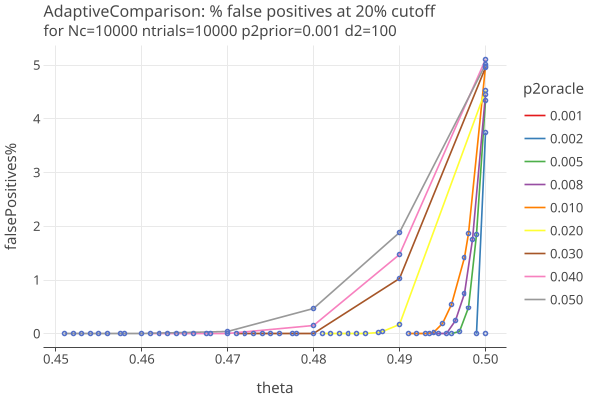

# Ballot Comparison using Betting Martingales

last changed: 12/10/24

The BETTING paper presents general techniques for estimating an unknown mean from bounded observations.

ALPHA summarizes this for RLAs, in section 2.3. While formally equivalent to the sequential probability ratios (SPR) approach, 
the betting strategy approach gives better intuition on the "aggressive betting" strategy, which is necessary to
get good performance for ballot comparison audits.

The COBRA paper explores a number of algorithms for optimal betting parameters for ballot 
comparison audits, based on estimating the rates of the under/overstatement errors:

Table 1.
````
    p0 := #{xi = a}/N is the rate of correct CVRs.
    p1 := #{xi = a/2}/N is the rate of 1-vote overstatements.
    p2 := #{xi = 0}/N is the rate of 2-vote overstatements.
    p3 := #{xi = 3a/2}/N is the rate of 1-vote understatements.
    p4 := #{xi = 2a}/N is the rate of 2-vote understatements.
````
where
* a := 1 / (2 − v/au)
* v := 2Āc − 1 is the diluted margin
* au := assort upper value; = 1 for plurality, 1/(2*minFraction) for supermajority
* mu_i := mean value under H0 (= 1/2 for with replacement), otherwise for WoR, varies for each sample i (ALPHA section 2.2.1).
* The possible values of the comparison assort function are: {1, 1/2, 0, 3/2, 2} * a

The expected value of the test statistic (generalized from COBRA section 3.2) is based on the comparison assort values
for each of the under/overstatement error types:

Equation 1
````
EF[Ti] = p0 [1 + λ(a − mu_i)] + p1 [1 + λ(a/2 − mu_i)] + p2 [1 − λ*mu_i)]  + p3 [1 + λ(3*a/2 − mu_i)]  + p4 [[1 + λ(2*a − mu_i)]
````

We follow the code in https://github.com/spertus/comparison-RLA-betting/blob/main/comparison_audit_simulations.R, to
find the value of lamda that maximizes EF[Ti], using org.apache.commons.math3.optim.univariate.BrentOptimizer.
See [OptimalComparison implementation](../core/src/main/kotlin/org/cryptobiotic/rlauxe/core/OptimalComparison.kt).

## GenAdaptiveComparison

Following COBRA, we start with only the p2 errors, and use Adaptive betting from COBRA section 4.2, equation (4), 
to estimate the p2 rate, using an adapted form of ALPHA's shrink_trunc algorithm:

````
    p̃_ki :=  (d_k * p̃_k + i * p̂_k(i−1)) / (d_k + i − 1) ∨ eps_k
where    
    k = (1,2,3,4) is one of the rates from Table 1 above
    p̃_ki is the estimated rate at time i
    p̃_k is the a priori estimate for rate pk
    d_k is the adaptive weighting value for the kth rate
    p̂_ki is the measured sample rate at time i
    eps_k is the lower bound for the estimated rate
````

The estimated rate p̃_ki is then plugged into Equation 1, and BrentOptimizer is used to find the maximal value of lamda for 
each step i, on the interval [0, 2]. 

In the following plots, we generate synthetic data with specified margins for the CVRs. Then, for different p2oracle rates,
we randomly flip votes to get the required number of p2 errors, and use those as the MVRs. We keep p2prior fixed to .001
We want to see what happens when the true p2 rate (p2oracle) is greater than p2prior. 

Plot 1 shows the average number of samples needed to reject the null, aka "success":

<a href="https://johnlcaron.github.io/rlauxe/docs/plots/p2errors/plotAdaptiveComparison001.plotSuccessVsTheta.html" rel="plotSuccessVsTheta"></a>

Plot 2 shows the percentage of successes when the cutoff is 20% of N. Note these are false positives when
theta <= 0.5:

<a href="https://johnlcaron.github.io/rlauxe/docs/plots/p2errors/plotAdaptiveComparison001.plotSuccess20VsTheta.html" rel="plotSuccess20VsTheta"></a>

Plot 3 zooms in on the false positives when the cutoff is 20% of N:

<a href="https://johnlcaron.github.io/rlauxe/docs/plots/p2errors/plotAdaptiveComparison001.plotFailuresVsTheta.html" rel="plotFailuresVsTheta"></a>

Plot 4 zooms in on the successes (same as Plot 2) close to theta = 1/2:

<a href="https://johnlcaron.github.io/rlauxe/docs/plots/p2errors/plotAdaptiveComparison001.plotSuccess20VsThetaNarrow.html" rel="plotSuccess20VsThetaNarrow"></a>

Comments
* the weighting factor d_k is set to 100
* this algorithm does well when p2oracle ~= p2prior, giving good results down to margins of 1-2%.
* we are testing very high values of p2oracle, in order to see how the algorithm responds when the overstatement
  errors are high enough to change the election outcome.
* the false positives (mostly) stay under the 5% risk limit, even when theta = 1/2.
* TODO test if these conclusions hold when p1 is non-zero, and when there are varying levels of 
  "random error" in the form of non-zero rates for all the errors.
* TODO test a wide range of p2priors, as well as a range of d values.