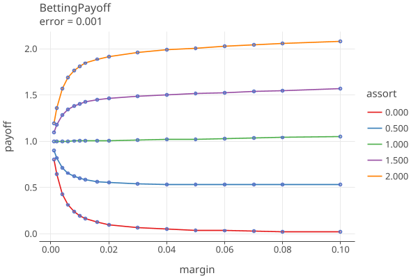
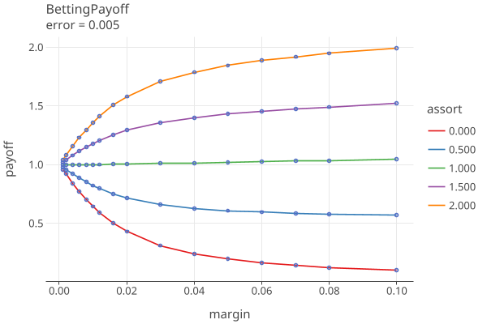
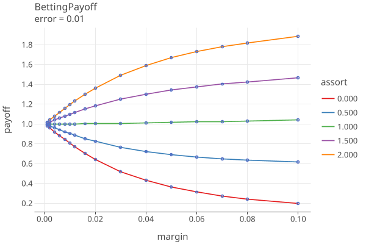

# Ballot Payoff Plots

## 12/10/24

Plots 1-5 shows the betting payoffs when all 4 error rates are equal to {0.0, 0.0001, .001, .005, .01}, respectively:

Plot 6 shows the payoffs for all the error rates when the MVR matches the CVR (assort value = 1.0 * noerror):

Plot 7 translates the payoff into a sample size, when there are no errors, using (payoff)^sampleSize = 1 / riskLimit and
solving for sampleSize = -ln(riskLimit) / ln(payoff).

The plot "error=0.0" is the equivilent to COBRA Fig 1, p. 6 for risk=.05. This is the best that can be done,
this is the minimum sampling size for the RLA.
Note that this value is independent of N, the number of ballots.

See GenBettingPayoff.kt for the geration of these plots.