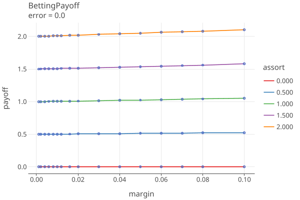
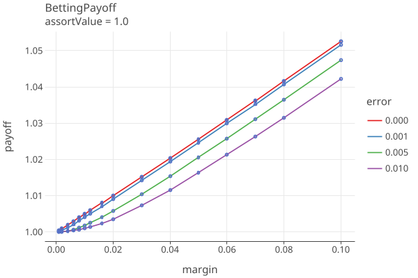

# CLCA Betting Risk Functions
_last changed 3/25/25_

## Betting martingales

In BETTING, Waudby-Smith and Ramdas develop tests and confidence sequences for the mean of a bounded population using
betting martingales of the form

    M_j :=  Prod (1 + λ_i (X_i − µ_i)),  i=1..j    (BETTING eq 34 and ALPHA eq  10)

where µi := E(Xi | Xi−1), computed on the assumption that the null hypothesis is true.
(For large N, µ_i is very close to 1/2.)

The sequence (M_j) can be viewed as the fortune of a gambler in a series of wagers.
The gambler starts with a stake of 1 unit and bets a fraction λi of their current wealth on
the outcome of the ith wager. The value Mj is the gambler’s wealth after the jth wager. The
gambler is not permitted to borrow money, so to ensure that when X_i = 0 (corresponding to
losing the ith bet) the gambler does not end up in debt (Mi < 0), λi cannot exceed 1/µi.

See Cobra section 4.2 and SHANGRLA Section 3.2.

## CLCA Assorter

The overstatement error for the ith ballot is:
````
    ωi ≡ A(ci) − A(bi) ≤ A(ci) ≤ upper    "overstatement error" (SHANGRLA eq 2, p 9)
      bi is the manual voting record (MVR) for the ith ballot
      ci is the cast-vote record for the ith ballot
      A() is the assorter function
Let
     Ā(c) ≡ Sum(A(ci))/N be the average CVR assort value
     v ≡ 2Ā(c) − 1, the _reported assorter margin_
     τi ≡ (1 − ωi /upper) ≥ 0
     B(bi, ci) ≡ τi /(2 − v/upper) = (1 − ωi /upper) / (2 − v/upper) ≡ "comparison assorter" ≡ B(MVR, CVR)

Then B assigns nonnegative numbers to ballots, and the outcome is correct iff
    B̄ ≡ Sum(B(bi, ci)) / N > 1/2
and so B is an half-average assorter.
````

````
  "assorter" here is the plurality assorter
  Let 
    bi denote the true votes on the ith ballot card; there are N cards in all.
    ci denote the voting system’s interpretation of the ith card
    Ā(c) ≡ Sum(A(ci))/N is the average assorter value across all the CVRs
    margin ≡ v ≡ 2Ā(c) − 1, the _reported assorter margin_
  
    ωi ≡ A(ci) − A(bi)   overstatementError for ith ballot
    ωi in [-1, -.5, 0, .5, 1] (for plurality assorter, which is in {0, .5, 1}))
  
    We know Āb = Āc − ω̄, so Āb > 1/2 iff ω̄ < Āc − 1/2 iff ω̄/(2*Āc − 1) < 1/2 = ω̄/v < 1/2
    
    scale so that B(0) = (2*Āc − 1)
    
        find B affine transform to interval [0, u], where H0 is average B < 1/2
    shift to 0, just add 1 to ωi, B(-1) = 0
    
    so B(-1) = 0
       B(0) = 1/2 
       B(1) = u 
    
    Bi = (1 - ωi/u) / (2 - v/u)
    Bi = tau * noerror; tau = (1 - ωi/u), noerror = 1 / (2 - v/u)    
    
    τi ≡ (1 − ωi /upper) ≥ 0, since ωi <= upper
    B(bi, ci) ≡ τi / (2 − margin/upper) = (1 − ωi /upper) / (2 − margin/upper)
  
  overstatementError in [-1, -.5, 0, .5, 1] == A(ci) − A(bi) = ωi
  find B transform to interval [0, u],  where H0 is B < 1/2
  Bi = (1 - ωi/u) / (2 - v/u)
  Bi = tau * noerror; tau = (1 - ωi/u), noerror = 1 / (2 - v/u)
  
  Bi in [0, .5, 1, 1.5, 2] * noerror = [twoOver, oneOver, nuetral, oneUnder, twoUnder]
````

Notes
* The comparison assorter B needs Ā(c) ≡ the average CVR assort value > 0.5.
* Ā(c) should have the diluted margin as the denominator.
  (Margins are  traditionally calculated as the difference in votes divided by the number of valid votes.
  Diluted refers to the fact that the denominator is the number of ballot cards containing that contest, which is
  greater than or equal to the number of valid votes.)
* If overstatement error is always zero (no errors in CRV), the assort value is always

  ````
      noerror = 1 / (2 - margin/assorter.upperBound()) 
              = 1 / (3 - 2 * awinnerAvg/assorter.upperBound())
              > 0.5 since awinnerAvg > 0.5
  ````
* The possible values of the bassort function are then:
  {0, .5, 1, 1.5, 2} * noerror
* When the CVRs  always equal the corresponding MVR, we always get bassort == noerror > .5, so eventually the null is rejected.

## CLCA Betting Payoffs

For the ith sample with bet λ_i, the BettingMart payoff is

    t_i = 1 + λ_i * (X_i − µ_i)

where

    λ_i in [0, 1/u_i]
    X_i = {0, .5, 1, 1.5, 2} * noerror for {2voteOver, 1voteOver, equal, 1voteUnder, 2voteUnder} respectively.
    µ_i ~= 1/2
    λ_i ~in [0, 2]

then

    payoff = t_i = 1 + λ_i * noerror * {-.5, 0, .5, 1.5}

Using AdaptiveBetting, λ_i depends only on the 4 estimated error rates (see next section) and the margin.
Also note that AdaptiveBetting wil use a "floor" (default 1.0e-5) for the estimated error rates, to prevent betting everything.

### Betting Payoff Plots

Plots 1-5 shows the betting payoffs when all 4 error rates are equal to {0.0, 0.0001, .001, .005, .01}, respectively:

<a href="https://johnlcaron.github.io/rlauxe/docs/plots/betting/BettingPayoff0.0.html" rel="BettingPayoff0"></a>
<a href="https://johnlcaron.github.io/rlauxe/docs/plots/betting/BettingPayoff1.0E-4.html" rel="BettingPayoff1.0E-4"></a>
<a href="https://johnlcaron.github.io/rlauxe/docs/plots/betting/BettingPayoff0.001.html" rel="BettingPayoff0.001"></a>
<a href="https://johnlcaron.github.io/rlauxe/docs/plots/betting/BettingPayoff0.005.html" rel="BettingPayoff0.005"></a>
<a href="https://johnlcaron.github.io/rlauxe/docs/plots/betting/BettingPayoff0.01.html" rel="BettingPayoff01"></a>

Plot 6 shows the payoffs for all the error rates when the MVR matches the CVR (assort value = 1.0 * noerror):

<a href="https://johnlcaron.github.io/rlauxe/docs/plots/betting/BettingPayoffAssort1.0.html" rel="BettingPayoffAssort1"></a>

Plot 7 translates the payoff into a sample size, using (payoff)^sampleSize = 1 / riskLimit and
solving for sampleSize = -ln(riskLimit) / ln(payoff), for the various values of the error rates, as above.

<a href="https://johnlcaron.github.io/rlauxe/docs/plots/betting/BettingPayoffSampleSize.html" rel="BettingPayoffSampleSize"></a>

The plot "error=0.0" is the equivilent to COBRA Fig 1, p. 6 for risk=.05. This is the best that can be done,
the minimum sampling size for the RLA.
Note that this value is independent of N, the number of ballots.

See GenBettingPayoff.kt for the generation of these plots.