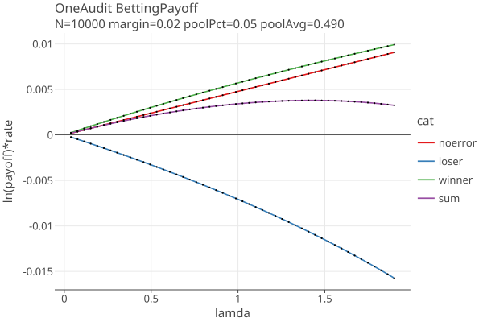

# Risk and betting functions
_last changed 01/28/2026_

<!-- TOC -->
* [Risk and betting functions](#risk-and-betting-functions)
  * [Estimating samples needed for CLCA](#estimating-samples-needed-for-clca)
  * [Stalled audits and maximum bets](#stalled-audits-and-maximum-bets)
  * [Betting with CLCA errors](#betting-with-clca-errors)
    * [CLCA assort values](#clca-assort-values)
  * [Betting with OneAudit pools](#betting-with-oneaudit-pools)
    * [Estimating samples needed for OneAudit when there are no errors](#estimating-samples-needed-for-oneaudit-when-there-are-no-errors)
<!-- TOC -->


A _risk function_ evaluates the probability that an assertion about an election is true or not. 
Rlauxe has two risk functions, one for CLCA audits (BettingMart) and one for polling audits (AlphaMart).
AlphaMart is formally equivilent to BettingMart, so we will just describe BettingMart.

We have a sequence of ballot cards that have been randomly selected from the population of all ballot cards for a contest in an election.
For each assertion, each card is assigned an _assort value_ which is a floating point number. So we have a sequence of
numbers (aka a "sequence of samples") that are fed into the risk function. For the ith sample:

    x_i = the assort value, 0 <= x_i <= upper
    µ_i = the expected value of the sample mean, if the assertion is false (very close to 1/2 usually)
    λ_i = the "bet" placed on the ith sample, based on the previous samples, 0 <= λ_i <= 2 .

    payoff_i = (1 + λ_i (x_i − µ_i)) = the payoff of the ith bet
    T_i = Prod (payoff_i, i= 1..i) = the product o f the payoffs aka the "testStatistic"

When T_i > 1/alpha then informally we can say that the assertion is true within the risk limit of alpha. So if alpha = .05, 
T_i must be >= 20 to accept the assertion.

## Estimating samples needed for CLCA

For CLCA, the x_i are constant when the mvr and the cvr agree. Call that value noerror; it is always > .5. 

If we approximate µ_i = .5 and use a constant bet of λc, then for the nth testStatistic  

    T_n = (1 + λc (noerror − .5))^n
    
    (1 + λc (noerror − .5))^n = (1/alpha)
    n * ln(1 + λc (noerror − .5)) = ln(1/alpha)
    n = ln(1/alpha) / ln(1 + λc (noerror − .5))
    n = ln(1/alpha) / ln(payoff)
    where payoff = (1 + λc (noerror − .5)
    
which is a closed form expression for the estimated samples needed.

To minimize n, we want to maximize payoff, so we want to maximize λc.

## Stalled audits and maximum bets

T_i = Prod (payoff_i, i= 1..i), so if any payoff = 0, the audit stalls and cant recover. 
So we must ensure that at each step the payoff is > 0:

    1 + λ_i (x_i − µ_i) > 0
    λ_i (x_i − µ_i) > -1
    λ_i (µ_i - x_i) < 1

The minimum value of (µ_i - x_i) is when x_i = 0, since µ_i >= 0 and x_i >= 0:

    λ_i * µ_i < 1    
    λ_i < 1/µ_i

How much less is TBD. 

Let λmax be the largest allowed bet < 1/µ_i. The smallest payoff possible is when x_i = 0:

    smallest payoff = 1 - λmax * µ_i

The testStatistic is multiplied by the payoff, so the smallest payoff is the maximum percent loss for one bet.
Limit that maximum loss to how much you are willing to lose on any one bet:

        maximum loss = (1 - maxLoss)
        1 - λmax * µ_i = 1 - maxLoss
        λmax * µ_i = maxLoss
        λmax = maxLoss / µ_i

Since maxLoss is < 1, λmax < 1/ µ_i.

For now we let the user choose maxLoss, and set λmax accordingly.

## Betting with CLCA errors

If there were never any errors, we would always place the maximum bet, and our sample size would always be at a minimum,
depending only on the diluted margin of the assorter. What should we bet in the possible presence of errors that occur 
randomly in the sequence?

Our betting strategy is a generalized form of AdaptiveBetting from the [COBRA paper](https://arxiv.org/pdf/2304.01010). 
We generalize to use any number of error types, and any kind of assorter, in particular ones with upper != 1, such as DHondt.

Suppose for a particular assorter, there are a fixed number of types of errors with known assort values {a_1..a_n} and 
probabilities {p_1..p_n}. Then p0 = 1 - Sum { p_k, k = 1..n } is the probability of no error.

Following COBRA, at each step, before sample X_i is drawn, we find the optimal value of lambda which maximizes the expected value of the log of T_i, and use that as the lamda bet for step i:

````
log T_i = ln(1.0 + lamda * (noerror - mui)) * p0  + Sum { ln(1.0 + lamda * (a_k - mui)) * p_k, k=1..n }   (eq 1)

where 
    p0 is the probability of no error (mvr matches the cvr)
    p_k is the probability of error type k
    a_k is the value of x when error type k occurs
````

The estimated error probabilities p_k are continually updated by the measured frequencies of the errors in the sample.

We use the BrentOptimizer from _org.apache.commons.math3_ library to find the optimal lamda for equation 1 on
the interval \[0.0, maxBet].

To get a sense of the optimization process, here are plots of the terms in equation 1, for a 1% plurality assorter margin
and error rates of .001 for each of the errors:

<a href="https://johnlcaron.github.io/rlauxe/docs/plots2/betting/optimallamda/payoff.html" rel="BettingPayoff"></a>

The sum of terms is the yellow line. The optimizer finds the value of lamda where eq 1 is at a maximum. Equation 1 is used
just for finding the optimal lamda; the value of the equation is not used.

If there are no negetive terms, then eq 1 is monotonically increasing, and lamda will always be the maximum value allowed.

### CLCA assort values

We do an affine transformation of our assorters so that they all return one of three values {0, 1/2, upper}, 
corresponding to whether the card has a vote for the loser, other, or winner.

A CLCA overstatement error = cvr_assort - mvr_assort has one of 7 possible values:

````
    [0, .5, u] - [0, .5, u] = 0, -.5, -u,
                             .5,  0, .5-u,
                              u, u-.5, 0
                              
    = [-u, -.5, .5-u, 0, .5, u-.5, u]  
````

The CLCA assorter (aka bassort) does an affine transformation of the overstatement error:

````
   bassort = (1-o/u)/(2-v/u) in [0, 2] * noerror
   where
     u = assorter upper value
     v = reported margin
     o = overstatement error
     noerror = 1/(2-v/u)

then the possible values of bassort = (1-o/u) * noerror are:

    [0, 1/2u, 1-1/2u, noerror, 1+1/2u, 2-1/2u, 2] * noerror
````

For Plurality, u = 1, so the possible values are:
````
[0, .5, 1, 1.5, 2] * noerror (u=1)
aka [p2o, p1o, noerror, p1u, p2u]
````

In general, when u != 1, there are 7 possible values, for example, a Dhondt assorter with u = 1.75:

````
DHondt upperBound=1.7500, noerror=0.51470588

[0.0, 0.1470588235294, 0.3676470588235, 0.51470588, 0.661764705882, 0.882352941176, 1.029411764705]
[0, 1/2u, 1-1/2u, 1, 1+1/2u, 2-1/2u, 2] * noerror

     winner-loser tau= 0.0000 '      0' (win-los)
     winner-other tau= 0.2857 '   1/2u' (win-oth)
      other-loser tau= 0.7143 ' 1-1/2u' (oth-los)
    winner-winner tau= 1.0000 'noerror' (noerror)
      other-other tau= 1.0000 'noerror' (noerror)
      loser-loser tau= 1.0000 'noerror' (noerror)
      loser-other tau= 1.2857 ' 1+1/2u' (oth-win)
     other-winner tau= 1.7143 ' 2-1/2u' (los-oth)
     loser-winner tau= 2.0000 '      2' (los-win)
````

when you throw phantoms into the mix:

````
     winner-loser tau= 0.0000 '      0' (win-los)
   winner-phantom tau= 0.0000 '      0' (win-los)
     winner-other tau= 0.2857 '   1/2u' (win-oth)
      other-loser tau= 0.7143 ' 1-1/2u' (oth-los)
    other-phantom tau= 0.7143 ' 1-1/2u' (oth-los)
    phantom-loser tau= 0.7143 ' 1-1/2u' (oth-los)
  phantom-phantom tau= 0.7143 ' 1-1/2u' (oth-los)
    winner-winner tau= 1.0000 'noerror' (noerror)
      other-other tau= 1.0000 'noerror' (noerror)
      loser-loser tau= 1.0000 'noerror' (noerror)
    loser-phantom tau= 1.0000 'noerror' (noerror)
    phantom-other tau= 1.0000 'noerror' (noerror)
      loser-other tau= 1.2857 ' 1+1/2u' (oth-win)
     other-winner tau= 1.7143 ' 2-1/2u' (los-oth)
   phantom-winner tau= 1.7143 ' 2-1/2u' (los-oth)
     loser-winner tau= 2.0000 '      2' (los-win)
````

See [Card Level Comparison Audits](Clca.md) for details and plots.


## Betting with OneAudit pools

OneAudit cards are a mixture of CVRs and pooled data. The CVRS are handled exactly as CLCA above. Pooled data
don not have CVRS, instead we have the average assort value in each pool. 

Consider a single pool and assorter a, with upper bound u and avg assort value in the pool = poolAvg.
The poolAvg is used as the cvr_value, so the overstatement error = cvr_assort - mvr_assort has one of 3 possible values:

    poolAvg - [0, .5, u] = [poolAvg, poolAvg -.5, poolAvg - u] for mvr loser, other and winner 

then bassort = (1-o/u)/(2-v/u) has one of 3 possible values:

    bassort = [1-poolAvg/u, 1 - (poolAvg -.5)/u, 1 - (poolAvg - u)/u] * noerror
    bassort = [1-poolAvg/u, (u - poolAvg + .5)/u, (2u - poolAvg)/u] * noerror

For each pool, we know the expected number of loser, winner, and other votes over all the cards in the pool:

```
    winnerVotes = votes[assorter.winner()]
    loserVotes = votes[assorter.loser()]
    otherVotes = pool.ncards() - winnerVotes - loserVotes
```

The expected rates are the votes divided by Npop. These are also the probabilities of drawing a card from that pool and that 
assort value.

Then we extend equation 1 with the expected assort values from the pools:

````
log T_i = ln(1.0 + lamda * (noerror - mui)) * p0 + Sum { ln(1.0 + lamda * (a_k - mui)) * p_k, k=1..n }
          + Sum { ln(1.0 + lamda * (a_pk - mui)) * p_pk; over pools and pool types}              (eq 2)

where 
    p0 is the probability of no error (mvr matches the cvr)
    p_k is the probability of error type k
    a_k is the value of x when error type k occurs
    p_pk is the probability of getting pool p, type k
    a_pk is the assort value when pool p, type k occurs (k = winner, loser, other)
````

And use this to find the optimal value of lambda.

### Estimating samples needed for OneAudit when there are no errors

The a_pk and p_pk values for OneAudit are known in advance, and do not need to be updated as we sample. We can estimate the
number of samples needed for OneAudit when there are no errors in the CVR data, assuming an approximate µ_i = .5 and a constant bet of λc:

    T_i = Prod (payoff_i, i= 1..i)

over N trials, there will be N * p terms, where p is the probability of that term:   

    T_n = (1 + λc (noerror − .5)) ^ (N*p0) * Prod { (1 + λc * (a_pk - 0.5)) ^ (N*p_pk) } = (1/alpha)

    N * ln(1 + λc (noerror − .5))*p0 + N * Sum( ln(1 + λc (a_pk − .5)*p_pk) = ln(1/alpha)
    N = ln(1/alpha) / (ln(1 + λc (noerror − .5))*p0 + Sum( ln(1 + λc (a_pk − .5)*p_pk))

where p0 = 1 - Sum (p_pk), and λc is taken as the optimal value of eq 2 when all error probabilities are 0.

This value of N estimates the mean of a distribution that has a fairly large variance.


Suppose we have a OneAudit with one pool with 5% of the votes, and both the pool margin and the election margin are 2%,
and there are no errors at all in the CVRs. The terms in equation 2 are:

<a href="https://johnlcaron.github.io/rlauxe/docs/plots2/betting/oapayoff/oapayoff.html" rel="OABettingPayoff"></a>

In this example, the optimal lamda is around 1.4. Here, the loser term is always negetive, and the winner term is always positive, so
even with no errors, we need many more samples than CLCA. This is highly dependent on the margin and the percent of cards
in the pools.