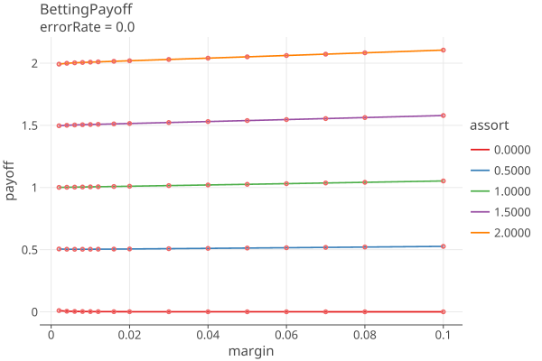
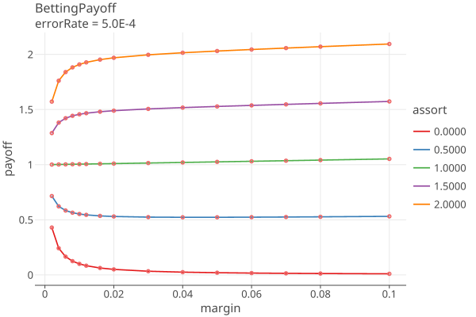
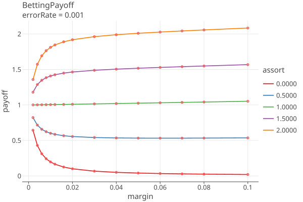
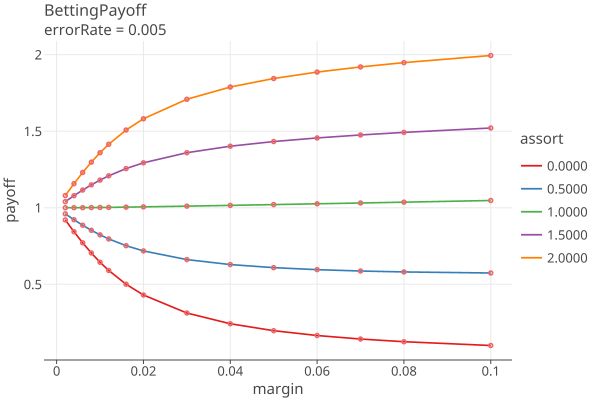
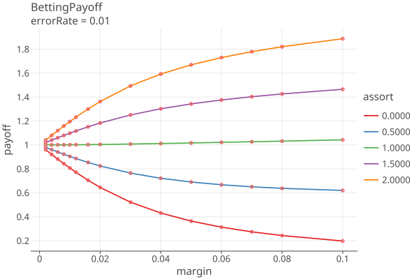
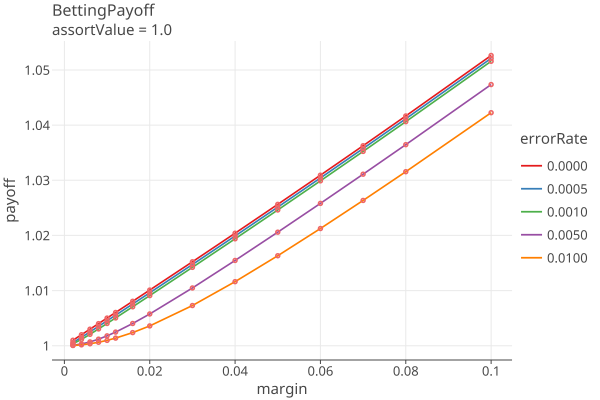
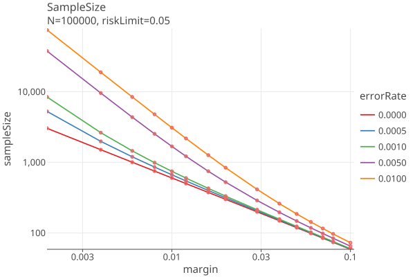

# CLCA - Card Level Comparison Audits
_last changed 01/28/26_

## CLCA Assorter

The overstatement error for the ith ballot is:
````
    ωi ≡ A(ci) − A(bi) ≤ A(ci) ≤ upper    "overstatement error" (SHANGRLA eq 2, p 9)
      bi is the manual voting record (MVR) for the ith ballot
      ci is the cast-vote record for the ith ballot
      A() is the assorter function
Let
     Ā(c) ≡ Sum(A(ci))/N be the average CVR assort value
     v ≡ 2Ā(c) − 1, the _reported assorter margin_
     τi ≡ (1 − ωi /upper) ≥ 0
     B(bi, ci) ≡ τi /(2 − v/upper) = (1 − ωi /upper) / (2 − v/upper) ≡ "comparison assorter" ≡ B(MVR, CVR)

Then B assigns nonnegative numbers to ballots, and the outcome is correct iff
    B̄ ≡ Sum(B(bi, ci)) / N > 1/2
and so B is an half-average assorter.
````

````
  In the following treatment, "assorter" is the plurality assorter.
  
  Let 
    bi denote the true votes on the ith ballot card; there are N cards in all.
    ci denote the voting system’s interpretation of the ith card
    Ā(c) ≡ Sum(A(ci))/N is the average assorter value across all the CVRs
    margin ≡ v ≡ 2Ā(c) − 1, the _assorter margin_
  
    ωi ≡ A(ci) − A(bi)   overstatement error for ith ballot
    ωi in [-1, -.5, 0, .5, 1] (for plurality assorter, which is in {0, .5, 1}))
  
    We know Āb = Āc − ω̄, so Āb > 1/2 iff ω̄ < Āc − 1/2 iff ω̄/(2*Āc − 1) < 1/2 = ω̄/v < 1/2
    
    scale so that B(0) = (2*Āc − 1)
    
    find B affine transform to interval [0, u], where H0 is average B < 1/2
    shift to 0, just add 1 to ωi, B(-1) = 0
    
    so B(-1) = 0
       B(0) = 1/2 
       B(1) = u 
    
    Bi = (1 - ωi/u) / (2 - v/u)
    Bi = tau * noerror; tau = (1 - ωi/u), noerror = 1 / (2 - v/u)    
    
    τi ≡ (1 − ωi /upper) ≥ 0, since ωi <= upper
    B(bi, ci) ≡ τi / (2 − margin/upper) = (1 − ωi /upper) / (2 − margin/upper)
  
  overstatement error in [-1, -.5, 0, .5, 1] == A(ci) − A(bi) = ωi
  find B transform to interval [0, u],  where H0 is B < 1/2
  Bi = (1 - ωi/u) / (2 - v/u)
  Bi = tau * noerror; tau = (1 - ωi/u), noerror = 1 / (2 - v/u)
  
  Bi in [0, .5, 1, 1.5, 2] * noerror = [twoOver, oneOver, nuetral, oneUnder, twoUnder]
````

Notes
* The comparison assorter B needs Ā(c) ≡ the average CVR assort value > 0.5.
* Ā(c) should have the diluted margin as the denominator, So N = Npop, the size of the population that the contest is drawn from.
* If overstatement error is always zero (no errors in CRV), the assort value is always

  ````
      noerror = 1 / (2 - margin/assorter.upperBound()) 
              = 1 / (3 - 2 * awinnerAvg/assorter.upperBound())
              > 0.5 since awinnerAvg > 0.5
  ````

## Generalization to u != 1

An assorter value is in the range [lower, upper], where lower >= 0. The "neutral value" is 1/2.
We always do an affine transformation so that lower = 0 and nuetral = 1/2; then upper > 1/2 is unbounded.
The plurality assorter is the special case of assort upper = 1.

The general treatment is as follows:

````
 B(bi, ci) = (1-o/u)/(2-v/u) = (1-o/u) * noerror, where
    o is the overstatement = (cvr_assort - mvr_assort)
    u is the upper bound on the value the assorter assigns to any ballot
    v is the assorter margin
    noerror = 1/(2-v/u) == B(bi, ci) when overstatement = 0

 assort in [0, .5, u], u > .5, so overstatement is in
      [-1, -.5, 0, .5, 1] (plurality)
      [-u, -.5, .5-u, 0, u-.5, .5, u] (SM, u in [.5, 1])
      [-u, .5-u, -.5, 0, .5, u-.5, u] (SM, u > 1)

 so B(bi, ci) in

 [1+(u-l)/u, 1+(.5-l)/u, 1+(u-.5)/u,  1, 1-(.5-l)/u, 1-(u-.5)/u, 1-(u-l)/u] * noerror
 [2, 1+1/2u, 2-1/2u,  1, 1-1/2u, 1/2u, 0] * noerror (when l=0) 
 [2, 1.5,  1, .5, 0] * noerror (when l=0, u=1)
````
So when u=1, there are 5 possible bassort values, and otherwise 7.

## CLCA Betting Payoffs

For the ith sample with bet λ_i, the BettingMart payoff is

    t_i = 1 + λ_i * (X_i − µ_i)

where
    λ_i in [0, 1/µ_i]
    X_i = [2, 1+1/2u, 2-1/2u,  1, 1-1/2u, 1/2u, 0] * noerror.
    µ_i ~= 1/2
    λ_i ~in [0, 2]

then

    payoff = t_i = 1 + λ_i * noerror * ([2, 1+1/2u, 2-1/2u,  1, 1-1/2u, 1/2u, 0] - 1/2)
    payoff = t_i = 1 + λ_i * noerror * [3/2, 1/2 + 1/2u, 3/2 - 1/2u,  1/2, 1/2 - 1/2u, 1/2u - 1/2, -1/2]
    payoff = t_i = 1 + λ_i * noerror * [3/2, (u + 1)/2u, (3u - 1)/2u,  1/2, (u - 1)/2u, (1 - u)/2u, -1/2]

    payoff = t_i = 1 + λ_i * noerror * [3/2, 1,  1/2, 0, -1/2] when u = 1


    payoff = 1 + λ_i * (x - 1/2)
    ln(payoff) = ln(1 + λ_i * (x - 1/2)) is positive when (x - 1/2) is

    let u12 = 1 / (2 * u) 
    since u > 1/2, (2 * u) > 1, u12 < 1

                los-win, oth-win,    los-oth,    noerror, oth-los,   win-oth,    win-los
    (x - 1/2) = [3/2,    (u+1)*u12, (3u-1)*u12,  1/2,     (u-1)*u12, (1-u)*u12, -1/2]

    note oth-los = - win-oth

when u < 1, oth-los < 0 and win-oth > 0
when u > 1, oth-los > 0 and win-oth < 0

u + 1 > 3u - 1
when 2 > 2u 
when 1 > u
so when u < 1, oth-win > los-oth

u = 1, only win-los < 0
u < 1, win-los, oth-los < 0
u > 1, win-los, win-oth < 0


### Betting Payoff Plots

Plots 1-5 shows the betting payoffs when the error rates are all equal to {0.0, 0.0001, .001, .005, .01}

<a href="https://johnlcaron.github.io/rlauxe/docs/plots2/betting/payoff/BettingPayoff0.0.html" rel="BettingPayoff0"></a>
<a href="https://johnlcaron.github.io/rlauxe/docs/plots2/betting/payoff/BettingPayoff5.0E-4.html" rel="BettingPayoff5.0E-4"></a>
<a href="https://johnlcaron.github.io/rlauxe/docs/plots2/betting/payoff/BettingPayoff0.001.html" rel="BettingPayoff0.001"></a>
<a href="https://johnlcaron.github.io/rlauxe/docs/plots2/betting/payoff/BettingPayoff0.005.html" rel="BettingPayoff0.005"></a>
<a href="https://johnlcaron.github.io/rlauxe/docs/plots2/betting/payoff/BettingPayoff0.01.html" rel="BettingPayoff01"></a>

Plot 6 shows the payoffs for all the error rates when the MVR matches the CVR (assort value = noerror):

<a href="https://johnlcaron.github.io/rlauxe/docs/plots2/betting/payoff/BettingPayoffAssort1.0.html" rel="BettingPayoffAssort1"></a>

Plot 7 translates the payoff into a sample size, using (payoff)^sampleSize = 1 / riskLimit and
solving for sampleSize = -ln(riskLimit) / ln(payoff), for the various values of the error rates, as above.

<a href="https://johnlcaron.github.io/rlauxe/docs/plots2/betting/payoff/BettingPayoffSampleSize.html" rel="BettingPayoffSampleSize"></a>

The plot "error=0.0" is the equivilent to COBRA Fig 1, p. 6 for risk=.05. This is the best that can be done,
the minimum sampling size for the RLA. You can use it to see how many samples you are likely to need, based on the smallest
diluted margin of the assorters of the contest.
Note that this value is independent of N, the number of ballots.

See GenBettingPayoff.kt for the generation of these plots.

Note AdaptiveBetting has been replaced by GeneralizedAdaptiveBetting.