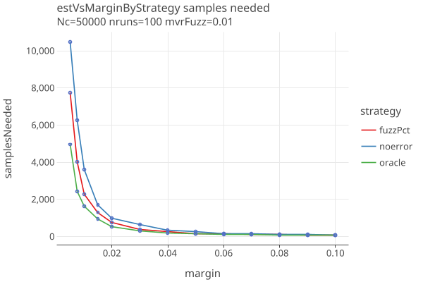
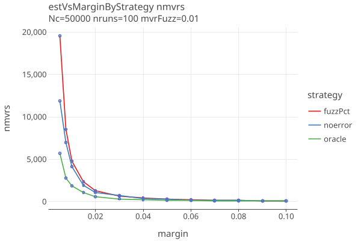
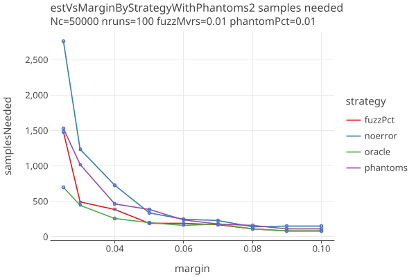
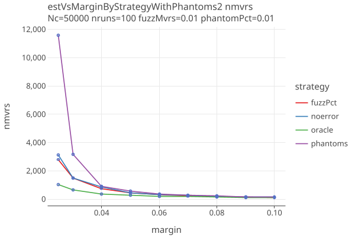
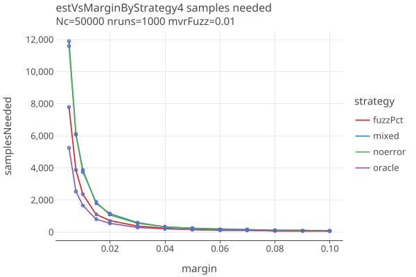
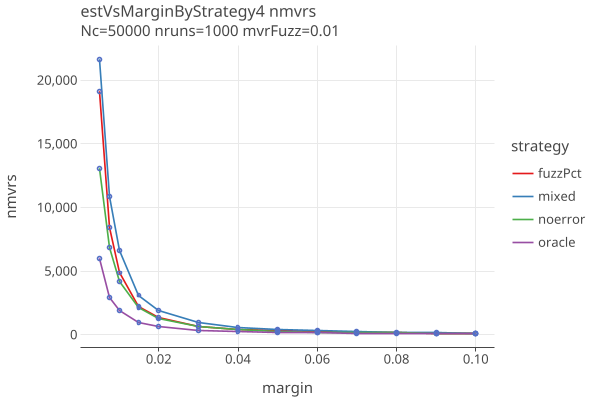
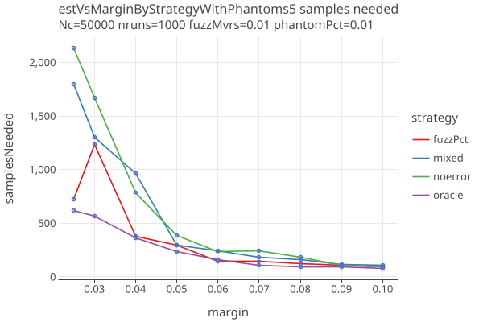
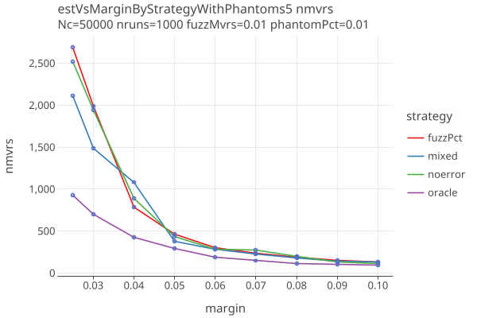

# CLCA error rates
last updated Feb 8, 2025

## Estimating Error

The assumptions that one makes about the CLCA error rates greatly affect the sample size estimation.
These rates should be empirically determined, and public tables for different voting machines should be published.
While these do not affect the reliabilty of the audit, they have a strong impact on the estimated sample sizes.

In a real-world measurement of a voting machine, one might measure:

1. percent time a mark is seen when its not there
2. percent time a mark is not seen when it is there
3. percent time a mark is given to the wrong candidate

If the errors are from random processes, its possible that margins remain approx the same, but also possible that some rates
are more likely to be affected than others. Its worth noting that error rates combine machine errors with human errors of
fetching and interpreting ballots.

We currently have two ways of setting error rates. Following COBRA, the user can specify the "apriori" error rates for p1, p2, p3, p4.
Otherwise, they can specify a "fuzz pct" (explained below), and the apriori error rates are derived from it. 

In both cases, we use CORBRA's adaptive estimate of the error rates that does a weighted average of the apriori and the 
actual error rate from previous samples. These estimates are used in COBRA's OptimalLambda algorithm, which finds the 
optimal bet given the error rates. 

This algorithm is used when estimating the sample size, and also when doing the actual audit.

## CLCA error rates

The CLCA error rates are:

        p2o: rate of 2-vote overstatements; voted for loser, cvr has winner
        p1o: rate of 1-vote overstatements; voted for other, cvr has winner
        p1u: rate of 1-vote understatements; voted for winner, cvr has other
        p2u: rate of 2-vote understatements; voted for winner, cvr has loser

For IRV, the corresponding descriptions of the errror rates are:

    NEB two vote overstatement: cvr has winner as first pref (1), mvr has loser preceeding winner (0)
    NEB one vote overstatement: cvr has winner as first pref (1), mvr has winner preceding loser, but not first (1/2)
    NEB two vote understatement: cvr has loser preceeding winner(0), mvr has winner as first pref (1)
    NEB one vote understatement: cvr has winner preceding loser, but not first (1/2), mvr has winner as first pref (1)
    
    NEN two vote overstatement: cvr has winner as first pref among remaining (1), mvr has loser as first pref among remaining (0)
    NEN one vote overstatement: cvr has winner as first pref among remaining (1), mvr has neither winner nor loser as first pref among remaining (1/2)
    NEN two vote understatement: cvr has loser as first pref among remaining (0), mvr has winner as first pref among remaining (1)
    NEN one vote understatement: cvr has neither winner nor loser as first pref among remaining (1/2), mvr has winner as first pref among remaining  (1)

See [Ballot Comparison using Betting Martingales](Betting.md) for more details and plots of 2-way contests
with varying p2error rates.


## Estimating CLCA error rates with fuzz

We can estimate CLCA error rates as follows:

The MVRs are "fuzzed" by taking _fuzzPct_ of the ballots
and randomly changing the candidate that was voted for. When fuzzPct = 0.0, the cvrs and mvrs agree.
When fuzzPct = 0.01, 1% of the contest's votes were randomly changed, and so on.

In the plots that follow, the actual fuzz of the MVRs is 1%. We use different fuzz rates for estimating and auditing, 
and see how the resulting sample sizes vary. 

The first plot below shows that CLCA sample sizes are somewhat affected by fuzz. The second plot shows that Plotting sample sizes
have greater spread, but on average are not much affected.

TODO: replace with clcaVsMarginByFuzzPct, pollVsMarginByFuzzPct

<a href="https://johnlcaron.github.io/rlauxe/docs/plots/samples/ComparisonFuzzed.html" rel="ComparisonFuzzed"></a>
<a href="https://johnlcaron.github.io/rlauxe/docs/plots/samples/PollingFuzzed.html" rel="PollingFuzzed"></a>

We use this strategy and run simulations that generate CLCA error rates, as a function of number of candidates in the contest.
Note that margin doesnt effect these values.


````
    GenerateComparisonErrorTable.generateErrorTable()
    N=100000 ntrials = 200
    generated 1/26/2026
````
| ncand | r2o    | r1o    | r1u    | r2u    |
|-------|--------|--------|--------|--------|
| 2     | 0.2624 | 0.2625 | 0.2372 | 0.2370 |
| 3     | 0.1401 | 0.3493 | 0.3168 | 0.1245 |
| 4     | 0.1278 | 0.3913 | 0.3520 | 0.1158 |
| 5     | 0.0693 | 0.3496 | 0.3077 | 0.0600 |
| 6     | 0.0554 | 0.3399 | 0.2994 | 0.0473 |
| 7     | 0.0335 | 0.2816 | 0.2398 | 0.0259 |
| 8     | 0.0351 | 0.3031 | 0.2592 | 0.0281 |
| 9     | 0.0309 | 0.3043 | 0.2586 | 0.0255 |
| 10    | 0.0277 | 0.2947 | 0.2517 | 0.0226 |

Then p2o = fuzzPct * r2o, p1o = fuzzPct * r1o, p1u = fuzzPct * r1u, p2u = fuzzPct * r2u.
For example, a two-candidate contest has significantly higher two-vote error rates (p2o/p2u), since its more likely to flip a
vote between winner and loser, than switch a vote to/from other. 

We give the user the option to specify a fuzzPct and use this table for the apriori error rates.


## Calculate Error Rates from actual MVRs (oracle strategy)

One could do a CLCA audit with the actual, not estimated error rates. At each round, before you run
the audit, compare the selected CVRs and the corresponding MVRs and count the number of errors for each
of the four categories. Use those rates in the OptimalLambda algorithm

The benefit is that you immediately start your bets knowing what errors you're going to see in that sample.
That gives us a fixed lamda for that sample. 

It does seem that the algorithm violates the "predictable sequence in the sense that ηj may depend on X j−1 , but not on Xk for k ≥ j ."
We use this _oracle strategy_ only for testing.


## CLCA sample sizes with different error rate strategies

These are plots of sample sizes for various error estimation strategies. In all cases, synthetic CVRs are generated with the given margin, 
and MVRs are fuzzed at the given fuzzPct. Except for the oracle strategy, the AdaptiveComparison betting function is used.

The error estimation strategies are:

* oracle : The true error rate for the sample is computed. This voilates the "predictable sequence requirement", so cant be used in a real audit.
* noerror : The apriori error rates are 0.
* fuzzPct: The apriori error rates are calculated from the true fuzzPct. 
* 2*fuzzPct: The fuzzPct is overestimated by a factor of 2.
* fuzzPct/2: The fuzzPct is underestimated by a factor of 1/2.

Here are plots of sample size as a function of fuzzPct, with a fixed margin of .04:

<a href="https://johnlcaron.github.io/rlauxe/docs/plots/workflows/clcaVsFuzzByStrategy/clcaVsFuzzByStrategyLinear.html" rel="clcaVsFuzzByStrategyLinear"></a>
<a href="https://johnlcaron.github.io/rlauxe/docs/plots/workflows/clcaVsFuzzByStrategy/clcaVsFuzzByStrategyLog.html" rel="clcaVsFuzzByStrategyLog"></a>

Notes:
* The oracle results show the lowest sample sizes possible.
* The noerror strategy is significantly worse in the presence of errors.
* If you can guess the fuzzPct to within a factor of 2, theres not much difference in sample sizes, especially for low values of fuzzPct.

Here are plots of sample size as a function of margin, with a fixed fuzzPct of .05:

<a href="https://johnlcaron.github.io/rlauxe/docs/plots/workflows/clcaVsMarginByStrategy/clcaVsMarginByStrategyLinear.html" rel="clcaVsMarginByStrategyLinear"></a>
<a href="https://johnlcaron.github.io/rlauxe/docs/plots/workflows/clcaVsMarginByStrategy/clcaVsMarginByStrategyLog.html" rel="clcaVsMarginByStrategyLog"></a>
<a href="https://johnlcaron.github.io/rlauxe/docs/plots/workflows/clcaVsMarginByStrategy/clcaVsMarginByStrategyFailures.html" rel="clcaVsMarginByStrategyFailures"></a>

* Arguably a fuzz rate of 5% is extreme.
* We start to see failures (more than 80% of trials fail) when the margin is less than 2 percent.

## More experiments with different error rate strategies

One might hope that with better apriori error rates, sample sizes would improve. To that end we tried two more strategies.

###  The _phantoms_ strategy

When it is know that a ballot is missing from the CVRs, a phantom CVR is created for it. Similarly, if a physical ballot has been chosen
to sample, and cannot be found, a phantom MVR is created. The values of the CLCA assorter in these cases are:

````
        assertEquals(0.0, bassorter.bassort(phantomMvr, winnerCvr))           // no mvr, cvr reported winner, : twoOver
        assertEquals(noerror, bassorter.bassort(phantomMvr, loserCvr))        // no mvr, cvr reported loser: nuetral
        assertEquals(0.5*noerror, bassorter.bassort(phantomMvr, phantomCvr))  // no mvr, no cvr: oneOver (common case)
        assertEquals(1.5*noerror, bassorter.bassort(winnerMvr, phantomCvr))   // mvr reported winner, no cvr: oneUnder
        assertEquals(.5*noerror, bassorter.bassort(loserMvr, phantomCvr))     // mvr reported loser, no cvr: oneOver
````

The common case is that both the CVR and the MVR is missing, which is equivilent to a "one ballot overstantement". So it
makes sense that using the _phantomPct_ phantoms for a contest might improve the sampling sizes.

The _phantoms_ strategy uses phantomPct from each contest as the apriori "one ballot overstantement" error rate of the AdaptiveComparison 
betting function. 

### The _previous_ strategy

The _previous_ strategy uses the measured error rates for the previous batch of sample ballots the apriori error rates of the AdaptiveComparison
betting function. For the first batch, before any measured values are available, it uses the phantomPct as in the phantoms strategy.

## Simulations with different strategies

For the new strategies and the noerror and oracle strategies, we show the number of samples needed, the number of Mvrs needed,
and the "extra" = nmvrs - needed, along with the average number of rounds and the failure rate:

This is for the case of no phantoms:

<a href="https://johnlcaron.github.io/rlauxe/docs/plots/workflows/estVsMarginByStrategy/estVsMarginByStrategy/SamplesLinear.html" rel="samplesByStrategyLinear"></a>
<a href="https://johnlcaron.github.io/rlauxe/docs/plots/workflows/estVsMarginByStrategy/estVsMarginByStrategy/NmvrsLinear.html" rel="nmvrsByStrategyLinear"></a>
<a href="https://johnlcaron.github.io/rlauxe/docs/plots/workflows/estVsMarginByStrategy/estVsMarginByStrategy/ExtraLinear.html" rel="extraByStrategyLinear"></a>
<a href="https://johnlcaron.github.io/rlauxe/docs/plots/workflows/estVsMarginByStrategy/estVsMarginByStrategy/estVsMarginByStrategyNrounds.html" rel="estByStrategyNrounds"></a>
<a href="https://johnlcaron.github.io/rlauxe/docs/plots/workflows/estVsMarginByStrategy/estVsMarginByStrategy/estVsMarginByStrategyFailures.html" rel="estByStrategyFailures"></a>

and the same when there are 1% phantoms:

<a href="https://johnlcaron.github.io/rlauxe/docs/plots/workflows/estVsMarginByStrategy/estVsMarginByStrategyWithPhantoms2/SamplesLinear.html" rel="samplesByStrategyPhantomsLinear"></a>
<a href="https://johnlcaron.github.io/rlauxe/docs/plots/workflows/estVsMarginByStrategy/estVsMarginByStrategyWithPhantoms2/NmvrsLinear.html" rel="nmvrsByStrategyPhantomsLinear"></a>
<a href="https://johnlcaron.github.io/rlauxe/docs/plots/workflows/estVsMarginByStrategy/estVsMarginByStrategyWithPhantoms2/ExtraLinear.html" rel="extraByStrategyPhantomsLinear"></a>
<a href="https://johnlcaron.github.io/rlauxe/docs/plots/workflows/estVsMarginByStrategy/estVsMarginByStrategyWithPhantoms2/estVsMarginByStrategyWithPhantoms2Nrounds.html" rel="estByStrategyNrounds"></a>
<a href="https://johnlcaron.github.io/rlauxe/docs/plots/workflows/estVsMarginByStrategy/estVsMarginByStrategyWithPhantoms2/estVsMarginByStrategyWithPhantoms2Failures.html" rel="estByStrategyFailures"></a>

Its clear that for some reason the _previous_ strategy makes things worse. 

Heres another take:

<a href="https://johnlcaron.github.io/rlauxe/docs/plots/workflows/estVsMarginByStrategy/estVsMarginByStrategy4/SamplesLinear.html" rel="samplesByStrategyLinear"></a>
<a href="https://johnlcaron.github.io/rlauxe/docs/plots/workflows/estVsMarginByStrategy/estVsMarginByStrategy4/NmvrsLinear.html" rel="nmvrsByStrategyLinear"></a>
<a href="https://johnlcaron.github.io/rlauxe/docs/plots/workflows/estVsMarginByStrategy/estVsMarginByStrategy4/ExtraLinear.html" rel="extraByStrategyLinear"></a>
<a href="https://johnlcaron.github.io/rlauxe/docs/plots/workflows/estVsMarginByStrategy/estVsMarginByStrategy4/estVsMarginByStrategy4Nrounds.html" rel="estByStrategyNrounds"></a>
<a href="https://johnlcaron.github.io/rlauxe/docs/plots/workflows/estVsMarginByStrategy/estVsMarginByStrategy4/estVsMarginByStrategy4Failures.html" rel="estByStrategyFailures"></a>

Then when there are 1% phantoms:

<a href="https://johnlcaron.github.io/rlauxe/docs/plots/workflows/estVsMarginByStrategy/estVsMarginByStrategyWithPhantoms5/SamplesLinear.html" rel="samplesByStrategyPhantomsLinear"></a>
<a href="https://johnlcaron.github.io/rlauxe/docs/plots/workflows/estVsMarginByStrategy/estVsMarginByStrategyWithPhantoms5/NmvrsLinear.html" rel="nmvrsByStrategyPhantomsLinear"></a>
<a href="https://johnlcaron.github.io/rlauxe/docs/plots/workflows/estVsMarginByStrategy/estVsMarginByStrategyWithPhantoms5/ExtraLinear.html" rel="extraByStrategyPhantomsLinear"></a>
<a href="https://johnlcaron.github.io/rlauxe/docs/plots/workflows/estVsMarginByStrategy/estVsMarginByStrategyWithPhantoms5/estVsMarginByStrategy5Nrounds.html" rel="estByStrategyNrounds"></a>
<a href="https://johnlcaron.github.io/rlauxe/docs/plots/workflows/estVsMarginByStrategy/estVsMarginByStrategyWithPhantoms5/estVsMarginByStrategy5Failures.html" rel="estByStrategyFailures"></a>

