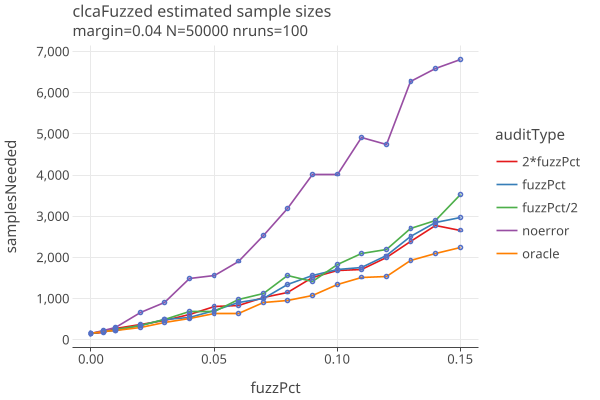
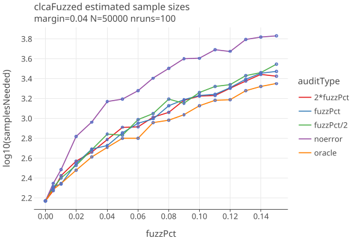
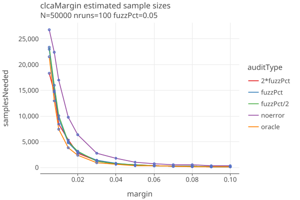
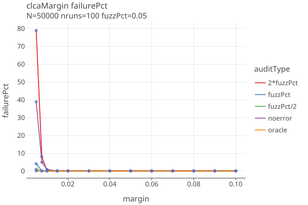

# Comparison error rates
last updated Jan 24, 2025

## Estimating Error

The assumptions that one makes about the comparison error rates greatly affect the sample size estimation.
These rates should be empirically determined, and public tables for different voting machines should be published.
While these do not affect the reliabilty of the audit, they have a strong impact on the estimated sample sizes.

If the errors are from random processes, its possible that margins remain approx the same, but also possible that some rates
are more likely to be affected than others. Its worth noting that error rates combine machine errors with human errors of
fetching and interpreting ballots.

We currently have two ways of setting error rates. Following COBRA, the user can specify the "apriori" error rates for p1, p2, p3, p4.
Otherwise, they can specify a "fuzz pct" (explained below), and the apriori error rates are derived from it. In both cases, we use
CORBRA's adaptive estimate of the error rates that does a weighted average of the aproiri and the samples error rates. This is used
when estimating the sample size from the diluted margin, and also when doing the actual audit comparing the CVRs and the MVRs.

## Comparison error rates

The comparison error rates are:

        val p1: rate of 1-vote overstatements; voted for other, cvr has winner
        val p2: rate of 2-vote overstatements; voted for loser, cvr has winner
        val p3: rate of 1-vote understatements; voted for winner, cvr has other
        val p4: rate of 2-vote understatements; voted for winner, cvr has loser

For IRV, the corresponding descriptions of the errror rates are:

    NEB two vote overstatement: cvr has winner as first pref (1), mvr has loser preceeding winner (0)
    NEB one vote overstatement: cvr has winner as first pref (1), mvr has winner preceding loser, but not first (1/2)
    NEB two vote understatement: cvr has loser preceeding winner(0), mvr has winner as first pref (1)
    NEB one vote understatement: cvr has winner preceding loser, but not first (1/2), mvr has winner as first pref (1)
    
    NEN two vote overstatement: cvr has winner as first pref among remaining (1), mvr has loser as first pref among remaining (0)
    NEN one vote overstatement: cvr has winner as first pref among remaining (1), mvr has neither winner nor loser as first pref among remaining (1/2)
    NEN two vote understatement: cvr has loser as first pref among remaining (0), mvr has winner as first pref among remaining (1)
    NEN one vote understatement: cvr has neither winner nor loser as first pref among remaining (1/2), mvr has winner as first pref among remaining  (1)

See [Ballot Comparison using Betting Martingales](docs/Betting.md) for more details and plots of 2-way contests
with varying p2error rates.

## Estimating Sample sizes and error rates with fuzz

We can estimate comparison error rates as follows:

The MVRs are "fuzzed" by taking _fuzzPct_ of the ballots
and randomly changing the candidate that was voted for. When fuzzPct = 0.0, the cvrs and mvrs agree.
When fuzzPct = 0.01, 1% of the contest's votes were randomly changed, and so on.

The first plot below shows that Comparison sample sizes are somewhat affected by fuzz. The second plot shows that Plotting sample sizes
have greater spread, but on average are not much affected.

We use this strategy and run simulations that generate comparison error rates, as a function of number of candidates in the contest.
(see GenerateComparisonErrorTable.kt):

N=100000 ntrials = 1000
generated 12/01/2024

| ncand | r1     | r2     | r3     | r4     |
|-------|--------|--------|--------|--------|
| 2     | 0.2535 | 0.2524 | 0.2474 | 0.2480 |
| 3     | 0.3367 | 0.1673 | 0.3300 | 0.1646 |
| 4     | 0.3357 | 0.0835 | 0.3282 | 0.0811 |
| 5     | 0.3363 | 0.0672 | 0.3288 | 0.0651 |
| 6     | 0.3401 | 0.0575 | 0.3323 | 0.0557 |
| 7     | 0.3240 | 0.0450 | 0.3158 | 0.0434 |
| 8     | 0.2886 | 0.0326 | 0.2797 | 0.0314 |
| 9     | 0.3026 | 0.0318 | 0.2938 | 0.0306 |
| 10    | 0.2727 | 0.0244 | 0.2624 | 0.0233 |

Then p1 = fuzzPct * r1, p2 = fuzzPct * r2, p3 = fuzzPct * r3, p4 = fuzzPct * r4.
For example, a two-candidate contest has significantly higher two-vote error rates (p2), since its more likely to flip a
vote between winner and loser, than switch a vote to/from other.
(NOTE: Currently the percentage of ballots with no votes cast for a contest is not well accounted for)

We give the user the option to specify a fuzzPct and use this table for the apriori error rates error rates,

Possible refinement of this algorithm might measure:
1. percent time a mark is seen when its not there
2. percent time a mark is not seen when it is there
3. percent time a mark is given to the wrong candidate

## Calculate Error Rates from actual Mvcrs (oracle strategy)

One could do a CLCA audit with the actual, not estimated error rates. At each round, before you run
the audit, compare the selected CVRs and the corresponding MVRs and count the number of errors for each
of the four categories. Use those rates in the OptimalLambda algorithm

The benefit is that you immediately start your bets knowing what errors you're going to see in that sample.
That gives us a fixed lamda for that sample. I assume optimal_lambda() wont choose a lambda that will go off the rails for the sample.

It does seem that the algorithm violates the "predictable sequence in the sense that ηj may depend on X j−1 , but not on Xk for k ≥ j ."
But could you use the measured error rate of round n as the starting error rate of round n+1 using shrink_trunc?
Or would that also invalidate the predictable sequence requirement?

I think it does if one starts from the beginning, but ok if one simply starts with the curret p-value with new samples.

## CLCA sample sizes with different error rate strategies

These are plots of sample sizes for various error estimation strategies. In all cases, synthetic CVRs are generated with the given margin, 
and MVRs have been fuzzed at the given fuzzPct. Except for the oracle strategy, the AdaptiveComparison betting function is used.

The error estimation strategies are:

* oracle : The true error rate for the sample is computed. This voilates the "predictable sequence requirement", so cant be used in a real audit.
* noerror : The apriori error rates are 0.
* fuzzPct: The apriori error rates are calculated from the true fuzzPct. 
* 2*fuzzPct: The fuzzPct is overestimated by a factor of 2.
* fuzzPct/2: The fuzzPct is underestimated by a factor of 1/2.

The sample size as a function of fuzzPct, fixed margin of .04:

Notes:
* The oracle results show the lowest sample sizes possible.
* The noerror strategy is significantly worse in te presence of errors.
* If you can guess the fuzzPct to within a factor of 2, theres not much differene, especially for low values of fuzzPct.

The sample size as a function of margin, fixed fuzzPct of .05:

