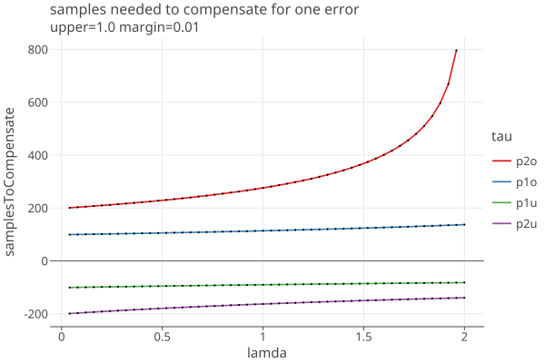
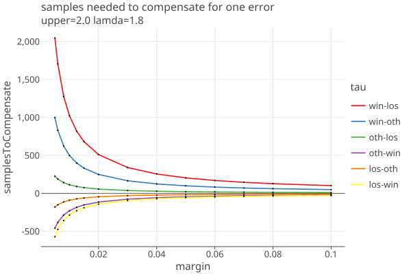
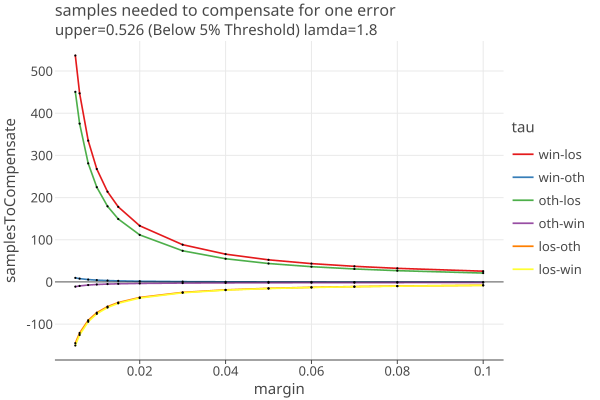
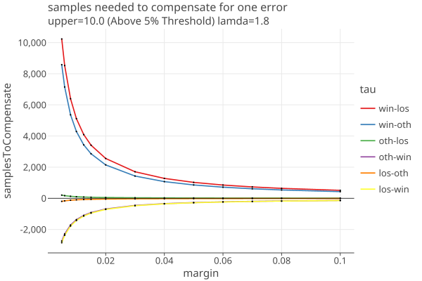
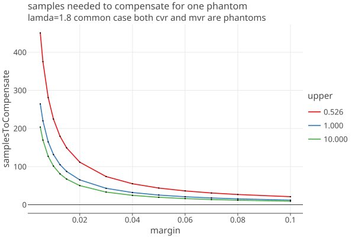
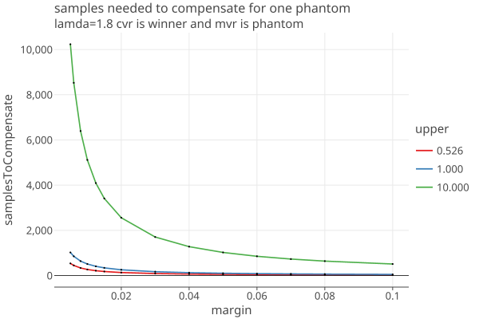

# CLCA errors
2/18/2026

<!-- TOC -->
* [CLCA errors](#clca-errors)
  * [CLCA assort values](#clca-assort-values)
  * [The effects of CLCA Errors](#the-effects-of-clca-errors)
  * [Phantom ballots](#phantom-ballots)
    * [The effect of Phantoms on samples needed](#the-effect-of-phantoms-on-samples-needed)
<!-- TOC -->

Read [BettingRiskFunctions](BettingRiskFunctions.md) for background. Here are necessary definitions:

    x_i = the assort value, 0 <= x_i <= upper
    1/2 < upper < unbounded but known
    µ_i = the expected value of the sample mean, if the assertion is false (very close to 1/2 usually)
    λ_i = the "bet" placed on the ith sample, based on the previous samples, 0 <= λ_i <= 2 .

    payoff_i = (1 + λ_i (x_i − µ_i)) = the payoff of the ith bet
    T_i = Prod (payoff_i, i= 1..i) = the product of the payoffs, aka the "testStatistic"


## CLCA assort values

We do an affine transformation of our assorters so that they all return one of three values [0, 1/2, upper] * noerror,
corresponding to whether the card has a vote for the loser, other, or winner. 

A CLCA overstatement error = cvr_assort - mvr_assort has one of 7 possible values:

````
    [0, .5, u] - [0, .5, u] = 0, -.5, -u,
                             .5,  0, .5-u,
                              u, u-.5, 0

ordering these from low to high:                         
    = [-u, -.5, .5-u, 0, .5, u-.5, u]  
    
the corresponding names are
    cvr - mvr
    [los,oth,win]-[los,oth,win] = [noerror, los-oth, los-win]
                                  [oth-los, noerror, oth-win]
                                  [win-los, win-oth, noerror] 
                        
names matching this ordering [-u, -.5, .5-u, 0, .5, u-.5, u]:
    ["los-win", "los-oth", "oth-win", "noerror", "oth-los", "win-oth", "win-los"] 
                                  
````

The CLCA assorter (aka bassort) does an affine transformation of the overstatement error:

````
   bassort = (1-o/u)*noerror = tau * noerror
   where
     o = overstatement error
     u = assorter upper bound
     v = reported assorter margin
     tau = (1-o/u)
     noerror = 1/(2-v/u)

then the possible values of bassort = (1-o/u) * noerror are:

    o = [u, u-.5, .5, 1, .5-u, -.5, -u]
    (1-o/u) = [1-u/u, 1-(u-.5)/u, 1-.5/u, 1,   1-(.5-u)/u, 1-(-.5/u), 1- (-u/u)]
    (1-o/u) = [0,   1-(u/u-.5/u), 1-.5/u, 1, 1-(.5/u-u/u),    1+.5/u, 1+u/u]
    (1-o/u) = [0,           .5/u, 1-.5/u, 1,       2-.5/u,    1+.5/u, 2]
    
taus=(1-o/u)= [0,            u12,  1-u12, 1,        2-u12,     1+u12, 2] where u12= 1/2u

the corresponding names are

tauNames = ["win-los", "win-oth", "oth-los", "noerror", "oth-win", "los-oth", "los-win"]
````

Note that taus depend only on u, while noerror depends on v and u.

For Plurality, u = 1, and the possible values are:
````
    [0, .5, 1, 1.5, 2] (u=1)
    
we give them SHANGRLA names: tauNames = ["p2o", "p1o", "noerror", "p1u", "p2u"]

````

In general, when u != 1, there are 7 possible values. For example, a Dhondt assorter with u = 1.75:

````
DHondt upperBound=1.7500, noerror=0.51470588

[0.0, 0.1470588235294, 0.3676470588235, 0.51470588, 0.661764705882, 0.882352941176, 1.029411764705]
[0, 1/2u, 1-1/2u, 1, 1+1/2u, 2-1/2u, 2] * noerror

     winner-loser tau= 0.0000 '      0' (win-los)
     winner-other tau= 0.2857 '   1/2u' (win-oth)
      other-loser tau= 0.7143 ' 1-1/2u' (oth-los)
    winner-winner tau= 1.0000 'noerror' (noerror)
      other-other tau= 1.0000 'noerror' (noerror)
      loser-loser tau= 1.0000 'noerror' (noerror)
      loser-other tau= 1.2857 ' 1+1/2u' (oth-win)
     other-winner tau= 1.7143 ' 2-1/2u' (los-oth)
     loser-winner tau= 2.0000 '      2' (los-win)
````

## The effects of CLCA Errors

It's instructive to see the effect of each error type on the testStatistic T, which gets multiplied by the 
payoff for that error. We will calculate the effect of one error by looking at the increase in noerror samples needed.

When the MVR and CVR agree, the assort value = noerror:

    payoff_noerror = (1 + λ * (noerror − 1/2))  ;  (µ_i is approximately 1/2)

When the MVR and CVR disagree, the assort value = tau * noerror, and the payoff is

    payoff_tau = (1 + λ * (tau * noerror − 1/2))

How many "noerror" samples are equivilent to a single sample whose assort value = tau * noerror ?

    payoff_noerror^n_tau * payoff_tau = 1.0                             (eq 1)
    n_tau = -ln(payoff_tau) / ln(payoff_noerror)
    n_tau = -ln((1 + λ * (tau * noerror − 1/2)) / ln(1 + λ * (noerror − 1/2))

n_tau depends on lamda, as well as upper and margin, since noerror = 1/(2-margin/upper).
To examine this, first we set the margin = .01 and upper = 1.0, and show the dependence on lamda:

<a href="https://johnlcaron.github.io/rlauxe/docs/plots2/betting/errorComp/byLamda.html" rel="byLamda"></a>

Only p2o is strongly dependent on the choice of lamda.

Now we fix lamda = 1.8 and show the dependence on margin for various values of upper:

<a href="https://johnlcaron.github.io/rlauxe/docs/plots2/betting/errorComp/byMargin.html" rel="byMargin"></a>
<a href="https://johnlcaron.github.io/rlauxe/docs/plots2/betting/errorComp/byUpper2.html" rel="byUpper2"></a>
<a href="https://johnlcaron.github.io/rlauxe/docs/plots2/betting/errorComp/byUpperUnder1.html" rel="byUpperUnder1"></a>
<a href="https://johnlcaron.github.io/rlauxe/docs/plots2/betting/errorComp/byUpper10.html" rel="byUpper10"></a>

(The last two plots correspond to the BelowThreshold and AboveThreshold assorters with 5% threshold, as used in Belgian D'Hondt elections.)

* Understatement errors have the effect of decreasing the number of samples needed, shown on the plots as negetive numbers.

* It is sobering to see how many extra samples are needed for just one error. For example, for a single p2o error, a plurality contest (upper=1) needs 100 extra samples when the margin is .05, and 500 extra when the margin is .01. (These are absolute numbers, not dependent on the population size.)

* The extra samples appear to scale linearly with upper: when upper=10, one needs 1000 and 5000 extra ballots for margins of .05 and .01, and so on.

* When applied to a real audit, one must take into account the probability of encountering an error in the sampled population. This will roughly be
  nerrors * sampleSize / populationSize.


These results are intrinsic to the risk function's payoff calculation, and independent of any implementation, except for the choice of lamda.
From the first plot vs lamda, we see that only p2o is strongly dependent on the choice of lamda. But we cant peek ahead to see what the next sample is,
and a 10% decrease in lamda approximately increases the samples needed by 10-15% when there are noerrors.

It seems that there's an unavoidable choice between optimistically assuming there are few to no errors, and trying to minimize the effects of errors if they are found. 

Also see [Choosing MaxLoss](https://github.com/JohnLCaron/rlauxe/blob/main/docs/BettingRiskFunctions.md#choosing-maxloss)


## Phantom ballots

See ["Limiting Risk by Turning Manifest Phantoms into Evil Zombies" (P2Z) paper](https://arxiv.org/pdf/1207.3413) for background.

When Nc > ncvrs, we add phantom cards to make up the difference, so nphantoms = Nc - ncvrs.

A phantom CVR has an assort value = .5.

A phantom CVR may have a valid ballot identifier, and only the scanned CVR is missing. (in this case it would be ideal to
locate the ballot and rescan if possible).

1. If the phantom CVR gets chosen for the audit, and the ballot cannot be located (the common case), then the MVR
   is assigned assort = 0, so overstatement = 1/2 - 0 = 1/2, and the bassort value is

        bassort = (1-o/u) * noerror 
        bassort = (1-1/2u)              (phantom-phantom)

2. If the phantom CVR gets chosen for the audit, and the ballot can be located, then we have an MVR that might have one of three sort values [0, 1/2, u].
   The overstatement would then be cvr_assort - mvr_assort = 1/2 - [0, 1/2, u] = [1/2, 0, 1/2-u], and the bassort value is

````
    bassort = (1-o/u) * noerror 
            = 1 - [1/2, 0, 1/2-u]/u * noerror
            = [1-1/2u, 1,  2-1/2u] * noerror      for mvr = loser, oth, winner
            =    1-1/2u                 (phantom-loser)
            =    1                      (phantom-other) 
            =    2-1/2u                 (phantom-winner) 
````

3. If the CVR exists, but the MVR cannot be found, then the MVR is a phantom and mvr_assort = 0. The CVR might have one of three sort values [0, 1/2, u]. The overstatement would then be cvr_assort - mvr_assort = [0, 1/2, u], and the bassort value is

````
   bassort = (1-o/u) * noerror
           = 1 - [0, 1/2, u]/u * noerror
           = [1, 1/2u,  0] * noerror      for CVR = loser, oth, winner
           =    1                       (loser-phantom)
           =    1-1/2u                  (other-phantom)
           =    0                       (winner-phantom)
````

Example implementation with u !=1, for example, a Dhondt assorter with u = 1.75:

       winner-loser tau= 0.0000 '      0'   (win-los)
       winner-phantom tau= 0.0000 '      0' (win-los)    (cvr is winner, mvr not found)
       winner-other tau= 0.2857 '   1/2u'   (win-oth)
       other-loser tau= 0.7143 ' 1-1/2u'    (oth-los)
       other-phantom tau= 0.7143 ' 1-1/2u'  (oth-los)    (cvr is other, mvr not found)
       phantom-loser tau= 0.7143 ' 1-1/2u'  (oth-los)    (cvr is phantom, mvr is loser)
       phantom-phantom tau= 0.7143 ' 1-1/2u' (oth-los)   (both are phantoms, common case)
       winner-winner tau= 1.0000 'noerror'  (noerror)
       other-other tau= 1.0000 'noerror'    (noerror)
       loser-loser tau= 1.0000 'noerror'    (noerror)
       loser-phantom tau= 1.0000 'noerror'  (noerror)    (cvr is loser, mvr not found)
       phantom-other tau= 1.0000 'noerror'  (noerror)    (cvr is phantom, mvr is other)
       loser-other tau= 1.2857 ' 1+1/2u'    (oth-win)
       other-winner tau= 1.7143 ' 2-1/2u'   (los-oth)
       phantom-winner tau= 1.7143 ' 2-1/2u' (los-oth)    (cvr is phantom, mvr is winner)
       loser-winner tau= 2.0000 '      2'   (los-win)


when u=1:

        cvr-mvr overstatement phantom-win = -0.5 bassort=1.5       (cvr is phantom, mvr found)
        cvr-mvr overstatement phantom-los = 0.5 bassort=0.5            "
        cvr-mvr overstatement phantom-oth = 0.0 bassort=1.0            "
        cvr-mvr overstatement win-phantom = 1.0 bassort=0.0        (cvr is not phantom, mvr not found)
        cvr-mvr overstatement los-phantom = 0.0 bassort=1.0            "
        cvr-mvr overstatement oth-phantom = 0.5 bassort=0.5            "
        cvr-mvr overstatement phantom-phantom = 0.5 bassort=0.5    common case

When the CVR is a phantom, it's the same as "oth".
When the MVR is a phantom, it's the same as "los".

**Table A** is a summary of tau names and values (where bassort = tau * noerror)

| cvr - mvr       | value  | name     | SHANGRLA name |
|-----------------|--------|----------|---------------|
| winner-loser    | 0      | win-los  | p2o           | 
| winner-phantom  | 0      | win-los  |               |
| winner-other    | 1/2u   | win-oth  | p1o           |
| other-loser     | 1-1/2u | oth-los  | p1o           |
| other-phantom   | 1-1/2u | oth-los  |               |
| phantom-loser   | 1-1/2u | oth-los  |               |
| phantom-phantom | 1-1/2u | oth-los  |               |
| winner-winner   | 1/2    | noerror  |               |
| other-other     | 1/2    | noerror  |               |
| loser-loser     | 1/2    | noerror  |               |
| loser-phantom   | 1/2    | noerror  |               |
| phantom-other   | 1/2    | noerror  |               |
| loser-other     | 1+1/2u | los-oth  | p1u           |
| other-winner    | 2-1/2u | oth-win  | p1u           |
| phantom-winner  | 2-1/2u | oth-win  |               |
| loser-winner    | 2      | los-win  | p2u           |


### The effect of Phantoms on samples needed

There are three cases involving phantoms where tau = "oth-los" (aka "p1o") = (1-1/2u)
* both the CVR and the MVR are phantoms, which we expect to be the common case
* CVR is a phantom, MVR has vote for loser
* CVR has vote for other, MVR not found

Using eq 1 above, here is a plot of number of noerror samples needed to compendate for one "oth-los" error for several values of upper:

<a href="https://johnlcaron.github.io/rlauxe/docs/plots2/betting/errorComp/phantomByUpper.html" rel="phantomByUpper"></a>

* The extra samples are non-trivial up to say, margins of .05 for plurality contests, and larger for D'Hondt contests when
  upper gets close to 1/2.

The other problematic case is when the CVR has a vote for the winner, but the MVR cant be found. Then tau = "win-los" (aka "p2o") = 0:

<a href="https://johnlcaron.github.io/rlauxe/docs/plots2/betting/errorComp/phantomMvr.html" rel="phantomMvr"></a>

The possibility that MVRs can't be located during the audit adds a big element of uncertainty to home many samples are needed.


