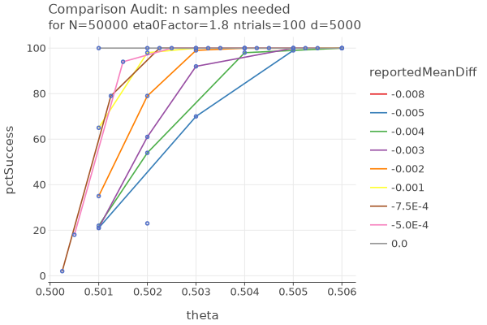
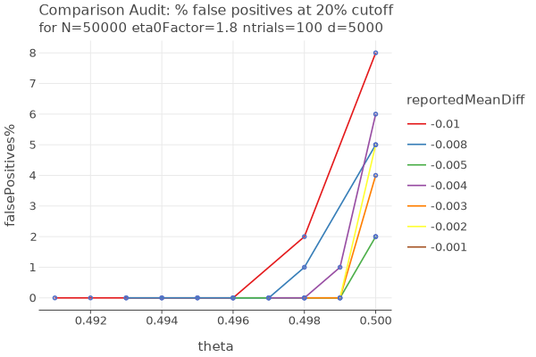

# Comparison Experiments

## 9/29/24

* suppose NS (number of samples needed) depends only on theta (and alpha)
* eta0 = cvrMean * etaFactor; etaFactor is the aggression factor
* nj = (d * eta0 + sampleSum) / (d + n)
* d controls how many samples to use before you allow sampleSum to influence
* seems like you want to pick d based on theta
* best proxy for theta is cvrMean

## ComparisonParameters cvrComparisonFull and cvrComparisonAnalyze

Run all combinations:
````
        val cvrMeanDiffs = listOf(-.005, -.01, -.05, -.10, -.15, 0.0, .005, .01, .05, .10, .15)
        val cvrMeans = listOf(.501, .502, .503, .504, .505, .506, .508, .51, .52, .53, .54, .55)
        val ns = listOf(5000, 10000, 20000, 50000)
        val ds = listOf(500, 1000, 5000, 10000)
        val eta0Factors = listOf(1.75, 1.8, 1.85, 1.9, 1.95)
````
Results summary:
````
************************************************************
cvrComparisonAnalyze at cutoff=10
geometricMean
  d=5000 eta0Factor=1.9 geometricMean=0.986 maxFalsePositive=5.110
  d=10000 eta0Factor=1.9 geometricMean=0.986 maxFalsePositive=5.220
  d=5000 eta0Factor=1.95 geometricMean=0.985 maxFalsePositive=5.330
  d=10000 eta0Factor=1.85 geometricMean=0.985 maxFalsePositive=5.130
  d=10000 eta0Factor=1.95 geometricMean=0.983 maxFalsePositive=5.020
  d=5000 eta0Factor=1.85 geometricMean=0.983 maxFalsePositive=4.920
  d=10000 eta0Factor=1.8 geometricMean=0.982 maxFalsePositive=5.000
  d=5000 eta0Factor=1.8 geometricMean=0.980 maxFalsePositive=5.050
  d=10000 eta0Factor=1.75 geometricMean=0.977 maxFalsePositive=5.360
  d=5000 eta0Factor=1.75 geometricMean=0.975 maxFalsePositive=5.260
  d=1000 eta0Factor=1.95 geometricMean=0.974 maxFalsePositive=5.170
  d=1000 eta0Factor=1.9 geometricMean=0.969 maxFalsePositive=5.150
  d=1000 eta0Factor=1.85 geometricMean=0.962 maxFalsePositive=5.280
  d=1000 eta0Factor=1.8 geometricMean=0.952 maxFalsePositive=4.960
  d=500 eta0Factor=1.95 geometricMean=0.943 maxFalsePositive=4.880
  d=1000 eta0Factor=1.75 geometricMean=0.939 maxFalsePositive=5.060
  d=500 eta0Factor=1.9 geometricMean=0.938 maxFalsePositive=5.040
  d=500 eta0Factor=1.85 geometricMean=0.926 maxFalsePositive=5.050
  d=500 eta0Factor=1.8 geometricMean=0.910 maxFalsePositive=4.960
  d=500 eta0Factor=1.75 geometricMean=0.889 maxFalsePositive=4.710

************************************************************
cvrComparisonAnalyze at cutoff=20
geometricMean
  d=10000 eta0Factor=1.75 geometricMean=0.996 maxFalsePositive=5.360
  d=5000 eta0Factor=1.75 geometricMean=0.996 maxFalsePositive=5.260
  d=5000 eta0Factor=1.8 geometricMean=0.995 maxFalsePositive=5.080
  d=10000 eta0Factor=1.8 geometricMean=0.995 maxFalsePositive=5.000
  d=5000 eta0Factor=1.85 geometricMean=0.993 maxFalsePositive=5.240
  d=10000 eta0Factor=1.85 geometricMean=0.992 maxFalsePositive=5.210
  d=5000 eta0Factor=1.9 geometricMean=0.991 maxFalsePositive=5.130
  d=10000 eta0Factor=1.9 geometricMean=0.988 maxFalsePositive=5.260
  d=1000 eta0Factor=1.95 geometricMean=0.986 maxFalsePositive=5.170
  d=5000 eta0Factor=1.95 geometricMean=0.985 maxFalsePositive=5.330
  d=1000 eta0Factor=1.9 geometricMean=0.985 maxFalsePositive=5.150
  d=1000 eta0Factor=1.85 geometricMean=0.983 maxFalsePositive=5.280
  d=10000 eta0Factor=1.95 geometricMean=0.980 maxFalsePositive=5.050
  d=1000 eta0Factor=1.8 geometricMean=0.980 maxFalsePositive=5.040
  d=1000 eta0Factor=1.75 geometricMean=0.975 maxFalsePositive=5.100
  d=500 eta0Factor=1.95 geometricMean=0.967 maxFalsePositive=4.930
  d=500 eta0Factor=1.85 geometricMean=0.963 maxFalsePositive=5.080
  d=500 eta0Factor=1.9 geometricMean=0.962 maxFalsePositive=5.090
  d=500 eta0Factor=1.8 geometricMean=0.956 maxFalsePositive=4.990
  d=500 eta0Factor=1.75 geometricMean=0.946 maxFalsePositive=4.830

************************************************************
cvrComparisonAnalyze at cutoff=30
geometricMean
  d=5000 eta0Factor=1.75 geometricMean=0.999 maxFalsePositive=5.260
  d=10000 eta0Factor=1.75 geometricMean=0.998 maxFalsePositive=5.360
  d=5000 eta0Factor=1.8 geometricMean=0.997 maxFalsePositive=5.080
  d=10000 eta0Factor=1.8 geometricMean=0.996 maxFalsePositive=5.040
  d=5000 eta0Factor=1.85 geometricMean=0.995 maxFalsePositive=5.310
  d=10000 eta0Factor=1.85 geometricMean=0.993 maxFalsePositive=5.280
  d=5000 eta0Factor=1.9 geometricMean=0.992 maxFalsePositive=5.170
  d=1000 eta0Factor=1.9 geometricMean=0.990 maxFalsePositive=5.150
  d=1000 eta0Factor=1.85 geometricMean=0.990 maxFalsePositive=5.280
  d=1000 eta0Factor=1.95 geometricMean=0.990 maxFalsePositive=5.170
  d=1000 eta0Factor=1.8 geometricMean=0.988 maxFalsePositive=5.080
  d=10000 eta0Factor=1.9 geometricMean=0.988 maxFalsePositive=5.260
  d=5000 eta0Factor=1.95 geometricMean=0.986 maxFalsePositive=5.330
  d=1000 eta0Factor=1.75 geometricMean=0.986 maxFalsePositive=5.140
  d=10000 eta0Factor=1.95 geometricMean=0.981 maxFalsePositive=5.140
  d=500 eta0Factor=1.95 geometricMean=0.977 maxFalsePositive=4.940
  d=500 eta0Factor=1.9 geometricMean=0.974 maxFalsePositive=5.120
  d=500 eta0Factor=1.85 geometricMean=0.970 maxFalsePositive=5.080
  d=500 eta0Factor=1.8 geometricMean=0.964 maxFalsePositive=5.000
  d=500 eta0Factor=1.75 geometricMean=0.955 maxFalsePositive=4.900

************************************************************
cvrComparisonAnalyze at cutoff=40
geometricMean
  d=5000 eta0Factor=1.75 geometricMean=1.000 maxFalsePositive=5.260
  d=10000 eta0Factor=1.75 geometricMean=0.998 maxFalsePositive=5.360
  d=5000 eta0Factor=1.8 geometricMean=0.998 maxFalsePositive=5.090
  d=10000 eta0Factor=1.8 geometricMean=0.996 maxFalsePositive=5.060
  d=5000 eta0Factor=1.85 geometricMean=0.995 maxFalsePositive=5.360
  d=10000 eta0Factor=1.85 geometricMean=0.993 maxFalsePositive=5.300
  d=5000 eta0Factor=1.9 geometricMean=0.992 maxFalsePositive=5.180
  d=1000 eta0Factor=1.85 geometricMean=0.992 maxFalsePositive=5.280
  d=1000 eta0Factor=1.9 geometricMean=0.991 maxFalsePositive=5.150
  d=1000 eta0Factor=1.8 geometricMean=0.991 maxFalsePositive=5.090
  d=1000 eta0Factor=1.95 geometricMean=0.991 maxFalsePositive=5.170
  d=1000 eta0Factor=1.75 geometricMean=0.989 maxFalsePositive=5.140
  d=10000 eta0Factor=1.9 geometricMean=0.988 maxFalsePositive=5.270
  d=5000 eta0Factor=1.95 geometricMean=0.987 maxFalsePositive=5.330
  d=10000 eta0Factor=1.95 geometricMean=0.981 maxFalsePositive=5.180
  d=500 eta0Factor=1.95 geometricMean=0.980 maxFalsePositive=4.950
  d=500 eta0Factor=1.9 geometricMean=0.978 maxFalsePositive=5.120
  d=500 eta0Factor=1.85 geometricMean=0.975 maxFalsePositive=5.080
  d=500 eta0Factor=1.8 geometricMean=0.971 maxFalsePositive=5.010
  d=500 eta0Factor=1.75 geometricMean=0.965 maxFalsePositive=4.960
````

* need to be more aggressive (larger etaFactor) when cutoff is smaller
* false positives slightly greater than alpha. probably need to decrease alpha to compensate?
* not clear what controls the false positives. I would have thought eta0factor.
* everything weighted equally,  which is not right

Choose cutoff = 20% as success target:
````
  cvrComparisonAnalyze at cutoff=20
  d=10000 eta0Factor=1.75 geometricMean=0.996 maxFalsePositive=5.360
  d=5000 eta0Factor=1.75 geometricMean=0.996 maxFalsePositive=5.260
  d=5000 eta0Factor=1.8 geometricMean=0.995 maxFalsePositive=5.080
  d=10000 eta0Factor=1.8 geometricMean=0.995 maxFalsePositive=5.000
````

* use etaFactor=1.8. use large enough N so it doesnt interfere
* determine NS as a function of cvrMean abd cvrMeanDiff
* fine tune d as a function of theta; can we improve based on cvrMean?



* when theta >= cvrMean, 100% of trials are successful at this setting
* when theta < cvrMean, pct success starts to fall when theta < .505, and gets worse as theta approaches .5
* surprising, apparently gets worse as cvrMean gets closer to theta



* goes over 5% when theta exactly .5
