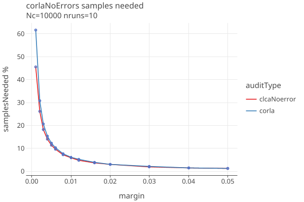
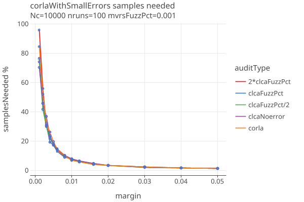
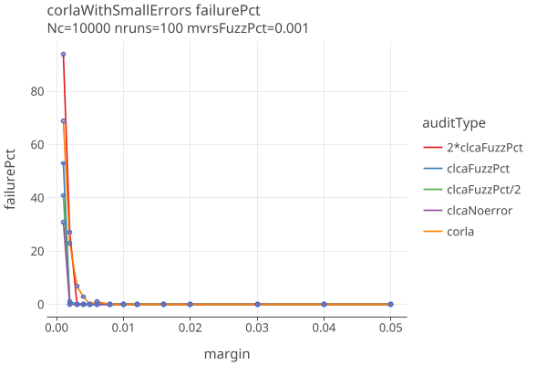
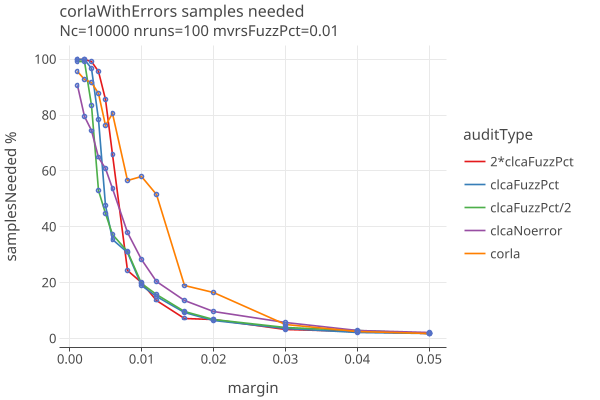
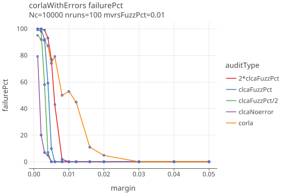
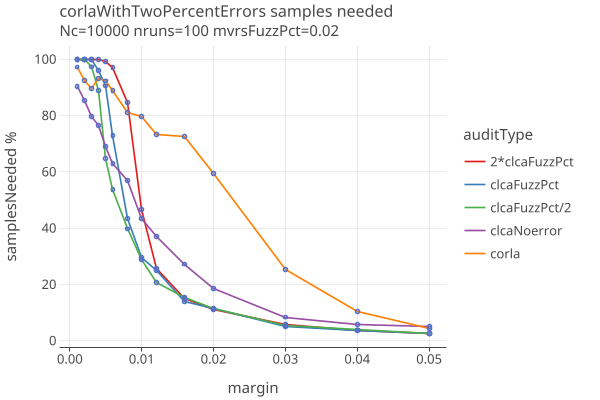
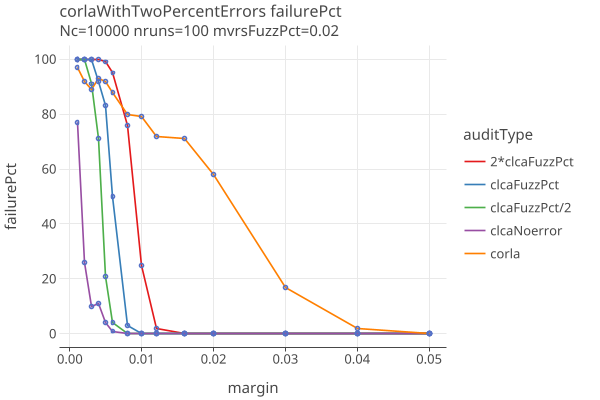

# CORLA
02/02/2025

The Colorado RLA software uses a "Conservative approximation of the Kaplan-Markov P-value" for calculating pvalues, 
from "Gentle Introduction" and "Super Simple" papers. It makes use of measured error rates as they are sampled.

We have a Kotlin port of the CORLA Java code in order to compare performance with our CLCA algorithm. Its possible
that our port does not accurately reflect what CORLA does.

The following plots compare our Corla implementation with our CLCA algorithm, using several "strategies". 
The CLCA "noerror" strategy is similar to CORLA in that it uses 0% error rates for the
apriori rates, then adjusts to the actual error rates as they are measured in the sampled ballots. This has the advantage
of not trying to guess the actual error rates. They differ in that CORLA uses the Kaplan-Markov bound (eq 10 of SuperSimple)
for the risk estimation function, while CLCA uses the BettingMart supermartingale and Adaptive / Optimal betting as described in
the COBRA paper.

We compare also with the CLCA "fuzzPct" strategy, where the apriori error rates are estimated from a presumed "fuzz percentage",
which randomly changed the voted-for candidate in a percentage of the ballots. We generate "fuzzed MRVS" using this technique
when simulating the effect of errors on the audit. The "clcaFuzzPct" is when we use exactly the same fuzzPct for the
apriri error rates as the MVRs were generated with. In theory, this should give us the best results. To see how things change
when our estimates are wrong, we have a "2*clcaFuzzPct" scenario where we overestimate the error rates by a factor of 2, and
a "clcaFuzzPct/2" scenario where we underestimate the error rates by a factor of 2.

## Comparison with no errors

* The algorithms give essentially the same results. One needs 1133 ballots to successfully audit a margin of .005.

## Comparison with fuzzPct .001

Here we add errors between the MVRS and CVRS at a rate of 1 per 1000 ballots. Then we add the three fuzzPct strategies described above.

* When margins < .005, we start to see "failures" which sends the audit to hand count.
* All of the strategies give essentially the same results.

## Comparison with fuzzPct .01

Here we add errors between the MVRS and CVRS at a rate of 1 per 100 ballots. 

* The various strategies are giving different results.
* CORLA is doing worse when margin <= .02.
* The clca strategies are all approximately similar, useable down to maybe .01 margins.

## Comparison with fuzzPct .02

Here we add errors between the MVRS and CVRS at a rate of 1 per 50 ballots.

* CORLA only useable when margin >= .03.
* CLCA noerror strategy doing worse when margin < .03.
* The other clca strategies are all approximately similar, still useable down to maybe .01 margins.

## Conclusions

* COBRA is impressively good in the absence of errors.
* As expected, it does progressively worse as the error rate increases.
* Not clear if COBRA can efficiently do multiple contests at once.

# Notes on CORLA implementation

* uses sparkjava web framework (now abandoned), with Jetty providing the Servlet container.
* hibernate/jpa ORM with postgres database
* everything revolves around the database as global, mutable shared state. No real separation of business logic
  from the persistence layer, unless you count the ASMs.
* The auditing math is contained in a few dozen line of code in the Audit class.
* Almost no unit testing, there may be some integration testing I havent found yet.
* Uses BigDecimal instead of Double for some reason.
* Log4J 2.17.2 (not vulnerable to RCE attack, but stable release is 2.24.0)
* Gson 2.8.1 (should be upgraded to latest stable).
* Maven build
* Eclipse project source layout

The value of the current code is the web based interface tailored to the desired workflow, no doubt
familiar to the Colorado Dept of State.

In principle, it might be easy to switch to using a different algorithm / library, but i havent yet untangled 
the workflow logic that feeds it. In particular:

* batching of ballots for auditing (must already be done in CORLA)
* lots of work that Stark et al are doing on stratification will likely require lots of code that isnt part 
  of the algorithm per se. Can we provide that? Is CORLA planning to? 
