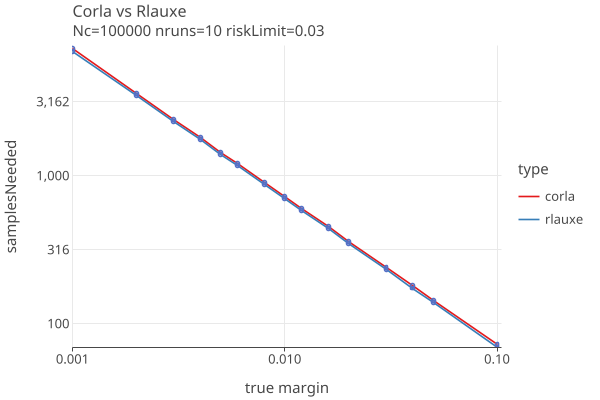
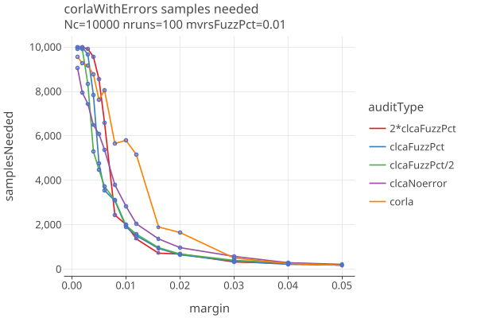
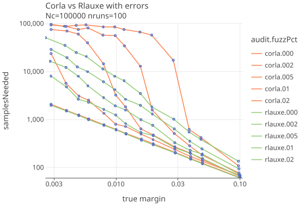

# CORLA notes
_last changed 03/25/2025_

**_NEEDS UPDATING_**

The report [Next Steps for the Colorado Risk-Limiting Audit (CORLA) Program](papers/Corla.pdf) (2018) suggest the following
issues should be addressed:

1. The current version (1.1.0) of RLATool needs to be modified to
  recognize and group together contests that cross jurisdictional boundaries.
  Currently, it treats every contest as if it were entirely contained in a single county. 
  It does not allow the user to select the sample size, nor directly allow an unstratified random sample to be drawn across counties.
2. New statistical methods are needed to deal with contests that include both CVR counties and no-CVR counties.
3. Auditing contests that appear only on a subset of ballots can be made much more efficient if the sample can be drawn from
  just those ballots that contain the contest.

Its not clear what the current version of colorado-rla is, or if any of these issues have been addressed.

# Comparing CORLA and Rlauxe

The Colorado RLA software uses a "Conservative approximation of the Kaplan-Markov P-value" for its risk measuring function
(from "Gentle Introduction" and "Super Simple" papers). It makes use of measured error rates as they are sampled.

We have a Kotlin port of the CORLA Java code in order to compare performance with our CLCA algorithm. Its possible
that our port does not accurately reflect what CORLA does. 

The following plots compare our Corla implementation with the Rlauxe algorithm based on Philip Stark's SHANGRLA framework. 
They differ in that CORLA uses the Kaplan-Markov bound (eq 10 of SuperSimple)
for the risk estimation function, while CLCA uses the BettingMart supermartingale and Adaptive / Optimal betting as described in
the COBRA paper. Also note that Rlauxe AdaptiveBetting uses a "floor" (default 1.0e-5) for the estimated error rates, to prevent betting
(and losing) everything.

These are "one-round" plots, so we dont limit the number of samples, or use the estimation algorithms.

## Compare CORLA and Rlauxe with no errors

Comparison when there are no errors found in the MVRs, so they always agree with the CVRs:

<a href="https://johnlcaron.github.io/rlauxe/docs/plots/corla/corlaNoErrors/corlaNoErrors2LogLog.html" rel="corlaNoErrors2LogLog"></a>

* The algorithms give essentially the same results. One needs about 700 ballots to successfully audit a contest with a margin of 1%, 
  when the risk limit is 3% and there are no errors.

## Compare CORLA and Rlauxe with errors

Here we add random errors between the MVRS and CVRS at rates of 2 per 1000 ballots (.002), 5 per 1000 ballots (.005),
1 per 100 ballots (.01), and 2 per 100 ballots (.02):

<a href="https://johnlcaron.github.io/rlauxe/docs/plots/corla/corlaWithErrors/corlaWithErrorsLinear.html" rel="corlaWithErrorsLinear"></a>

The same plot on a log-log scale. A straight line means that the sample size is proportional to 1/margin.

<a href="https://johnlcaron.github.io/rlauxe/docs/plots/corla/corlaWithErrors/corlaWithErrorsLogLog.html" rel="corlaWithErrorsLogLog"></a>

* CORLA is impressively good in the absence of errors.
* It does progressively worse as the error rate increases and the margin decreases.

# Notes on CORLA implementation

Everything revolves around the database as global, mutable shared state. No real separation of business logic
from the persistence layer. So, difficult to evolve separately.

* uses sparkjava web framework (now abandoned), with Jetty providing the Servlet container.
* client written in typescript
* hibernate/jpa ORM with postgres database
* The auditing math is contained in a few dozen line of code in the Audit class.
* Uses BigDecimal instead of Double for some reason.
* Log4J 2.17.2 (not vulnerable to RCE attack, but stable release is 2.24.0)
* Gson 2.8.1 (should be upgraded to latest stable).
* MAven build
* Eclipse project source layout and build, and also a makefile build system, (maybe legacy).
* Travis CI ("Travis CI is no longer free for open source accounts")
* testng, mockito

Other issues that are not clear to me:

* Can CORLA efficiently do multiple contests at once?
* How does CORLA handle phantom records?
* How is batching of ballots for auditing done?

## Postgres schema

I think hibernate reads through the annotated classes and automatically constructs the ORM mapping?

server/eclipse-project/src/test/resources/SQL/corla.sql

````
create sequence hibernate_sequence;

alter sequence hibernate_sequence owner to corlaadmin;

create table assertion_context
(
    id                 bigint       not null,
    assumed_continuing varchar(255) not null
);

alter table assertion_context
    owner to corlaadmin;

create table asm_state
(
    id           bigint       not null
        primary key,
    asm_class    varchar(255) not null,
    asm_identity varchar(255),
    state_class  varchar(255),
    state_value  varchar(255),
    version      bigint
);

alter table asm_state
    owner to corlaadmin;

create table assertion
(
    assertion_type              varchar(31)      not null,
    id                          bigserial
        primary key,
    contest_name                varchar(255)     not null,
    current_risk                numeric(10, 8)   not null,
    difficulty                  double precision not null,
    diluted_margin              numeric(10, 8)   not null,
    estimated_samples_to_audit  integer          not null,
    loser                       varchar(255)     not null,
    margin                      integer          not null,
    one_vote_over_count         integer          not null,
    one_vote_under_count        integer          not null,
    optimistic_samples_to_audit integer          not null,
    other_count                 integer          not null,
    two_vote_over_count         integer          not null,
    two_vote_under_count        integer          not null,
    version                     bigint,
    winner                      varchar(255)     not null
);

alter table assertion
    owner to corlaadmin;

create table assertion_assumed_continuing
(
    id                 bigint       not null
        constraint fk357sixi5a6nt1sus8jdk1pcpn
            references assertion,
    assumed_continuing varchar(255) not null
);

alter table assertion_assumed_continuing
    owner to corlaadmin;

create table assertion_discrepancies
(
    id          bigint  not null
        constraint fkt31yi3mf6c9axmt1gn1mu33ea
            references assertion,
    discrepancy integer not null,
    cvr_id      bigint  not null,
    primary key (id, cvr_id)
);

alter table assertion_discrepancies
    owner to corlaadmin;

create table ballot_manifest_info
(
    id                      bigint       not null
        primary key,
    batch_id                varchar(255) not null,
    batch_size              integer      not null,
    county_id               bigint       not null,
    scanner_id              integer      not null,
    sequence_end            bigint       not null,
    sequence_start          bigint       not null,
    storage_location        varchar(255) not null,
    version                 bigint,
    ultimate_sequence_end   bigint,
    ultimate_sequence_start bigint,
    uri                     varchar(255)
);

alter table ballot_manifest_info
    owner to corlaadmin;

create index idx_bmi_county
    on ballot_manifest_info (county_id);

create index idx_bmi_seqs
    on ballot_manifest_info (sequence_start, sequence_end);

create table cast_vote_record
(
    id                bigint       not null
        primary key,
    audit_board_index integer,
    comment           varchar(255),
    cvr_id            bigint,
    ballot_type       varchar(255) not null,
    batch_id          varchar(255) not null,
    county_id         bigint       not null,
    cvr_number        integer      not null,
    imprinted_id      varchar(255) not null,
    record_id         integer      not null,
    record_type       varchar(255) not null,
    scanner_id        integer      not null,
    sequence_number   integer,
    timestamp         timestamp,
    version           bigint,
    rand              integer,
    revision          bigint,
    round_number      integer,
    uri               varchar(255),
    constraint uniquecvr
        unique (county_id, imprinted_id, record_type, revision)
);

alter table cast_vote_record
    owner to corlaadmin;

create index idx_cvr_county_type
    on cast_vote_record (county_id, record_type);

create index idx_cvr_county_cvr_number
    on cast_vote_record (county_id, cvr_number);

create index idx_cvr_county_cvr_number_type
    on cast_vote_record (county_id, cvr_number, record_type);

create index idx_cvr_county_sequence_number_type
    on cast_vote_record (county_id, sequence_number, record_type);

create index idx_cvr_county_imprinted_id_type
    on cast_vote_record (county_id, imprinted_id, record_type);

create index idx_cvr_uri
    on cast_vote_record (uri);

create table contest_result
(
    id              bigint       not null
        primary key,
    audit_reason    integer,
    ballot_count    bigint,
    contest_name    varchar(255) not null
        constraint idx_cr_contest
            unique,
    diluted_margin  numeric(19, 2),
    losers          text,
    max_margin      integer,
    min_margin      integer,
    version         bigint,
    winners         text,
    winners_allowed integer
);

alter table contest_result
    owner to corlaadmin;

create table comparison_audit
(
    audit_type                    varchar(31)    not null,
    id                            bigint         not null
        primary key,
    contest_cvr_ids               text,
    diluted_margin                numeric(10, 8) not null,
    audit_reason                  varchar(255)   not null,
    audit_status                  varchar(255)   not null,
    audited_sample_count          integer        not null,
    disagreement_count            integer        not null,
    estimated_recalculate_needed  boolean        not null,
    estimated_samples_to_audit    integer        not null,
    gamma                         numeric(10, 8) not null,
    one_vote_over_count           integer        not null,
    one_vote_under_count          integer        not null,
    optimistic_recalculate_needed boolean        not null,
    optimistic_samples_to_audit   integer        not null,
    other_count                   integer        not null,
    risk_limit                    numeric(10, 8) not null,
    two_vote_over_count           integer        not null,
    two_vote_under_count          integer        not null,
    version                       bigint,
    overstatements                numeric(19, 2),
    contest_result_id             bigint         not null
        constraint fkn14qkca2ilirtpr4xctw960pe
            references contest_result
);

alter table comparison_audit
    owner to corlaadmin;

create table audit_to_assertions
(
    id            bigint not null
        constraint fkgrx2l2qywbc3nv83iid55ql36
            references comparison_audit,
    assertions_id bigint not null
        constraint fkqomhyyib2xno6nq0wjpv95fs5
            references assertion
);

alter table audit_to_assertions
    owner to corlaadmin;

create table contest_vote_total
(
    result_id  bigint       not null
        constraint fkfjk25vmtng6dv2ejlp8eopy34
            references contest_result,
    vote_total integer,
    choice     varchar(255) not null,
    primary key (result_id, choice)
);

alter table contest_vote_total
    owner to corlaadmin;

create table county
(
    id      bigint       not null
        primary key,
    name    varchar(255) not null
        constraint uk_npkepig28dujo4w98bkmaclhp
            unique,
    version bigint
);

alter table county
    owner to corlaadmin;

create table administrator
(
    id               bigint       not null
        primary key,
    full_name        varchar(255) not null,
    last_login_time  timestamp,
    last_logout_time timestamp,
    type             varchar(255) not null,
    username         varchar(255) not null
        constraint uk_esogmqxeek1uwdyhxvubme3qf
            unique,
    version          bigint,
    county_id        bigint
        constraint fkh6rcfib1ishmhry9ctgm16gie
            references county
);

alter table administrator
    owner to corlaadmin;

create table contest
(
    id              bigint       not null
        primary key,
    description     varchar(255) not null,
    name            varchar(255) not null,
    sequence_number integer      not null,
    version         bigint,
    votes_allowed   integer      not null,
    winners_allowed integer      not null,
    county_id       bigint       not null
        constraint fk932jeyl0hqd21fmakkco5tfa3
            references county,
    constraint ukdv45ptogm326acwp45hm46uaf
        unique (name, county_id, description, votes_allowed)
);

alter table contest
    owner to corlaadmin;

create index idx_contest_name
    on contest (name);

create index idx_contest_name_county_description_votes_allowed
    on contest (name, county_id, description, votes_allowed);

create table contest_choice
(
    contest_id         bigint  not null
        constraint fknsr30axyiavqhyupxohtfy0sl
            references contest,
    description        varchar(255),
    fictitious         boolean not null,
    name               varchar(255),
    qualified_write_in boolean not null,
    index              integer not null,
    primary key (contest_id, index),
    constraint uka8o6q5yeepuy2cgnrbx3l1rka
        unique (contest_id, name)
);

alter table contest_choice
    owner to corlaadmin;

create table contests_to_contest_results
(
    contest_result_id bigint not null
        constraint fkr1jgmnxu2fbbvujdh3srjmot9
            references contest_result,
    contest_id        bigint not null
        constraint uk_t1qahmm5y32ovxtqxne8i7ou0
            unique
        constraint fki7qed7v0pkbi2bnd5fvujtp7
            references contest,
    primary key (contest_result_id, contest_id)
);

alter table contests_to_contest_results
    owner to corlaadmin;

create table counties_to_contest_results
(
    contest_result_id bigint not null
        constraint fk2h2muw290os109yqar5p4onms
            references contest_result,
    county_id         bigint not null
        constraint fk1ke574b6yqdc8ylu5xyqrounp
            references county,
    primary key (contest_result_id, county_id)
);

alter table counties_to_contest_results
    owner to corlaadmin;

create table county_contest_result
(
    id                   bigint  not null
        primary key,
    contest_ballot_count integer,
    county_ballot_count  integer,
    losers               text,
    max_margin           integer,
    min_margin           integer,
    version              bigint,
    winners              text,
    winners_allowed      integer not null,
    contest_id           bigint  not null
        constraint fkon2wldpt0279jqex3pjx1mhm7
            references contest,
    county_id            bigint  not null
        constraint fkcuw4fb39imk9pyw360bixorm3
            references county,
    constraint idx_ccr_county_contest
        unique (county_id, contest_id)
);

alter table county_contest_result
    owner to corlaadmin;

create index idx_ccr_county
    on county_contest_result (county_id);

create index idx_ccr_contest
    on county_contest_result (contest_id);

create table county_contest_vote_total
(
    result_id  bigint       not null
        constraint fkip5dfccmp5x5ubssgar17qpwk
            references county_contest_result,
    vote_total integer,
    choice     varchar(255) not null,
    primary key (result_id, choice)
);

alter table county_contest_vote_total
    owner to corlaadmin;

create table cvr_audit_info
(
    id                      bigint not null
        primary key,
    count_by_contest        text,
    multiplicity_by_contest text,
    disagreement            text   not null,
    discrepancy             text   not null,
    version                 bigint,
    acvr_id                 bigint
        constraint fk2n0rxgwa4njtnsm8l4hwc8khy
            references cast_vote_record,
    cvr_id                  bigint not null
        constraint fkdks3q3g0srpa44rkkoj3ilve6
            references cast_vote_record
);

alter table cvr_audit_info
    owner to corlaadmin;

create table contest_comparison_audit_disagreement
(
    contest_comparison_audit_id bigint not null
        constraint fkt490by57jb58ubropwn7kmadi
            references comparison_audit,
    cvr_audit_info_id           bigint not null
        constraint fkpfdns930t0qv905vbwhgcxnl2
            references cvr_audit_info,
    primary key (contest_comparison_audit_id, cvr_audit_info_id)
);

alter table contest_comparison_audit_disagreement
    owner to corlaadmin;

create table contest_comparison_audit_discrepancy
(
    contest_comparison_audit_id bigint not null
        constraint fkcajmftu1xv4jehnm5qhc35j9n
            references comparison_audit,
    discrepancy                 integer,
    cvr_audit_info_id           bigint not null
        constraint fk3la5frd86i29mlwjd8akjgpwp
            references cvr_audit_info,
    primary key (contest_comparison_audit_id, cvr_audit_info_id)
);

alter table contest_comparison_audit_discrepancy
    owner to corlaadmin;

create table cvr_contest_info
(
    cvr_id     bigint  not null
        constraint fkrsovkqe4e839e0aels78u7a3g
            references cast_vote_record,
    county_id  bigint,
    choices    varchar(1024),
    comment    varchar(255),
    consensus  varchar(255),
    contest_id bigint  not null
        constraint fke2fqsfmj0uqq311l4c3i0nt7r
            references contest,
    index      integer not null,
    primary key (cvr_id, index)
);

alter table cvr_contest_info
    owner to corlaadmin;

create index idx_cvrci_uri
    on cvr_contest_info (county_id, contest_id);

create table dos_dashboard
(
    id                  bigint not null
        primary key,
    canonical_choices   text,
    canonical_contests  text,
    election_date       timestamp,
    election_type       varchar(255),
    public_meeting_date timestamp,
    risk_limit          numeric(10, 8),
    seed                varchar(255),
    version             bigint
);

alter table dos_dashboard
    owner to corlaadmin;

create table generate_assertions_summary
(
    id           bigserial
        primary key,
    contest_name varchar(255) not null
        constraint uk_g5q4xm0ga61nbiccn44irhivx
            unique,
    error        varchar(255) not null,
    message      varchar(255) not null,
    version      bigint       not null,
    warning      varchar(255) not null,
    winner       varchar(255) not null
);

create table irv_ballot_interpretation
(
    id             bigint        not null
        primary key,
    cvr_number     integer       not null,
    imprinted_id   varchar(255)  not null,
    interpretation varchar(1024) not null,
    raw_choices    varchar(1024) not null,
    record_type    varchar(255)  not null,
    version        bigint,
    contest_id     bigint        not null
        constraint fkinw3u6cigskdttcwqosnsl98e
            references contest
            on delete cascade
);

alter table irv_ballot_interpretation
    owner to corlaadmin;

create table contest_to_audit
(
    dashboard_id bigint not null
        constraint fkjlw9bpyarqou0j26hq7mmq8qm
            references dos_dashboard,
    audit        varchar(255),
    contest_id   bigint not null
        constraint fkid09bdp5ifs6m4cnyw3ycyo1s
            references contest,
    reason       varchar(255)
);

alter table contest_to_audit
    owner to corlaadmin;

create table log
(
    id                  bigint       not null
        primary key,
    authentication_data varchar(255),
    client_host         varchar(255),
    hash                varchar(255) not null,
    information         varchar(255) not null,
    result_code         integer,
    timestamp           timestamp    not null,
    version             bigint,
    previous_entry      bigint
        constraint fkfw6ikly73lha9g9em13n3kat4
            references log
);

alter table log
    owner to corlaadmin;

create table tribute
(
    id                     bigint not null
        primary key,
    ballot_position        integer,
    batch_id               varchar(255),
    contest_name           varchar(255),
    county_id              bigint,
    rand                   integer,
    rand_sequence_position integer,
    scanner_id             integer,
    uri                    varchar(255),
    version                bigint
);

alter table tribute
    owner to corlaadmin;

create table uploaded_file
(
    id                       bigint       not null
        primary key,
    computed_hash            varchar(255) not null,
    approximate_record_count integer      not null,
    file                     oid          not null,
    filename                 varchar(255),
    size                     bigint       not null,
    timestamp                timestamp    not null,
    version                  bigint,
    result                   text,
    status                   varchar(255) not null,
    submitted_hash           varchar(255) not null,
    county_id                bigint       not null
        constraint fk8gh92iwaes042cc1uvi6714yj
            references county
);

alter table uploaded_file
    owner to corlaadmin;

create table county_dashboard
(
    id                       bigint  not null
        primary key,
    audit_board_count        integer,
    driving_contests         text,
    audit_timestamp          timestamp,
    audited_prefix_length    integer,
    audited_sample_count     integer,
    ballots_audited          integer not null,
    ballots_in_manifest      integer not null,
    current_round_index      integer,
    cvr_import_error_message varchar(255),
    cvr_import_state         varchar(255),
    cvr_import_timestamp     timestamp,
    cvrs_imported            integer not null,
    disagreements            text    not null,
    discrepancies            text    not null,
    version                  bigint,
    county_id                bigint  not null
        constraint uk_6lcjowb4rw9xav8nqnf5v2klk
            unique
        constraint fk1bg939xcuwen7fohfkdx10ueb
            references county,
    cvr_file_id              bigint
        constraint fk6rb04heyw700ep1ynn0r31xv3
            references uploaded_file,
    manifest_file_id         bigint
        constraint fkrs4q3gwfv0up7swx7q1q6xlwo
            references uploaded_file
);

alter table county_dashboard
    owner to corlaadmin;

create table audit_board
(
    dashboard_id  bigint    not null
        constraint fkai07es6t6bdw8hidapxxa5xnp
            references county_dashboard,
    members       text,
    sign_in_time  timestamp not null,
    sign_out_time timestamp,
    index         integer   not null,
    primary key (dashboard_id, index)
);

alter table audit_board
    owner to corlaadmin;

create table audit_intermediate_report
(
    dashboard_id bigint  not null
        constraint fkmvj30ou8ik3u7avvycsw0vjx8
            references county_dashboard,
    report       varchar(255),
    timestamp    timestamp,
    index        integer not null,
    primary key (dashboard_id, index)
);

alter table audit_intermediate_report
    owner to corlaadmin;

create table audit_investigation_report
(
    dashboard_id bigint  not null
        constraint fkdox65w3y11hyhtcba5hrekq9u
            references county_dashboard,
    name         varchar(255),
    report       varchar(255),
    timestamp    timestamp,
    index        integer not null,
    primary key (dashboard_id, index)
);

alter table audit_investigation_report
    owner to corlaadmin;

create table county_contest_comparison_audit
(
    id                            bigint         not null
        primary key,
    diluted_margin                numeric(10, 8) not null,
    audit_reason                  varchar(255)   not null,
    audit_status                  varchar(255)   not null,
    audited_sample_count          integer        not null,
    disagreement_count            integer        not null,
    estimated_recalculate_needed  boolean        not null,
    estimated_samples_to_audit    integer        not null,
    gamma                         numeric(10, 8) not null,
    one_vote_over_count           integer        not null,
    one_vote_under_count          integer        not null,
    optimistic_recalculate_needed boolean        not null,
    optimistic_samples_to_audit   integer        not null,
    other_count                   integer        not null,
    risk_limit                    numeric(10, 8) not null,
    two_vote_over_count           integer        not null,
    two_vote_under_count          integer        not null,
    version                       bigint,
    contest_id                    bigint         not null
        constraint fk8te9gv7q10wxbhg5pgttbj3mv
            references contest,
    contest_result_id             bigint         not null
        constraint fkag9u8fyqni2ehb2dtqop4pox8
            references contest_result,
    dashboard_id                  bigint         not null
        constraint fksycb9uto400qabgb97d4ihbat
            references county_dashboard
);

alter table county_contest_comparison_audit
    owner to corlaadmin;

create index idx_ccca_dashboard
    on county_contest_comparison_audit (dashboard_id);

create table county_contest_comparison_audit_disagreement
(
    county_contest_comparison_audit_id bigint not null
        constraint fk7yt9a4fjcdctwmftwwsksdnma
            references county_contest_comparison_audit,
    cvr_audit_info_id                  bigint not null
        constraint fk9lhehe4o2dgqde06pxycydlu6
            references cvr_audit_info,
    primary key (county_contest_comparison_audit_id, cvr_audit_info_id)
);

alter table county_contest_comparison_audit_disagreement
    owner to corlaadmin;

create table county_contest_comparison_audit_discrepancy
(
    county_contest_comparison_audit_id bigint not null
        constraint fk39q8rjoa19c4fdjmv4m9iir06
            references county_contest_comparison_audit,
    discrepancy                        integer,
    cvr_audit_info_id                  bigint not null
        constraint fkpe25737bc4mpt170y53ba7il2
            references cvr_audit_info,
    primary key (county_contest_comparison_audit_id, cvr_audit_info_id)
);

alter table county_contest_comparison_audit_discrepancy
    owner to corlaadmin;

create table county_dashboard_to_comparison_audit
(
    dashboard_id        bigint not null
        constraint fkds9j4o8el1f4nepf2677hvs5o
            references county_dashboard,
    comparison_audit_id bigint not null
        constraint fksliko6ckjcr7wvmicuqyreopl
            references comparison_audit,
    primary key (dashboard_id, comparison_audit_id)
);

alter table county_dashboard_to_comparison_audit
    owner to corlaadmin;

create table round
(
    dashboard_id                   bigint    not null
        constraint fke3kvxe5r43a4xmeugp8lnme9e
            references county_dashboard,
    ballot_sequence_assignment     text      not null,
    actual_audited_prefix_length   integer,
    actual_count                   integer   not null,
    audit_subsequence              text      not null,
    ballot_sequence                text      not null,
    disagreements                  text      not null,
    discrepancies                  text      not null,
    end_time                       timestamp,
    expected_audited_prefix_length integer   not null,
    expected_count                 integer   not null,
    number                         integer   not null,
    previous_ballots_audited       integer   not null,
    signatories                    text,
    start_audited_prefix_length    integer   not null,
    start_time                     timestamp not null,
    index                          integer   not null,
    primary key (dashboard_id, index)
);

alter table round
    owner to corlaadmin;

create index idx_uploaded_file_county
    on uploaded_file (county_id);

--
-- Name: hibernate_sequence; Type: SEQUENCE SET; Schema: public; Owner: corlaadmin
--

SELECT pg_catalog.setval('public.hibernate_sequence', 44767, true);

````