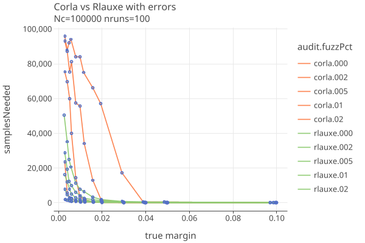

# CORLA
03/09/2025

The report [Next Steps for the Colorado Risk-Limiting Audit (CORLA) Program](papers/Corla.pdf) suggest the following
issues should be addressed:

1. The current version (1.1.0) of RLATool needs to be modified to
  recognize and group together contests that cross jurisdictional boundaries.
  Currently, it treats every contest as if it were entirely contained in a single county. 
  It does not allow the user to select the sample size, nor directly allow an unstratified random sample to be drawn across counties.
2. New statistical methods are needed needed to deal with contests that include both CVR counties and no-CVR counties.
3. Auditing contests that appear only on a subset of ballots can be made much more efficient if the sample can be drawn from
  just those ballots that contain the contest.

Its not clear what the current version of colorado-rla is, or if any of these issues have been addressed.

# Comparing CORLA and Rlauxe

The Colorado RLA software uses a "Conservative approximation of the Kaplan-Markov P-value" for its risk measuring function
(from "Gentle Introduction" and "Super Simple" papers). It makes use of measured error rates as they are sampled.

We have a Kotlin port of the CORLA Java code in order to compare performance with our CLCA algorithm. Its possible
that our port does not accurately reflect what CORLA does. 

The following plots compare our Corla implementation with the Rlauxe algorithm based on Philip Stark's SHANGRLA framework. 
They differ in that CORLA uses the Kaplan-Markov bound (eq 10 of SuperSimple)
for the risk estimation function, while CLCA uses the BettingMart supermartingale and Adaptive / Optimal betting as described in
the COBRA paper. 

These are "one-round" plots, so we dont limit the number of samples, or use the estimation algorithms.

## Compare CORLA and Rlauxe with no errors

Comparison when there are no errors found in the MVRs, so they always agree with the CVRs:

* The algorithms give essentially the same results. One needs about 2000 ballots to successfully audit a margin of .003 when there are no errors.

## Compare CORLA and Rlauxe with errors

Here we add random errors between the MVRS and CVRS at rates of 2 per 1000 ballots (.002), 5 per 1000 ballots (.005),
1 per 100 ballots (.01), and 2 per 100 ballots (.02):

The same plot on a log-log scale. A straight line means that the sample size is proportional to 1/margin.

* COBRA is impressively good in the absence of errors.
* It does progressively worse as the error rate increases and the margin decreases.

# Notes on CORLA implementation

* uses sparkjava web framework (now abandoned), with Jetty providing the Servlet container.
* hibernate/jpa ORM with postgres database
* everything revolves around the database as global, mutable shared state. No real separation of business logic
  from the persistence layer, unless you count the ASMs.
* The auditing math is contained in a few dozen line of code in the Audit class.
* Uses BigDecimal instead of Double for some reason.
* Log4J 2.17.2 (not vulnerable to RCE attack, but stable release is 2.24.0)
* Gson 2.8.1 (should be upgraded to latest stable).
* Maven build
* Eclipse project source layout

Other issues that are not clear to me:

* Can CORLA efficiently do multiple contests at once?
* How dors CORLA handle phantom records?
* How is batching of ballots for auditing done?
