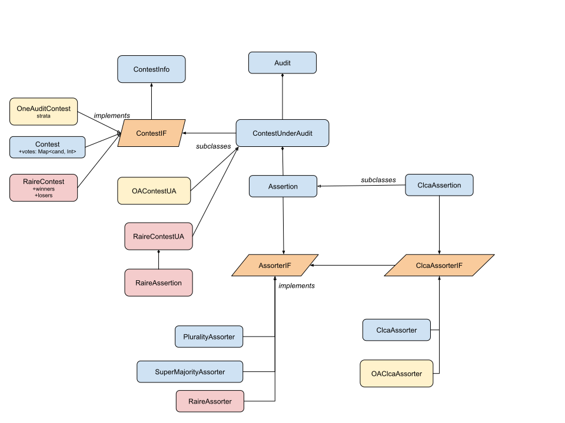
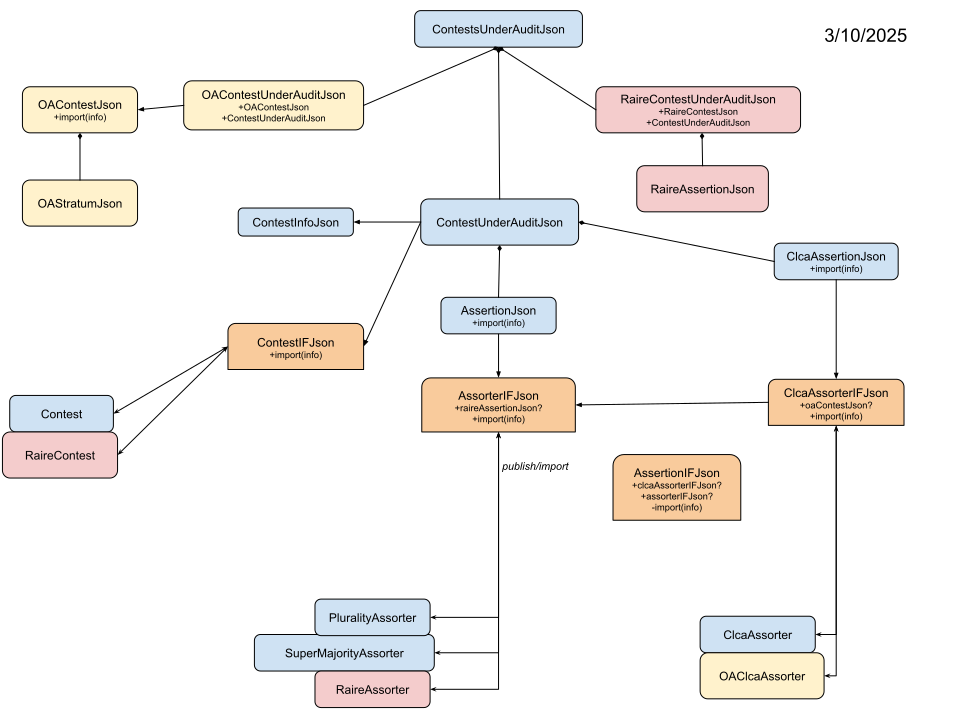

# Developer Notes
_12/20/2025_

## Prerequisites

1. A git client that is compatible with github.
2. **Java 21+**. Install as needed, and make it your default JVM when working with rlauxe.
3. The correct version of gradle and kotlin will be installed when you invoke a gradle command.
4. You need internet access to download the dependencies.


## Download the git repository

````
cd <devhome>
git clone https://github.com/JohnLCaron/rlauxe.git
cd rlauxe
````

## Build the library

To do a clean build (no tests):

```
cd <devhome>/rlauxe
./gradlew clean assemble
```

If the library has changed on github and you need to update it:

````
cd <devhome>/rlauxe
git fetch origin
git rebase -i origin/main
````

Then rebuild the code:

````
./gradlew clean assemble
````

## Run tests

## Set the test data directory

Before running the tests, go to the source file  _core/src/testFixtures/kotlin/org/cryptobiotic/rlauxe/TestUtils.kt_.
At the top of the file, change the line:

````
val testdataDir = "/home/stormy/rla"
````

to some directory on your system. Make sure the directory exists.

### Run the core tests using gradle

To build the complete library and run the core tests:

```
    cd <devhome>/rlauxe
    ./gradlew clean assemble
    ./gradlew core:test
```

## Using IntelliJ

We recommend using the IntelliJ IDE if you plan on doing Java/Kotlin coding, or even if you are just building and running.

* Make sure the prerequisites are satisfied, as above.
* Download the git repository as above.
* Install IntelliJ. The community version probably works fine, but an individual license for the Ultimate Edition is well worth it.

Start up IntelliJ, and in the top menu:

1. File / New / "Project from existing sources"
2. In the popup window, navigate to _devhome/rlauxe_ and select that directory
3. Choose "Import project from existing model" / Gradle

IntelliJ will create and populate an IntelliJ project with the rlauxe sources. 

To build the library, from the topmenu:  Build / Build Project (Ctrl-F9)

To run the core tests, from the left Project Panel source tree, navigate to the _core/src/test/kotlin/org/cryptobiotic/rlauxe_
directory, right click on the directory name, choose "Run tests in ...". If that menu option isnt shown, check if you're in the 
main source tree instead of the test source tree.

To run individual tests, go to the test source; IntelliJ will place a clickable green button in the left margin wherever 
there is a runnable test.

There's lots of online help for using IntelliJ.


## Modules

* **cases**: code to create case studies
* **core**: core library
* **docs**: documentation
* **libs**: local copy of raire-java library
* **plots**: code to generate plots for documentation


## Test Cases

The repo contains all the test case data, except for San Francisco. Download

  https://www.sfelections.org/results/20241105/data/20241203/CVR_Export_20241202143051.zip

into testdataDir/cases/sf2024. (_testdataDir_ as you chose in "Set the test data directory" step above.)

Then run _createSf2024CvrExport()_ test in _cases/src/test/kotlin/org/cryptobiotic/rlauxe/sf/CreateSf2024CvrExport.kt_
to generate _testdataDir/cases/sf2024/crvExport.csv_. This only needs to be done one time.

All the test cases can be generated from:

_cases/src/test/kotlin/org/cryptobiotic/util/TestGenerateAllUseCases.kt_.

## rlauxe viewer

Download the [rlauxe-viewer repo](https://github.com/JohnLCaron/rlauxe-viewer) and follow instructions there to view 
Audit Records and run audits on them, in particular, any of the test cases.

**Caveat Emptor**: The serialization formats are undergoing rapid changes, with no backwards compatibility (yet). Expect that
if you download a new version of the library, you will have to regenerate audit records, and download the latest rlauxe viewer
to view them.


# Random notes and stats

## Code Coverage (Lines of Codes)

 **core test coverage**

| date       | pct    | cover/total LOC |
|------------|--------|-----------------|
| 11/20/2025 | 84.0 % | 5602/6667       |
| 11/25/2025 | 85.2 % | 5229/6136       |
| 11/28/2025 | 85.9 % | 5188/6039       |
| 11/29/2025 | 86.3 % | 5208/6034       |
| 11/30/2025 | 86.7 % | 5255/6058       |
| 12/04/2025 | 85.0 % | 5327/6265       |
| 12/10/2025 | 80.5 % | 5338/6634       |
| 12/13/2025 | 82.8 % | 5341/6449       |
| 12/18/2025 | 83.9 % | 5332/6357       |

 **core + cases test coverage** 

| date       | pct    | cover/total LOC |
|------------|--------|-----------------|
| 11/28/2025 | 79.3 % | 6417/8094       |
| 11/29/2025 | 79.6 % | 6434/8087       |
| 11/29/2025 | 81.4 % | 6479/7962       |
| 12/04/2025 | 81.7 % | 6530/7994       |
| 12/10/2025 | 78.4 % | 6597/8412       |
| 12/13/2025 | 80.7 % | 6606/8187       |


## UML
last changed: 03/10/2025







# TODO 12/11/25 (Belgium)

* consolidate over counties
* include undervotes
* assertions that look at coalitions of parties. (Vanessa)
* choose an audit size and measure the risk.

# TODO 12/20/25

* rlauxe / irv review
* investigate the effect of population.hasSingleCardStyle = hasStyle.
* investigate possible attacks with mvr_assort = 0.5 when the mvr is missing the contest.
* review strategies and fuzzing in estimation and auditing
* replace old plots


