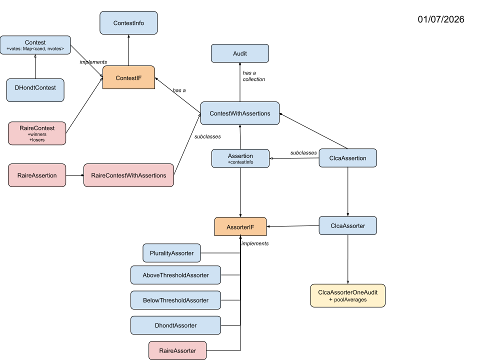
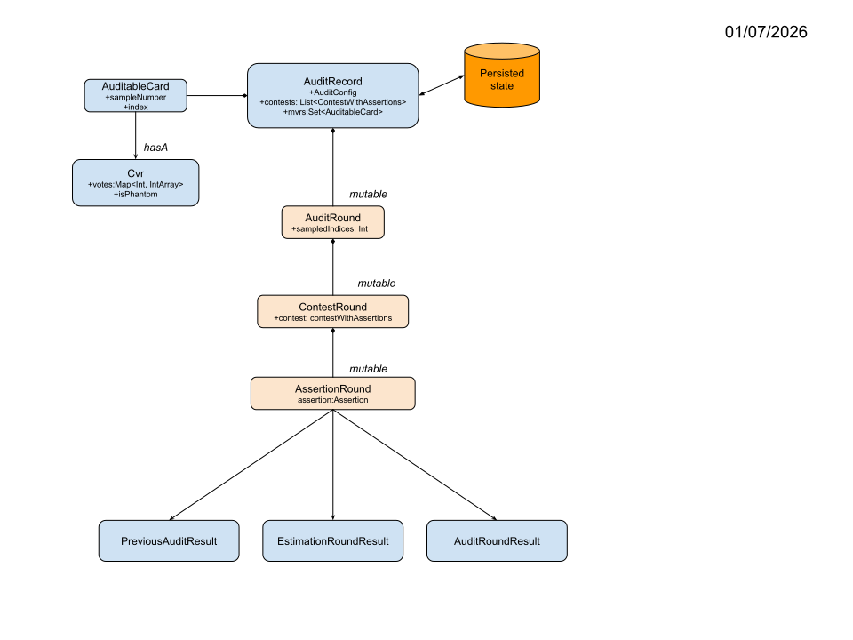

# Developer Notes
_02/14/2026_

## Prerequisites

1. A git client that is compatible with github.
2. **Java 21+**. Install as needed, and make it your default JVM when working with rlauxe.
3. The correct version of gradle and kotlin will be installed when you invoke a gradle command.
4. You need internet access to download the dependencies.


## Download the git repository

````
cd <devhome>
git clone https://github.com/JohnLCaron/rlauxe.git
cd rlauxe
````

## Build the library
To do a clean build (no tests):

```
cd <devhome>/rlauxe
./gradlew clean assemble
```

Normally rlauxe-vierer keeps the current rlauxe library inside its own repo.
However, if the library has changed on github and you need to rebuild it:

````
cd <devhome>/rlauxe
git fetch origin
git rebase -i origin/main
````

Then rebuild the code:

````
./gradlew clean assemble
````

## Run tests

## Set the test data directory

Before running the tests, go to the source file  _core/src/testFixtures/kotlin/org/cryptobiotic/rlauxe/TestUtils.kt_.
At the top of the file, change the line:

````
val testdataDir = "/home/stormy/rla"
````

to some directory on your system. Make sure the directory exists.

### Run the core tests using gradle

To build the complete library and run the core tests:

```
    cd <devhome>/rlauxe
    ./gradlew clean assemble
    ./gradlew core:test
```

To run a subset of tests in cases:

```
    cd <devhome>/rlauxe
    ./gradlew :cases:test --tests "org.cryptobiotic.util.*"
```


## Using IntelliJ

We recommend using the IntelliJ IDE if you plan on doing Java/Kotlin coding, or even if you are just building and running.

* Make sure the prerequisites are satisfied, as above.
* Download the git repository as above.
* Install IntelliJ. The community version probably works fine, but an individual license for the Ultimate Edition is well worth it.

Start up IntelliJ, and in the top menu:

1. File / New / "Project from existing sources"
2. In the popup window, navigate to _devhome/rlauxe_ and select that directory
3. Choose "Import project from existing model" / Gradle

IntelliJ will create and populate an IntelliJ project with the rlauxe sources. 

To build the library, from the topmenu:  Build / Build Project (Ctrl-F9)

To run the core tests, from the left Project Panel source tree, navigate to the _core/src/test/kotlin/org/cryptobiotic/rlauxe_
directory, right click on the directory name, choose "Run tests in ...". If that menu option isnt shown, check if you're in the 
main source tree instead of the test source tree.

To run individual tests, go to the test source; IntelliJ will place a clickable green button in the left margin wherever 
there is a runnable test.

There's lots of online help for using IntelliJ.


## Modules

* **cases**: code to create case studies
* **core**: core library
* **docs**: documentation
* **libs**: local copy of raire-java library
* **plots**: code to generate plots for documentation


## Test Cases

The repo contains all the test case data, except for San Francisco. Download

  [SF2024 data](https://www.sfelections.org/results/20241105/data/20241203/CVR_Export_20241202143051.zip)

into testdataDir/cases/sf2024/ (where _testdataDir_ is as you chose in the "Set the test data directory" step above)

Then run _createSf2024CvrExport()_ test in _cases/src/test/kotlin/org/cryptobiotic/rlauxe/sf/CreateSf2024CvrExport.kt_
to generate _testdataDir/cases/sf2024/crvExport.csv_. This only needs to be done one time.

All the test cases can be generated from:

_cases/src/test/kotlin/org/cryptobiotic/util/TestGenerateAllUseCases.kt_.

Run the verifier on all the generated test cases:

_cases/src/test/kotlin/org/cryptobiotic/util/TestVerifyUseCases.kt_.


## rlauxe viewer

Download the [rlauxe-viewer repo](https://github.com/JohnLCaron/rlauxe-viewer) and follow instructions there to view 
Audit Records and run audits on them, in particular, on any of the test cases.

**Caveat Emptor**: The serialization formats are undergoing rapid changes, with no backwards compatibility (yet). Expect that
if you download a new version of the library, you will possibly have to regenerate any audit records (including tests cases), 
before viewing them.


# Notes and stats

## Code Coverage (Lines of Codes)

 **core test coverage**

| date       | pct    | cover/total LOC |
|------------|--------|-----------------|
| 11/20/2025 | 84.0 % | 5602/6667       |
| 11/25/2025 | 85.2 % | 5229/6136       |
| 11/28/2025 | 85.9 % | 5188/6039       |
| 11/29/2025 | 86.3 % | 5208/6034       |
| 11/30/2025 | 86.7 % | 5255/6058       |
| 12/04/2025 | 85.0 % | 5327/6265       |
| 12/10/2025 | 80.5 % | 5338/6634       |
| 12/13/2025 | 82.8 % | 5341/6449       |
| 12/18/2025 | 83.9 % | 5332/6357       |
| 12/23/2025 | 83.9 % | 5393/6431       |
| 01/07/2026 | 84.5 % | 5344/6327       |
| 01/16/2026 | 87.5 % | 5417/6190       |
| 01/18/2026 | 90.2 % | 5677/6294       |
| 01/27/2026 | 87.6 % | 6021/6871       |
| 01/27/2026 | 87.8 % | 5847/6658       |
| 02/13/2026 | 87.2 % | 6116/7014       |
| 02/14/2026 | 87.8 % | 6174/7034       |
| 02/19/2026 | 87.7 % | 6197/7063       |


## UML
last changed: 01/07/2026





you could say theres two kinds of Contests, Regular (with votes) and Irv (with VoteConsolidator's)
you could say theres two kinds of Audits, Polling and Clca
if a Clca has pools, then its a OneAudit with OneAuditClcaAssorter's

| audit   | contest | assorters                               |
|---------|---------|-----------------------------------------|
| polling | regular | PAssorter                               |
| polling | irv     | RaireAssorter                           |
| clca    | regular | ClcaAssorter                            |
| clca    | regular | ClcaAssorterOneAudit                    |
| clca    | irv     | ClcaAssorter with RaireAssorter         |
| clca    | irv     | ClcaAssorterOneAudit with RaireAssorter |

ContestIF
Contest
DhondtContest
RaireContest

ContestUnderAudit
hasa ContestIF
hasa List<PrimitiveAssorter>
hasa List<ClcaAssorter>, (if Clca): (if ClcaAssorterOneAudit, then its OneAudit)

->subclass RaireContestUnderAudit
hasa RaireContest
hasa List<RaireAssorter>
hasa List<ClcaAssorter>, (if Clca): (if ClcaAssorterOneAudit, then its OneAudit)

AssorterIF (aka PrimitiveAssorter)
PluralityAssorter
AboveThreshold
BelowThreshold
DhondtAssorter
RaireAssorter

ClcaAssorter
hasa AssorterIF

->subclass ClcaAssorterOneAudit

Assertion
hasa AssorterIF

->subclass ClcaAssertion
hasa ClcaAssorter

## Persistence

````
 $auditdir/
        auditConfig.json      // AuditConfigJson
        auditSeed.json        // PrnJson
        cardManifest.csv      // AuditableCard, may be zipped
        cardPools.csv         // OneAuditPoolFromCvrs (OneAudit only)
        contests.json         // ContestsUnderAuditJson
        electionInfo.json     // ElectionInfoJson
        populations.json      // PopulationJson: PopulationIF -> Population
        sortedCards.csv       // AuditableCardCsv, sorted by prn, may be zipped

        roundX/
            auditEstX.json       // AuditRoundJson,  an audit state with estimation, ready for auditinf
            auditStateX.json     // AuditRoundJson,  the results of the audit for this round
            sampleCardsX.csv     // AuditableCardCsv, complete sorted cards used for this round; MvrManager called from runClcaAuditRound, runPollingAuditRound
            sampleMvrsX.csv      // AuditableCardCsv, complete sorted mvrs used for this round; PersistedWorkflow runAuditRound, startNewRound
            samplePrnsX.json     // SamplePrnsJson, complete sorted sample prns for this round

        private/
            sortedMvrs.csv       // AuditableCardCsv, sorted by prn, matches sortedCards.csv, may be zipped


org.cryptobiotic.rlauxe.persist

class AuditRecord(
    override val location: String,
    override val electionInfo: ElectionInfo,
    override val config: AuditConfig,
    override val contests: List<ContestWithAssertions>,
    override val rounds: List<AuditRound>,  // TODO do we need to replace AuditEst ??
    mvrs: List<AuditableCard> // mvrs already sampled
) {
   // TODO maybe better on workflow ??
    fun enterMvrs(mvrs: CloseableIterable<AuditableCard>, errs: ErrorMessages): Boolean
   
   fun readCardManifest(publisher: Publisher, ncards: Int): CardManifest {
   fun readPopulations(publisher: Publisher): List<PopulationIF>? {
   fun readCardPools(publisher: Publisher, infos: Map<Int, ContestInfo>): List<OneAuditPoolFromCvrs>? { 
}

package org.cryptobiotic.rlauxe.workflow

 abstract class AuditWorkflow {
    abstract fun auditConfig() : AuditConfig
    abstract fun mvrManager() : MvrManager
    abstract fun auditRounds(): MutableList<AuditRoundIF>
    abstract fun contestsUA(): List<ContestWithAssertions>
    abstract fun runAuditRound(auditRound: AuditRound, onlyTask: String? = null, quiet: Boolean = true): Boolean  // return complete
    
   open fun startNewRound(quiet: Boolean = true, onlyTask: String? = null): AuditRound
}
class WorkflowTesterTYPE
class CobraAudit
class CorlaAudit

class PersistedWorkflow(
    val auditRecord: AuditRecordIF,
    val mvrWrite: Boolean = true,
)

interface MvrManager {
    fun cardManifest(): CardManifest
    // fun sortedCards(): CloseableIterable<AuditableCard>  // most uses will just need the first n samples
    fun oapools(): List<OneAuditPoolFromCvrs>?
    // fun populations(): List<PopulationIF>?
    fun makeMvrCardPairsForRound(round: Int): List<Pair<CvrIF, AuditableCard>>  // Pair(mvr, cvr)
    
   // test only
    fun setMvrsBySampleNumber(sampleNumbers: List<Long>, round: Int): List<AuditableCard>
}
class MvrManagerForTesting
class MvrManagerFromManifest
class CompositeMvrManager

class PersistedMvrManager(val auditRecord: AuditRecord, val mvrWrite: Boolean = true): MvrManager
````


## Documents

README

    docs/BettingRiskFunctions.md
    docs/OneAuditUseCases.md
    docs/SamplePopulations.md
    docs/AlphaMart.md  
        (https://docs.google.com/spreadsheets/d/1bw23WFTB4F0xEP2-TFEu293wKvBdh802juC7CeRjp-g/edit?gid=662624429#gid=662624429)
        (https://docs.google.com/spreadsheets/d/1bw23WFTB4F0xEP2-TFEu293wKvBdh802juC7CeRjp-g/edit?gid=1185506629#gid=1185506629)

    docs/papers/papers.txt
    docs/Developer.md
    docs/Overview.md
    docs/RlauxeSpec.md
        (AdaptiveBetting.md)
    docs/Verification.md
    docs/CaseStudies.md
        (Corla.md)
    docs/Clca.md

## Fuzzing notes

Simulation 02/06/2026

* vetted
    ContestSimulation.simulateCvrsWithDilutedMargin
    PollingFuzzSamplerTracker.makeFuzzedCvrsForPolling
    ClcaFuzzSamplerTracker.makeFuzzedCardFromCard, makeFuzzedCardsForClca, makeFuzzedCvrsForClca
    CvrSimulation
    VunderFuzzer

** Production Estimation
    cardManifest is passed in, used for CLCA OneAudit but not Polling
        has to be generated for testing - where ?

Polling: for each contest independently:
    * SimulateIrvTestData (IRV)
        simulate cvrs for a RaireContest, doesnt call raire-java for the assertions
    * CvrSimulation.simulateCvrsWithDilutedMargin(contestRound.contestUA, config) (IRV not ok) to match contest totals, undervotes and phantoms
    * uses PollingFuzzSamplerTracker for the sampler with these cvrs and optional fuzzing
        takes existing cvrs and fuzzes before sampling

Clca:    
    * cardSamples = getSubsetForEstimation() ; choose smaller list from CardManifest; used for all contests
    * uses ClcaFuzzSamplerTracker for the sampler with these CardSamples and optional fuzzing, IRV ok
        for each contest, extracts just the cards used in the usedByContest list

OneAudit:
    * cardSamples = getSubsetForEstimation() ; choose smaller list from CardManifest; used for all contests
    * VunderFuzzer(cardPools, cardSamples).mvrCvrPairs fuzzed pairs, IRV ok
    * ClcaSamplerErrorTracker.fromIndexList(contestUA.contest.id, oaCassorter, oaFuzzedPairs, wantIndices)

** Production Auditing

for a real audit, no simulation is used:

    enum class PersistedWorkflowMode {
        real,           // use PersistedMvrManager;  sampleMvrs$round.csv must be written from external program.
        testSimulated,  // use PersistedMvrManagerTest which fuzzes the mvrs on the fly
        testPrivateMvrs  // use PersistedMvrManager; use private/sortedMvrs.csv to write sampleMvrs$round.csv
    }

** Testing Auditing

1. PersistedWorkflow
    PersistedMvrManagerTest(auditDir: String, config: AuditConfig, contestsUA: List<ContestUnderAudit>)
        ClcaFuzzSamplerTracker.makeFuzzedCardsForClca(contestsUA.map { it.contest.info() }, newCards, mvrFuzzPct)

2. class MvrManagerForTesting (40)
   // simulated cvrs, mvrs for testing are sorted and kept here in memory
   // mvrs must be fuzzed before passing to MvrManagerForTesting; not fuzzed here

3. CreateAudit.writeUnsortedPrivateMvrs(Publisher(auditdir), testMvrs, config.seed)
   // (persistent) write mvrs to private when audit is created
   // mvrs must be fuzzed before passing to writeUnsortedPrivateMvrs; not fuzzed here
   
** testFixtures

ClcaContestAuditTaskGenerator
    var testCvrs = simulateCvrsWithDilutedMargin() // includes undervotes and phantoms
    var testMvrs = makeFuzzedCvrsForClca(listOf(sim.contest.info()), testCvrs, mvrsFuzzPct)

ClcaSingleRoundAuditTaskGenerator
    val testCvrs = simulateCvrsWithDilutedMargin() // includes undervotes and phantoms
    val testMvrs =  if (p2flips != null || p1flips != null) {
        makeFlippedMvrs(testCvrs, Nc, p2flips, p1flips)
    } else {
        makeFuzzedCvrsForClca(listOf(sim.contest.info()), testCvrs, mvrsFuzzPct)
    }

OneAuditSingleRoundWithDilutedMargin
   val (contestUA, mvrs, cards, pools) = makeOneAuditTest()  // mvrs are not fuzzed
   MvrManagerFromManifest (9)
        makeFuzzedCvrsForClca(infoList, sortedMvrs, simFuzzPct) // mvrs fuzzed here

MultiContestTestData (69) : specify the contests with range of margins, phantoms, undervotes, phantoms, single poolId, poolPct
    used by RunRlaStartFuzz (Polling, Clca)

MultiContestCombineData: specify the contests with exact number of votes

OneAuditTest : One OA contest
    makeOneAuditTestContests: multiple OA contests
    used by RunRlaCreateOneAudit


// Simulation of Raire Contest; pass in the parameters and simulate the cvrs; then call raire library to generate the assertions
simulateRaireTestContest: single raire contest


# TODO

## TODO 12/11/25 (Belgium)

* include undervotes
* assertions that look at coalitions of parties. (Vanessa)
* choose an audit size and measure the risk.

## TODO 12/20/25

* investigate the effect of population.hasSingleCardStyle = hasStyle.
* investigate possible attacks with mvr_assort = 0.5 when the mvr is missing the contest.

## TODO 01/04/26

* maxRisk does it help? reduce lamda tradeoff
* 2D plotting
* betting on the error rate
* mix_betting_mart: "Finds a simple discrete mixture martingale as a (flat) average of D TSMs each with fixed bet 'lam'"
* review COBRA 3.2, 4.3 (Diversified betting)

## TODO 2/6/26

* replace SimulateIrvTestData with Vunder: we need the VoteConsolidator info
* can we use Vunder in MultiContestTestData (68) ?

## TODO 2/17

* investigate assigning costs to mallots sampled and nrounds, and minimize the cost.


