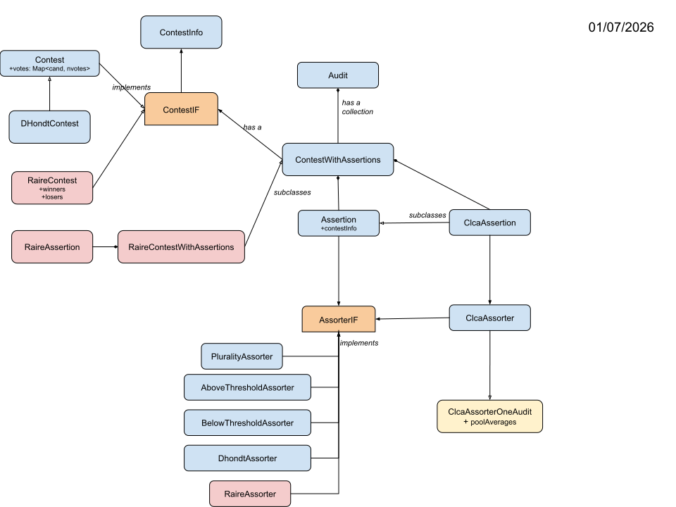
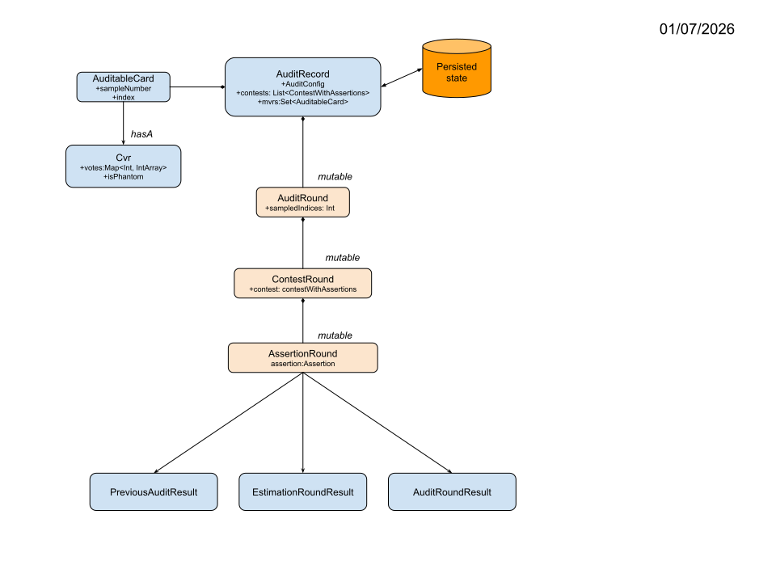

# Developer Notes
_07/12/2026_

<!-- TOC -->
* [Developer Notes](#developer-notes)
* [Getting Started](#getting-started)
  * [Prerequisites](#prerequisites)
  * [Download the git repository](#download-the-git-repository)
  * [Build the library](#build-the-library)
  * [Run tests](#run-tests)
  * [Set the test data directory](#set-the-test-data-directory)
    * [Run the core tests using gradle](#run-the-core-tests-using-gradle)
  * [Using IntelliJ](#using-intellij)
  * [Modules](#modules)
  * [Generate Test Cases](#generate-test-cases-)
    * [For the Belgium 2024 test case](#for-the-belgium-2024-test-case)
    * [For the Boulder 2024 test case](#for-the-boulder-2024-test-case)
    * [For Colorado elections using auditcenter](#for-colorado-elections-using-auditcenter)
      * [For Colorado 2020 General elections](#for-colorado-2020-general-elections)
      * [For Colorado 2022 Primary election](#for-colorado-2022-primary-election)
      * [For Colorado 2024 General election](#for-colorado-2024-general-election)
    * [For the Georgia 2026 primary test case](#for-the-georgia-2026-primary-test-case)
    * [For the San Francisco 2024 test case](#for-the-san-francisco-2024-test-case)
  * [rlauxe viewer](#rlauxe-viewer)
* [Notes and stats](#notes-and-stats)
  * [Code Coverage (Lines of Codes)](#code-coverage-lines-of-codes)
    * [core test coverage](#core-test-coverage)
    * [core + cases test coverage](#core--cases-test-coverage)
    * [core + cases + CreateCases test coverage](#core--cases--createcases-test-coverage)
  * [Time reading card manifest](#time-reading-card-manifest)
  * [UML](#uml)
  * [Miscellaneous Notes](#miscellaneous-notes)
    * [Documents](#documents)
    * [Fuzzing notes](#fuzzing-notes)
* [TODO](#todo)
* [CLI](#cli)
<!-- TOC -->

# Getting Started

## Prerequisites

1. A git client that is compatible with GitHub.
2. **Java 21+**. Install as needed, and make it your default JVM when working with rlauxe.
3. The correct version of Gradle and Kotlin will be installed when you invoke a gradle command.
4. You need internet access to download the dependencies.

## Download the git repository

````
cd <devhome>
git clone https://github.com/JohnLCaron/rlauxe.git
cd rlauxe
````

## Build the library
To do a clean build (no tests):

```
cd <devhome>/rlauxe
./gradlew clean assemble
```

Normally **rlauxe-viewer** keeps the current rlauxe library inside its own repo.
However, if the library has changed on GitHub and you need to rebuild it:

````
cd <devhome>/rlauxe
git fetch origin
git rebase -i origin/main
````

Then rebuild the code:

````
./gradlew clean assemble
````

## Run tests

## Set the test data directory

Before running the tests, go to the source file  _core/src/testFixtures/kotlin/org/cryptobiotic/rlauxe/TestUtils.kt_.
At the top of the file, change the line:

````
val testdataDir = "/home/stormy/rla"
````

to some directory on your system. Make sure the directory exists.

### Run the core tests using gradle

To build the complete library and run the core tests:

```
    cd <devhome>/rlauxe
    ./gradlew clean assemble
    ./gradlew core:test
```

To run a subset of tests in cases:

```
    cd <devhome>/rlauxe
    ./gradlew :cases:test --tests "org.cryptobiotic.create.*"
```


## Using IntelliJ

We recommend using the IntelliJ IDE if you plan on doing Java/Kotlin coding, or even if you are just building and running.

* Make sure the prerequisites are satisfied, as above.
* Download the git repository as above.
* Install IntelliJ. The (free) community version probably works fine, but an individual license for the Ultimate Edition is well worth it.

Start up IntelliJ, and in the top menu:

1. File / New / "Project from existing sources"
2. In the popup window, navigate to _devhome/rlauxe_ and select that directory
3. Choose "Import project from existing model" / Gradle

IntelliJ will create and populate an IntelliJ project with the rlauxe sources. 

To build the library, from the topmenu:  Build / Build Project (Ctrl-F9)

To run the core tests, from the left Project Panel source tree, navigate to the _core/src/test/kotlin/org/cryptobiotic/rlauxe_
directory, right click on the directory name, choose "Run tests in ...". If that menu option isn't shown, check if you're in the 
main source tree instead of the test source tree.

To run individual tests, go to the test source; IntelliJ will place a clickable green button in the left margin
(next to _@Test_) wherever there is a runnable test.

There's lots of online help for using IntelliJ. 


## Modules

* **cases**: code to create case studies
* **core**: core library
* **docs**: documentation
* **libs**: local copy of raire-java library
* **plots**: code to generate plots for documentation


## Generate Test Cases 

build the uberjars:

$ cd <devhome>/rlauxe
$ ./gradlew assemble uberjar

### For the Belgium 2024 test case

The repo contains the needed input for belgium2024. To create the data:

`
java -classpath cases/build/libs/rlauxe-cases-0.10.2.0-uber.jar org.cryptobiotic.rlauxe.cli.CreateCaseData \
    -case belgium -topdir "/home/you/wherever/cases/belgium2024"
`

* check _cases/build/libs/_ for the latest version of rlauxe-cases-uber.jar and use that
* substitute your own output "topdir" directory

Use `java -jar viewer/build/libs/viewer-uber.jar -belgiumAudit` to view this case.
See [here](https://github.com/JohnLCaron/rlauxe-viewer#special-features-for-belgium-audits).


### For the Boulder 2024 test case

The repo contains the needed input for boulder024. To create the data:

`
java -classpath cases/build/libs/rlauxe-cases-0.10.2.0-uber.jar org.cryptobiotic.rlauxe.cli.CreateCaseData \
    -case boulder2024 -topdir "/home/you/wherever/cases/boulder2024" -type oa
`

will create a OneAudit election. To create a CLCA election, use the flag "-type clca"


### For Colorado elections using auditcenter

The repo does not contain the test data input for Colorado. Clone the following git repository:

git clone https://github.com/nealmcb/auditcenter

#### For Colorado 2020 General elections

`
java -classpath cases/build/libs/rlauxe-cases-0.10.2.0-uber.jar org.cryptobiotic.rlauxe.cli.CreateCaseData \
    -case corla2020 -toptopdir "/home/you/wherever/cases/corla2020" \
    -auditcenter "/home/you/wherever/github/auditcenter/directory" 
`

* check _cases/build/libs/_ for the latest version of rlauxe-cases-uber.jar
* substitute your own "auditcenter" directory
* substitute your own "toptopdir" directory where the data will be written.
* currently we are only supporting the Colorado 2020 General election, but other elections will be added.
* this creates an election using style based sampling (CSD). To use uniform sampling, use the flag "-sampling uniform".

To use the viewer for Corla elections, see [here](https://github.com/JohnLCaron/rlauxe-viewer/docs/CorlaViewer.md)

To run the Colorado 2020 election with cvrs from https://votedatabase.com, see [here](../notes/Corla2020notes.md). 
Then use

`
java -classpath cases/build/libs/rlauxe-cases-0.10.2.0-uber.jar org.cryptobiotic.rlauxe.cli.CreateCaseData \
    -case corla2020withCvrs -toptopdir "/home/you/wherever/cases/corla2020withCvrs" \
    -auditcenter "/home/you/wherever/github/auditcenter/directory" \
    -input "/home/you/wherever/votedatabase/cvr/Colorado"
`

#### For Colorado 2022 Primary election

`
java -classpath cases/build/libs/rlauxe-cases-0.10.2.0-uber.jar org.cryptobiotic.rlauxe.cli.CreateCaseData \
    -case corla2022p -toptopdir "/home/you/wherever/cases/corla2022p" \
    -auditcenter "/home/you/wherever/github/auditcenter/directory" 
`

#### For Colorado 2024 General election

`
java -classpath cases/build/libs/rlauxe-cases-0.10.2.0-uber.jar org.cryptobiotic.rlauxe.cli.CreateCaseData \
    -case corla2024 -toptopdir "/home/you/wherever/cases/corla2024" \
    -auditcenter "/home/you/wherever/github/auditcenter/directory" 
`

### For the Georgia 2026 primary test case

`
java -classpath cases/build/libs/rlauxe-cases-0.10.2.0-uber.jar org.cryptobiotic.rlauxe.cli.CreateCaseData \
    -case ga26p -topdir "/home/you/wherever/cases/ga2026Primary" \
    -input "/home/you/wherever/github/nealmcb/rla-review-arlo/2026-05-19-primary/extracted"
`

will create a OneAudit election. 


### For the San Francisco 2024 test case

The repo does not contain the test data input for San Francisco. Download

  [SF2024 data](https://www.sfelections.org/results/20241105/data/20241203/CVR_Export_20241202143051.zip)

Create the _top directory_ for this case (eg _$testdataDir/cases/sf2024/_), and put the downloaded zip file in it.

Then run:

`
java -classpath cases/build/libs/rlauxe-cases-0.10.2.0-uber.jar org.cryptobiotic.rlauxe.cli.CreateCaseData \
    -case sf2024 -toptopdir "/home/you/wherever/cases/sf2024" --cvrExport
`
to build the cvrExport.csv file, which will be written to topdir. This only needs to be done one time.

To generate the sf2024 election data: 

`
java -classpath cases/build/libs/rlauxe-cases-0.10.2.0-uber.jar org.cryptobiotic.rlauxe.cli.CreateCaseData \
    -case sf2024 -toptopdir "/home/you/wherever/cases/sf2024"
`

will create a OneAudit election in "/home/you/wherever/cases/sf2024/oa". To create a CLCA election, add the flag "-type clca"
which will create a Clca election in "/home/you/wherever/cases/sf2024/clca"

If you want to control where the election is placed, use

`
java -classpath cases/build/libs/rlauxe-cases-0.10.2.0-uber.jar org.cryptobiotic.rlauxe.cli.CreateCaseData \
    -case sf2024 -toptopdir "/home/you/wherever/cases/sf2024" \
    -output "/home/you/wherever/" -type [clca | oa]
`

will create a _type_ election in "/home/you/wherever", taking the cvrs from "/home/you/wherever/cases/sf2024".

## rlauxe viewer

Download the [rlauxe-viewer repo](https://github.com/JohnLCaron/rlauxe-viewer) and follow the 
[instructions](https://github.com/JohnLCaron/rlauxe-viewer#building-rlauxe-viewer) to view Audit Records and run audits on them, for example on any of the test cases.

**Caveat Emptor**: The serialization formats are undergoing rapid changes, with no backwards compatibility (yet). Expect that
if you download a new version of the library, you may have to regenerate any audit records (including tests case data), 
before viewing them.

**Quaeso ignosce mihi peccatum meum**: We are now using semantic versioning (with a leading 0 to indicate a prerelease): eg "0.10.2.0" = 0.MAJOR.MINOR.PATCH.
The data format is rapidly changing in incompatible ways; when it does, the major version will increment.
You will have to regenerate any data you have. The case study data can now be regenerated from the command line,
see [Getting Started](docs/Developer.md#getting-started).
Mea culpa, mea culpa, mea maxima culpa.

# Notes and stats

## Code Coverage (Lines of Codes)

 ### core test coverage

| date       | pct    | cover/total LOC |
|------------|--------|-----------------|
| 11/20/2025 | 84.0 % | 5602/6667       |
| 11/25/2025 | 85.2 % | 5229/6136       |
| 11/28/2025 | 85.9 % | 5188/6039       |
| 11/29/2025 | 86.3 % | 5208/6034       |
| 11/30/2025 | 86.7 % | 5255/6058       |
| 12/04/2025 | 85.0 % | 5327/6265       |
| 12/10/2025 | 80.5 % | 5338/6634       |
| 12/13/2025 | 82.8 % | 5341/6449       |
| 12/18/2025 | 83.9 % | 5332/6357       |
| 12/23/2025 | 83.9 % | 5393/6431       |
| 01/07/2026 | 84.5 % | 5344/6327       |
| 01/16/2026 | 87.5 % | 5417/6190       |
| 01/18/2026 | 90.2 % | 5677/6294       |
| 01/27/2026 | 87.6 % | 6021/6871       |
| 01/27/2026 | 87.8 % | 5847/6658       |
| 02/13/2026 | 87.2 % | 6116/7014       |
| 02/14/2026 | 87.8 % | 6174/7034       |
| 02/19/2026 | 89.1 % | 6251/7017       |
| 02/24/2026 | 90.2 % | 6252/6934       |
| 03/02/2026 | 90.6 % | 6427/7090       |
| 03/03/2026 | 91.5 % | 6510/7116       |
| 03/03/2026 | 90.1 % | 6497/7208       |
| 03/27/2026 | 89.4 % | 6189/6919       |
| 03/30/2026 | 90.5 % | 6355/7022       |
| 05/20/2026 | 81.3 % | 6816/8383       |
| 05/20/2026 | 86.7%  | 7212/8323       |
| 07/08/2026 | 79.9%  | 7796/9752       |
| 07/09/2026 | 81.3%  | 7650/9407       |
| 07/10/2026 | 78.6%  | 7437/9460       |
| 07/11/2026 | 83.0%  | 7819/9426       |

### core + cases test coverage

| date     | pct    | cover/total LOC |
|----------|--------|-----------------|
| 07/11/26 | 70.1 % | 10502/14972     |

### core + cases + CreateCases test coverage

Include TestCreateCaseData

| date     | pct    | cover/total LOC |
|----------|--------|-----------------|
| 07/08/26 | 72.5 % | 10673/14726     |
| 07/09/26 | 78.5 % | 11592/14769     |
| 07/10/26 | 75.4 % | 11140/14777     |
| 07/11/26 | 77.2 % | 11527/14936     |


## Time reading card manifest


````
totalCardCount=4982774 (corla24 consistent)

//// results ntrials = 20
//          ProtoCardIteratorM: accum=1143043148 took 267.1 s = 13354.45 ms/trial count=20, mean=2.6801 stddev=0.0738 us/card  = 1.0
//           CloseableIterable: accum=1143043148 took 263.1 s = 13151.8  ms/trial count=20, mean=2.6394 stddev=0.1009 us/card  =  .98
//     CloseableIterableInline: accum=1143043148 took 383.4 s = 19169.4  ms/trial count=20, mean=3.8471 stddev=0.0841 us/card  = 1.43 = 43% slower (!)
// CloseableIterableNonGeneric: accum=1143043148 took 261.5 s = 13071.6  ms/trial count=20, mean=2.6233 stddev=0.0713 us/card  =  .98
//                 timeReadCsv: accum=1143043148 took 1068 s =  53387.0  ms/trial count=20, mean=10.714 stddev=0.2442 us/card  = 4.0 = 4x slower
//            timeFastSampling:                  took 8.611 s =   429.0  ms/trial count=20, mean=0.0861 stddev=0.0118 us/card  = 31 times faster
//      timeFastSamplingCached:                  took 1.120 s =    54.9  ms/trial count=20, mean=0.0110 stddev=0.0053 us/card  = 243 times faster

````

## UML
last changed: 01/07/2026





## Miscellaneous Notes

There are two kinds of Contests, Regular (with votes) and Irv (with VoteConsolidator's).
There are two kinds of Audits, Polling and Clca.
If a Clca has pools, then it's a OneAudit with OneAuditClcaAssorter's

| audit   | contest | assorters                               |
|---------|---------|-----------------------------------------|
| polling | regular | PluralityAssorter                       |
| polling | irv     | RaireAssorter                           |
| clca    | regular | ClcaAssorter                            |
| clca    | regular | ClcaAssorterOneAudit                    |
| clca    | irv     | ClcaAssorter with RaireAssorter         |
| clca    | irv     | ClcaAssorterOneAudit with RaireAssorter |

````
ContestIF
    Contest
    DhondtContest
    IrvContest

ContestWithAssertions
    hasa ContestIF
    hasa List<PrimitiveAssorter>
    (if Clca) hasa List<ClcaAssorter>
    (if OneAudit) hasa List<ClcaAssorterOneAudit)

->subclass RaireContestWithAssertions
    hasa IrvContest
    hasa List<RaireAssertion>
    (if Clca) hasa List<ClcaAssorter>
    (if OneAudit) hasa List<ClcaAssorterOneAudit)

AssorterIF (aka PrimitiveAssorter)
    PluralityAssorter
    AboveThreshold
    BelowThreshold
    DhondtAssorter
    RaireAssorter
        hasa RaireAssertion

ClcaAssorter
    hasa AssorterIF

->subclass ClcaAssorterOneAudit

Assertion
    hasa AssorterIF

->subclass ClcaAssertion
    hasa ClcaAssorter
    
````

### Documents

README

    docs/SamplePopulations.md
    docs/Verification.md
    docs/BettingRiskFunctions.md
    docs/OneAuditUseCases.md
    docs/AlphaMart.md  
        (https://docs.google.com/spreadsheets/d/1bw23WFTB4F0xEP2-TFEu293wKvBdh802juC7CeRjp-g/edit?gid=662624429#gid=662624429)
        (https://docs.google.com/spreadsheets/d/1bw23WFTB4F0xEP2-TFEu293wKvBdh802juC7CeRjp-g/edit?gid=1185506629#gid=1185506629)
    docs/ClcaErrors.md  
    docs/CaseStudies.md  

    docs/papers/papers.txt
    docs/Developer.md
    docs/Verification.md
    docs/CaseStudies.md
        (Corla.md)
    docs/Raire.md
    docs/DHondt.md

maybe:
    docs/Attacks.md
    docs/AuditRecord.md
    docs/RlauxeSpec.md
    docs/VerifierSpec.md

not:           
    docs/Clca.md
    docs/GeneralizedAdaptiveBetting.md
    docs/RlaOptions.md

### Fuzzing notes

Simulation 02/06/2026

* vetted
    ContestSimulation.simulateCvrsWithDilutedMargin
    PollingFuzzSamplerTracker.makeFuzzedCvrsForPolling
    ClcaFuzzSamplerTracker.makeFuzzedCardFromCard, makeFuzzedCardsForClca, makeFuzzedCvrsForClca
    CvrSimulation
    VunderFuzzer

** Production Estimation
    cardManifest is passed in, used for CLCA OneAudit but not Polling
        has to be generated for testing - where ?

Polling: for each contest independently:
    * SimulateIrvTestData (IRV)
        simulate cvrs for a RaireContest, doesn't call raire-java for the assertions
    * CvrSimulation.simulateCvrsWithDilutedMargin(contestRound.contestUA, config) (IRV not ok) to match contest totals, undervotes and phantoms
    * uses PollingFuzzSamplerTracker for the sampler with these cvrs and optional fuzzing
        takes existing cvrs and fuzzes before sampling

Clca:    
    * cardSamples = getSubsetForEstimation() ; choose smaller list from CardManifest; used for all contests
    * uses ClcaFuzzSamplerTracker for the sampler with these CardSamples and optional fuzzing, IRV ok
        for each contest, extracts just the cards used in the usedByContest list

OneAudit:
    * cardSamples = getSubsetForEstimation() ; choose smaller list from CardManifest; used for all contests
    * VunderFuzzer(cardPools, cardSamples).mvrCvrPairs fuzzed pairs, IRV ok
    * ClcaSamplerErrorTracker.fromIndexList(contestUA.contest.id, oaCassorter, oaFuzzedPairs, wantIndices)

** Production Auditing

for a real audit, no simulation is used:

    enum class PersistedWorkflowMode {
        real,           // use PersistedMvrManager;  sampleMvrs$round.csv must be written from external program.
        testSimulated,  // use PersistedMvrManagerTest which fuzzes the mvrs on the fly
        testPrivateMvrs  // use PersistedMvrManager; use private/sortedMvrs.csv to write sampleMvrs$round.csv
    }

** Testing Auditing

1. PersistedWorkflow
    PersistedMvrManagerTest(auditDir: String, config: AuditConfig, contestsUA: List<ContestUnderAudit>)
        ClcaFuzzSamplerTracker.makeFuzzedCardsForClca(contestsUA.map { it.contest.info() }, newCards, mvrFuzzPct)

2. class MvrManagerForTesting (40)
   // simulated cvrs, mvrs for testing are sorted and kept here in memory
   // mvrs must be fuzzed before passing to MvrManagerForTesting; not fuzzed here

3. CreateAudit.writeUnsortedPrivateMvrs(Publisher(auditdir), testMvrs, config.seed)
   // (persistent) write mvrs to private when audit is created
   // mvrs must be fuzzed before passing to writeUnsortedPrivateMvrs; not fuzzed here
   
** testFixtures

ClcaContestAuditTaskGenerator
    var testCvrs = simulateCvrsWithDilutedMargin() // includes undervotes and phantoms
    var testMvrs = makeFuzzedCvrsForClca(listOf(sim.contest.info()), testCvrs, mvrsFuzzPct)

ClcaSingleRoundAuditTaskGenerator
    val testCvrs = simulateCvrsWithDilutedMargin() // includes undervotes and phantoms
    val testMvrs =  if (p2flips != null || p1flips != null) {
        makeFlippedMvrs(testCvrs, Nc, p2flips, p1flips)
    } else {
        makeFuzzedCvrsForClca(listOf(sim.contest.info()), testCvrs, mvrsFuzzPct)
    }

OneAuditSingleRoundWithDilutedMargin
   val (contestUA, mvrs, cards, pools) = makeOneAuditTest()  // mvrs are not fuzzed
   MvrManagerFromManifest (9)
        makeFuzzedCvrsForClca(infoList, sortedMvrs, simFuzzPct) // mvrs fuzzed here

MultiContestTestData (69) : specify the contests with range of margins, phantoms, undervotes, phantoms, single poolId, poolPct
    used by RunRlaStartFuzz (Polling, Clca)

MultiContestCombineData: specify the contests with exact number of votes

OneAuditTest : One OA contest
    makeOneAuditTestContests: multiple OA contests
    used by RunRlaCreateOneAudit


// Simulation of Raire Contest; pass in the parameters and simulate the cvrs; then call raire library to generate the assertions
simulateRaireTestContest: single raire contest


# TODO

**TODO 12/11/25 (Belgium)**

* include undervotes
* assertions that look at coalitions of parties. (Vanessa)

**TODO 12/20/25**

* investigate the effect of population.hasSingleCardStyle = hasStyle.
* investigate possible attacks with mvr_assort = 0.5 when the mvr is missing the contest.

**TODO 01/04/26**

* 2D plotting
* mix_betting_mart: "Finds a simple discrete mixture martingale as a (flat) average of D TSMs each with fixed bet 'lam'".
  review COBRA 3.2, 4.3 (Diversified betting)

**TODO 2/6/26**

* replace SimulateIrvTestData with Vunder: we need the VoteConsolidator info
* can we use Vunder in MultiContestTestData (68) ?

**TODO 2/17**

* investigate assigning costs to ballots sampled and nrounds, and minimize the cost.

**TODO 2/21**

* undervote Pct = totalVotes / (ncards * voteFor)
  maybe ok for Plurality with nwinners > 1
  but for IRV seems misleading. perhaps IRV undervote should mean "didnt vote in the contest"?

# CLI

class TestRunRoundCli {
    fun testRunRoundCli() {
    fun testRunAllRoundsCli() {
    fun testStartAuditFirstRound() {
    fun testResampleAndSaveResults() {
    fun testRemoveAndResample() {


