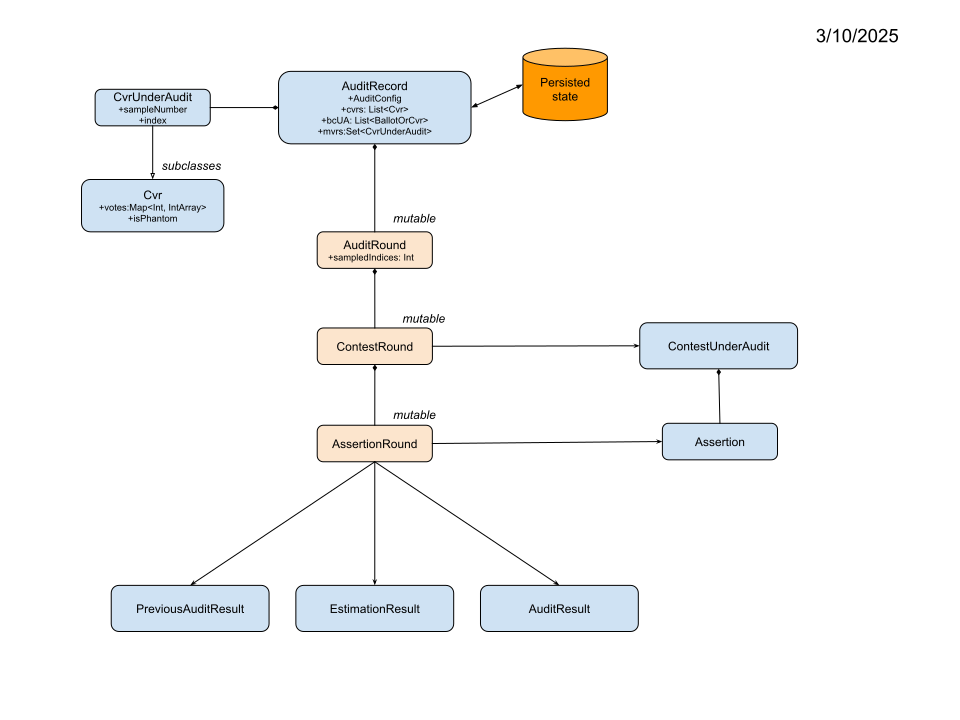

# Developer Notes
last changed: 03/10/2025

## TODO

1. Test SuperMajority
2. Test Approval
3. Figure out One Audit
4. Test no styles
5. undervotes when nwinners > 1

## Colorado

1. Read "Redacted and Aggregated" batches. How to sample ??
2. Find out where they are getting Nc. Are there Np ??
3. Can One Audit be used in Colorado?
4. Can just read the exported cvrs, or do we have to hook into Postgres?
