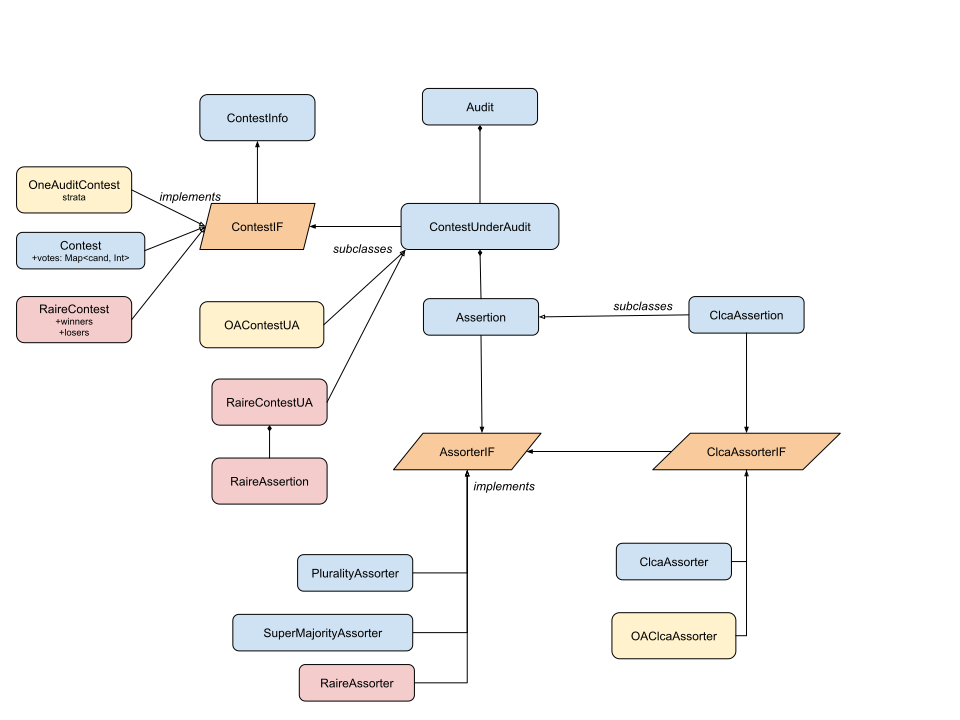

# Developer Notes

## Code Coverage

| date       | pct    | cover/total LOC |
|------------|--------|-----------------|
| 10/02/2025 | 82.9 % | 4476/5400       |
| 10/09/2025 | 90.3 % | 4834/5352       |
| 10/10/2025 | 92.1 % | 4903/5325       |
| 10/12/2025 | 84.8 % | 4553/5371       |
| 10/13/2025 | 88.7 % | 4734/5336       |
| 10/19/2025 | 91.7 % | 5028/5483       |
| 10/19/2025 | 91.1 % | 5019/5512       |
| 10/20/2025 | 91.3 % | 4961/5432       |
| 10/21/2025 | 91.4 % | 4837/5290       |

## Modules

* cases: code to create case study audits
* core: core library
* docs: documentation
* libs: local copy of raire-java library
* plots: code to generate plots for documentation
* rla: additional tests

## UML
last changed: 03/10/2025

