# Estimation

## Under/Over estimating error rates

Overestimating sample sizes uses more hand-counted MVRs than needed. Underestimating sample sizes forces more rounds than needed.
Over/under estimation is strongly influenced by over/under estimating error rates.

The following plots show approximate distributions of estimated and actual sample sizes, for margin=2% and errors in the MVRs generated with 2% fuzz.

When the estimated error rates are equal to the actual error rates:

<a href="https://johnlcaron.github.io/rlauxe/docs/plots2/dist/estErrorRatesEqual.html" rel="estErrorRatesEqual">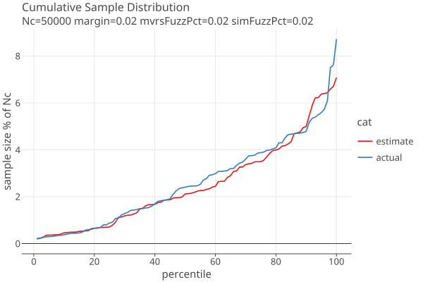</a>

When the estimated error rates are double the actual error rates:

<a href="https://johnlcaron.github.io/rlauxe/docs/plots2/dist//estErrorRatesDouble.html" rel="estErrorRatesDouble">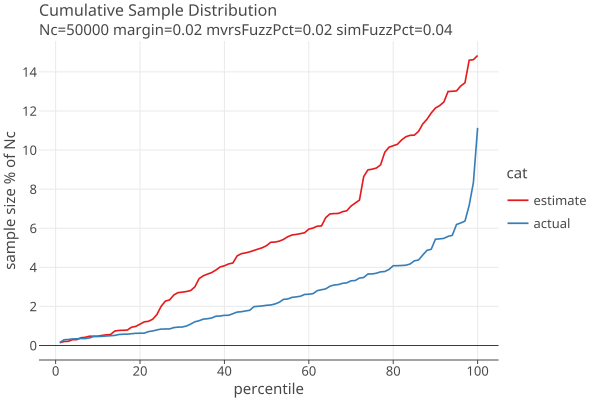</a>

When the estimated error rates are half the actual error rates:

<a href="https://johnlcaron.github.io/rlauxe/docs/plots2/dist/estErrorRatesHalf.html" rel="estErrorRatesHalf">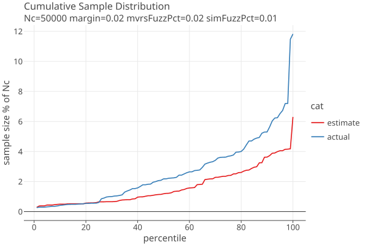</a>

These are generated without using rounds. When using rounds, surprisingly its better to start with an initial guess of
no simulated fuzzing, as these plots show:

Here are the average extra samples vs the average number of rounds for mvrs with 1/1000 fuzz:

  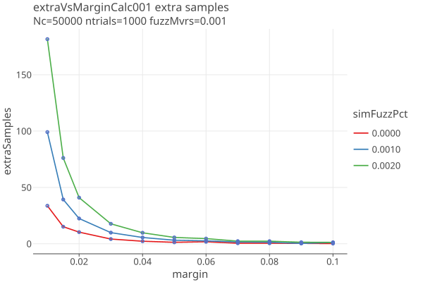
&nbsp; &nbsp; &nbsp; &nbsp; 
  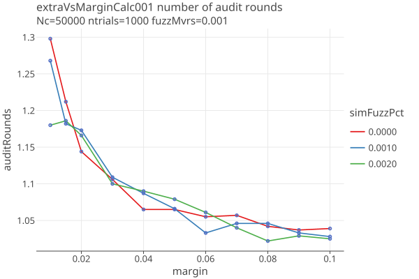

Here are the average extra samples vs the average number of rounds for mvrs with 2/1000 fuzz:

  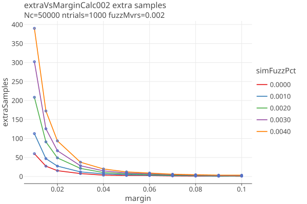
&nbsp; &nbsp; &nbsp; &nbsp; 
  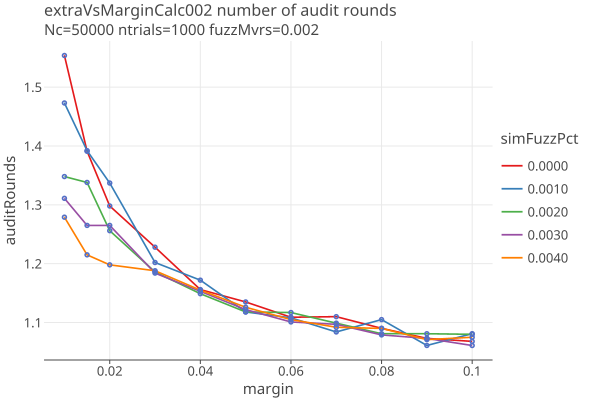

Here are the average extra samples vs the average number of rounds for mvrs with 3/1000 fuzz:

  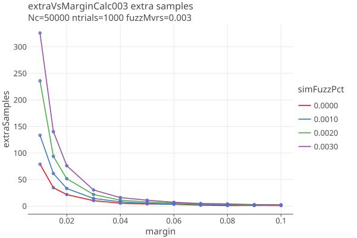
&nbsp; &nbsp; &nbsp; &nbsp; 
  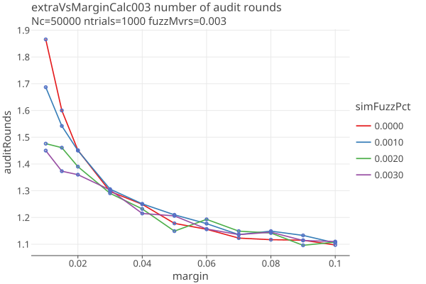

In all three cases, using 0% simulation has the lowest extra samples, better than using simFuzzPct that matches the true
fuzz (fuzzMvrs). Note that these are averages over 1000 trials. The reason 0% simulation has the lowest extra samples
is probably that with a large variance, one is better off underestimating the sample size on the first round,
and then on the second round using the measured error rates to estimate how many are left to do.

The trade off in using 0% simulation is that the average number of rounds goes up. (In the future, we could allow the
auitors to assign a cost to sampling n ballots and a cost to an audit round, and attempt to minimize the overall costs.)

Based on these findings, we have chosen to use the _optimistic strategy_: for round 1, we simualte the sample distribution assuming no errors.
For subsequent rounds, we use the measured error rates from the previous round. The user can control what percentile of
the distribution is used for the estimate foreach round. The default is to take the 50th percentile on round 1, and the 80th percentile on subsequent rounds.

The results of this strategy are shown here:

  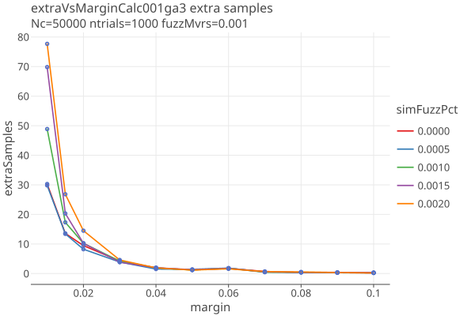
&nbsp; &nbsp; &nbsp; &nbsp; 
  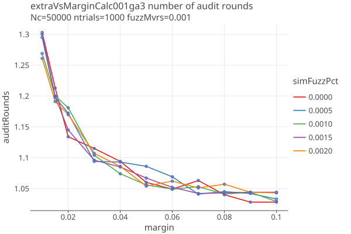

Here are the average extra samples vs the average number of rounds for mvrs with 2/1000 fuzz:

  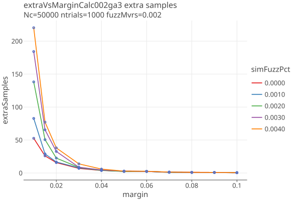
&nbsp; &nbsp; &nbsp; &nbsp; 
  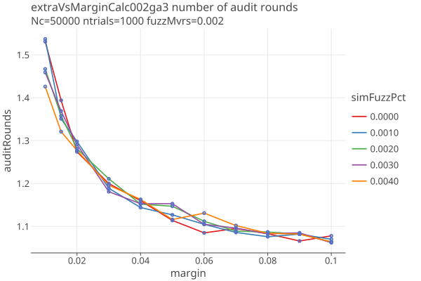

Here are the average extra samples vs the average number of rounds for mvrs with 3/1000 fuzz:

  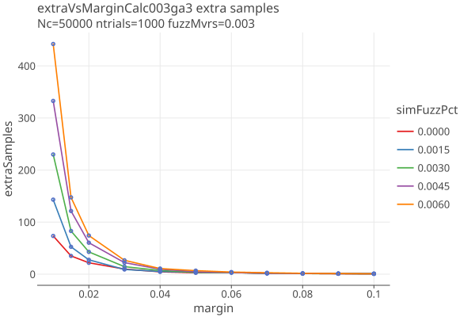
&nbsp; &nbsp; &nbsp; &nbsp; 
  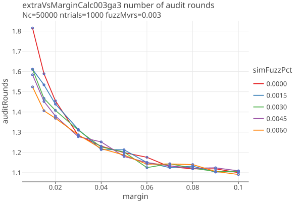

Here are interactive plots to zoom in on more detail:

* [interactive extra samples plots](https://johnlcaron.github.io/rlauxe/docs/plots2/extra2/extraSamples.html)
* [interactive number of rounds plots](https://johnlcaron.github.io/rlauxe/docs/plots2/extra2/numberOfRounds.html)