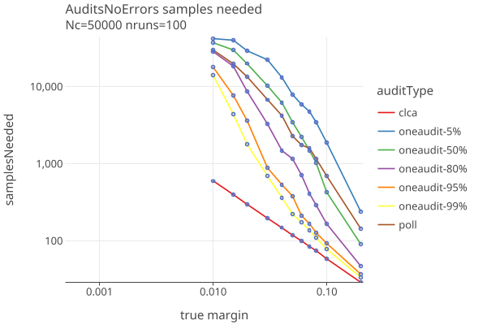

# OneAudit version 2 (overstatement net equivalent audit)
_last changed 04/07/2025_

When there is a CVR, use the standard CLCA assorter. When there is no CVR, compare the MVR with the "average CVR" of the batch.
This is "overstatement-net-equivalent" (aka ONE).

## Strategies

When there are no errors:

when there are errors:

## Compare Audit Types

Here are sample sizes for the three audit types: Polling, Comparison (CLCA) and OneAudit (with 5%, 50% and 95% of ballots having CVRs),
when there are no errors in the CVRs:

* OneAudit results are about twice as high as polling. More tuning is possible but wont change the O(margin) shape.
* OneAudit / Polling probably arent useable when margin < .02, whereas CLCA can be used for much smaller margins.
* Its surprising that theres not more difference between the OneAudit results with different percents having CVRs.

In order to deal with the possibility of errors, the above plots use the "default" ShrinkTrunc strategy, which is a conservative
bet about the true margin of the assorter values. To match better the values that Philip uses in his papers, we also experiment
with the "max99" strategy, of just always betting 99% of the maximum allowed value. This works well when there are no errors, as
the following plots show.

In these plots we only use OneAudit with 95% of ballots having CVRs, and compare the "max99" and "default" OneAudit strategies 
as well as polling and clca audits.

## Notes

* I dont think you can use IRV with OneAudit??
* Seems like you might have some contests that need OneAudit and some not. So you want to make that contest specific. Or
  just run seperaet audits for each type? Same with no styles ??
