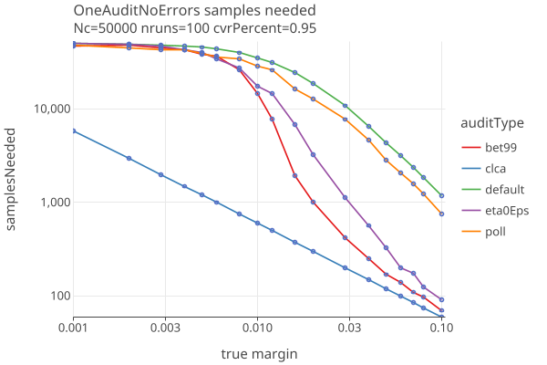
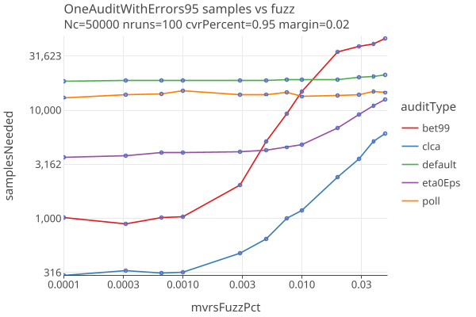
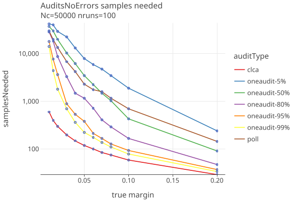
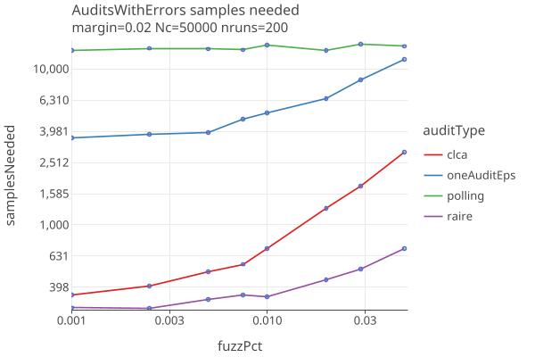
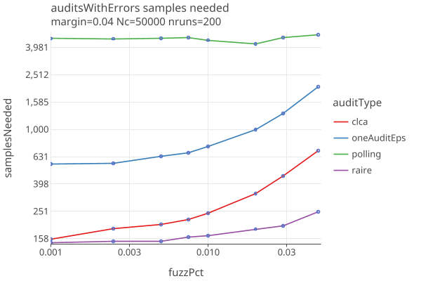

# OneAudit version 2 
_last changed 04/07/2025_

## Strategies

We try different betting "strategies":

* **default**: Set eta0 = reportedMean, use shrinkTrunk for betting strategy.
* **bet99**: Set eta0 = reportedMean, always bet 99% of the maximum allowed bet.
* **eta0Eps**: Set eta0 = upper*(1 - eps), use shrinkTrunk for betting strategy.

When there are no errors, comparing those 3 strategies along with polling and clca audits. The OneAudit has CVRs for 95% of its cards, and 
5% are in a single pool without CVRS, but with Card Style Data. As a function of margin:

* The bet99 strategy does the best among the oneaudit, when margin > .01.

When there are errors (parameterized by fuzzPct, the percent  of ballots randomly changed), for fixed margin of 2%. 
As a function of fuzzPct:

* The bet99 strategy does best when the fuzzPct is < .005 (5 in 1000 have a random error)
* The eta0Eps strategy does best when the fuzzPct is > .005.

## Compare Audit Types

We will use the eta0Eps strategy for oneaudit, and compare Polling, Comparison (CLCA) and OneAudit (with 5%, 50%, 80%, 95% and 99% of cards having CVRs).
When there are no errors in the CVRs, as a function of margin:

* OneAudit results are much better in version 2. When percent of ballots having CVRs is around 50%, OneAudit does about the same as Polling. 
  For higher cvrPervcent, it does correspondingly better.

When there are errors (again parameterized by fuzzPct, the percent of ballots randomly changed), for fixed margin of 2% and 4%:

* At these parameters, OneAudit is intermediate between Polling and CLCA.
* OneAudit results have similar sensitities to errors as CLCA.
* IRV audits (which are also CLCA audits) are less likely to have their outcomes altered due to random changes in the ballots.

## Notes

* I dont think you can use IRV with OneAudit??
* Seems like you might have some contests that need OneAudit and some not. So you want to make that contest specific. Or
  just run seperaet audits for each type? Same with no styles ??
