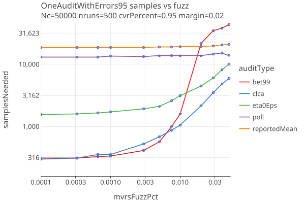

# OneAudit version 3 
_last changed 04/24/2025_

## Strategies

We try different betting "strategies":

* **default**: Set eta0 = reportedMean, use shrinkTrunk for betting strategy.
* **bet99**: Set eta0 = reportedMean, always bet 99% of the maximum allowed bet.
* **eta0Eps**: Set eta0 = upper*(1 - eps), use shrinkTrunk for betting strategy.

When there are no errors, comparing those 3 strategies along with polling and clca audits. The OneAudit has CVRs for 95% of its cards, and 
5% are in a single pool without CVRS, but with Card Style Data. As a function of margin:

* The bet99 strategy is indistinguishable from clca when there are no errors.

When there are errors (parameterized by fuzzPct, the percent  of ballots randomly changed), for fixed margin of 2%. 
As a function of fuzzPct:

* The bet99 strategy does best when the fuzzPct is < .005 (5 in 1000 have a random error), then degrades quickly.
* The eta0Eps strategy stays reletively flat, and does much better than bet99 when fuzzPct is > .01.

## Compare Audit Types

We will use the eta0Eps strategy for oneaudit, and compare Polling, Comparison (CLCA) and OneAudit (with 5%, 50%, 80%, 95% and 99% of cards having CVRs).

When there are no errors in the CVRs, as a function of margin:

* OneAudit results are much better in version 3. Surprisingly, it doesnt matter what the cvr percent is (all the lines are exactly on top of each other).

When there are errors (parameterized by fuzzPct, the percent of ballots randomly changed), for fixed margin of 2% and 4%:

* OneAudit results are much better in version 3. 
* It doesnt matter what the cvr percent is: the variation in the various oneaudit-cvrPercent is likely due to random 
  variation in when errors are encountered in the sequence.
* OneAudit results have similar sensitivities to errors as CLCA.
* IRV (Raire) audits are less likely to have their outcomes altered due to random changes in the ballots.
* Polling audit sample sizes are all but impervious to errors.

## Notes

* I dont think you can use IRV with OneAudit (?)
* Seems like you might have some contests that need OneAudit and some not. So you want to make that contest specific. Or
  just run separate audits for each type? Same with no styles ??
* TODO: try affine transformation as in ONEAUDIT eq 10.
