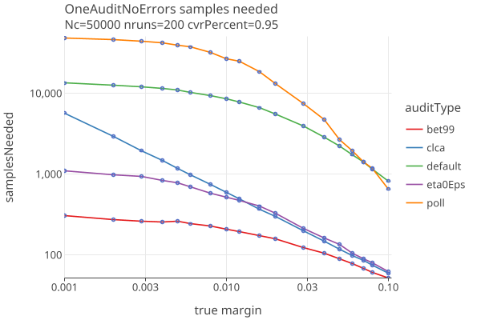
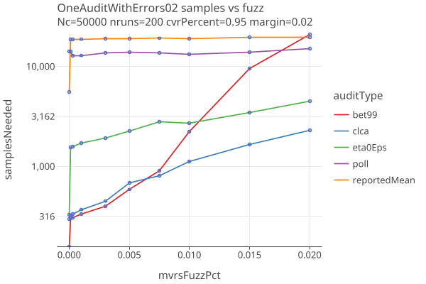
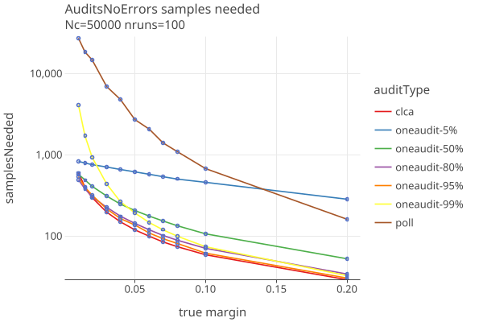
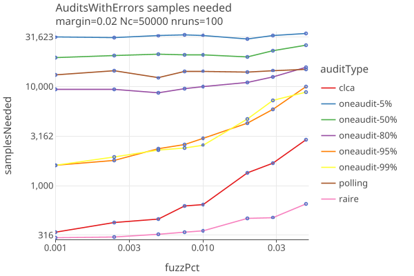
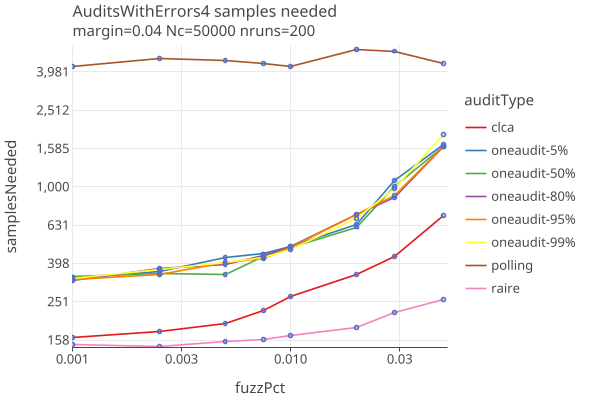

# OneAudit version 4 
_last changed 08/31/2025_

## Strategies

We try different betting "strategies":

* **bet99**: Set eta0 = reportedMean, always bet 99% of the maximum allowed bet.
* **eta0Eps**: Set eta0 = upper*(1 - eps), use shrinkTrunk for betting strategy.
* **optimalBet**: Use betting mart with kelly_optimal betting.

Here we compare these 3 strategies along with polling and clca audits, when there are no errors, as a function of margin. 
The OneAudit has CVRs for 95% of its cards, and 5% are in a single pool without CVRS, but with Card Style Data.

* Surprisingly, OneAudit (bet99 and eta0Eps) does better than CLCA when there are no errors, at low margins. This result needs to
  be investigated.

Here we compare the same audit types when there are errors, as a function of fuzzPct, for fixed margin of 2%:

* The bet99 strategy does best when the fuzzPct is < .01 (1 in 100 have a random error), then degrades quickly.
* The eta0Eps strategy stays reletively flat, and does much better than bet99 when fuzzPct is > .01.
* There is an interesting discontinuity going from 0.0 (no errors) to even a very small error (.0001 here). To be investigated.

## Compare Audit Types

We will use the eta0Eps strategy for OneAudit, and compare Polling, Comparison (CLCA) and OneAudit (with 5%, 50%, 80%, 95% and 99% of cards having CVRs).

When there are no errors in the CVRs, as a function of margin:

* OneAudit results are much better in version 3. 
* We dont see too much variation with the different cvr percentages. Its possible that the exact margins in the pool and non-pool
  ballots are more determitive than the cvr percentage.

When there are errors (parameterized by fuzzPct, the percent of ballots randomly changed), for fixed margin of 2% and 4%:

* OneAudit results are much better in version 3. 
* The spread among the OneAudit-cvrPercent audits follow the expectation that higher cvr percents look more like CLCA. 
* OneAudit results have similar sensitivities to errors as CLCA.
* IRV (Raire) audits are less likely to have their outcomes altered due to random changes in the ballots.
* Polling audit sample sizes are all but impervious to errors.

## Notes

* Need to explore how multiple pools and their margins effect results; cvr-percentage is possibly not the main determinate of sample size. 
* I dont think you can use IRV with OneAudit (?)
* Seems like you might have some contests that need OneAudit and some not. So you want to make that contest specific. Or
  just run separate audits for each type? Same with no styles ??
* TODO: test effects of affine transformation as in ONEAudit eq 10, for BLCA.
