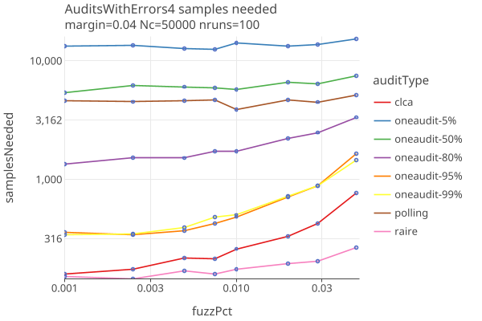

# OneAudit version 4 
_last changed 9/10/2025_

## Strategies

We try different betting "strategies":

* **bet99**: Set eta0 = reportedMean, always bet 99% of the maximum allowed bet.
* **eta0Eps**: Set eta0 = upper*(1 - eps), use shrinkTrunk for betting strategy.
* **optimalBet**: Use betting mart with kelly_optimal betting.

Here we compare these 3 strategies along with polling and clca audits, when there are no errors, as a function of margin. 
The OneAudit has CVRs for 95% of its cards, and 5% are in a single pool without CVRS, but with Card Style Data.

* The bet99 and optimalBet are mostly identical and do best when there are no errors.

Here we compare the same audit types when there are errors, at a fixed 4% margin, as a function of fuzzPct:

* The optimalBet strategy does better even than CLCL once the fuzzPct are bigger than .005.

## Compare Audit Types

We will use the optimalBet strategy for OneAudit, and compare Polling, Comparison (CLCA) and OneAudit (with 5%, 50%, 80%, 95% and 99% of cards having CVRs).

When there are no errors in the CVRs, as a function of margin:

* OneAudit looks ok as long as the % pooled data is not too high.

When there are errors (parameterized by fuzzPct, the percent of ballots randomly changed), for fixed margin of 2% and 4%:

* There is an interesting discontinuity going from 0.0 (no errors) to even a very small error (.001 here). To be investigated.
* The spread among the OneAudit-cvrPercent audits follow the expectation that higher cvr percents look more like CLCA. 
* OneAudit results have similar sensitivities to errors as CLCA.
* IRV (Raire) audits are less likely to have their outcomes altered due to random changes in the ballots.
* Polling audit sample sizes are all but impervious to errors.
