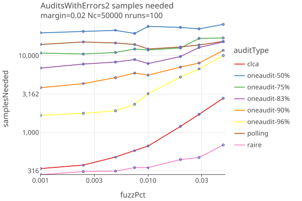

# OneAudit version 4 
_last changed 12/06/2025_

Earlier OneAudit results before we started using [Betting with OneAudit pools](https://github.com/JohnLCaron/rlauxe/blob/main/docs/BettingRiskFunctions.md#betting-with-oneaudit-pools)

## Strategies

We try different betting "strategies":

* **adaptive**: use AdaptiveBetting exactly like CLCA.
* **optimalBet**: Use betting mart with optimal_comparison betting from SHANGRLA.
* **bet99**: Set eta0 = reportedMean, always bet 99% of the maximum allowed bet.
* **eta0Eps**: Set eta0 = upper*(1 - eps), use shrinkTrunk for betting strategy.

Here we compare these 3 strategies along with polling and clca audits, when there are no errors, as a function of margin. 
The OneAudit has CVRs for 95% of its cards, and 5% are in a single pool without CVRS, but with a single Card Style.

* The bet99 and optimalBet are mostly identical and do best when there are no errors.

Here we compare the same audit types when there are errors, at a fixed 4% margin, as a function of fuzzPct:

* The optimalBet strategy does better even than CLCL once the fuzzPct are bigger than .005.

## Compare Audit Types

We will use the optimalBet strategy for OneAudit, and compare Polling, Comparison (CLCA) and OneAudit (with 50%, 75%, 83%, 90% and 96% of cards having CVRs).

When there are no errors in the CVRs, as a function of margin:

* OneAudit looks good as long as the % pooled data is not too high, and the margin is not too low.

When there are errors (parameterized by fuzzPct, the percent of ballots randomly changed), for fixed margin of 2% and 4%:

* The spread among the OneAudit-cvrPercent audits follow the expectation that higher cvr percents look more like CLCA. 
* OneAudit results have similar sensitivities to errors as CLCA.
* IRV (Raire) audits are less likely to have their outcomes altered due to random changes in the ballots.
* Polling audit sample sizes are all but impervious to errors.
* Boulder2024 has ~96% CVRS; SF2024 has ~86% CVRs.
