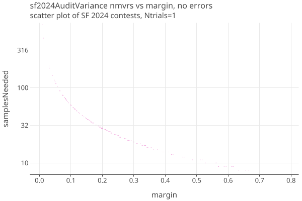
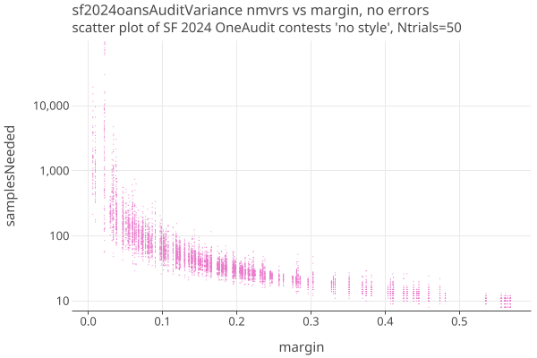
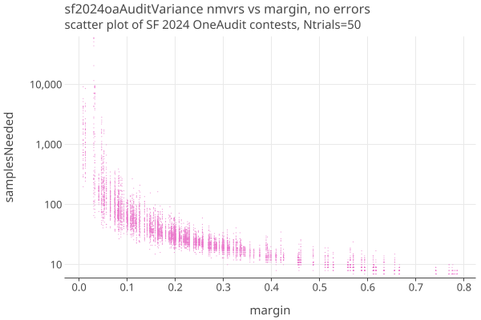
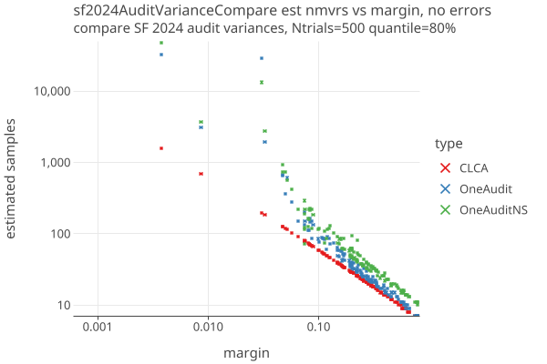
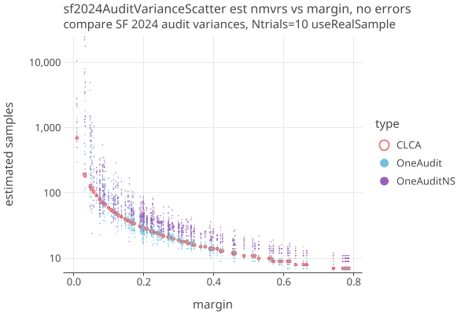
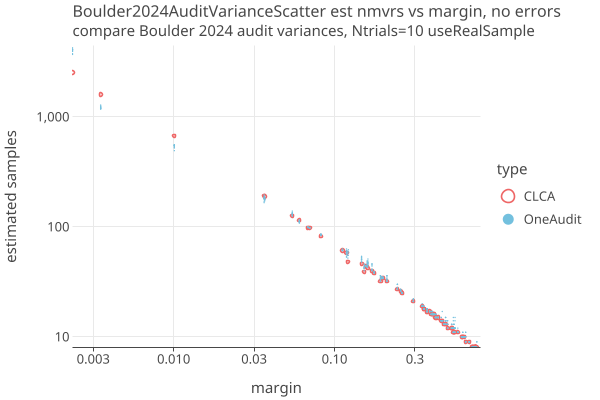

# OneAudit Use Cases
_last changed: 01/07/2026_

## SF2024: Comparison of CLCA and OneAudit, with and without styles

We compare CLCA, OneAudit with styles, and OneAudit without styles on the SanFrancisco 2024 General Election. In
reality we can only use OneAudit without styles, since the in-precinct CVRs are not associated with the physical ballots.
We can use these CVRs to calculate the average assort values of the pools, however.

For simulating a OneAudit with styles, we use the in-precinct CVRS as Card Style Data for each ballot, and pretend that we can
associate them with physical ballots. We dont use the in-precinct CVRS during the audit sampling.

For simulating a CLCA, we ignore the in-precinct vs mail-in distinction between the CVRS, and pretend that we can
associate all CVRs with physical ballots, and use all the CVRs during the audit sampling.

Here are the number of samples needed for each of the 164 assertions of all the contests of SF2024 for the CLCA simulation,
when all ballots have an associated CVR and there are no errors:

Here is the same election using OneAudit without styles.
About 86% of the ballots have CVRs, the rest are in the precinct pools.
We run the audit 50 times with different permutations of the actual ballots, and show a scatter plot of the results. The
variance is due to the random order of the pooled ballots; the 50 trials are spread out vertically, since they all have the same margin:

Here is the same election using OneAudit with styles:

* Its not immediately obvious but the margins of OneAudit without styles are shifted to lower values compared to OneAudit with styles.
* Other than the margin shift, the two versions of OneAudit look similar and do well for high margins, say > 10%.
* Due to the large variance introduced by the pooled data, comparing just the average of the samples needed is misleading at low margins.

Here are all three audit types on a single scatter plot, showing the 80% quantile of 500 trials of number of samples needed for each assertion of the SF 2024 General Election, when there are no errors:

* OneAuditNS (no card style data) plot uses the original margin (not the lowered margin), in order to compare it accurately to the other types.
* The CLCA is smooth because it has no variance when there are no errors, while OneAudit show scatter for the same margins.
* OneAudit needs about 3x, and OneAuditNS needs about 6x the samples at 5% margin, compared to a CLCA audit, for the 80% quantile, 
  and gets progressively worse as margins get lower.
* The actual values depend strongly on all the details of the use case, in particular the percent of pooled ballots, and the
  within-pool variance of the pooled data from the average pool assort value.

Using the 80% quantile for each contest overestimates the number of samples needed. This is especially true for
OneAudit, where there is so much variation in the sample size distribution even when there are no errors. We are now testing a new
strategy for OneAudit where we use the actual sample data to get the contest sample size (assuming no errors) for the first round.
On subsequent rounds, we use the measured error rates with the OptimalComparision betting strategy.

Because we use the actual sample size only for choosing the number of first round ballots to draw, and not for the betting
strategy or sampling algorithm, I believe that we are not violating the requirements of the "anytime P-value" property of the Betting martingales (TBD).

There is also increased efficiency when auditing many or all of the contests of an election at one time.
In order to get a sense of how well these audit types might work in real elections, we ran the SF 2024 General Election
10 times (with different PRN seeds each time) for both the OneAudit and OneAuditNS. We used the actual sample to get the
number of cards needed when there are no errors. This gives us a better sense of the absolute values and spread of
a real election.

Here are 1 CLCA and 10 trials each of OneAudit and OneAudit NoStyle for SF2024. The total number of MVRS sampled were:

| type       | avg   | trials                                                           | avg / CLCA  |
|------------|-------|------------------------------------------------------------------|-------------|
| CLCA       | 1592  | [1592]                                                           | 1.0         |
| OneAudit   | 5442  | [2726, 2889, 3035, 3706, 4162, 4649, 4695, 5782, 10856, 11926]   | 3.4         |
| OneAuditNS | 13409 | [3368, 4399, 7032, 7424, 7665, 7914, 13565, 25835, 26839, 30049] | 8.4         |

The spread among all the trials (click to get an interactive chart):

* Both versions of OneAudit do better than CLCA on a significant number of assertion trials; the spread goes below CLCA as well as above.
* With no errrors, the audit always finishes in one round.
* We removed two contests with the lowest margins: contest 14, a plurality contest with 4 winners (margin=0.0006 recount=0.0020),
  and contest 28, an IRV contest ( margin=0.0037 recount=0.0100). This probably models what would happen in a real election.
* The contest with the lowest margin still in the audit is contest 15 (margin=0.0086 recount=0.0302)
* The total mvrs used are dominated by the contest(s) with the lowest margin. By removing the close contests, we can greatly reduce
  the sampled mvrs. OTOH, its the close contests where RLAs are most needed.

## Boulder2024: OneAudit for Redacted data

The Boulder County, CO, 2024 general election publishes pools of "redacted ballots" with vote totals, but no CVRS.

* 396,681 cards 
* 12,297 redacted cards (3%) in 60 pools
* 65 contests (no IRV)
* Both the cvrs and the redacted pool totals reference a BallotType, which can be used for Card Style Data.
* The number of cards in each pool is not published, so we estimate it, and adjust contest Nc to be consistent.
  See [CaseStudies](CaseStudies.md) for details.
* There are 2 contests below the automatic recountMargin of .005, so we exclude them from the audit. The recount margin
  for Colorado is (winner - loser)/ winner, rather than margin = (winner - loser)/ Nc.
* Risk limit is 3% per Colorado law.

Here are 1 CLCA and 10 trials of OneAudit for Boulder2024. The total number of MVRS sampled were:

| type       | avg   | trials                                                         | avg / CLCA |
|------------|-------|----------------------------------------------------------------|------------|
| CLCA       | 4800  | [4800]                                                         | 1.0        |
| OneAudit   | 5857  | [5545, 5580, 5801, 5851, 5902, 5909, 5948, 5958, 6025, 6058]   | 1.22       |

The spread among all the trials (click to get an interactive chart):

* OneAudit suprisingly does better for the second and third lowest margins. TODO: investigate.
* Most of the difference in total samples (table above) probably comes from the lowest margin assertion.

Findings so far:

1. Boulder County must publish the number of ballots in each pool to do a real audit.
2. The redacted pools should always use a single BallotType, so we can sample with styles.
3. To do IRV with redacted ballots, VoteConsolidations for the redacted ballots would have to be provided.
4. OneAudit is comparable to CLCA at this low percent (3%) of pooled ballots.
