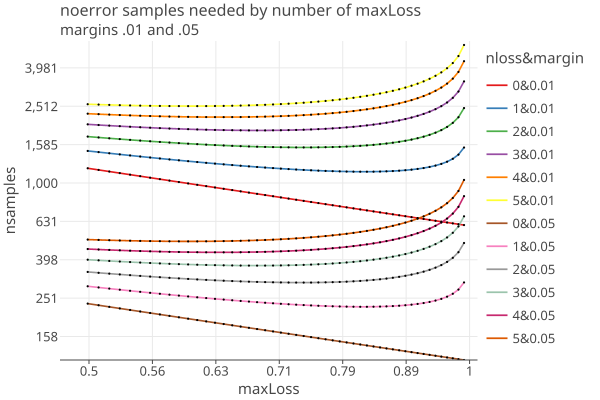

# Phantom ballots
2/10/26

When Nc > ncvrs, we add phantom cards to make up the difference, so nphantoms = Nc - ncvrs.

Assign assort_cvr = .5 to a phantom cvr. (this make the mean larger reletive to assigning 0).

A phantom cvr may have a valid ballot identifier, and only the scanned cvr is missing. (in this case it would be ideal to
locate the ballot and rescan if possible).

1. If the phantom cvr gets chosen for the audit, and the ballot cannot be located (the common case), then the mvr
   is assigned assort = 0, so overstatement = 1/2 - 0 = 1/2

        bassort = (1-o/u) * noerror 
        bassort = (1-1/2u)  phantom-phantom

2. If the phantom cvr gets chosen for the audit, and the ballot can be located, then we have an mvr that might have one of three    sort values [0, 1/2, u].
The overstatement would then be cvr_assort - mvr_assort = 1/2 - [0, 1/2, u] = [1/2, 0, 1/2-u], and the bassort value is

1-(1/2-u)/u
1-(1/2u - u/u)
1 - 1/2u + 1

    bassort = (1-o/u) * noerror 
            = 1 - [1/2, 0, 1/2-u]/u * noerror
            = [1-1/2u, 1,  2-1/2u] * noerror      for mvr = loser, oth, winner
            =    1-1/2u     phantom-loser 
            =    1          phantom-other 
            =    2-1/2u     phantom-winner 

3. If the cvr exists, but the mvr cannot be found, then it is a phantom, and mvr_assort = 0. (theres probably no way to predict this in advance). The cvr  might have one of three sort values [0, 1/2, u].
The overstatement would then be cvr_assort - mvr_assort = [0, 1/2, u], and the bassort value is

           bassort = (1-o/u) * noerror
           = 1 - [0, 1/2, u]/u * noerror
           = [1, 1/2u,  0] * noerror      for cvr = loser, oth, winner
           =    1       loser-phantom
           =    1-1/2u  other-phantom
           =    0       winner-phantom

double check our implementation with u !=1 :

       winner-loser tau= 0.0000 '      0' (win-los)
       winner-phantom tau= 0.0000 '      0' (win-los)   check
       winner-other tau= 0.2857 '   1/2u' (win-oth)
       other-loser tau= 0.7143 ' 1-1/2u' (oth-los)
       other-phantom tau= 0.7143 ' 1-1/2u' (oth-los)    check
       phantom-loser tau= 0.7143 ' 1-1/2u' (oth-los)    check
       phantom-phantom tau= 0.7143 ' 1-1/2u' (oth-los)  check   common case
       winner-winner tau= 1.0000 'noerror' (noerror)
       other-other tau= 1.0000 'noerror' (noerror)
       loser-loser tau= 1.0000 'noerror' (noerror)
       loser-phantom tau= 1.0000 'noerror' (noerror)    check
       phantom-other tau= 1.0000 'noerror' (noerror)    check
       loser-other tau= 1.2857 ' 1+1/2u' (oth-win)
       other-winner tau= 1.7143 ' 2-1/2u' (los-oth)
       phantom-winner tau= 1.7143 ' 2-1/2u' (los-oth)   check
       loser-winner tau= 2.0000 '      2' (los-win)

for u=1:

        cvr-mvr overstatement phantom-win = -0.5 bassort=1.5    check   (cvr is phantom, mvr found)
        cvr-mvr overstatement phantom-los = 0.5 bassort=0.5     check       "
        cvr-mvr overstatement phantom-oth = 0.0 bassort=1.0     check       "
        cvr-mvr overstatement win-phantom = 1.0 bassort=0.0     check   (cvr is not phantom, mvr not found)
        cvr-mvr overstatement los-phantom = 0.0 bassort=1.0     check       "
        cvr-mvr overstatement oth-phantom = 0.5 bassort=0.5     check       "
        cvr-mvr overstatement phantom-phantom = 0.5 bassort=0.5 check   common case

## Choosing MaxLoss

Using same logic as [Choosing MaxLoss](docs/BettingRiskFunctions.md#choosing-maxloss)

A phantom-phantom bassort is noerror/2. How many noerror samples are needed to offset an assort value of noerror/2 (p1o)?

The payoff for p1o = noerror/2 is 

    t_p1o = 1 + λc * (noerror/2 − 1/2)
    t_p1o = 1 + λc/2 * (noerror-1)

To compensate for one p1o sample, we need ncomp noerror samples, such that

    t_p1o^n_p1o = 1 / (1 - maxLoss)
    n_p1o = -ln(1 - maxLoss) / ln(1 + maxLoss * (noerror-1))

If there are no errors, then the number of noerror samples we need to reject the null hypothesis is

    t_noerror^n = 1 / alpha
    n = -ln(alpha) / ln(1 + maxLoss * noerror))

Ignoring other types of errors, the number of samples needed when there are k p1o errors are:

    ntotal = n + k * n_p1o
    ntotal = -ln(alpha) / ln(1 + maxLoss * noerror) + k * -ln(1 - maxLoss) / ln(1 + maxLoss * (noerror-1))
    ntotal = -(ln(alpha) + k * ln(1 - maxLoss)) / ln(1 + maxLoss * (noerror-1))

Here is a plot of ntotal for values of k (0..5) and two different margins v = .01 and .05, with upper = 1:

////////////////////////////////////////////////////////////////////////////////

Alternative

When Nc > ncvrs, we add phantom cards to make up the difference, no nphantoms = Nc - ncvrs.

By assigning the most pessimistic assort value = 0 to a phantom cvr, we make sure the audit is conservative.

A phantom cvr may have a valid ballot identifier, its just that the scanned cvr is missing. (in this case it woul be ideal to
locate the ballot and rescan id possible).

If the phantom cvr gets chosen for the audit, and the ballot can be located, then we have an mvr that might have one of three sort values [0, 1/2, u]
The overstatement would then be cvr_assort - mvr_assort = 0 - [0, 1/2, -u], and the bassort value is

    bassort = (1-o/u) * noerror 
            = 1 - [0, -1/2, -u]/u * noerror
            = [1, 1+1/2u, 2] * noerror      for mvr = loser, oth, winner
            =    noerror                phantom-loser 
            =    (1+1/2u) * noerror     phantom-other 
            =    2                      phantom-winner 

If the phantom cvr gets chosen for the audit, and the ballot cannot be located (probably the common case), then the mvr
is assigned assort = 0, so overstatement = 0 - 0 = 0

    bassort = (1-o/u) * noerror 
    bassort = noerror 

we get noerror because we have already made the worse case assumption by assigning cvr assort = 0, and no further adjustment is needed.

the only adjustment is if we find the ballot and it is not a vote for the loser, so we get credit for that, either
"los-oth/p1u" (1+1/2u * noerror) or "los-win/p2u" (2 * noerror).