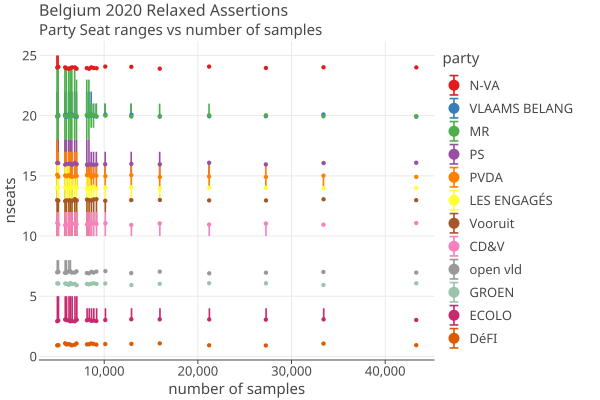

# Relaxed Assertions
10/3/2026

_(click on image to get interactive html graph)_

**Uniform Relaxation**. Across all contests (aka "Constituencies"), iteratively choose the assertion that has the most impact on the number of samples needed for the entire audit. Most-impact is calculated by finding the difference between an assertion's estimated MVRs (nmvrs) and the next highest assertion's nmvrs from the same contest. Once the largest-impact assertion is found, that contest's sample limit is set to the next highest assertion's nmvrs. Then all assertions for that contest with estimated nmvrs higher than the sample limit will fail. This algorithm does not try to minimimize the seat spread, does not try to control how many ballots any Constituenciy will need to sample, and has no bias about any party's results.

The plot shows, starting at the rightmost point which has no failing assertions, the effect of successively failing the next largest-impact assertion, as you move left across the plot. 

**Party Seat Ranges** are calculated from the latest draft of the paper [Ideas for bounding sample sizes for Belgian
RLAs](papers/DhondtRelaxedAssertions.1001.pdf). Each time another assertion is "failed", we run the complete _RelaxedAssertions_ algorithm to calculate bounds on all partys' winning seat count. 

The plot shows these as error bars, as well as the reported number of seats as points.