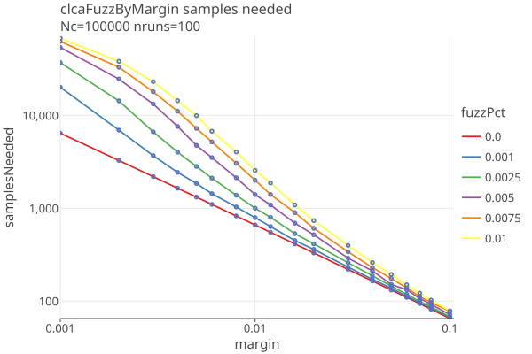
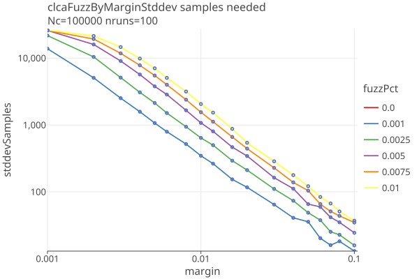
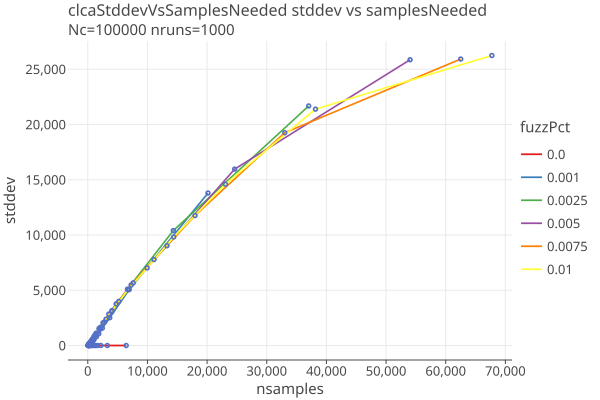
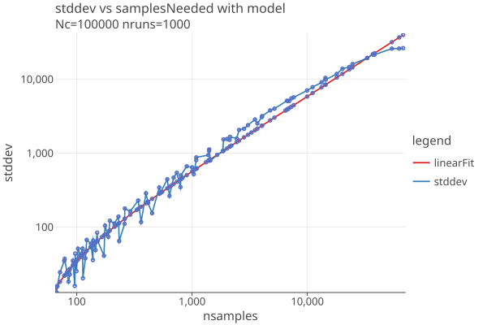

## Samples needed when there are errors

In the following simulations, errors are created between the CVRs and the MVRs, by taking _fuzzPct_ of the cards
and randomly changing the candidate that was voted for. When fuzzPct = 0.0, the CVRs and MVRs agree.
When fuzzPct = 0.01, 1% of the contest's votes were randomly changed, and so on.

### CLCA with errors

Here are the results of 1000 simulations of CLCA average samplesNeeded by margin for various values of fuzzPct:

The average samplesNeeded dont tell the whole picture. There is a distribution of samplesNeeded whose variance is roughly proportional
to the samplesNeeded; here is the standard deviation of those distributions with dependence on margin and fuzzPct:

A plot of standard deviation against samples needed shows an approximate linear relationship, approximately independent
of fuzzPct when nsamples < 30,000:

A straight line implies

    stddev = b + m * nsamples

where m is the slope of the line. We will take representative points (x0 = 68, y0 = 16) and (x1 = 37028, y1 = 21675)

    m = (y2 - y1) / (x2 - x1) 
      = (21675 - 16) / (37028 - 68) 
      = .586

    stddev = b + m * nsamples
    b = stddev - m * nsamples
    b = y0 - m * x0
    b = 16 - .586 * 68
    b = -23.85

so our approximate fit is:

    stddev = .586 * nsamples - 23.85

which we show on a log-log plot here:

These results are generated by our single round (no estimation phase) CLCA algorithm with maxRisk = .9, and would be different with other choices of algorithm parameters.

### Comparison of CLCA, Polling, and OneAudit

With the margin fixed at 2%, this plot compares polling and CLCA audits and their variance:

Here are just CLCA audits with margins of .01, .02, and .04, over a range of fuzz errors from 0 to 1%:

* Polling audit sample sizes are all but impervious to errors, because the sample variance dominates the errors.
* As margins get smaller, the variance in CLCA audits increases. At .001 fuzz (1 in 1000), an audit with a margin of 1% has an
  average sample size of 814, but the 1-sigma range goes from 472 to 1157.
* A rule of thumb might be that if you want to do CLCA audits down to 1% margin, your error rate must be less than 1/1000.

Here are similar results for OneAudits with fuzz in their CVRs:

We dont see that much change as the CLCA errors increase; the variance generated by the CLCA errors is small compared to the OneAudit variance from the pooled data.
