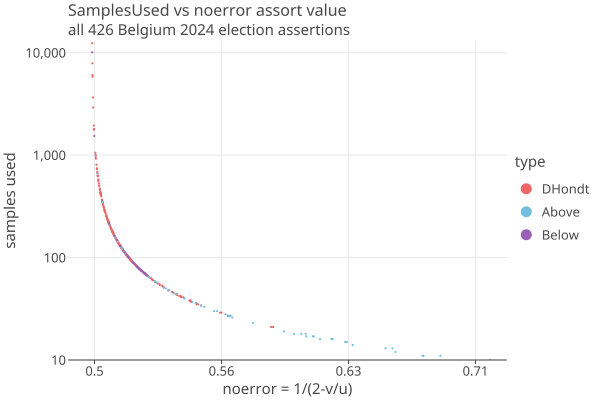

# Belgium election use case
02/19/2026

## 2024 Data

Downloaded the summary data in json from 
https://resultatselection.belgium.be/fr/search/chambre-des-repr%C3%A9sentants/2024/circonscription-%C3%A9lectorale

and placed in _cases/src/test/data/belgium2024_.

Olivier's python code is at https://git-crypto.elen.ucl.ac.be/opereira/rlabelgium

## Creating the election

1. Set testdataDir in _core/src/testFixtures/kotlin/org/cryptobiotic/rlauxe/TestUtils.kt_ to a convenient location on your local machine.

2. Using _cases/src/test/kotlin/org/cryptobiotic/rlauxe/util/TestGenerateAllUseCases.kt_, run _createAllBelgiumElections()_ to create all the elections.

3. The elections will be created under toptopdir = _$testdataDir/cases/belgium/2024/_.

View all results in rlauxe-viewer by pointing to $toptopDir, or an individual contest by pointing to _$toptopDir/$contestName/audit_.

### Details

- Each contest creates its own set of cvrs by creating one cvr for each vote in the election.
- It also creates mvrs from the cvrs for use in the audit. The default is to just copy the cvrs, so there are no errors.
- You can also generate the mvrs with some "fuzz" amount by changing line ~57 in CreateBelgiumClca

            clcaConfig = ClcaConfig(fuzzMvrs=0.0)

- Note that while we often use "percent fuzz", its actually the ratio of fuzz to the total ballots, so fuzzMvrs=.001 means .1 %. We are finding that close D'Hondt elections should be <= .001 fuzz. Really, we need to aim for no errors at all.

Also see [D'Hondt notes](https://github.com/JohnLCaron/rlauxe/blob/main/docs/Dhondt.md)

## Results from running Belgium elections with no errors

### Samples Needed across all assertions

In all 426 assertions in Belgium 2024 election, only 13 need more than 1000 samples:

<a href="https://johnlcaron.github.io/rlauxe/docs/plots2/cases/BelgiumResultsScatterLogLog.html" rel="BelgiumResultsScatter"></a>

Because upper varies for each assorter, noerror = 1/(2-margin/upper) is much better to plot against. Furthermore, when there are no
errors, samplesNeeded depends only on noerror: samplesNeeded = -ln(alpha) / ln(1 + maxBet * (noerror − 1/2)), which is why the plot is smooth.

### Results from createAllBelgiumElections()

````
                |                                minAssorter |  noerror |     mean |    upper |  nmvrs | minMvrs | pct %  |
         Anvers |                   DHondt w/l='CD&V'/'PVDA' | 0.500134 | 0.500267 | 1.000000 |  12383 |   11203 | 1.04 % |
      Bruxelles |                       DHondt w/l='PS'/'MR' | 0.500210 | 0.500472 | 1.125000 |   7870 |    7137 | 1.52 % |
    FlandreWest |                   DHondt w/l='PVDA'/'CD&V' | 0.501659 | 0.506614 | 2.000000 |   1005 |     904 | 0.12 % |
    FlandreEast |                DHondt w/l='Vooruit'/'CD&V' | 0.500455 | 0.500908 | 1.000000 |   3657 |    3296 | 0.35 % |
        Hainaut |                 BelowThreshold for 'ECOLO' | 0.500164 | 0.500173 | 0.526316 |  10083 |    9136 | 1.36 % |
          Liège |              DHondt w/l='LES ENGAGÉS'/'PS' | 0.500284 | 0.500663 | 1.166667 |   5826 |    5267 | 0.92 % |
       Limbourg |       DHondt w/l='Vooruit'/'VLAAMS BELANG' | 0.502437 | 0.507277 | 1.500000 |    684 |     616 | 0.12 % |
     Luxembourg |              DHondt w/l='LES ENGAGÉS'/'MR' | 0.503001 | 0.505966 | 1.000000 |    556 |     501 | 0.32 % |
          Namur |                      DHondt w/l='PTB'/'PS' | 0.505404 | 0.516037 | 1.500000 |    310 |     279 | 0.10 % |
 BrabantFlamant |          DHondt w/l='VLAAMS BELANG'/'N-VA' | 0.504228 | 0.511180 | 1.333333 |    396 |     356 | 0.06 % |
  BrabantWallon |              DHondt w/l='MR'/'LES ENGAGÉS' | 0.502644 | 0.504384 | 0.833333 |    631 |     568 | 0.25 % |
````

Notes:

* Hainaut fails when simFuzz = .001 because its margin is so small.
* To look at all the elections with rlauxe-viewer
    * run createAllBelgiumElections() which puts all elections under toptopdir = "$testdataDir/cases/belgium/2024"
    * open $toptopdir in rlauxe-viewer

### Results from createBelgiumElection("Anvers")

````
showBelgiumElection Anvers
DHondtContest 'Anvers' (1) DHONDT voteForN=1 votes={6=368877, 1=249826, 5=127973, 8=125894, 4=125257, 7=90370, 2=70890, 10=10341, 9=8639, 11=7221, 3=4213, 12=1686} undervotes=0, voteForN=1
   winners=[6, 1, 5, 8, 4, 7, 2] Nc=1191187 Nphantoms=0 Nu=0 sumVotes=1191187
   nseats=24 winners={6=8, 1=5, 5=3, 8=3, 4=2, 7=2, 2=1} belowMin=[3, 9, 10, 11, 12] threshold=0.05 minVotes=59560
   fw/fl=41964.7/41752.3 diff=212 (w-l)/w =0.00506 Npop=1191187 dilutedMargin=0.0535% reportedMargin=0.0535% recountMargin=0.5060% 


candidate          Round:           1 |           2 |           3 |           4 |           5 |           6 |           7 |           8 |           9 |
 1        VLAAMS BELANG :  249826 (2) |  124913 (7) |  83275 (11) |  62456 (17) |  49965 (20) |       41637 |       35689 |       31228 |       27758 |
 2             open vld :  70890 (13) |       35445 |       23630 |       17722 |       14178 |       11815 |       10127 |        8861 |        7876 |
 3          Volt Europa*:        4213 |        2106 |        1404 |        1053 |         842 |         702 |         601 |         526 |         468 |
 4                 PVDA :  125257 (6) |  62628 (16) |       41752 |       31314 |       25051 |       20876 |       17893 |       15657 |       13917 |
 5              Vooruit :  127973 (4) |  63986 (14) |  42657 (23) |       31993 |       25594 |       21328 |       18281 |       15996 |       14219 |
 6                 N-VA :  368877 (1) |  184438 (3) |  122959 (8) |   92219 (9) |  73775 (12) |  61479 (18) |  52696 (19) |  46109 (21) |       40986 |
 7                GROEN :  90370 (10) |  45185 (22) |       30123 |       22592 |       18074 |       15061 |       12910 |       11296 |       10041 |
 8                 CD&V :  125894 (5) |  62947 (15) |  41964 (24) |       31473 |       25178 |       20982 |       17984 |       15736 |       13988 |
 9               Voor U*:        8639 |        4319 |        2879 |        2159 |        1727 |        1439 |        1234 |        1079 |         959 |
10           DierAnimal*:       10341 |        5170 |        3447 |        2585 |        2068 |        1723 |        1477 |        1292 |        1149 |
11        Partij BLANCO*:        7221 |        3610 |        2407 |        1805 |        1444 |        1203 |        1031 |         902 |         802 |
12        BELG.UNIE-BUB*:        1686 |         843 |         562 |         421 |         337 |         281 |         240 |         210 |         187 |

* failed threshold

minAssorter: DHondt w/l='CD&V'/'PVDA': dilutedMean=50.0267% upperBound=1.0000
  fw/fl=41964.7/41752.3 diff=212 (w-l)/w =0.00506
````

### Show Anvers Contest in rlauxe-viewer

````

 |      field |                value | description                               |
 | ---------- | -------------------- | ----------------------------------------- |
 |      round |                    1 | index of audit round                      |
 |         id |                    1 | contest identifier                        |
 |       name |               Anvers | contest name                              |
 |       type |               DHONDT | contest type                              |
 |     margin | 5.347607050782965E-4 | diluted margin (smallest assertion)       |
 | estNewMvrs |                12383 | estimated new samples needed              |
 |    estMvrs |                12383 | estimated samples needed                  |
 |   mvrsUsed |                12383 | number of mvrs actually used during audit |
 |  mvrsExtra |                    0 | estimated - used                          |
 |    include |                 true | include the contest in this audit round   |
 |       done |                 true | contest has completed                     |
 |     status |              Success | status of contest completion              |


DHondtContest 'Anvers' (1) DHONDT voteForN=1 votes={6=368877, 1=249826, 5=127973, 8=125894, 4=125257, 7=90370, 2=70890, 10=10341, 9=8639, 11=7221, 3=4213, 12=1686} undervotes=0, voteForN=1
   winners=[6, 1, 5, 8, 4, 7, 2] Nc=1191187 Nphantoms=0 Nu=0 sumVotes=1191187
   nseats=24 winners={6=8, 1=5, 5=3, 8=3, 4=2, 7=2, 2=1} belowMin=[3, 9, 10, 11, 12] threshold=0.05 minVotes=59560
   fw/fl=41964.7/41752.3 diff=212 (w-l)/w =0.00506 Npop=1191187 dilutedMargin=0.0535% reportedMargin=0.0535% recountMargin=0.5060% 


candidate          Round:           1 |           2 |           3 |           4 |           5 |           6 |           7 |           8 |           9 |
 1        VLAAMS BELANG :  249826 (2) |  124913 (7) |  83275 (11) |  62456 (17) |  49965 (20) |       41637 |       35689 |       31228 |       27758 |
 2             open vld :  70890 (13) |       35445 |       23630 |       17722 |       14178 |       11815 |       10127 |        8861 |        7876 |
 3          Volt Europa*:        4213 |        2106 |        1404 |        1053 |         842 |         702 |         601 |         526 |         468 |
 4                 PVDA :  125257 (6) |  62628 (16) |       41752 |       31314 |       25051 |       20876 |       17893 |       15657 |       13917 |
 5              Vooruit :  127973 (4) |  63986 (14) |  42657 (23) |       31993 |       25594 |       21328 |       18281 |       15996 |       14219 |
 6                 N-VA :  368877 (1) |  184438 (3) |  122959 (8) |   92219 (9) |  73775 (12) |  61479 (18) |  52696 (19) |  46109 (21) |       40986 |
 7                GROEN :  90370 (10) |  45185 (22) |       30123 |       22592 |       18074 |       15061 |       12910 |       11296 |       10041 |
 8                 CD&V :  125894 (5) |  62947 (15) |  41964 (24) |       31473 |       25178 |       20982 |       17984 |       15736 |       13988 |
 9               Voor U*:        8639 |        4319 |        2879 |        2159 |        1727 |        1439 |        1234 |        1079 |         959 |
10           DierAnimal*:       10341 |        5170 |        3447 |        2585 |        2068 |        1723 |        1477 |        1292 |        1149 |
11        Partij BLANCO*:        7221 |        3610 |        2407 |        1805 |        1444 |        1203 |        1031 |         902 |         802 |
12        BELG.UNIE-BUB*:        1686 |         843 |         562 |         421 |         337 |         281 |         240 |         210 |         187 |

* failed threshold
````

