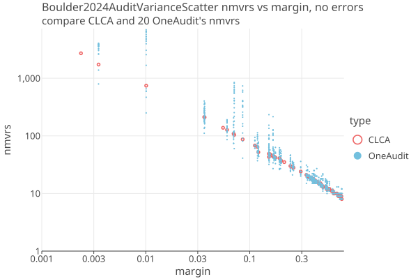
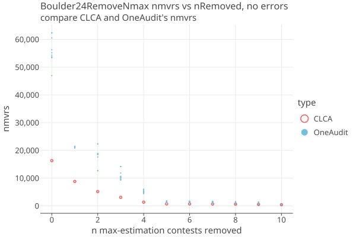

# Boulder County, CO, 2024 general election
03/01/2026

* 396,681 cards
* 65 contests (no IRV), 3 contests were uncontested
* 12,297 redacted cards (3%) in 60 pools. 
* Risk limit is 3% per Colorado law.
* Two contests fall below the _automatic recount threshold_ of 0.5%, and so are removed from the audit.
* Both the CVRs and the redacted pool totals reference a BallotType, which we use for Card Style Data.
* For pooled data, we simulate CVRs that match the adjusted pool totals.
* The simulated MVRs are the CVRs with optional fuzzing. 

## OneAudit for Redacted data

Some of the CVRs were redacted to protect voter anonymity. The redacted ballots were grouped 
(apparently) by BallotType and just the pool subtotals were published.
These _redacted ballot pools_ are a good fit for using OneAudit. 
Unfortunately, the total number of cards in each pool is (apparently) not published, so we have to estimate it,
and adjust the contest Nc to be consistent. See below for details.

We are interested in comparing the CLCA audit which has full CVRs against the OneAudit which has the redacted ballots
in OneAudit pools.

Here we show 10 OneAudit's (with different PRN seeds each time), and compare it to the CLCA audits.
In all cases there are no errors (but some of the contests have a small number of phantoms). 
Over 62 contests there are ? assertions, each with a different margin. Here is the spread of the OneAudits reletive to
the CLCA, for each of the ? assertions:

<a href="https://johnlcaron.github.io/rlauxe/docs/plots2/cases/Boulder2024AuditVarianceScatterLogLog.html" rel="Boulder2024AuditVarianceScatter"></a>

* This is the simulated number of mvrs needed, including the extra samples needed from estimating each round.
* The audit risk limit is 3%, per Colorado law.
* Each run has a different PRN seed, to make sure we are seeing independent variations.
* CLCA is smooth because it has no variance when there are no errors, while OneAudit shows scatter at the same margins.

The total mvrs needed are dominated by the assertions with the lowest margin. 
Here we explore how CLCA and OneAudit differ when n contests with the largest estimated nmvrs are removed from the audit:

<a href="https://johnlcaron.github.io/rlauxe/docs/plots2/cases/Boulder24RemoveNmaxLinear.html" rel="Boulder24RemoveNmax"></a>

In practice, even for CLCA, contests with very small margins and/or that require a large percentage of the ballots for that contest
are likely to be removed. For Boulder2024, the top 2 contests are under the Colorado automatic recount margin of .005, and
would go to a full hand count immediately. So its only after the first 2 contests are removed that the results become interesting.

With OneAudit, the other two contests in the top 4 require more than 85% of the available ballots, and would also probably just go to a hand count.
The top 3 or 4 contests always fail and are removed from the audit, which is why the number of successful contests for OneAudit (OA nsuccess)
are less than the number of successful CLCA contests.

The takeaway is that by the time you remove these 4 contests, OneAudit needs about 2x more nmvrs than CLCA for Boulder24.
This is a much better result than for [SanFrancisco](SF2024.md), and is due to the lower percentage of ballots in pools (3% vs 13%), and
also because the Boulder pools have a single Ballot Style, and so the margin is not diluted.

| n   | nsuccess | OA nsuccess | CLCA est | OA est avg | ratio | One Audit Spread                                                       | 
|-----|----------|-------------|----------|------------|-------|------------------------------------------------------------------------|
| 0   | 62       | 58.8        | 16292    | 53706      | 3.3   | [46930, 53432, 53553, 53706, 54285, 55184, 56259, 60528, 62340, 62341] |
| 1   | 61       | 58.3        | 8804     | 21121      | 2.4   | [20885, 20901, 20965, 21079, 21097, 21185, 21352, 21412, 21453, 21454] |
| 2   | 60       | 58.2        | 5147     | 17093      | 3.3   | [12662, 12719, 17608, 18511, 18557, 18745, 18810, 18832, 22338, 22339] |
| 3   | 59       | 58.4        | 3070     | 10517      | 3.4   | [9297, 9558, 9721, 10184, 10307, 10496, 10646, 11862, 14157, 14158]    |
| 4   | 58       | 57.6        | 1343     | 5011       | 3.7   | [4419, 4717, 4892, 4964, 5018, 5025, 5377, 5453, 5938, 5939]           |
| 5   | 57       | 57.0        | 708      | 1386       | 2.0   | [1123, 1230, 1253, 1374, 1449, 1539, 1551, 1663, 1776, 1777]           |
| 6   | 56       | 56.0        | 706      | 1346       | 1.9   | [1102, 1230, 1242, 1360, 1439, 1484, 1485, 1568, 1672, 1673]           |
| 7   | 55       | 55.0        | 665      | 1283       | 1.9   | [958, 1139, 1226, 1361, 1382, 1442, 1448, 1472, 1627, 1628]            |
| 8   | 54       | 54.0        | 625      | 1008       | 1.6   | [667, 681, 709, 849, 1060, 1262, 1359, 1401, 1476, 1477]               |
| 9   | 53       | 53.0        | 516      | 753        | 1.5   | [539, 544, 587, 605, 607, 648, 987, 1099, 1368, 1369]                  |
| 10  | 52       | 52.0        | 415      | 481        | 1.2   | [442, 457, 460, 475, 485, 490, 501, 511, 541, 542]                     |

````
where 
   n = remove top n estimated-nmvrs contests
   nsuccess = number of contests successfully audited by CLCA
   OA nsuccess = average number of contests successfully audited by OneAudit
   CLCA est = estimated nmvrs needed by CLCA
   OA est avg = average estimated nmvrs needed by OneAudit
   ratio = OA est avg / CLCA est
   One Audit Spread = spread of estimated nmvrs needed by OneAudit
````

Findings so far:

1. Boulder County must publish the number of ballots in each pool to do a real audit.
2. The redacted pools should always use a single BallotType, so we can sample "with style".
3. To do IRV with redacted ballots, VoteConsolidations for the redacted ballots would have to be provided.
4. Sample size are greatly reduced after removing contests with very small margins or that require a large percentage of the ballots.
5. OneAudit needs ~2x more nmvrs than CLCA after removing the top 4 contests from the audit.

## Downloaded files

The following files have already been downloaded into cases/src/test/data/Boulder2024 and converted to csv files by reading into 
Libre Office and exporting to csv:

From: https://bouldercounty.gov/elections/results/

    https://assets.bouldercounty.gov/wp-content/uploads/2024/11/2024G-Boulder-County-Official-Statement-of-Votes.xlsx
    https://assets.bouldercounty.gov/wp-content/uploads/2025/01/2024-Boulder-County-General-Redacted-Cast-Vote-Record.xlsx
    
    https://assets.bouldercounty.gov/wp-content/uploads/2024/12/2024G-Boulder-County-Amended-Statement-of-Votes.xlsx
    https://assets.bouldercounty.gov/wp-content/uploads/2025/01/2024-Boulder-County-General-Recount-Redacted-Cast-Vote-Record.xlsx

## Generating the election

Using _cases/src/test/kotlin/org/cryptobiotic/rlauxe/util/TestGenerateAllUseCases.kt_:

* run createBoulder24oa() to create a OneAudit elction in  _$testdataDir/cases/boulder24/oa/audit_
* run createBoulder24clca() to create a CLCA elction in  _$testdataDir/cases/boulder24/clca/audit_

### Boulder election notes:

The XXX_Cast-Vote-Record.xlsx files may be a standard "export to excel" function from Dominion.
These are read by readDominionCvrExportCsv().
(the CvrExport_xxxxx.json files seem to be no longer available on the website) 

The XXX_Statement-of-Votes.xlsx files may be in a bespoke format specific to Boulder County. Each election Ive looked at is slightly different. These
are read by readBoulderStatementOfVotes(), which uses the filename to choose the variation.

````
DominionCvrExportCsv
CvrNumber, TabulatorNum, BatchId, RecordId, ImprintedId, CountingGroup, BallotType,
CastVoteRecord(cvrNumber: Int, tabulatorNum: Int, batchId: String, recordId: Int, imprintedId: String, ballotType: String)
cvrs have ballotType == cardStyle. So does redacted group, which mostly agree.

BoulderStatementOfVotes has
(2023R) "Precinct Code","Precinct Number","Active Voters","Contest Title","Candidate Name","Total Ballots","Round 1 Votes","Round 2 Votes","TotalVotes","TotalBlanks","TotalOvervotes","TotalExhausted"
(2023) "Precinct Code","Precinct Number","Active Voters","Contest Title","Choice Name","Total Ballots","Total Votes","Total Undervotes","Total Overvotes"
(2024) "Precinct Code","Precinct Number","Contest Title","Choice Name","Active Voters","Total Ballots","Total Votes","Total Undervotes","Total Overvotes"
````

## Boulder2024 characteristics

* Both the cvrs and the redacted pool totals reference a BallotType, which can be used as the Card Style Data.
* We are not given the count of ballots or undervotes in the redacted pools.
* The StatementOfVotes gives us enough information to calculate Nc.
* We estimate the undervotes and pool counts as explained below, and adjust the contest Nc to be consistest with the card manifest.

**createBoulder24oa()** creates a OneAudit by assuming that each pool has a single CardStyle, which allows us to
use style based sampling. This constrains the way that undervotes are added to the pools. We need to know the number of cards in each batch. We dont,
so we approximate it, and adjust Nc.

**createBoulder24clca():** creates a CLCA by simulating cvrs in each pool and adding to the regular cvrs.
This allows us to characterize how OneAudit and CLCA compare.

Its not possible to run an IRV audit with redacted CVRs. There are lines called "RCV Redacted & Randomly Sorted", but they dont make much sense so far. To do IRV with OneAudit you need to create a VoteConsolidator for each pool from the real cvrs.

### Calculating the redacted undervotes and pool counts

We have two source of information: **sovo** is Boulder's StatementOfVotes, and DominionCvrExportCsv contain the CVRs and
the redacted pool counts.

* For most contests, phantoms = 0 = sovoContest.totalBallots - ((sovoContest.totalVotes + sovoContest.totalUnderVotes) / info.voteForN + sovoContest.totalOverVotes)
* We can calculate missing undervotes = sovoContest.totalUnderVotes + sovoContest.totalOverVotes * info.voteForN - cvr.undervotes.
* We assume missing undervotes are in the redacted pools.
* We assume all ballots in each pool contain the same set of contests, called the Ballot Style. In that case, we just need to
  estimate the number of cards for each pool, that gives the correct number of undervotes.
* We create the Ballot Manifest with the published CVRS, and entries for each card in the pools, which contain CSD and pool ids,
  but no vote information.

Some of these assumptions may not be right, but they are sufficient for our purposes. In a real audit, we would work with the EA to track each down.
We would advocate that the number of cards in each pool be published.

### Corrections to StatementOfVotes

On contest 20, sovo.totalVotes and sovo.totalBallots is wrong vs the cvrs. (only one where voteForN=3, but may not be related)

````
'Town of Superior - Trustee' (20) candidates=[0, 1, 2, 3, 4, 5, 6] choiceFunction=PLURALITY nwinners=3 voteForN=3
contestTitle, precinctCount, activeVoters, totalBallots, totalVotes, totalUnderVotes, totalOverVotes
sovoContest=Town of Superior - Trustee, 7, 9628, 8254, 16417, 8246, 33
cvrTabulation={0=3121, 1=3332, 2=3421, 3=2097, 4=805, 5=657, 6=3137} nvotes=16570 ncards=7865 undervotes=7025 overvotes=0 novote=1484 underPct= 29%
redTabulation={0=130, 1=87, 2=111, 3=50, 4=25, 5=36, 6=101} nvotes=540 ncards=180 undervotes=0 overvotes=0 novote=0 underPct= 0%
  sovoCards= 8254 = (sovoContest.totalVotes + sovoContest.totalUnderVotes) / info.voteForN + sovoContest.totalOverVotes
  phantoms= 0  = sovoContest.totalBallots - sovoCards
  sovoUndervotes= 8345 = sovoContest.totalUnderVotes + sovoContest.totalOverVotes * info.voteForN
  cvrUndervotes= 7025
  redUndervotes= 1320  = sovoUndervotes - cvr.undervotes
  redVotes= 540 = redacted.votes.map { it.value }.sum()
  redNcards= 620 = (redVotes + redUndervotes) / info.voteForN
  totalCards= 8485 = redNcards + cvr.ncards
  diff= -231 = sovoContest.totalBallots - totalCards
````
Assume sovo.totalBallots is wrong, so Nc = max(totalCards, sovoContest.totalBallots)

### Corrections to Redacted Ballots

We assume all ballots in each pool contain the same set of contests, called the Ballot Style. Seems true except for
RedactedGroup '06, 33, & 36-A'. We can compare the BallotStyle for CV RS vs the redacted group:

````
RedactedGroup=[0, 1, 2, 3, 5, 10, 11, 12, 13, 14, 15, 21, 22, 23, 24, 25, 26, 27, 28, 29, 30, 31, 32, 33, 34, 35, 36, 37, 38, 39, 40, 41, 42]
         CVRS=[0, 1, 2, 3, 5, 10, 11, 13, 14, 15, 21, 22, 23, 24, 25, 26, 27, 28, 29, 30, 31, 32, 33, 34, 35, 36, 37, 38, 39, 40, 41, 42]
````

Note that contest 12 is in RedactedGroup but not CVRs. Its value in the RedactedGroup is zero, so we assume that it is a mistake to be there.
This matters for the undervote count of that contest.


