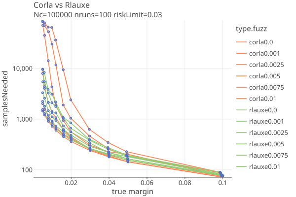

# Colorado Statewide Election 2024
03/05/2026

* 3,241,120 ballot cast (Colorado 2024 General Election) in 3199 precincts.
* 260 contests, no IRV.
* CO doesnt publically publish the CVRs, just precinct totals, see _2024GeneralPrecinctLevelResults.csv/zip/xlsx_.
* CORLA does an RLA, so they do have access to the CVRs. A "publically verifiable" RLA requires the CVRs to be publically verifiable. But we can still do the RLA as long as they are "privately available".

We use the precinct totals to simulate CVRs, and use those to estimate how Rlauxe would preform in a real audit.

# Comparing CORLA and Rlauxe

The Colorado RLA software uses a "Conservative approximation of the Kaplan-Markov P-value" for its risk measuring function
[from "Gentle Introduction" and "Super Simple" papers](../notes/notes.txt). It makes use of measured error rates as they are sampled.

We have a Kotlin port of the CORLA Java code in order to compare performance with our CLCA algorithm. Its possible
that our port does not accurately reflect the actual CORLA code.

The following plots compare our Corla implementation against the Rlauxe algorithm [see BettingRiskFunctions](docs/BettingRiskFunctions.md).
These are "ballot-at-a-time" plots, so we dont limit the number of samples, or use the estimation rounds.

<a href="https://johnlcaron.github.io/rlauxe/docs/plots2/cases/compareCorlaAndRlauxeLogLinear.html" rel="compareCorlaAndRlauxeLogLinear"></a>

* CORLA is impressively good in the absence of errors.
* It does progressively worse as the error rate increases and the margin decreases.

If you arbitrarily set the maximum sample size to 10,000, Rlauxe can audit down to .5% margin and 1% fuzz rates. 
CORLA can audit down to .5% margin at .25% fuzz rates. If you are confident in keeping errors low, CORLA is quite good.
Note that phantom ballots contribute to error rates (see [effects of phantoms on samples needed](../ClcaErrors.md#phantom-ballots))
and also must be kept low for Corla to be effective. Also see [Corla Notes](../notes/CorlaNotes.md).

## Downloaded files

Detail XLS (295 contests, 92k zipped, 2.6M unzipped )
has a separate sheet for every contest with vote count, by county
https://results.enr.clarityelections.com//CO//122598/355977/reports/detailxls.zip
can also get it as an XML (56k zipped, 780k unzipped ):
https://results.enr.clarityelections.com//CO//122598/355977/reports/detailxml.zip

        val detailXmlFile = "src/test/data/corla/2024election/detail.xml"

PrecinctLevelResults are apparently no longer available, or were moved.
We got them from:
https://www.sos.state.co.us/pubs/elections/resultsData.html
https://www.sos.state.co.us/pubs/elections/Results/2024/2024GeneralPrecinctLevelResults.xlsx
convert to cvs and zip to corla/src/test/data/2024election/2024GeneralPrecinctLevelResults.zip

looks like:

County	Precinct	Contest	Choice	Party	Total Votes
ADAMS	4215601243	Presidential Electors	Kamala D. Harris / Tim Walz	DEM	224
ADAMS	4215601244	Presidential Electors	Kamala D. Harris / Tim Walz	DEM	237
ADAMS	4215601245	Presidential Electors	Kamala D. Harris / Tim Walz	DEM	64

        val precinctFile = "src/test/data/corla/2024election/2024GeneralPrecinctLevelResults.xlsx"

This file is also no longer available, and Im looking for where they were originally downloaded from:

        val contestRoundFile = "src/test/data/corla/2024audit/round1/contest.csv"

We use it to make the contests.

## Generating the election

Using _cases/src/test/kotlin/org/cryptobiotic/rlauxe/util/TestGenerateAllUseCases.kt_:

* run createColoradoOneAudit() to create a OneAudit election in  _$testdataDir/cases/corla/oa/audit_
* run createColoradoClca() to create a CLCA elction in  _$testdataDir/cases/corla/clca/audit_

### Corla election notes:

* The _detail.xls_ file has summary by contest broken out by county, in a multipage excel file. _detail.xml_ has same info in xml file
* The _round1/contest.csv_ file has a summary of each round; we use these fields from it to make the contest:
````
  contest_name
  winners_allowed
  ballot_card_count
  contest_ballot_card_count
  winners
  min_margin
  risk_limit
  optimistic_samples_to_audit
  estimated_samples_to_audit
````

Note that this gives us the number of samples estimated for each audit round, from the CORLA "super simple" algorithm. We can compare these estimates with the CORLA software's estimates (estimates can be seen in Rlauxe Viewer _AuditRoundsTable_).

There are 725 contests listed on round1/contest.csv. There are 295 listed in detail.xml. I was told they dont have precinct data (or CVRs?) for contests \>= 260. So we restrict our attention to those 260 contests.

The file corla/2024audit/_targetedContests.xlsx_ shows contests selected for audit, eg:

````
  "County","Contest","Vote For","Lowest Winner","Highest Loser","Contest Margin","Diluted Margin","Risk Limit","Estimated # of CVRs to audit","# of CVRs","Remarks",,,,,,,,,,,,,,,,
  "Colorado","Presidential Electors",1,"1,374,175","1,084,812","289,363",8.15%,3%,89,"2,554,611","Audited in all 64 counties",,,,,,,,,,,,,,,,1
````

However this doesnt agree with detail.xml, eg:
````
      Choice(key=1, text='Kamala D. Harris / Tim Walz', party='DEM', totalVotes=1728159, voteTypes=[VoteType(name='Total Votes', votes=1728159
      Choice(key=2, text='Donald J. Trump / JD Vance', party='REP', totalVotes=1377441, voteTypes=[VoteType(name='Total Votes', votes=1377441
````
Not sure why its different, but it looks like targetedContests.xlsx is wrong.

detail.xml does not have the total number of ballots for a contest, so we get that from ContestRound.contest_ballot_card_count eg:

````
contest_name,audit_reason,random_audit_status,winners_allowed,ballot_card_count,contest_ballot_card_count,winners,min_margin,risk_limit,audited_sample_count,two_vote_over_count,one_vote_over_count,one_vote_under_count,two_vote_under_count,disagreement_count,other_count,gamma,overstatements,optimistic_samples_to_audit,estimated_samples_to_audit
Presidential Electors,state_wide_contest,in_progress,1,4746866,3239722,"""Kamala D. Harris / Tim Walz""",350348,0.03000000,0,0,0,0,0,0,0,1.03905000,0,99,99
````
Not exactly consistent, eg 1728159 - 1377441 = 350718 != 350348, but close enough for now (we can only do a simulation since we dont have the real CVRs).

### simulated CVRs for CLCA audit

We use the published precinct level results to create simulated CVRs and run simulated RLAs. Note that we need CVRs to do IRV contests, so we cant handle
IRV contests.

**createColoradoClca()** assumes we can match the CVRs to physical ballots and does a regular CLCA.
This allows us to compare the cost of OneAudit vs CLCA.

### simulated OneAudit

Not currently done. TODO: choose a few rural counties that might be doing hand counts; put them into OneAudit pools, probably by county. 
See how the sample sizes compare to CLCA.

### Next Steps

From "Next Steps for the Colorado Risk-Limiting Audit (CORLA) Program" (Mark Lindeman, Neal McBurnett, Kellie Ottoboni, Philip B. Stark. March 5, 2018):

    It is estimated that by June, 2018, 98.2% of active Colorado voters will be in CVR counties.

    First, the current version (1.1.0) of RLATool needs to be modified to recognize and group together contests that 
    cross jurisdictional boundaries; currently, it treats every contest as if it were entirely contained in a single county. 
    Margins and risk limits apply to entire contests, not to the portion of a contest included in a county. 
    RLATool also does not allow the user to select the sample size, nor does it directly allow an unstratified 
    random sample to be drawn across counties. 

    Second, to audit a contest that includes voters in “legacy” counties (counties with voting systems that cannot 
    export cast vote records) and voters in counties with newer systems, new statistical methods are needed to keep the 
    efficiency of ballot-level comparison audits that the newer systems afford. 

    Third, auditing contests that appear only on a subset of ballots can be made much more efficient if the sample can 
    be drawn from just those ballots that contain the contest. While allowing samples to be restricted to ballots 
    reported to contain a particular contest is not essential in the short run, it will be necessary eventually to 
    make it feasible to audit smaller contests.

Also see [Corla Notes](../notes/CorlaNotes.md).
