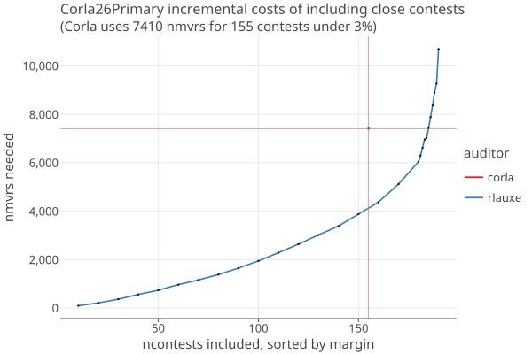
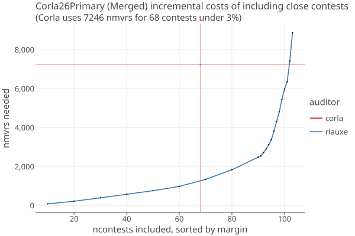
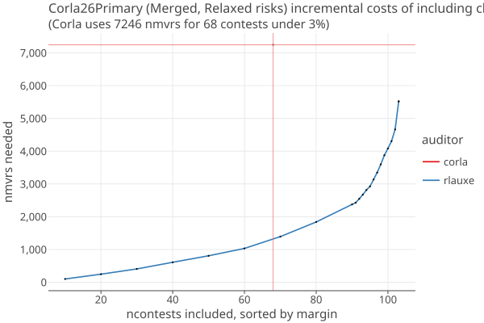

# 2026 Colorado Statewide primary election

_last updated 08/25/2026_

* 1,444,041 cards cast in 63 Counties.
* 707 contests, no IRV.
    * 1 contest is below min cards (City of Durango Ballot Issue 2A) 
    * 516 contests are uncontested
    * 190 auditable contests
* Corla targeted 113 contests, sampled 7410 mvrs, with 3% risk limit. 
  See [risk-estimation-for-uniform-sampling](CorlaCounty2024.md#risk-estimation-for-uniform-sampling) for how we
  estimate opportunistic risk for uniform sampling.

Corla artificially carves up targeted statewide contests by (some) counties. We have ignored this in order to compare apples to apples.
Further work should unwind this to see what an actual audit using rlauxe would look like.

## Results

The following are the actual Corla and simulated Rlauxe audits for different scenarios of which contests are selected for the rlauxe audit.

### Targeted contests only

* rlauxe nmvrs = 4648
* corla nmvrs = 7410
* contests under maxRisk (rlauxe) = 142 / 190 = 74%
* contests under maxRisk (corla) = 155 / 190 = 81%

|               | rlauxe  |   corla  |
|---------------|---------|----------|
| under maxRisk |   142   |    155   |
| under      5% |   144   |    155   |
| under     10% |   145   |    159   |
| under     20% |   150   |    166   |
| under     30% |   154   |    168   |

### Targeted contests plus important contests

* rlauxe nmvrs = 6964
* corla nmvrs = 7410
* contests under maxRisk (rlauxe) = 168 / 190 = 88%
* contests under maxRisk (corla) = 155 / 190 = 81%

|               | rlauxe  |   corla  |
|---------------|---------|----------|
| under maxRisk |   168   |    155   |
| under      5% |   169   |    155   |
| under     10% |   170   |    159   |
| under     20% |   173   |    166   |
| under     30% |   176   |    168   |

### All contests 

* rlauxe nmvrs = 10691
* corla nmvrs = 7410
* contests under maxRisk (rlauxe) = 183 / 190 = 96%
* contests under maxRisk (corla) = 155 / 190 = 81%

|               | rlauxe  |   corla  |
|---------------|---------|----------|
| under maxRisk |   183   |    155   |
| under      5% |   183   |    155   |
| under     10% |   183   |    159   |
| under     20% |   183   |    166   |
| under     30% |   183   |    168   |

### All contests with relaxed risk levels

* rlauxe nmvrs = 7615
* corla nmvrs = 7410
* contests under maxRisk (rlauxe) = 183 / 190 = 96%
* contests under maxRisk (corla) = 155 / 190 = 81%

|               | rlauxe  |   corla  |
|---------------|---------|----------|
| under maxRisk |   183   |    155   |
| under      5% |   170   |    155   |
| under     10% |   173   |    159   |
| under     20% |   183   |    166   |
| under     30% |   183   |    168   |


### Incremental Costs of including close contests 

<a href="https://johnlcaron.github.io/rlauxe/docs/cases/Corla24Dist/Corla26Marginal.Linear.html" rel="TargetOnly"></a>

* The contests are sorted by descending margin 
* The contests are added to the audit 10 at a time, until the last 10.
* The steep rise at the end shows how the close contests sharply increase the samples needed.
* Corla has a single point shown in red.
* Not showing the average or variance here, just one example audit with simulated cvrs.


# Merged 2026 Colorado Statewide primary election

Corla artificially carves up targeted statewide contests by (some) counties. 
To see how a real Rlauxe audit would look, we merged these "forced county" contests together.

* 1,444,041 cards cast in 63 Counties.
* 620 contests, no IRV.
  * 1 contest is below min cards (City of Durango Ballot Issue 2A)
  * 516 contests are uncontested
  * 103 auditable contests

## Results

The following are simulated Rlauxe audits for different scenarios of which contests are selected for the rlauxe audit.

### All contests

*  rlauxe nmvrs = 8914
*  corla nmvrs = 7246
*  contests under maxRisk (rlauxe) = 103 / 103 = 100%
*  contests under maxRisk (corla) = 60 / 103 = 58%

|               | rlauxe  |   corla  |
|---------------|---------|----------|
| under maxRisk |   103   |     60   |
| under      5% |   103   |     60   |
| under     10% |   103   |     64   |
| under     20% |   103   |     71   |
| under     30% |   103   |     73   |

### All contests with relaxed risk levels

* rlauxe nmvrs = 5520
* corla nmvrs = 7246
* contests under maxRisk (rlauxe) = 103 / 103 = 100%
* contests under maxRisk (corla) = 60 / 103 = 58%

|               | rlauxe  |   corla  |
|---------------|---------|----------|
| under maxRisk |   103   |     60   |
| under      5% |    91   |     60   |
| under     10% |    94   |     64   |
| under     20% |   103   |     71   |
| under     30% |   103   |     73   |


### Incremental Costs of including close contests

<a href="https://johnlcaron.github.io/rlauxe/docs/cases/Corla26/Corla26Merged.Linear.html" rel="Corla26Merged"></a>

* The contests are sorted by descending margin
* The contests are added to the audit 10 at a time, until the last 13.
* The steep rise at the end shows how the close contests sharply increase the samples needed.
* Corla has a single point shown in red.
* Not showing the average or variance here, just one example audit with simulated cvrs.

The same when using "relaxed risk limits"

````
    if (contest estimated mvrs >= 250) max risk = 20 %
    else if (contest estimated mvrs >= 150) max risk = 10 %
    else if (contest estimated mvrs >= 50) max risk = 5 %
    else max risk = auditRiskLimit (typically 3 %)
````

<a href="https://johnlcaron.github.io/rlauxe/docs/cases/Corla26/Corla26MergedRelaxed.Linear.html" rel="Corla26MergedRelaxed"></a>

# Merged 2026 primary election with 3 Counties' CVRs

* "La Plata", "Morgan","Weld"
* Successfully read in the CVRS with a few hiccups:
    * candidate name "Paul Noel Fiorino" has 2 variants that had to be corrected
    * La Plata had contest "Secretary of State - LBR" misnamed as "Secretary of State" 
* missing values of Nc(contest); currently not able to run an accurate audit.


# Limits of Colorado data

1. Need CVRs to conduct publically verifiable elections.
2. Need Ballot Styles (or CVRs) to conduct a CLCA.
3. County subtotal data does not include count of number of cards or undervotes by contest. If we had that, we could at least make accurate simulations.
4. Need to know ncards in the Aggregated data; then can put them into a OneAudit pool.

##### SOS BEAC 8/14/26 notes

voted   register
 582793 2071995   ind 72/28% dem/rep
 486525 1007781   dem
 371183  909608   rep
1444308 4488997 total

24K in person 1.7%

RLA modernization group
STV Longmont ballot initiative 2029
