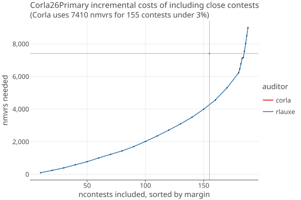

# 2026 Colorado Statewide primary election

_last updated 08/17/2026_

* 1,606,913 cards cast in 63 Counties.
* 707 contests, no IRV.
    * 2 contests are below min margin (Las Animas County Commissioner District 3 - DEM, Jackson County Sheriff - REP) 
    * 1 contest is below min cards (City of Durango Ballot Issue 2A) 
    * 516 contests are uncontested
    * 188 auditable contests
* Corla targeted 113 contests, sampled 7410 mvrs, with 3% risk limit. 
  See [risk-estimation-for-uniform-sampling](CorlaCountyAudits.md#risk-estimation-for-uniform-sampling) for how we
  estimate opportumistic risk for uniform sampling.

Corla artificially carves up targeted statewide contests by (some) counties. We have ignored this in order to compare apples to apples.
Further work should unwind this to see what an actual audit using rlauxe would look like.

## Results

The following actual Corla and simuilated Rlauxe audits for different scenarios of which contests are selected for the rlauxe audit.

### Targeted contests only

rlauxe nmvrs = 4713
corla nmvrs = 7410
contests under maxRisk (rlauxe) = 144 / 188 = 76%
contests under maxRisk (corla) = 155 / 188 = 82%

|               | rlauxe  |   corla  |
|---------------|---------|----------|
| under maxRisk |   144   |    155   |
| under      5% |   145   |    155   |
| under     10% |   146   |    159   |
| under     20% |   150   |    166   |
| under     30% |   156   |    168   |

### Targeted contests plus important contests

rlauxe nmvrs = 7113
corla nmvrs = 7410
contests under maxRisk (rlauxe) = 175 / 188 = 93%
contests under maxRisk (corla) = 155 / 188 = 82%

|               | rlauxe  |   corla  |
|---------------|---------|----------|
| under maxRisk |   175   |    155   |
| under      5% |   176   |    155   |
| under     10% |   177   |    159   |
| under     20% |   181   |    166   |
| under     30% |   182   |    168   |

### All contests 

rlauxe nmvrs = 8989
corla nmvrs = 7410
contests under maxRisk (rlauxe) = 188 / 188 = 100%
contests under maxRisk (corla) = 155 / 188 = 82%

|               | rlauxe  |   corla  |
|---------------|---------|----------|
| under maxRisk |   188   |    155   |
| under      5% |   188   |    155   |
| under     10% |   188   |    159   |
| under     20% |   188   |    166   |
| under     30% |   188   |    168   |

### All contests with relaxed risk levels

rlauxe nmvrs = 6702
corla nmvrs = 7410
contests under maxRisk (rlauxe) = 188 / 188 = 100%
contests under maxRisk (corla) = 155 / 188 = 82%

|               | rlauxe  |   corla  |
|---------------|---------|----------|
| under maxRisk |   188   |    155   |
| under      5% |   177   |    155   |
| under     10% |   180   |    159   |
| under     20% |   188   |    166   |
| under     30% |   188   |    168   |

### Incremental Costs of including close contests 

* The contests are sorted by descending margin 
* The contests are added to the audit 10 at a time, until the last 8.
* The steep rise at the end shows how the close contests sharply increase the samples needed.
* Corla has a single point shown in red.
* Not showing the average or variance here, just one example audit with simulated cvrs.
