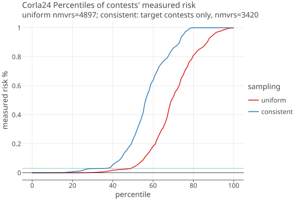
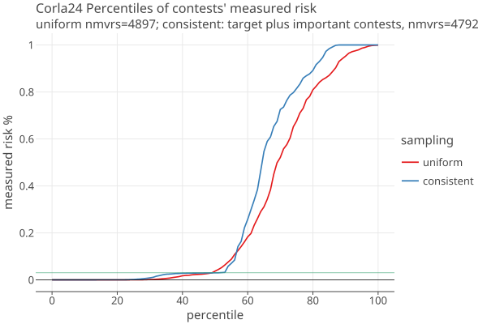
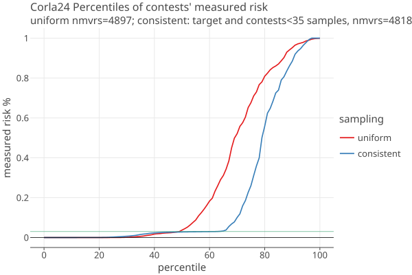
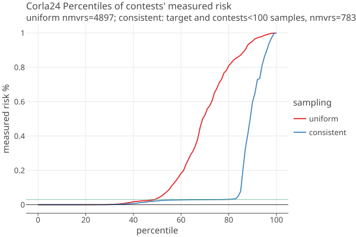
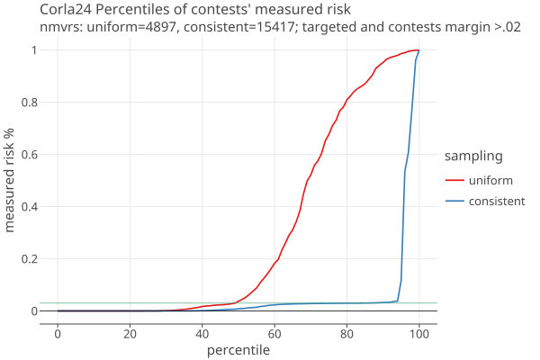
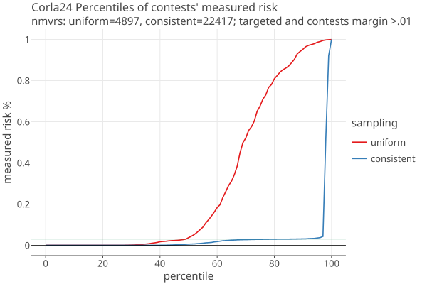
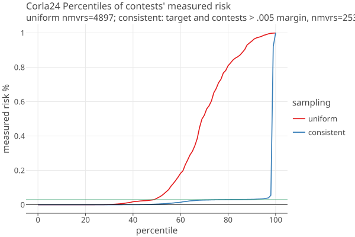
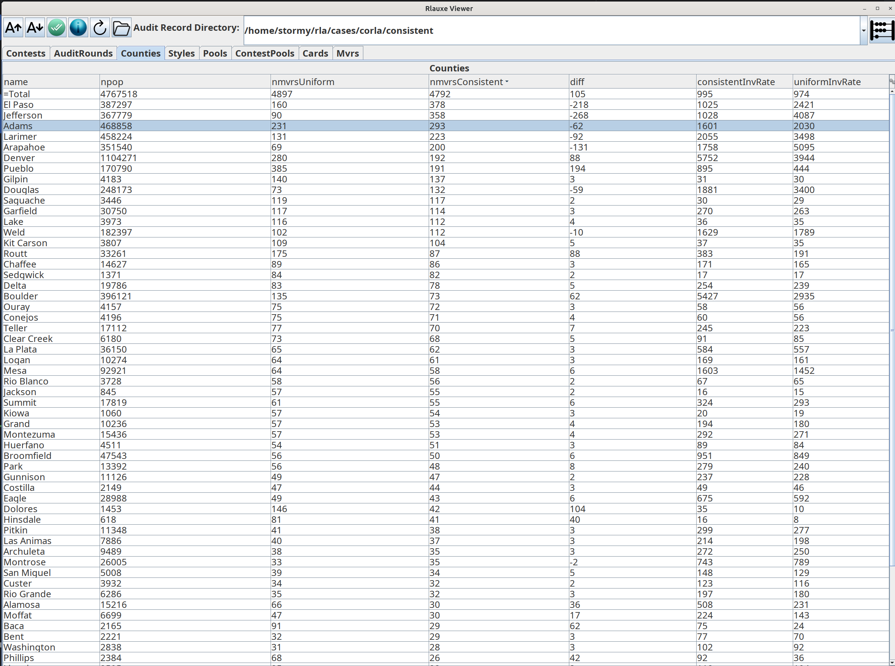

# Colorado Statewide election by Counties 2024

_last updated 06/02/2026_

* 4,767,518 cards cast (Colorado 2024 General Election) in 63 Counties.
* 723 contests, no IRV.
* No CVRs, just subtotals by County.
* 4897 sampled MVRS and corresponding CVRS are available.
* risk limit =  3%

## Colorado-RLA (Corla) uniform sampling

The Colorado RLA software uses a "Conservative approximation of the Kaplan-Markov P-value" 
from the ["Gentle Introduction" and "Super Simple" papers](../notes/notes.txt) for its risk measuring function and to estimate the number 
of samples needed for each contest in order to achieve the risk limit.

Corla chooses a _targeted_ contest in each county to audit, and estimates the number of samples needed (aka _estNmvrs_) when doing
uniform (not consistent) sampling. It uniformly samples estNmvrs cards (aka _sheets_) across all the cards in the county.

Independently, it chooses two statewide contests to audit, calculates estNmvrs, and uniformly samples across all the cards in the state.

### Risk estimation for uniform sampling

Because the sampling is uniform for both county and state, provisionally we think that we can combine both county and state
samples together. We also think that we can estimate the risk from these samples for all contests, not just the targeted ones,
aka _opportunistic auditing_.

We group the combined samples by county, based on which county the card was cast in. When a contest lies within a single county, the RLA is straightforwad, using the _fully diluted margin_:

    dilutedMargin = (margin in votes) / (total cards in the county)

When a contest lies within multiple counties, provisionally we think the following algorithm can be used: For each county
that the contest is in, calculate the county sample rate as

    countySampleRate = (number of samples in the county) / (total cards in the county)

Then we find the minimum countySampleRate over all counties. Conceptually, for each county we randomly choose and discard 
extra samples, until all counties have the same sample rate. Now sum the number of remaining samples over all counties, and 
sum the total cards over all counties. This is the _audit statum_ for that contest. (Note that the countySample rates are 
independent of the contest, but the set of counties used depends on each contest). The contest diluted margin is

    dilutedMargin = (margin in votes over all counties with the contest) / 
                    (total cards in all counties with the contest)

Given the contest dilutedMargin and the number of samples in the contest's stratum, we can calculate the estimated risk from the betting martingale as:

    gamma = 1.03905
    bet = 2/gamma    // aka the "maximum bet"
    upper = 1 for plurality assorter

    noerror = 1.0 / (2.0 - margin/upper)
    payoff = 1.0 + bet * (noerror - 0.5)

    risk = 1 / payoff ^ nsamples

or from the Kaplan-Markov formula:

    payoff = 1.0 - margin/(2*gamma)
    risk = 1 / payoff ^ nsamples

Notes:

* I think Kaplan-Markov is the Taylor series approximation of the betting mart. The approximation is quite good and gets better as the margin gets smaller.
* The betting mart is taken from the ALPHA paper, equation 10.
* See Audit.pValueApproximation() for Corla's risk calculation. This is called from _ReportRows.genSumResultsReport()_ which calls
  _ComparisionAudit.riskMeasurement()_. The inputs are read from the database, so not able to see what values they are using.
  TODO: get copy of ReportRows.genSumResultsReport() output if possible.

## Rlauxe simulated consistent sampling for CORLA24

We want to compare how the current uniform sampling risk measurement compares with using consistent sampling and _Card-style data_ (CSD) as
described in the "More style, less work" paper.

We dont have CVRS available so we have to simulate them from the county vote subtotals, taken from _tabulateCounty.csv_.
Unfortunately, these subtotals do not include undervotes or number of cards for each contest. So we estimate those as 
best we can, and hope that in the future we can work with the real CVRS, or at least county vote subtotals that include undervotes.

The accuracy of the simulation depends on knowing what contests appear together on what cards. If we had CSD for each card in the 
county manifests, we could do a very accurate simulation even without the actual CVRs. To proceed, we examined the 5000 sampled MVRS, and 
created a list of _CardStyles_ (i.e. the list of contests on the card) found there. 

There were still quite a few small contests that did not appear on any of the
MVRs, and we just assumed that in each county, there was a single card style for all these ophan contests. (This is surely wrong and needs to be revisited).
For each county, we then adjusted the number of counts of each CardStyle until the total vote counts were approximately equal to the known county subtotals 
(this also needs to be revisited and made better).

Given these simulated CVRS, we ran the standard Rlauxe consistent sampling algorithm. The diluted margins in this case 
are substantially better than in the uniform sampling "no-CSD" case:

    dilutedMargin = (margin in votes) / (total cards that contain the contest)

Furthermore, the consistent sampling is over the entire set of cards in all counties, and we dont have to worry about 
contests that span multiple counties.

The downside is that there is less "opportunistic sampling" in consistent sampling than for uniform samping. In consistent sampling,
each contest has a canonical sequence of cards that must be used, in order to eliminate possible sampling bias.
So opportunistic contests (ones not expicityle included in the audit) can only use samples until the canonical sequence 
is broken because a card in its sequene is not included in the sample. This differs from uniform sampling where all mvrs
in the strata count in the risk measurement, even when they dont include the contest (per private conversation with Phillip Stark).

## Results

Screenshot of the Viewer Tool used for running "what if" scenarios:

The following are plots of the distribution of all contests' measured risk. The uniform sampling is the actual 2024 audit. The consistent sampling 
is our simulation, for different scenarios of which contests are selected to audit.

### Targeted contests only

Here, the contests selected for auditing are only the targeted contests:

* The green line is the 3% risk limit.
* The percentile is the percent of contests with measured risk smaller than the y value of the plot.
* Consistent sampling has about 40% of the contests under the risk limit of 3%; uniform sampling close to 50%.
  This is still much greater than the percent of targeted contests = 65 / 723 = 9%.
* The uniform sampling shows better opportunistic sampling (distribution is pushed to the right)
* Note the number of total samples in each case: uniform = 4897, consistent = 3420.

### Targeted contests plus important contests

The contests selected for auditing are the targeted contests plus all statewide contests and contests with names starting with "State" or "Representative",
needing less than 150 samples:

* Note the number of total samples: uniform = 4897, consistent = 4792. The 150 sample cutoff was chosen to
  make these approximately equal.
* The distributions are probably equivilent for practical purposes.

### Targeted contests plus contests needing less than X samples

* The contests selected for auditing are the targeted contests plus all contests needing less than 35 samples:

* Note the number of total samples: uniform = 4897, consistent = 4818. The 35 sample cutoff was chosen to
  make these approximately equal.
* The consistent sampling is quite a bit better, with over 65% of contests under the risk limit.

The contests selected for auditing are the targeted contests plus all contests needing less than 100 samples:

### Targeted contests plus contests with margins greater than a cutuff

The next three plots have the targeted contests plus all contests with margins greater than 2%, 1% and 1/2%:

## Uniform vs Consistent Sampling

The last scenarios emphasize getting as many contests as possible under the limit. Yet these contests are probably the least
interesting because they arent close. The advantage of consistent sampling is that one explicity chooses which contests
to audit, then seeing exactly what sample size is required. You can run "what if" scenarios until you are satisfied
with the result and the cost. 

If you have estimates of expected error rates, Rlauxe can model the expected variance of the samples needed. One can then
choose a quantile of the distribution for the sample size, which gives the probability that you will need more than one round.
The advantage is that you can explicityly choose the tradeoff between extra samples vs the number of rounds needed.

## County level sample size

The number of samples needed can be shown by county. Each county might make its own choices of which contests to audit, 
and immediately see the likely number of samples the county would need to audit. It can iterate on these choices until
satisfied with the cost and benefits.

Here is an example from the "targeted plus important contests" scenario,
the column labeled **nmvrsConsistent** is the number of samples needed for each county. These reflect whether the county has
close contests, not the size of the county:

## CVRs vs Card Styles

In order to do consistent sampling we would like to have full access to CVRs (and they must record the undervotes).
However, consistent sampling doesn't actually need the CVR unless that sheet gets selected for the audit. What we do need is an 
accurate list of the contests that are on each sheet, aka the _Card Style_. I imagine that each county has a relatively small 
number of Card Styles, and if these were included on the manifest, we could do consistent sampling from that.

A _publicly verifiable_ audit needs the CVRs to be publically _commited to_ before the audit starts, to ensure that the election
authority cant cheat on the audit. But if releasing the actual votes is impossible for now, then card styles in the manifest 
would be a good first step. 

