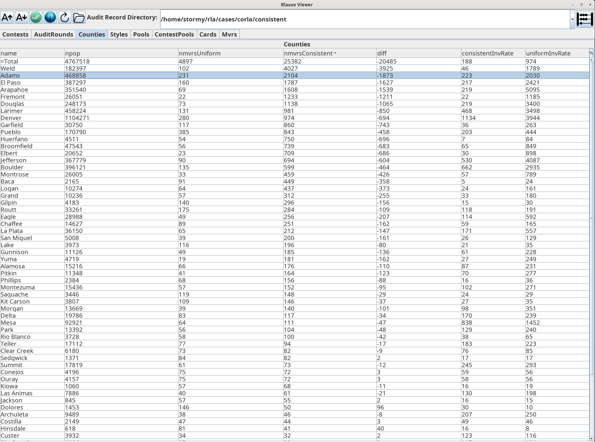

# Colorado Statewide Election 2024
05/14/2026

* 4,767,518 ballot cast (Colorado 2024 General Election) in 63 Counties.
* 723 contests, no IRV.
* No CVRs, just subtotals by County.
* 4897 sampled MVRS and corresponding CVRS are available.
* risk limit = 3%

## Colorado-RLA (Corla) uniform sampling

The Colorado RLA software uses a "Conservative approximation of the Kaplan-Markov P-value" for its risk measuring function
from the ["Gentle Introduction" and "Super Simple" papers](../notes/notes.txt), and to estimate the number of samples needed for each 
contest in order to achieve the risk limit.

Corla chooses a "targeted" contest in each county to audit, and estimates the number of samples needed (= estNmvrs) when doing
uniform (not consistent) sampling. It uniformly samples estNmvrs ballots across all the ballots in the county.

Independently, it chosses two statewide contests to audit, calculates estNmvrs, and uniformly samples across all the ballots in the state.

(Insert how colorado-rla then does its risk calculation).

Because the sampling is uniform for both county and state, provisionally we think that we can combine both county and state
samples together. We also think that we can estimate the risk from these samples for all contests, not just the targeted ones.

We group the combined samples by county, based on which county the ballot was cast in. When a contest lies within a single county, the RLA is straightforwad, using the "fully diluted margin":

    dilutedMargin = (margin in votes) / (total ballots in the county)

When a contest lies within multiple counties, provisionally we think the following algorithm can be used. For each county
that the contest is in, calculate the county sample rate as

    countySampleRate = (number of samples in the county) / (total ballots in the county)

Then we find the minimum countySampleRate over all counties. Conceptually, for each county we randomly choose and discard 
extra samples, until all counties have the same sample rate. Now sum the number of remaining samples over all counties, and 
sum the total ballots over all counties. This is the "audit statum" for that contest. Note that the countySample rates are 
independent of the contest, but the set of counties used depends on the contest. The contest diluted margin is

    dilutedMargin = (margin in votes over all counties with the contest) / (total ballots in all counties with the contest)

Given the contest dilutedMargin and the number of samples in the contest's stratum, we can calculate the estimated risk from the betting martingale as:

    gamma = 1.03905
    bet = 2/gamma // is the "maximum bet"
    upper = 1 for plurality assorter

    noerror = 1.0 / (2.0 - margin/upper)
    payoff = 1.0 + bet * (noerror - 0.5)

    risk = 1 / payoff ^ nsamples

or from the Kaplan-Markov formula:

    payoff = 1.0 - margin/(2*gamma)
    risk = 1 / payoff ^ nsamples

Notes:

* I think Kaplan-Markov is the Taylor series approximation of the betting mart. The approximation is quite good and gets better as the margin gets smaller.
* The betting mart is taken from the ALPHA paper, equation 10.

## Rlauxe simulated consistent sampling for CORLA24

We want to compare how the current uniform sampling risk measurement compares with using consistent sampling and "Card-style data" (CSD) as
described in the "More style, less work" paper.

We dont have CVRS available so we have to simulate them from the County vote subtotals, taken from tabulateCounty.csv.
Unfortunately, these subtotals do not include undervotes or number of ballots for each contest. So we estimate those as 
best we can, and hope that in the future we can work with the real CVRS, or at least county vote subtotals that include undervotes.

The accuracy of the simulation depends on knowing what contests appear together on what ballots. If we had CSD for each ballot in the 
county manifests, we could do a very accurate simulation even without the actual CVRs. To proceed, we examined the 5000 samples MVRS, and 
found the CSD (i.e. the list of contests on the ballot) from those. There were still quite a few small contests that did not appear on any
MVRs, and we just assumed that in each county, there was a single card style for all those contests. (This is surely wrong and needs to be revisitsed).
We then adjusted the number of counts of each style until the total vote counts were approximately equal to the known subtotals.
(This also needs to be revisited and made mo' better).

Given these simulated CVRS, we then ran the standard Rlauxe consistent sampling algorithm. The diluted margins in this case 
are substantially better than in the uniform sampling "no-CSD" case:

    dilutedMargin = (margin in votes) / (total ballots that contain the contest)

Furthermore, the consistent sampling is over the entire set of ballots in all counties, and we dont have to worry about 
contests that span multiple counties.

The downside is that there is less "opportunistic sampling" in consistent sampling than for uniform samping. In consistent sampling,
each contest has a canonicl sequence of ballots that must be sampled from, in order to eliminate possle sampling bias. 

[check canonial sequence fo non-include contests.]

TBD

## Results

Here is the distribution of all contests' measured risk. The uniform sampling is the actual 2024 audit. The consistent sampling 
is our simulation, for different scenarios of which contests are selected to audit.

The contests selected for auditing are only the targeted contests:

The contests selected for auditing are the targeted contests plus all statewide contests and contests with names starting with "State" or "Representative",
needing less than 150 samples:

The contests selected for auditing are the targeted contests plus all contests needing less than 35 samples:

The contests selected for auditing are the targeted contests plus all contests needing less than 100 samples:

The next three plots have the targeted contests plus all contests with margins greater than 2%, 1% and 1/2%:

The number of samples needed can be shown by county. Each county could make its own choices of which contests to audit, and immediately see the
number of samples it would need to audit. Here is an example from the last distribution (targeted plus margin greater than 1/2%:

