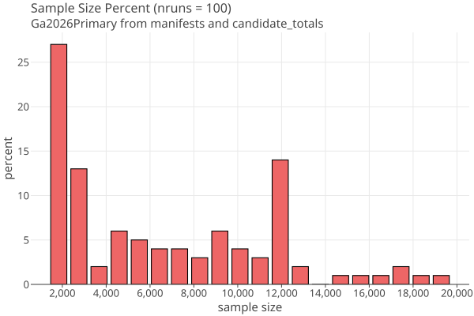
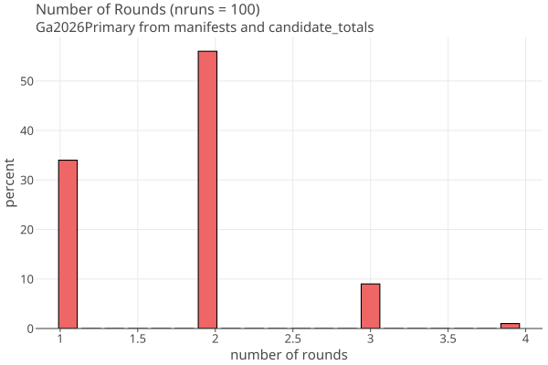
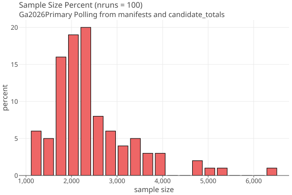
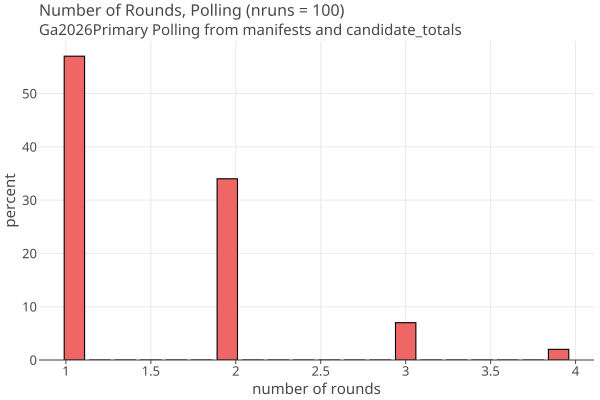

# Georgia 2026 Primary OneAudit
_07/05/2026_

## Ga2026Primary from manifests and candidate_totals 

* only have candidate_totals from the two audited contests
* total cards in batches = 2,081,564 
* very high undervote percentages ~ 50%, maybe because there are two cards and the contests are only on one of them ??
  In which case the margins would be twice as big if there was card style data.

### Batch Comparison Audit Summary

**from final_audit_report.csv**

* audited 2 contests with 341,816 ballots in 700 batches
    * "US Senate - Rep" voteMargin 94110, margin = 0.0452, "Sample Size" = 138, Batches Sampled = 148
    * "Governor - Dem" voteMargin = 406242, margin = 0.195, "Sample Size" = 18, Batches Sampled = 148
* risk limit 5%, batch comparison using arlo MACRO
* MACRO based on "Efficient Post-Election Audits of Multiple Contests: 2009 California Tests" Stark, Aug 2009
* sample size (batches) 138 (US Senate- Rep); 18 (Gov - Dem)
* "total ballots cast" = 2,081,564 agrees with sum of batches
* change in margin 91 (Senate) 40 (Gov)

Its not clear what "Sample Size" = 138, 18 means.
There are 700 rows in the "SAMPLED BATCHES" section; and summing the "Ballots in Batch" column gives 341,816. Perhaps 138 was the initial estimate, but there were multiple rounds and they ended up needing 700 batches? Perhaps the sample size is just ignored?
Im not seeing this mentioned in Claude's analysis. MAybe have to dig into Arlo MACRO code.

### Problems with Claude analysis

**2026-05-19-primary/reports/manifest_and_tally_analysis.md**
````
| Candidate | Votes |
|-----------|-------|
| Mike Collins | 369,638 |
| Derek Dooley | 275,528 |
| Earl L. "Buddy" Carter | 229,221 |
| Jonathan "Jon" McColumn | 28,446 |
| John F. Coyne III | 9,850 |
| **Total** | **912,683** |

Computed using Arlo's Contest class:
- **US Senate - Rep diluted margin**: 0.0222 (Dooley vs. Carter: 46,307 / 2,081,564)
  - This is the margin that drives the MACRO sample size — small margin → large sample
````

This is incorrect. The winner is Collins, and runner up is Dooley, so the margin is 

  369638 - 275528 = 94110 / 2,081,564 = .045

It dooes have the Dem governer race correct.

This error is repeated in "MACRO Sample Sizes" in _sample_reproducibiity.md_ and in "Key Computed Values" in the README.


### Rlauxe OneAudit summary

We assume that the two contests appear on the same card, and appear on all cards.
These assumptions minimize the sample size; we need card style data to make a more
accurate simulation.

We use batch manifests and candidate totals to create a OneAudit pool for each batch, with subtotals for the two
audited contests. The small size of these batches makes the OneAudit more efficient.

Running 100 audits, the range of mvr sample sizes (including overshoot) as a histogram:

<a href="https://johnlcaron.github.io/rlauxe/docs/cases/Ga26/NmvrsHistogram.html" rel="Ga26NmvrsHistogram"></a>

has a mean = 1334 and stddev = 791. This is a highly skewed distribution with a long tail towards large sample sizes, and I think its 
typical of OneAudit distributions.

The deciles of the CDF:

[10=621, 20=680, 30=737, 40=772, 50=1117, 60=1317, 70=1570, 80=1945, 90=2481, 100=3850]

Simulations deciles are, eg:

[293, 357, 466, 601, 742, 881, 1050, 1225, 1477, 3266]
[296, 361, 446, 535, 639, 764, 952, 1290, 1586, 2780]
[272, 459, 554, 686, 770, 883, 1064, 1269, 1713, 3705]
[306, 390, 450, 548, 660, 856, 1049, 1358, 1738, 2990]

Configuration has estPercentile=[50, 80], meaning use 50% decile for the first round, and 80% decile for subsequent rounds.
This leads to "Number of rounds" histogram for the 100 trial runds:

<a href="https://johnlcaron.github.io/rlauxe/docs/cases/Ga26/NroundsHistogram.html" rel="NroundsHistogram"></a>

TODO: Simulations seem low. Do simulations include overshoot?

In conclusion, for this case, OneAudit has an average mvr sample size = 1337 << 341,816 for Batch Audit.

OneAudit paper 

* BLCA: Batch-level comparison RLAs compare reported vote subtotals for randomly selected batches of cards (e.g., all cards cast in a precinct) to manual tabulations of the same batches
* BPA: Ballot-polling RLA examine individual randomly selected cards but do not use data from the voting system other than the totals
* CLCA: Card-level comparison RLAs compare individual CVRs to the corresponding MVRs for a random sample of cards
* OneAudit: CLCA where some or all CVRS are derived from contest or batch subtotals.
* Hybrid audits use different audit strategies in different strata.

````
  BLCA is closest to historical statutory audits, but requires larger sample
  sizes than other methods when outcomes are correct. BPA requires almost no
  data from the voting system. It is generally more efficient than BLCA, but
  its sample size grows approximately quadratically as the margin shrinks. The
  most efficient approach is CLCA, for which the sample size grows approximately
  linearly as the margin shrinks. But it requires the most information from the
  voting system: an exported CVR for every card and a way to link exported CVRs
  to the corresponding physical cards, without compromising voter privacy.
  
  When OneAudit CVRs are derived entirely from contest totals, the method is algebraically equivalent to BPA.
  When the CVRs are derived from batch subtotals, the method is far more efficient than BLCA
  and approaches the efficiency of ‘pure’ CLCA when the batches are sufficiently homogeneous.
````

Table 3 amended:

| Contest           | turnout    | batches | margin | sample size | K-M BLCA | Shangrla<br>OneAudit | Wald BP | BLCA/CLCA | Rlauxe<br>OneAudit |
|-------------------|------------|---------|--------|-------------|----------|----------------------|---------|-----------|--------------------|
| 2020 CA U.S. Pres | 17,785,667 | 21,346  | 28.7 % | ~178,000    | 26,700   | 70                   | 72      | 381       | -                  |
| 2022 GA SoS       | 3,909,983  | 12,968  | 9.2 %  | > 231,000   | 103,300  | 1380                 | 700     | 75        | -                  |
| 2026 GA Senate    | 2,081,564  |  5,641  | 4.5 %  | 341,816     | -        | -                    | -       | -         | 1337               |

### Rlauxe Polling summary

Same as OneAudit, but as a polling audit.

Running 100 audits, the range of mvr sample sizes (including overshoot) as a histogram:

<a href="https://johnlcaron.github.io/rlauxe/docs/cases/Ga26/NmvrsPollingHistogram.html" rel="Ga26NmvrsPollingHistogram"></a>

(count, mean, variance, sampleVariance, stddev) = 100, (2444.11, 835441.1978999998, 843879.9978787877), 914.0247249938044

has a mean = 2444 and stddev = 914.

The deciles of the CDF:

[10=1602, 20=1788, 30=1956, 40=2101, 50=2240, 60=2372, 70=2533, 80=2992, 90=3558, 100=6539]

Configuration has estPercentile=[50, 80], meaning use 50% decile for the first round, and 80% decile for subsequent rounds.
This leads to "Number of rounds" histogram for the 100 trial runds:

<a href="https://johnlcaron.github.io/rlauxe/docs/cases/Ga26/NroundsPollingHistogram.html" rel="NroundsPollingHistogram"></a>


## Ga2026Primary from ballot image audit

### from github/nealmcb/rla-review-arlo/2026-05-19-primary/reports/ballot_image_audit.md:

    Georgia law requires that every ballot be digitally imaged as it passes through an optical
    scanner. The ballot image audit takes those stored images and re-tabulates them independently,
    then compares the re-tabulation against the original scanner results.
    
    **File:** `Contest Results Comparison with County Breakout.xlsx` (released ~2026-06-28)  
    **Rows:** 30,895 data rows  
    **Columns:** County, ContestId, ContestName, DetailId, DetailName, OriginalCount, AuditCount, Difference

| Metric                                | Count     | Notes                                                   |
|---------------------------------------|-----------|---------------------------------------------------------|
| Unique contest names                  | **974**   | Across all counties                                     |
| County × contest pairs                | **9,169** | The unit the spreadsheet actually tracks                |
| Unique ContestIds                     | **132**   | IDs 1–132; reused across counties (not globally unique) |
| Contests with ≥2 candidates           | **473**   | By unique contest name                                  |
| Uncontested (1 candidate)             | **498**   | Slightly more than half of all named contests           |
| Purely local contests (1 county only) | **498**   | Coincidence with uncontested count                      |
| Multi-county contests                 | **476**   | State, federal, judicial, legislative                   |
| State/federal contests (≥50 counties) | **40**    | Statewide races                                         |

### my findings:

* extract github/nealmcb/rla-review-arlo/2026-05-19-primary/downloads/contest_results_comparison.xlsx to csv

**pass 1**

````
read 30895 rows (county x contest x candidate)
Counties 159
Unique Contest names = 972
noCandidates = 3 (removed)
Contests = 969
  singleCounty = 494
  multiCounty = 475
  
Uncontested = 499
Statewide = 40
````

**pass 2**: keep seperate by county, then combine when both the contest name and candidates match

````
CountyContests 1679
Contests = 1672
oneCandidate = 1004
singleCounty = 1289
multiCounty = 383
statewide = 40
````

**pass 3**: fix typos in contests and candidate names

````
CountyContests 1668
countNoCand = 7
Contests = 1661
singleCounty = 1281
multiCounty  =  380
Uncontested = 1000
Statewide = 40
````

**pass 4** get rid of leading "For"
see "For Judge Court of Appeals of Georgia"

````
Counties 159
CountyContests 1650
Contests = 1650
oneCandidate = 999
contested = 651
  singleCounty = 514
  multiCounty = 106
  statewide = 31
````

**TODO**

* Cant rely on unique Contest or Candidate names:  started to hand correct discrepencies (need to automate)
* Need to integrate Contest Ids (not done yet)
* Cant match on contestName or Id; I used contest name and candidates to put multicounty contests together
* I removed 7 contests with no candidates
* 1650 is close(r) to the mysterious 1785 contests

TODO: fix issues and run audit simulation.

We need card style data to make an accurate simulation with 650 contests. We also want batch level subtotals, not county subtotals.


## Downloaded files

Taken from "github/nealmcb/rla-review-arlo/2026-05-19-primary"

## Generating the election

createGaElection using manifest.csv and candidate_total.csv (Only have two contests available)

`
java -classpath cases/build/libs/rlauxe-cases-0.10.2.0-uber.jar org.cryptobiotic.rlauxe.cli.CreateCaseData \
    -case ga26p -topdir "/home/you/wherever/cases/ga2026Primary" \
    -input "/home/you/wherever/github/nealmcb/rla-review-arlo/2026-05-19-primary/extracted"
`

createGa2Election using manifest.csv ballot image audit (1668 contests, 1000 uncontested)

TODO

## fixes

java.lang.IllegalArgumentException: candidate names differ only by case: {JerMarkus A. Jacobs=0, Jermarkus A. Jacobs=1}

## check OneAudit payoff math 

````
contest 1 assertion = 1/3
 idx,         xs,        bet,     payoff,       Tj,   pvalue,                                         location,  mvr votes, card votes
 879, 0.20748673, 0.63880904, 0.81314351, 12.42957, 0.080453, COLUMBIA-ED-Harlem Branch Library  ICP 1 - 0-126,        [3], pool=1771, poolAvg=0.5961
````


