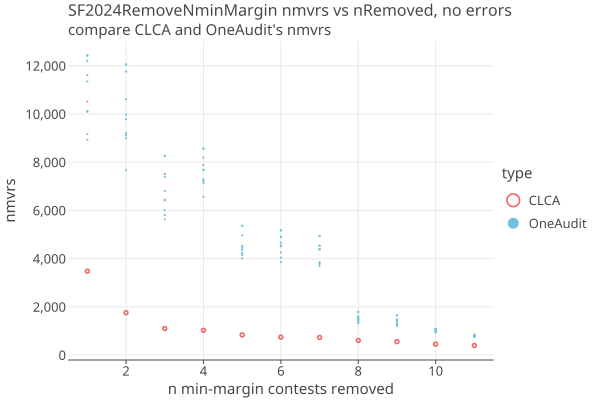

# San Francisco County 2024
02/27/2026

* 1,603,908 cvrs
* 48 total contests, 11 are IRV
* 4224 pools with 216286 cards (13.5%), using SHANGRLA grouping.
* Many pools have only a few cards.

The CVRs are in two groups, "mail-in" and "in-person" (aka "precinct"). Mail-in ballots are processed centrally and the
CVR identifiers are printed on the physical ballots. At the precinct, the scanners do not record the CVR identifier on the ballots, 
so we cannot match the precinct CVRs with their physical ballots as required by a CLCA. 
The precinct physical ballots are kept in seperate batches, and the precinct CVRs give us subtotals (and VoteConsolidator's for IRV contests),
so we can make each precinct into a OneAudit pool.

The card manifest for precinct ballots do not contain the CVR identifier, but rather only a precinct name and an index.
The precinct batches must be kept in order, so that as we choose random ballots to sample, the sampling is uniform over the batch.

Each precinct contains ballots with different ballot styles, i.e. different contests. The set of possible contests in each precinct
is found by taking the union of all contests for all CVRs for that precinct. Each precinct then becomes a Population with that list
as its _possibleContests_, and _hasSingleCardStyle_ = false. This greatly increases the Npopulation for each contest, which decreases
its diluted margin, and increases the number of cards needed for the audit (nmvrs). In addition, OneAudits have a large variance in nmvrs
compared to an equivilent CLCA, which have no variance when there are no errors or phantoms.

We use SF2024 to characterize the increased nmvrs for OneAudit for a real-world example. We can easily simulate a CLCA for SF2024 by simply
pretending that the precincts do record the CVRS on the physical ballots, and so all CVRS can be matched to MVRs. Seeing the increase in
nmvrs needed for an audit then motivates udgrading the precinct scanners to record the CVRs.

## SF2024: Comparison of CLCA and OneAudit

We ran the SF 2024 General Election 20 times (with different PRN seeds each time) for OneAudit, and compare it to the CLCA audit. 
In all cases there are no errors.

Here are 1 CLCA and 20 trials of OneAudit:

| type     | avg    | deciles of distribution                                             | 
|----------|--------|---------------------------------------------------------------------|
| CLCA     | 3462   | [3462]                                                              |
| OneAudit | 11708  | [5960, 6593, 7759, 10563, 10956, 12598, 14948, 16011, 17262, 24587] | 

Over 48 contests there are 131 assertions, each with a different margin. Here is the spread of the OneAudits reletive to 
the CLCA, for each of the 131 assertions:

* This is the full number of mvrs needed, including the extra samples needed from having to estimate each round.
* Some of the OneAudits do better than CLCA; the spread goes below CLCA as well as above.

The above plot is misleading in that the OneAudits are placed on top of their corresponding CLCAs. Actually, the OneAudit margins are
38-52% smaller. Here is the same plot with the OneAudits using their actual margins. You can see the effect of the increased population
size. This is a large effect at low margins (note that we are using a LogLog plot):

  

The total mvrs needed are dominated by the assertions with the lowest margin. In the above plot, contest 14 has an assertions that
falls below the .005 minimum recount margin, and was removed from both the CLCA and OneAudits. For OneAudit, contest 28 was also
removed for exceeding the Max Sample Limit, in this case, set at 20,000. We'd like to explore how CLCA and OneAudit differ when
the n lowest-margin contests are removed from the audit.

* For CLCA, removing the top three contests cuts the nmvrs to around 1000, with marginal improvement after that.
* OneAudit averages are 2-7x higher than CLCA. 

| n  | CLCA  | OA avg | avg / CLCA | One Audit Spread                                                     | 
|----|-------|--------|------------|----------------------------------------------------------------------|
| 1  | 3480  | 10470  | 3.0        | [8936, 9167, 10097, 10118, 10519, 11353, 11614, 12208, 12428, 12429] |
| 2  | 1759  | 9635   | 5.5        | [7674, 8999, 9120, 9208, 9787, 9972, 10615, 11760, 12056, 12057]     |
| 3  | 1103  | 6592   | 6.0        | [5627, 5810, 6008, 6416, 6450, 6813, 7396, 7512, 8267, 8268]         |
| 4  | 1028  | 7397   | 7.2        | [6569, 7139, 7230, 7294, 7682, 7690, 7883, 8195, 8566, 8567]         |
| 5  | 837   | 4426   | 5.3        | [4010, 4156, 4207, 4232, 4365, 4451, 4531, 4967, 5364, 5365]         |
| 6  | 745   | 4470   | 6.0        | [3858, 4047, 4260, 4512, 4551, 4664, 4900, 4904, 5175, 5176]         |
| 7  | 732   | 4220   | 5.8        | [3701, 3786, 3853, 4383, 4394, 4396, 4527, 4544, 4939, 4940]         |
| 8  | 607   | 1487   | 2.4        | [1329, 1348, 1418, 1464, 1489, 1527, 1575, 1609, 1783, 1784]         |
| 9  | 559   | 1364   | 2.4        | [1211, 1296, 1297, 1299, 1390, 1407, 1471, 1476, 1650, 1651]         |
| 10 | 455   | 1002   | 2.2        | [937, 957, 960, 982, 1009, 1039, 1054, 1061, 1087, 1088]             |
| 11 | 398   | 783    | 2.0        | [762, 773, 781, 783, 785, 786, 793, 818, 839, 840]                   |

By removing the close contests, we can greatly reduce the sampled mvrs. OTOH, its the close contests where RLAs are most needed.

## Downloaded files

From Dice dont Slice paper:

    We consider the 2024 mayoral race in San Francisco as a case study. This instant-
    runoff voting (IRV) contest included thirteen candidates. Daniel Lurie, who
    received 26% of the first-choice selections and 55% after all but two candidates
    were eliminated, defeated incumbent London Breed, who received 24% of the
    first-choice elections and 45% of the final round votes.
    
    The election produced 1,603,908 CVRs, of which 216,286 were for cards cast in 4,223 precinct batches
    and 1,387,622 CVRs were for vote-by-mail (VBM) cards.

    VBM CVRs are linked to the corresponding card, facilitating ballot-level
    comparison auditing, but the in-person CVRs are not linked to individual cards,
    only to tabulation batches. The CVRs were incorporated into the audit using
    ONEAudit. RAIRE [4] was used to generate the assertions for the audit to test.

These numbers agree with ours.

From https://github.com/spertus/UI-TS/blob/main/Code/SF_oneaudit_example.ipynb:

    Download the SF CVRs from https://sfelections.org/results/20241105w/detail.html
    Under the 'Final Report' tab click "Cast Vote Record (Raw data) - JSON" to download a zip file with all the CVRs.

This zip file CVR_Export_20241202143051.zip (296 MB) contains 27,570 files:

    BallotTypeContestManifest.json
    BallotTypeManifest.json
    CandidateManifest.json
    Configuration.json
    ContestManifest.json
    CountingGroupManifest.json
    CvrExport_0.json
    CvrExport_10000.json
    CvrExport_10001.json
    CvrExport_10002.json
    ...

Input is in _CVR_Export_20241202143051.zip_. This contains the Dominion CVR_Export JSON files, as well as the
Contest Manifest, Candidate Manifest, and other manifests. We also have the San Francisco County _summary.xml_ file from
their website for corroboration. The summary.xml ncards match the CVRS exactly, so there are no phantoms.

## Creating the SF2024 election

Follow the instructions in [Getting Started](../docs/Developer.md#test-cases) to download and process the SF2024 data.
This is only done once.

Using _cases/src/test/kotlin/org/cryptobiotic/rlauxe/util/TestGenerateAllUseCases.kt_:

* run createSFElectionOA() to create a OneAudit elction in  _$testdataDir/cases/sf2024/oa/audit_
* run createSFElectionClca() to create a CLCA elction in  _$testdataDir/cases/sf2024/clca/audit_

### Notes on election creation

We read the CVR_Export files
and write equivilent csv files in our own "AuditableCard" format to a temporary "cvrExport.csv" file.
We make the contests from the information in ContestManifest and CandidateManifest files,
and tabulate the votes from the cvrs. If its an IRV contest, we use the raire-java library to create the Raire assertions.

