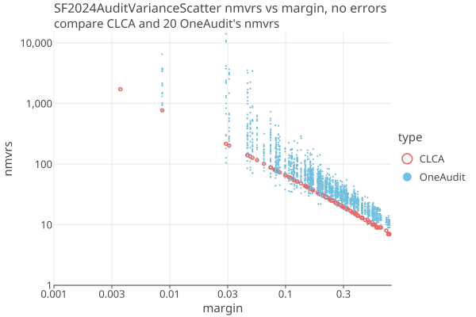
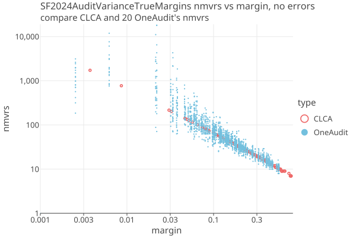
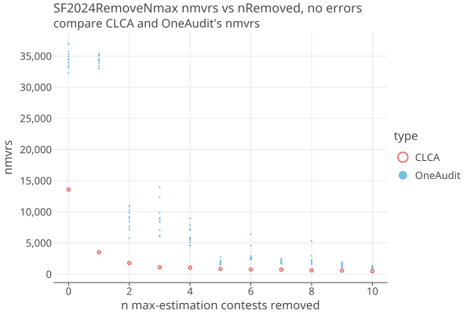

# San Francisco County 2024
03/01/2026

* 1,603,908 cvrs
* 48 total contests, 11 are IRV
* 4224 pools with 216286 cards (13.5%), using SHANGRLA grouping.
* Many pools have only a few cards.

The CVRs are in two groups, "mail-in" and "in-person" (aka "precinct"). Mail-in ballots are processed centrally and the
CVR identifiers are printed on the physical ballots. At the precinct, the scanners do not record the CVR identifier on the ballots, 
so we cannot match the precinct CVRs with their physical ballots as required by a CLCA. 
The precinct physical ballots are kept in seperate batches, and the precinct CVRs give us subtotals (and VoteConsolidator's for IRV contests),
so we can make each precinct into a OneAudit pool.

The card manifest for precinct ballots do not contain the CVR identifier, but rather only a precinct name and an index.
The precinct batches must be kept in order, so that as we choose random ballots to sample, the sampling is uniform over the batch.

Each precinct contains ballots with different ballot styles, i.e. different contests. The set of possible contests in each precinct
is found by taking the union of all contests for all CVRs for that precinct. Each precinct then becomes a Population with that list
as its _possibleContests_, and _hasSingleCardStyle_ = false. This greatly increases the population size for each contest, which decreases
its diluted margin and increases the number of cards needed for the audit (nmvrs). In addition, OneAudits have a large variance in nmvrs
compared to an equivilent CLCA, which have no variance when there are no errors or phantoms.

We use the SF2024 case study to characterize the increased nmvrs needed for OneAudit in a real-world example. 
We can easily simulate a CLCA for SF2024 by simply pretending that the precincts do record the CVRS on the physical ballots, 
and so all CVRS can be matched to MVRs. 

The increased nmvrs needed for a OneAudit motivates upgrading the precinct scanners to record the CVR identifiers on the physical ballots,
so that a CLCA audit can be run instead.

## Comparison of CLCA and OneAudit

We ran the SF 2024 General Election 20 times (with different PRN seeds each time) for OneAudit, and compared it to the simulated CLCA audit. 
In all cases there are no errors. Over 48 contests there are 131 assertions, each with a different margin. Here is the spread of the OneAudits reletive to 
the CLCA, for each of the 131 assertions:

<a href="https://johnlcaron.github.io/rlauxe/docs/plots2/cases/SF2024AuditVarianceScatterLogLog.html" rel="SF2024AuditVarianceScatterLogLog"></a>

* This is the full number of mvrs needed, including the extra samples needed from having to estimate each round.
* The audit risk limit is arbitrarily set to 5%.
* Some of the OneAudits do better than CLCA; the spread goes below CLCA as well as above.

The above plot is misleading in that the OneAudits are placed on top of their corresponding CLCAs. Actually, the OneAudit margins are
38-52% smaller. Here is the same plot with the OneAudits using their actual margins. You can see the effect of the increased population
size. This is a large effect at low margins (note that we are using a LogLog plot):

  <a href="https://johnlcaron.github.io/rlauxe/docs/plots2/cases/SF2024AuditVarianceTrueMarginsLogLog.html" rel="SF2024AuditVarianceTrueMarginsLogLog"></a>

The total mvrs needed are dominated by the assertions with the lowest margins. Here we explore how CLCA and OneAudit differ when
the n lowest-margin contests are removed from the audit:

<a href="https://johnlcaron.github.io/rlauxe/docs/plots2/cases/SF2024RemoveNmaxLinear.html" rel="SF2024RemoveNmax"></a>

In practice, even for CLCA, contests with very small margins and/or that require a large percentage of the ballots for that contest
would be removed from the audit. For SF2024, the top 2 contests (14 and 28) have recount margin less than .005, and
would go to a full hand count immediately. For OneAudit, close contests fail to complete and the number of successful contests 
for OneAudit (OA nsuccess) are less than the number of successful CLCA contests (nsuccess). 

So its only after the first 2 contests are removed that the comparision between CLCA and OneAudit become meaningful.
Starting with n=4, OneAudit needs 2-6x more nmvrs than CLCA for SF2024, on average. 
This is a much worse result than for [Boulder 2024](Boulder2024.md), due to the percentage ballots in pools (3% vs 13%), and
because the SanFrancisco pools have multiple Ballot Styles, and so the contest margins are significantly diluted.

| n   | nsuccess | OA nsuccess | CLCA est | OA est avg | ratio  | One Audit Spread                                                       | 
|-----|----------|-------------|----------|------------|--------|------------------------------------------------------------------------|
| 0   | 48       | 46.0        | 13562    | 37995      | 2.8    | [35708, 36864, 37150, 38326, 38428, 38762, 38935, 40279, 40532, 40533] |
| 1   | 47       | 46.0        | 3498     | 45050      | 12.9   | [43017, 43493, 44326, 44520, 45617, 46352, 46421, 46598, 47868, 47869] |
| 2   | 46       | 46.0        | 1771     | 10704      | 6.0    | [9131, 9690, 9823, 10198, 10792, 10924, 11081, 11899, 14608, 14609]    |
| 3   | 45       | 45.0        | 1093     | 4672       | 4.3    | [3696, 4070, 4432, 4462, 4471, 4846, 4981, 5182, 7452, 7453]           |
| 4   | 44       | 44.0        | 1024     | 4498       | 4.4    | [2730, 3517, 3528, 3646, 4975, 5584, 5898, 6053, 6605, 6606]           |
| 5   | 43       | 43.0        | 820      | 2395       | 2.9    | [2214, 2302, 2304, 2317, 2336, 2480, 2505, 2653, 2869, 2870]           |
| 6   | 42       | 42.0        | 742      | 4592       | 6.2    | [2944, 3019, 3100, 3404, 3450, 4287, 4345, 4748, 13793, 13794]         |
| 7   | 41       | 41.0        | 727      | 2264       | 3.1    | [1689, 1711, 1977, 2039, 2090, 2298, 2670, 2706, 3809, 3810]           |
| 8   | 40       | 40.0        | 597      | 2243       | 3.8    | [1458, 1467, 1574, 1756, 2337, 2641, 3155, 3235, 3367, 3368]           |
| 9   | 39       | 39.0        | 552      | 1913       | 3.5    | [1693, 1715, 1717, 1947, 1973, 1980, 2082, 2165, 2249, 2250]           |
| 10  | 38       | 38.0        | 459      | 887        | 1.9    | [822, 827, 869, 871, 878, 895, 931, 978, 989, 990]                     |

````
where 
   n = remove top n estimated-nmvrs contests
   nsuccess = number of contests successfully audited by CLCA
   OA nsuccess = average number of contests successfully audited by OneAudit
   CLCA est = estimated nmvrs needed by CLCA
   OA est avg = average estimated nmvrs needed by OneAudit
   ratio = OA est avg / CLCA est
   One Audit Spread = spread of estimated nmvrs needed by OneAudit
````

## Downloaded files

From Dice dont Slice paper:

    We consider the 2024 mayoral race in San Francisco as a case study. This instant-
    runoff voting (IRV) contest included thirteen candidates. Daniel Lurie, who
    received 26% of the first-choice selections and 55% after all but two candidates
    were eliminated, defeated incumbent London Breed, who received 24% of the
    first-choice elections and 45% of the final round votes.
    
    The election produced 1,603,908 CVRs, of which 216,286 were for cards cast in 4,223 precinct batches
    and 1,387,622 CVRs were for vote-by-mail (VBM) cards.

    VBM CVRs are linked to the corresponding card, facilitating ballot-level
    comparison auditing, but the in-person CVRs are not linked to individual cards,
    only to tabulation batches. The CVRs were incorporated into the audit using
    ONEAudit. RAIRE [4] was used to generate the assertions for the audit to test.

These numbers agree with ours.

From https://github.com/spertus/UI-TS/blob/main/Code/SF_oneaudit_example.ipynb:

    Download the SF CVRs from https://sfelections.org/results/20241105w/detail.html
    Under the 'Final Report' tab click "Cast Vote Record (Raw data) - JSON" to download a zip file with all the CVRs.

This zip file CVR_Export_20241202143051.zip (296 MB) contains 27,570 files:

    BallotTypeContestManifest.json
    BallotTypeManifest.json
    CandidateManifest.json
    Configuration.json
    ContestManifest.json
    CountingGroupManifest.json
    CvrExport_0.json
    CvrExport_10000.json
    CvrExport_10001.json
    CvrExport_10002.json
    ...

Input is in _CVR_Export_20241202143051.zip_. This contains the Dominion CVR_Export JSON files, as well as the
Contest Manifest, Candidate Manifest, and other manifests. We also have the San Francisco County _summary.xml_ file from
their website for corroboration. The summary.xml ncards match the CVRS exactly, so there are no phantoms.

## Creating the SF2024 election

Follow the instructions in [Getting Started](../docs/Developer.md#test-cases) to download and process the SF2024 data.
This is only done once.

Using _cases/src/test/kotlin/org/cryptobiotic/rlauxe/util/TestGenerateAllUseCases.kt_:

* run createSFElectionOA() to create a OneAudit elction in  _$testdataDir/cases/sf2024/oa/audit_
* run createSFElectionClca() to create a CLCA elction in  _$testdataDir/cases/sf2024/clca/audit_

### Notes on election creation

We read the CVR_Export files
and write equivilent csv files in our own "AuditableCard" format to a temporary "cvrExport.csv" file.
We make the contests from the information in ContestManifest and CandidateManifest files,
and tabulate the votes from the cvrs. If its an IRV contest, we use the raire-java library to create the Raire assertions.

