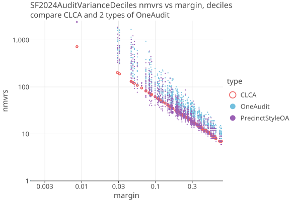
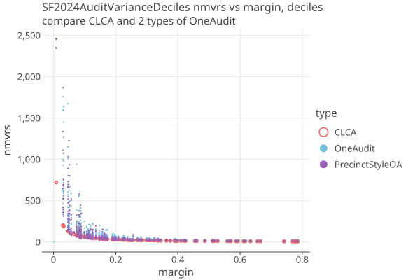

# San Francisco County 2024
04/10/2026

* 1,603,908 cvrs
* 48 total contests, 11 are IRV
* 4224 pools with 216286 cards (13.5%), using SHANGRLA grouping (session.TabulatorId-session.BatchId)
* 2565 pools with 216286 cards (13.5%), grouped by (precinct-cardStyle).
* Many pools have only a few cards.

The CVRs are in two groups, "mail-in" and "in-person" (aka "precinct"). Mail-in ballots are processed centrally and the
CVR identifiers are printed on the physical ballots. At the precinct, the scanners do not record the CVR identifier on the ballots, 
so we cannot match the precinct CVRs with their physical ballots as required by a CLCA. 

It appears that (session.TabulatorId-session.BatchId) represents one "Session" of ballot scanning. All cards for some set of ballots
are run through the scanner. If the batch of cards in the session remain together, then those can be the OneAudit pools. The downside is
that there are multiple card styles in the same batch, so Npop is larger and diluted margins are smaller, on the order of 40% or so. (eg 569469/412231 = 1.38)

Here is a summary of one precinct using this grouping:

````
precinct=1, styles=[2], poolIds=[39-1, 43-1, 31-123, 31-124, 36-110, 36-179, 36-253, 36-254, 33-244, 36-256, 33-249, 28-78, 33-253, 33-255, 28-83, 28-84, 561-0, 26-144, 27-522, 27-525]
  count=18 contests=[1, 2, 3, 5, 9, 13, 14, 15, 18, 19, 20, 21, 22, 28, 29, 30, 31, 32, 33, 34, 35, 36, 37, 38, 39, 40, 41, 42, 43, 44, 45, 46, 47, 48, 49, 50, 51, 52, 53] #contests=39
  count=89 contests=[29, 30, 31, 32, 33, 34, 35, 36, 37, 38] #contests=10
  count=89 contests=[1, 2, 3, 5, 9, 13, 14, 15] #contests=8
  count=89 contests=[18, 19, 20, 21, 22, 28] #contests=6
  count=89 contests=[39, 40, 41, 42, 43, 44, 45, 46, 47, 48, 49, 50, 51, 52, 53] #contests=15
    style=2 contests=[1, 2, 3, 5, 9, 13, 14, 15, 18, 28, 19, 21, 22, 20, 29, 30, 31, 32, 33, 34, 35, 36, 37, 38, 39, 40, 41, 42, 43, 44, 45, 46, 47, 48, 49, 50, 51, 52, 53] #contests=39
    agrees with sc=18
    cards agree with styleTypeContests
    cards are disjoint
````

* There are ~20 batches (pools) for each precinct, with no obvious pattern of the batch name.
* There are typically 4 cards per ballot, which we see here as 89 ballots
* There are 18 cvrs where the cards have been combined. Perhaps an older scanner that doesnt record the cards seperately?
* The contests on the seperate cards are disjoint (excluding the "combined" card style)
* Mostly one ballot style per precinct that agrees with the contests on the Cvrs.

We investigate the possiblilty that after the scan, the cards are separated by card style into seperate physical batches. All of the cards of the same style
for all the scans at one precinct can be kept in the same batch. Then the OneAudit ballots are grouped by (precinct-cardStyle), and have a single card
style, so Npop = Nc. (Its hard to know if this is a practical option, but simulating it shows us the expected tradeoff).

With this grouping, we ignore the sessions, and for example, get 5 card pools for precinct 1:

````
precinct=1
  pool1: count=18 contests=[1, 2, 3, 5, 9, 13, 14, 15, 18, 19, 20, 21, 22, 28, 29, 30, 31, 32, 33, 34, 35, 36, 37, 38, 39, 40, 41, 42, 43, 44, 45, 46, 47, 48, 49, 50, 51, 52, 53] #contests=39
  pool2: count=89 contests=[29, 30, 31, 32, 33, 34, 35, 36, 37, 38] #contests=10
  pool3: count=89 contests=[1, 2, 3, 5, 9, 13, 14, 15] #contests=8
  pool4: count=89 contests=[18, 19, 20, 21, 22, 28] #contests=6
  pool5: count=89 contests=[39, 40, 41, 42, 43, 44, 45, 46, 47, 48, 49, 50, 51, 52, 53] #contests=15
````

Since we have the CVRs, we can create subtotals for whatever subset we want. The difficult part id to create physical batches
of cards that can be reliably sampled. Both OneAudit scenarios dont care about the order of the cards within the batch, until
the random seed is chosen. Then the ordering must match the CardManifest and cannot be changed.

There are other possibilities, not yet investigated:

1. If the card order within the scan session can be preserved, then we can match the CVR with physical cards and do a CLCA.
2. SanFrancisco saves an image of the scanned cards pointed to by the ImageMask field:
   `"ImageMask": "D:\\NAS\\SF November 2024 Consolidated General Election\\Results\\Tabulator00031\\Batch125\\Images\\00031_00125_000222*.*"`
   This image could be used to do the manual audit. Presumably this could be done much faster, and perhaps allow a "ballot-at-a-time" audit that
   would eliminate the waste of guessing how many ballots to audit for each round.

## Shangrla OneAudit details

The precinct physical ballots are kept in seperate batches by session, and the CVRs give us subtotals (and VoteConsolidator's for IRV contests),
so we can make each precinct into a OneAudit pool.

The card manifest for precinct ballots do not contain the CVR identifier, but rather only a pool name and an index.
The precinct batches must be kept in order, so that as we choose random ballots to sample, the sampling is uniform over the batch.

Each precinct contains ballots with different ballot styles, i.e. different contests. The set of possible contests in each precinct
is found by taking the union of all contests for all CVRs for that precinct. Each scanning session then becomes a OneAudit pool with this union
as its _possibleContests_, and _hasSingleCardStyle_ = false. This greatly increases the population size for each contest, which decreases
its diluted margin and increases the number of cards needed for the audit (nmvrs). In addition, OneAudits have a large variance in nmvrs
compared to an equivilent CLCA, which have no variance when there are no errors or phantoms.

We use the SF2024 case study to characterize the increased nmvrs needed for both OneAudits in a real-world example. 
We can easily simulate a CLCA for SF2024 by simply pretending that the precincts do record the CVRS on the physical ballots, 
and so all CVRS can be matched to MVRs.

## Comparison of CLCA and OneAudits

We ran the SF 2024 General Election 20 times (with different PRN seeds each time) for OneAudit, Precinct-Style OneAudit, and a single CLCA audit. 
In all cases there are no errors. Over 48 contests there are 131 assertions, each with a different margin. Here is the spread of the OneAudits reletive to 
the CLCA, for each of the 131 assertions:

<a href="https://johnlcaron.github.io/rlauxe/docs/plots2/cases/SF2024AuditVarianceDecilesLogLog.html" rel="SF2024AuditVarianceDecilesLogLog"></a>

* We show the deciles of the distribution of the 20 OneAudit runs.
* This is the full number of mvrs needed, including the extra samples needed from having to estimate each round.
* The sample limit cutoff is arbitrarily set to 2500 samples.
* The OneAudits cant go below margins of about 3% without exceeding the 2500 sample limit. The ClCA gets down to around 1% margin.
* Some of the OneAudits do better than CLCA; the spread goes below CLCA as well as above.

The same plot on a Linear scale:

<a href="https://johnlcaron.github.io/rlauxe/docs/plots2/cases/SF2024AuditVarianceDecilesLinear.html" rel="SF2024AuditVarianceDecilesLinear"></a>

The total mvrs needed are dominated by the assertions with the lowest margins.
In practice, even for CLCA, contests with very small margins and/or that require a large percentage of the ballots for that contest
would be removed from the audit. For SF2024, the top 2 contests (14 and 28) have recount margin less than .005, and
would go to a full hand count immediately. For OneAudit, close contests may fail to complete when they exceed sample control constraints.

This table shows how CLCA and the OneAudits compare when n contests with the highest estimated sample size (usually the 
lowest margins, but not always) are removed from the audit. 
We use 20 runs to generate the distributions, and then show the average and stddev of the distribution:

| removeN | CLCA nmvrs | OA nmvrs avg | OA stddev | SP nmvrs avg | SP stddev | OA/SP nmvrs | OA/SP stddev |
|---------|------------|--------------|-----------|--------------|-----------|-------------|--------------|
| 2       | 1660       | 8475         | 2052      | 6708         | 631       | 1.26        | 3.05         |
| 3       | 1036       | 4463         | 1289      | 3679         | 228       | 1.21        | 3.86         |
| 4       | 963        | 3790         | 1377      | 3300         | 576       | 1.15        | 4.16         |
| 5       | 782        | 2888         | 746       | 2426         | 182       | 1.19        | 1.76         |
| 6       | 700        | 2377         | 498       | 3166         | 577       | 0.75        | 2.18         |
| 7       | 668        | 1788         | 473       | 2027         | 260       | 0.88        | 4.92         |
| 8       | 570        | 1922         | 580       | 1470         | 163       | 1.30        | 2.62         |
| 9       | 526        | 1413         | 298       | 908          | 36        | 1.74        | 3.82         |

````
where 
   removeN = remove top n highest-estimated-nmvrs contests
   CLCA nmvrs = number of nmvrs needed by CLCA in eimulated audit
   OA nmvrs avg = nmvrs needed by "Session Scan" OneAudit, average over 20 simulated audits
   OA stddev = standard deviation of nmvrs needed by Session Scan OneAudit, over 20 simulated audits
   SP nmvrs avg = nmvrs needed by "Precinct Style" OneAudit, average over 20 simulated audits
   SP stddev = standard deviation of nmvrs needed by Precinct Style OneAudit, over 20 simulated audits
   OA/SP nmvrs = OA nmvrs avg / SP nmvrs avg
   OA/SP stddev = OA stddev avg / SP stddev avg
````
* the "Precinct Style" OneAudit average is mostly within 25% of the "Session Scan" OneAudit (surprisingly, not always smaller).
* the variance, however is much reduced, with a 2-5 times smaller standard deviation.


| removeN | OA Nrounds avg | OA Nrounds stddev | SP Nrounds avg | SP Nrounds stddev |
|---------|----------------|-------------------|----------------|-------------------|
| 2       | 2.95           | .59               | 2.45           | .50               |
| 3       | 3.25           | .83               | 2.85           | .35               |
| 4       | 3.35           | .91               | 2.8            | .51               |
| 5       | 3.05           | .97               | 3.4            | .49               |
| 6       | 3.2            | .81               | 5.5            | .74               |
| 7       | 3.2            | .98               | 2.7            | .46               |
| 8       | 3.1            | .89               | 2.8            | .57               |
| 9       | 3.05           | 1.02              | 2.0            | .00  (?)          |


## Raw data

````
OneAudit SessionScan results (12 hr 25 min)
2, 20, 8475.499999999998, 2052.970445476505, 2.95 , 0.5894913061275798
3, 20, 4463.200000000001, 1289.1720055911856, 3.25 , 0.8291561975888498
4, 20, 3790.5000000000005, 1377.4379659353085, 3.35 , 0.9096702699330126
5, 20, 2888.35, 746.8386890754924, 3.05 , 0.9733961166965892
6, 20, 2377.3, 498.7643832512502, 3.2 , 0.8124038404635961
7, 20, 1788.45, 473.4677892951114, 3.2 , 0.9797958971132711
8, 20, 1922.2500000000005, 580.365305217326, 3.0999999999999996 , 0.8888194417315588
9, 20, 1413.2, 298.50252930251696, 3.05 , 1.023474474522936

OneAudit PrecinctStyle results (3 hr 26 min)
2, 20, 6312.7, 671.7364885131669
3, 20, 5214.1, 333.63001963252646
4, 20, 3037.5, 330.9825524102442
5, 20, 2728.3999999999996, 417.56573135256195
6, 20, 2060.5000000000005, 224.2301273245859
7, 20, 1251.7500000000002, 95.76422870780092
8, 20, 1512.1000000000001, 221.7678741387039
9, 20, 1246.55, 77.93938349769005

(1 hr 51 min)
2, 20, 6708.850000000001, 631.986888708935, 2.45 , 0.49749371855331
3, 20, 3679.5500000000006, 228.50918471693862, 2.85 , 0.3570714214271425
4, 20, 3300.3999999999996, 576.0607086063065, 2.8 , 0.5099019513592785
5, 20, 2426.5, 182.74586178625222, 3.4 , 0.4898979485566356
6, 20, 3155.45, 577.7408999716049, 5.45 , 0.739932429347437
7, 20, 2027.5500000000004, 260.76070927193007, 2.7 , 0.45825756949558394
8, 20, 1470.2, 163.32685021147012, 2.85 , 0.5722761571129799
9, 20, 907.9499999999999, 35.76517160590732, 2.0 , 0.0
````

## Previous results

Here we explore how CLCA and OneAudit differ when
the n lowest-margin contests are removed from the audit:

<a href="https://johnlcaron.github.io/rlauxe/docs/plots2/cases/SF2024RemoveNmaxLinear.html" rel="SF2024RemoveNmax"></a>

| n  | nsuccess | OA nsuccess | CLCA est | OA est avg | ratio | One Audit Spread                                                       | 
|----|----------|-------------|----------|------------|-------|------------------------------------------------------------------------|
| 0  | 48       | 46.0        | 13562    | 34123      | 2.5   | [32344, 33119, 33472, 33940, 34362, 34505, 34887, 35287, 35694, 36994] |
| 1  | 47       | 46.0        | 3498     | 34126      | 9.8   | [32985, 33342, 33785, 34196, 34337, 34466, 34525, 35035, 35178, 35366] |
| 2  | 46       | 46.0        | 1771     | 8453       | 4.8   | [5748, 7155, 7577, 8428, 8880, 9188, 9845, 10242, 10829, 10936]        |
| 3  | 45       | 45.0        | 1093     | 8378       | 7.7   | [6032, 6181, 7044, 8312, 8373, 8762, 8994, 9836, 12348, 13907]         |
| 4  | 44       | 44.0        | 1024     | 5845       | 5.7   | [4544, 4595, 5094, 5426, 5682, 5855, 7034, 7222, 7878, 8907]           |
| 5  | 43       | 43.0        | 820      | 1784       | 2.2   | [1493, 1517, 1618, 1642, 1715, 1892, 1936, 2011, 2190, 2730]           |
| 6  | 42       | 42.0        | 742      | 2833       | 3.8   | [2291, 2422, 2435, 2499, 2589, 2607, 2679, 2920, 4598, 6370]           |
| 7  | 41       | 41.0        | 727      | 1977       | 2.7   | [1704, 1728, 1811, 1834, 1946, 2021, 2043, 2326, 2437, 2465]           |
| 8  | 40       | 40.0        | 597      | 2090       | 3.5   | [1605, 1631, 1662, 1682, 1970, 2027, 2157, 2252, 2924, 5349]           |
| 9  | 39       | 39.0        | 552      | 1349       | 2.4   | [1067, 1100, 1141, 1165, 1264, 1446, 1607, 1662, 1848, 1931]           |
| 10 | 38       | 38.0        | 459      | 1006       | 2.2   | [903, 926, 942, 957, 974, 1009, 1012, 1047, 1250, 1342]                |

````
where 
   n = remove top n estimated-nmvrs contests
   nsuccess = number of contests successfully audited by CLCA
   OA nsuccess = average number of contests successfully audited by OneAudit
   CLCA est = estimated nmvrs needed by CLCA
   OA est avg = average estimated nmvrs needed by OneAudit
   ratio = OA est avg / CLCA est
   One Audit Spread = spread of estimated nmvrs needed by OneAudit
````

## Downloaded files

From Dice dont Slice paper:

    We consider the 2024 mayoral race in San Francisco as a case study. This instant-
    runoff voting (IRV) contest included thirteen candidates. Daniel Lurie, who
    received 26% of the first-choice selections and 55% after all but two candidates
    were eliminated, defeated incumbent London Breed, who received 24% of the
    first-choice elections and 45% of the final round votes.
    
    The election produced 1,603,908 CVRs, of which 216,286 were for cards cast in 4,223 precinct batches
    and 1,387,622 CVRs were for vote-by-mail (VBM) cards.

    VBM CVRs are linked to the corresponding card, facilitating ballot-level
    comparison auditing, but the in-person CVRs are not linked to individual cards,
    only to tabulation batches. The CVRs were incorporated into the audit using
    ONEAudit. RAIRE [4] was used to generate the assertions for the audit to test.

These numbers agree with ours.

From https://github.com/spertus/UI-TS/blob/main/Code/SF_oneaudit_example.ipynb:

    Download the SF CVRs from https://sfelections.org/results/20241105w/detail.html
    Under the 'Final Report' tab click "Cast Vote Record (Raw data) - JSON" to download a zip file with all the CVRs.

This zip file CVR_Export_20241202143051.zip (296 MB) contains 27,570 files:

    BallotTypeContestManifest.json
    BallotTypeManifest.json
    CandidateManifest.json
    Configuration.json
    ContestManifest.json
    CountingGroupManifest.json
    CvrExport_0.json
    CvrExport_10000.json
    CvrExport_10001.json
    CvrExport_10002.json
    ...

Input is in _CVR_Export_20241202143051.zip_. This contains the Dominion CVR_Export JSON files, as well as the
Contest Manifest, Candidate Manifest, and other manifests. 

We also have the San Francisco County _summary.xml_ file from
their website for corroboration. The summary.xml ncards match the CVRS exactly, so there are no phantoms.

## Creating the SF2024 election

Follow the instructions in [Getting Started](../docs/Developer.md#test-cases) to download and process the SF2024 data.
This is only done once.

Using _cases/src/test/kotlin/org/cryptobiotic/rlauxe/util/TestGenerateAllUseCases.kt_:

* run createSFElectionOA() to create a OneAudit elction in  _$testdataDir/cases/sf2024/oa/audit_
* run createSFElectionClca() to create a CLCA elction in  _$testdataDir/cases/sf2024/clca/audit_

### Notes on election creation

We read the CVR_Export files
and write equivilent csv files in our own "AuditableCard" format to a temporary "cvrExport.csv" file.
We make the contests from the information in ContestManifest and CandidateManifest files,
and tabulate the votes from the cvrs. If its an IRV contest, we use the raire-java library to create the Raire assertions.

